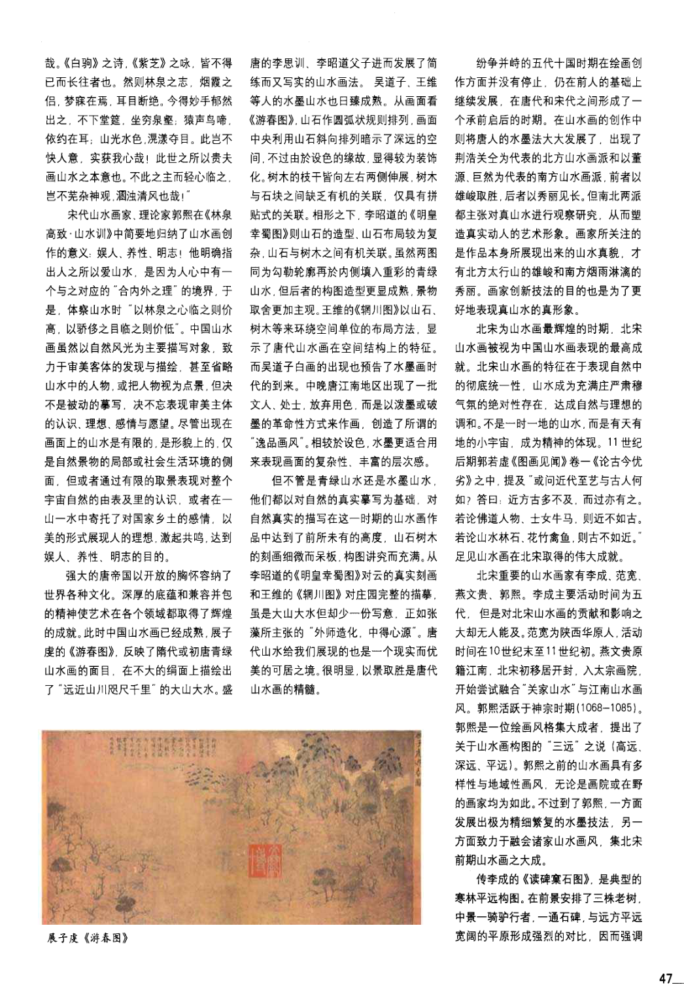
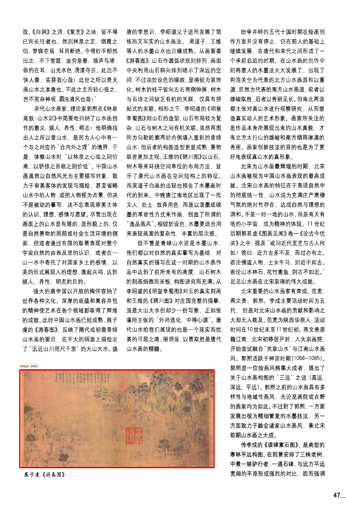
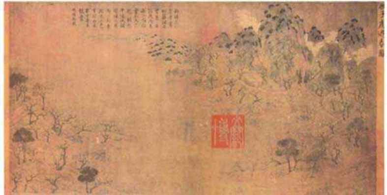

# v0.2 单条 SFT 轨迹样例：真实输入与真实输出

- 更新时间：2026-05-30 21:18 CST
- 数据集：`/root/datasets/evidence_grounded_vlm_agentrl/agentbench_v0_2_retrieval_scope_20260530_1922`
- evidence index：`/root/datasets/evidence_grounded_vlm_agentrl/evidence_index_v0_2_20260530_1914`
- task_id：`egva_v0_2_scope_000005`
- source_task_id：`egva_v0_1_local_000009`
- split：`train`
- SFT 文件：`/root/datasets/evidence_grounded_vlm_agentrl/agentbench_v0_2_retrieval_scope_20260530_1922/sft/train.jsonl`

## 现在应该先做什么

不要马上进入大规模 RL。当前最合理的顺序是：

1. 先看 20-30 条这样的真实 SFT 轨迹，确认“输入、工具返回、输出 action、gold claim”是否符合你的任务直觉。
2. 修正 evidence snippet 和 chunk 分片：当前 snippet 是机械截断，chunk 也是字符窗口分片，这不适合作为最终高质量数据。
3. 对低文本页做 OCR/VLM fallback，并从新权威 corpus 重新生成 1000-2000 条 v0.3 tasks。
4. 再训练 trajectory SFT adapter，之后实现可 step、可 verifier 的环境，最后做小规模 on-policy GRPO。

## 这条样本对应的 PDF 和页面

- PDF：`/root/Workspace/ChineseLandscape/data/raw_pdfs/唐、五代、宋山水画比较：从景胜到意胜.pdf`
- PDF 页码：第 2 页，1-based 页码
- 原始页面图：`/root/datasets/evidence_grounded_vlm_agentrl/agentbench_v0_1_local_evidence_20260530_1625/pages/唐_五代_宋山水画比较_从景胜到意胜_p002.png`
- 带框 overlay：`/root/datasets/evidence_grounded_vlm_agentrl/agentbench_v0_1_local_evidence_20260530_1625/overlays/egva_v0_1_local_000009.jpg`
- 裁剪图：`/root/datasets/evidence_grounded_vlm_agentrl/agentbench_v0_1_local_evidence_20260530_1625/crops/唐_五代_宋山水画比较_从景胜到意胜_p002_56_730_620_925.jpg`

页面原图：



带框图：红框是目标图像区域。这个例子没有蓝框图注框，因为 v0.1 规则没有抽到单独 caption bbox。



裁剪出的目标图像：



## Gold Claims

这条样本要求模型最后写出的 claim 如下。这个例子没有 abstain，每个字段都有监督答案。

```json
[
  {
    "claim_id": "caption_text",
    "field": "caption_text",
    "value": "展子虔《游春图》",
    "abstain": false,
    "evidence_ids": [
      "ev_dfb457e7addb86966179"
    ],
    "candidate_evidence_ids": [
      "ev_dc5a00fcf70eb069dbb8",
      "ev_adcc576b3b2fe9c2bf58",
      "ev_98ee59e4a04873bebd9c",
      "ev_6715791cf9e8276fdb34",
      "ev_dfb457e7addb86966179",
      "ev_c0267a80e4a7be0357ed",
      "ev_ce9658e2d671a5ea5e75",
      "ev_600a9f5c894a6c47202a"
    ],
    "support_type": "text",
    "confidence": 0.9,
    "evidence_status": "vlm_selected_evidence_support_migrated",
    "legacy_evidence_ids": [
      "chunk_bf33d281254d748f"
    ],
    "legacy_candidate_evidence_ids": [
      "chunk_7d9e554e17a9a37e",
      "chunk_f115569745b9d9aa",
      "chunk_8e4670c165fb4f52",
      "chunk_fb8826e381c5c846",
      "chunk_bf33d281254d748f",
      "chunk_f3b072f8ea3b7391",
      "chunk_134fd853ce3c7f1f",
      "chunk_ba9fa05d72f2b59e"
    ]
  },
  {
    "claim_id": "title",
    "field": "title",
    "value": "游春图",
    "abstain": false,
    "evidence_ids": [
      "ev_dc5a00fcf70eb069dbb8",
      "ev_dfb457e7addb86966179"
    ],
    "candidate_evidence_ids": [
      "ev_dc5a00fcf70eb069dbb8",
      "ev_adcc576b3b2fe9c2bf58",
      "ev_98ee59e4a04873bebd9c",
      "ev_6715791cf9e8276fdb34",
      "ev_dfb457e7addb86966179",
      "ev_c0267a80e4a7be0357ed",
      "ev_ce9658e2d671a5ea5e75",
      "ev_600a9f5c894a6c47202a"
    ],
    "support_type": "text",
    "confidence": 0.9,
    "evidence_status": "vlm_selected_evidence_support_migrated",
    "legacy_evidence_ids": [
      "chunk_7d9e554e17a9a37e",
      "chunk_bf33d281254d748f"
    ],
    "legacy_candidate_evidence_ids": [
      "chunk_7d9e554e17a9a37e",
      "chunk_f115569745b9d9aa",
      "chunk_8e4670c165fb4f52",
      "chunk_fb8826e381c5c846",
      "chunk_bf33d281254d748f",
      "chunk_f3b072f8ea3b7391",
      "chunk_134fd853ce3c7f1f",
      "chunk_ba9fa05d72f2b59e"
    ]
  },
  {
    "claim_id": "artist",
    "field": "artist",
    "value": "展子虔",
    "abstain": false,
    "evidence_ids": [
      "ev_dc5a00fcf70eb069dbb8",
      "ev_dfb457e7addb86966179"
    ],
    "candidate_evidence_ids": [
      "ev_dc5a00fcf70eb069dbb8",
      "ev_adcc576b3b2fe9c2bf58",
      "ev_98ee59e4a04873bebd9c",
      "ev_6715791cf9e8276fdb34",
      "ev_dfb457e7addb86966179",
      "ev_c0267a80e4a7be0357ed",
      "ev_ce9658e2d671a5ea5e75",
      "ev_600a9f5c894a6c47202a"
    ],
    "support_type": "text",
    "confidence": 0.9,
    "evidence_status": "vlm_selected_evidence_support_migrated",
    "legacy_evidence_ids": [
      "chunk_7d9e554e17a9a37e",
      "chunk_bf33d281254d748f"
    ],
    "legacy_candidate_evidence_ids": [
      "chunk_7d9e554e17a9a37e",
      "chunk_f115569745b9d9aa",
      "chunk_8e4670c165fb4f52",
      "chunk_fb8826e381c5c846",
      "chunk_bf33d281254d748f",
      "chunk_f3b072f8ea3b7391",
      "chunk_134fd853ce3c7f1f",
      "chunk_ba9fa05d72f2b59e"
    ]
  },
  {
    "claim_id": "dynasty",
    "field": "dynasty",
    "value": "隋",
    "abstain": false,
    "evidence_ids": [
      "ev_dc5a00fcf70eb069dbb8"
    ],
    "candidate_evidence_ids": [
      "ev_dc5a00fcf70eb069dbb8",
      "ev_adcc576b3b2fe9c2bf58",
      "ev_98ee59e4a04873bebd9c",
      "ev_6715791cf9e8276fdb34",
      "ev_dfb457e7addb86966179",
      "ev_c0267a80e4a7be0357ed",
      "ev_ce9658e2d671a5ea5e75",
      "ev_600a9f5c894a6c47202a"
    ],
    "support_type": "text",
    "confidence": 0.8,
    "evidence_status": "vlm_selected_evidence_support_migrated",
    "legacy_evidence_ids": [
      "chunk_7d9e554e17a9a37e"
    ],
    "legacy_candidate_evidence_ids": [
      "chunk_7d9e554e17a9a37e",
      "chunk_f115569745b9d9aa",
      "chunk_8e4670c165fb4f52",
      "chunk_fb8826e381c5c846",
      "chunk_bf33d281254d748f",
      "chunk_f3b072f8ea3b7391",
      "chunk_134fd853ce3c7f1f",
      "chunk_ba9fa05d72f2b59e"
    ]
  },
  {
    "claim_id": "visual_elements",
    "field": "visual_elements",
    "value": [
      "山",
      "树",
      "云雾"
    ],
    "abstain": false,
    "evidence_ids": [
      "ev_dc5a00fcf70eb069dbb8",
      "ev_adcc576b3b2fe9c2bf58",
      "ev_98ee59e4a04873bebd9c"
    ],
    "candidate_evidence_ids": [
      "ev_dc5a00fcf70eb069dbb8",
      "ev_adcc576b3b2fe9c2bf58",
      "ev_98ee59e4a04873bebd9c",
      "ev_6715791cf9e8276fdb34",
      "ev_dfb457e7addb86966179",
      "ev_c0267a80e4a7be0357ed",
      "ev_ce9658e2d671a5ea5e75",
      "ev_600a9f5c894a6c47202a"
    ],
    "support_type": "visual_text",
    "confidence": 0.75,
    "evidence_status": "vlm_selected_evidence_support_migrated",
    "visual_bbox": [
      56,
      730,
      620,
      925
    ],
    "legacy_evidence_ids": [
      "chunk_7d9e554e17a9a37e",
      "chunk_f115569745b9d9aa",
      "chunk_8e4670c165fb4f52"
    ],
    "legacy_candidate_evidence_ids": [
      "chunk_7d9e554e17a9a37e",
      "chunk_f115569745b9d9aa",
      "chunk_8e4670c165fb4f52",
      "chunk_fb8826e381c5c846",
      "chunk_bf33d281254d748f",
      "chunk_f3b072f8ea3b7391",
      "chunk_134fd853ce3c7f1f",
      "chunk_ba9fa05d72f2b59e"
    ]
  },
  {
    "claim_id": "technique",
    "field": "technique",
    "value": [
      "青绿山水"
    ],
    "abstain": false,
    "evidence_ids": [
      "ev_dc5a00fcf70eb069dbb8"
    ],
    "candidate_evidence_ids": [
      "ev_dc5a00fcf70eb069dbb8",
      "ev_adcc576b3b2fe9c2bf58",
      "ev_98ee59e4a04873bebd9c",
      "ev_6715791cf9e8276fdb34",
      "ev_dfb457e7addb86966179",
      "ev_c0267a80e4a7be0357ed",
      "ev_ce9658e2d671a5ea5e75",
      "ev_600a9f5c894a6c47202a"
    ],
    "support_type": "text",
    "confidence": 0.9,
    "evidence_status": "vlm_selected_evidence_support_migrated",
    "legacy_evidence_ids": [
      "chunk_7d9e554e17a9a37e"
    ],
    "legacy_candidate_evidence_ids": [
      "chunk_7d9e554e17a9a37e",
      "chunk_f115569745b9d9aa",
      "chunk_8e4670c165fb4f52",
      "chunk_fb8826e381c5c846",
      "chunk_bf33d281254d748f",
      "chunk_f3b072f8ea3b7391",
      "chunk_134fd853ce3c7f1f",
      "chunk_ba9fa05d72f2b59e"
    ]
  },
  {
    "claim_id": "composition",
    "field": "composition",
    "value": [
      "圆弧状排列"
    ],
    "abstain": false,
    "evidence_ids": [
      "ev_dc5a00fcf70eb069dbb8"
    ],
    "candidate_evidence_ids": [
      "ev_dc5a00fcf70eb069dbb8",
      "ev_adcc576b3b2fe9c2bf58",
      "ev_98ee59e4a04873bebd9c",
      "ev_6715791cf9e8276fdb34",
      "ev_dfb457e7addb86966179",
      "ev_c0267a80e4a7be0357ed",
      "ev_ce9658e2d671a5ea5e75",
      "ev_600a9f5c894a6c47202a"
    ],
    "support_type": "text",
    "confidence": 0.9,
    "evidence_status": "vlm_selected_evidence_support_migrated",
    "visual_bbox": [
      56,
      730,
      620,
      925
    ],
    "legacy_evidence_ids": [
      "chunk_7d9e554e17a9a37e"
    ],
    "legacy_candidate_evidence_ids": [
      "chunk_7d9e554e17a9a37e",
      "chunk_f115569745b9d9aa",
      "chunk_8e4670c165fb4f52",
      "chunk_fb8826e381c5c846",
      "chunk_bf33d281254d748f",
      "chunk_f3b072f8ea3b7391",
      "chunk_134fd853ce3c7f1f",
      "chunk_ba9fa05d72f2b59e"
    ]
  }
]
```

## 一句话说明 SFT 行的真实含义

`sft/train.jsonl` 中不是“一条任务一行”，而是“一步 action 一行”。

每一行的真实训练格式是：

```text
messages[0] = user 输入：一个或多个 image 对象 + 当前 prompt；prompt 里包含历史动作、工具返回、当前 claim 草稿
messages[1] = assistant 输出：下一步 JSON action
```

图像确实在真实输入里：step 0 只有页面图；从 step 1 开始，上一轮 `crop_image` 已经执行过，所以真实输入通常包含页面图 + 裁剪图。下面每一步都直接把这些输入图像显示出来。

这个 task 被拆成 15 行 step-level SFT 样本。下面每一步都直接展示数据文件里的真实 `messages[0]` 和 `messages[1]`，不是我改写后的解释。

## 15 步真实 SFT 输入/输出

### Step 0: `crop_image`

- JSONL 行号：`60`
- 输入图像路径：`['/root/datasets/evidence_grounded_vlm_agentrl/agentbench_v0_1_local_evidence_20260530_1625/pages/唐_五代_宋山水画比较_从景胜到意胜_p002.png']`

真实输入图像：


<details><summary>真实模型输入：messages[0]</summary>

```json
{
  "role": "user",
  "content": [
    {
      "type": "image",
      "image": "/root/datasets/evidence_grounded_vlm_agentrl/agentbench_v0_1_local_evidence_20260530_1625/pages/唐_五代_宋山水画比较_从景胜到意胜_p002.png"
    },
    {
      "type": "text",
      "text": "你是 evidence-grounded figure understanding 的 VLM tool-call agent。你的目标是根据 PDF 页面图像、局部裁剪图和可追溯证据，写出关于红框山水画图像的 claim。\n任务：Use page image, cropped figure, scoped evidence retrieval, and opened evidence snippets to write evidence-grounded claims for the highlighted Chinese landscape figure.\ntask_id：egva_v0_2_scope_000005；source_file：唐、五代、宋山水画比较：从景胜到意胜.pdf；page：2；step：0\n可用工具：\n1. crop_image(bbox)：裁剪页面中的目标图像区域。\n2. retrieve_evidence(query, scope, anchor, top_k)：按范围检索证据。scope 只能是 current_page、nearby_pages、same_document、corpus。current_page 表示只查当前页；nearby_pages 表示查当前页前后一页；same_document 表示查同一篇文献；corpus 表示查全语料。\n3. open_evidence(evidence_id)：打开已经由 retrieve_evidence 返回的证据片段。\n4. write_claim(field, value, evidence_ids, visual_bbox, confidence)：写入有证据支撑的字段。\n5. abstain_claim(field, reason)：证据不足时放弃该字段。\n6. finish：完成任务。\n约束：不要凭空编造作品名、画家、朝代、技法；没有可靠证据就 abstain。不要请求读取任意 PDF 页，只能通过 retrieve_evidence 的 scope 扩大检索范围。\n历史动作：[]\n工具返回：[]\n当前 claims：[]\n只输出一个 JSON 对象。"
    }
  ]
}
```

</details>

<details><summary>真实监督输出：messages[1]</summary>

```json
{
  "role": "assistant",
  "content": "{\"action\":\"crop_image\",\"bbox\":[56,730,620,925]}"
}
```

</details>

### Step 1: `retrieve_evidence`

- JSONL 行号：`61`
- 输入图像路径：`['/root/datasets/evidence_grounded_vlm_agentrl/agentbench_v0_1_local_evidence_20260530_1625/pages/唐_五代_宋山水画比较_从景胜到意胜_p002.png', '/root/datasets/evidence_grounded_vlm_agentrl/agentbench_v0_1_local_evidence_20260530_1625/crops/唐_五代_宋山水画比较_从景胜到意胜_p002_56_730_620_925.jpg']`

真实输入图像：


<details><summary>真实模型输入：messages[0]</summary>

```json
{
  "role": "user",
  "content": [
    {
      "type": "image",
      "image": "/root/datasets/evidence_grounded_vlm_agentrl/agentbench_v0_1_local_evidence_20260530_1625/pages/唐_五代_宋山水画比较_从景胜到意胜_p002.png"
    },
    {
      "type": "image",
      "image": "/root/datasets/evidence_grounded_vlm_agentrl/agentbench_v0_1_local_evidence_20260530_1625/crops/唐_五代_宋山水画比较_从景胜到意胜_p002_56_730_620_925.jpg"
    },
    {
      "type": "text",
      "text": "你是 evidence-grounded figure understanding 的 VLM tool-call agent。你的目标是根据 PDF 页面图像、局部裁剪图和可追溯证据，写出关于红框山水画图像的 claim。\n任务：Use page image, cropped figure, scoped evidence retrieval, and opened evidence snippets to write evidence-grounded claims for the highlighted Chinese landscape figure.\ntask_id：egva_v0_2_scope_000005；source_file：唐、五代、宋山水画比较：从景胜到意胜.pdf；page：2；step：1\n可用工具：\n1. crop_image(bbox)：裁剪页面中的目标图像区域。\n2. retrieve_evidence(query, scope, anchor, top_k)：按范围检索证据。scope 只能是 current_page、nearby_pages、same_document、corpus。current_page 表示只查当前页；nearby_pages 表示查当前页前后一页；same_document 表示查同一篇文献；corpus 表示查全语料。\n3. open_evidence(evidence_id)：打开已经由 retrieve_evidence 返回的证据片段。\n4. write_claim(field, value, evidence_ids, visual_bbox, confidence)：写入有证据支撑的字段。\n5. abstain_claim(field, reason)：证据不足时放弃该字段。\n6. finish：完成任务。\n约束：不要凭空编造作品名、画家、朝代、技法；没有可靠证据就 abstain。不要请求读取任意 PDF 页，只能通过 retrieve_evidence 的 scope 扩大检索范围。\n历史动作：[{\"action\": \"crop_image\", \"bbox\": [56, 730, 620, 925]}]\n工具返回：[{\"tool\": \"crop_image\", \"bbox\": [56, 730, 620, 925], \"crop_path\": \"/root/datasets/evidence_grounded_vlm_agentrl/agentbench_v0_1_local_evidence_20260530_1625/crops/唐_五代_宋山水画比较_从景胜到意胜_p002_56_730_620_925.jpg\"}]\n当前 claims：[]\n只输出一个 JSON 对象。"
    }
  ]
}
```

</details>

<details><summary>真实监督输出：messages[1]</summary>

```json
{
  "role": "assistant",
  "content": "{\"action\":\"retrieve_evidence\",\"query\":\"唐、五代、宋山水画比较：从景胜到意胜 展子虔《游春图》\",\"scope\":\"current_page\",\"anchor\":{\"source_file\":\"唐、五代、宋山水画比较：从景胜到意胜.pdf\",\"page\":2,\"bbox\":[56,730,620,925]},\"top_k\":5}"
}
```

</details>

### Step 2: `retrieve_evidence`

- JSONL 行号：`62`
- 输入图像路径：`['/root/datasets/evidence_grounded_vlm_agentrl/agentbench_v0_1_local_evidence_20260530_1625/pages/唐_五代_宋山水画比较_从景胜到意胜_p002.png', '/root/datasets/evidence_grounded_vlm_agentrl/agentbench_v0_1_local_evidence_20260530_1625/crops/唐_五代_宋山水画比较_从景胜到意胜_p002_56_730_620_925.jpg']`

真实输入图像：


<details><summary>真实模型输入：messages[0]</summary>

```json
{
  "role": "user",
  "content": [
    {
      "type": "image",
      "image": "/root/datasets/evidence_grounded_vlm_agentrl/agentbench_v0_1_local_evidence_20260530_1625/pages/唐_五代_宋山水画比较_从景胜到意胜_p002.png"
    },
    {
      "type": "image",
      "image": "/root/datasets/evidence_grounded_vlm_agentrl/agentbench_v0_1_local_evidence_20260530_1625/crops/唐_五代_宋山水画比较_从景胜到意胜_p002_56_730_620_925.jpg"
    },
    {
      "type": "text",
      "text": "你是 evidence-grounded figure understanding 的 VLM tool-call agent。你的目标是根据 PDF 页面图像、局部裁剪图和可追溯证据，写出关于红框山水画图像的 claim。\n任务：Use page image, cropped figure, scoped evidence retrieval, and opened evidence snippets to write evidence-grounded claims for the highlighted Chinese landscape figure.\ntask_id：egva_v0_2_scope_000005；source_file：唐、五代、宋山水画比较：从景胜到意胜.pdf；page：2；step：2\n可用工具：\n1. crop_image(bbox)：裁剪页面中的目标图像区域。\n2. retrieve_evidence(query, scope, anchor, top_k)：按范围检索证据。scope 只能是 current_page、nearby_pages、same_document、corpus。current_page 表示只查当前页；nearby_pages 表示查当前页前后一页；same_document 表示查同一篇文献；corpus 表示查全语料。\n3. open_evidence(evidence_id)：打开已经由 retrieve_evidence 返回的证据片段。\n4. write_claim(field, value, evidence_ids, visual_bbox, confidence)：写入有证据支撑的字段。\n5. abstain_claim(field, reason)：证据不足时放弃该字段。\n6. finish：完成任务。\n约束：不要凭空编造作品名、画家、朝代、技法；没有可靠证据就 abstain。不要请求读取任意 PDF 页，只能通过 retrieve_evidence 的 scope 扩大检索范围。\n历史动作：[{\"action\": \"crop_image\", \"bbox\": [56, 730, 620, 925]}, {\"action\": \"retrieve_evidence\", \"query\": \"唐、五代、宋山水画比较：从景胜到意胜 展子虔《游春图》\", \"scope\": \"current_page\", \"anchor\": {\"source_file\": \"唐、五代、宋山水画比较：从景胜到意胜.pdf\", \"page\": 2, \"bbox\": [56, 730, 620, 925]}, \"top_k\": 5}]\n工具返回：[{\"tool\": \"crop_image\", \"bbox\": [56, 730, 620, 925], \"crop_path\": \"/root/datasets/evidence_grounded_vlm_agentrl/agentbench_v0_1_local_evidence_20260530_1625/crops/唐_五代_宋山水画比较_从景胜到意胜_p002_56_730_620_925.jpg\"}, {\"tool\": \"retrieve_evidence\", \"query\": \"唐、五代、宋山水画比较：从景胜到意胜 展子虔《游春图》\", \"scope\": \"current_page\", \"anchor\": {\"source_file\": \"唐、五代、宋山水画比较：从景胜到意胜.pdf\", \"page\": 2, \"bbox\": [56, 730, 620, 925]}, \"results\": []}]\n当前 claims：[]\n只输出一个 JSON 对象。"
    }
  ]
}
```

</details>

<details><summary>真实监督输出：messages[1]</summary>

```json
{
  "role": "assistant",
  "content": "{\"action\":\"retrieve_evidence\",\"query\":\"唐、五代、宋山水画比较：从景胜到意胜 展子虔《游春图》 游春图 展子虔 隋 山 树 云雾 青绿山水 圆弧状排列\",\"scope\":\"nearby_pages\",\"anchor\":{\"source_file\":\"唐、五代、宋山水画比较：从景胜到意胜.pdf\",\"page\":2,\"bbox\":[56,730,620,925]},\"top_k\":6}"
}
```

</details>

### Step 3: `retrieve_evidence`

- JSONL 行号：`63`
- 输入图像路径：`['/root/datasets/evidence_grounded_vlm_agentrl/agentbench_v0_1_local_evidence_20260530_1625/pages/唐_五代_宋山水画比较_从景胜到意胜_p002.png', '/root/datasets/evidence_grounded_vlm_agentrl/agentbench_v0_1_local_evidence_20260530_1625/crops/唐_五代_宋山水画比较_从景胜到意胜_p002_56_730_620_925.jpg']`

真实输入图像：


<details><summary>真实模型输入：messages[0]</summary>

```json
{
  "role": "user",
  "content": [
    {
      "type": "image",
      "image": "/root/datasets/evidence_grounded_vlm_agentrl/agentbench_v0_1_local_evidence_20260530_1625/pages/唐_五代_宋山水画比较_从景胜到意胜_p002.png"
    },
    {
      "type": "image",
      "image": "/root/datasets/evidence_grounded_vlm_agentrl/agentbench_v0_1_local_evidence_20260530_1625/crops/唐_五代_宋山水画比较_从景胜到意胜_p002_56_730_620_925.jpg"
    },
    {
      "type": "text",
      "text": "你是 evidence-grounded figure understanding 的 VLM tool-call agent。你的目标是根据 PDF 页面图像、局部裁剪图和可追溯证据，写出关于红框山水画图像的 claim。\n任务：Use page image, cropped figure, scoped evidence retrieval, and opened evidence snippets to write evidence-grounded claims for the highlighted Chinese landscape figure.\ntask_id：egva_v0_2_scope_000005；source_file：唐、五代、宋山水画比较：从景胜到意胜.pdf；page：2；step：3\n可用工具：\n1. crop_image(bbox)：裁剪页面中的目标图像区域。\n2. retrieve_evidence(query, scope, anchor, top_k)：按范围检索证据。scope 只能是 current_page、nearby_pages、same_document、corpus。current_page 表示只查当前页；nearby_pages 表示查当前页前后一页；same_document 表示查同一篇文献；corpus 表示查全语料。\n3. open_evidence(evidence_id)：打开已经由 retrieve_evidence 返回的证据片段。\n4. write_claim(field, value, evidence_ids, visual_bbox, confidence)：写入有证据支撑的字段。\n5. abstain_claim(field, reason)：证据不足时放弃该字段。\n6. finish：完成任务。\n约束：不要凭空编造作品名、画家、朝代、技法；没有可靠证据就 abstain。不要请求读取任意 PDF 页，只能通过 retrieve_evidence 的 scope 扩大检索范围。\n历史动作：[{\"action\": \"crop_image\", \"bbox\": [56, 730, 620, 925]}, {\"action\": \"retrieve_evidence\", \"query\": \"唐、五代、宋山水画比较：从景胜到意胜 展子虔《游春图》\", \"scope\": \"current_page\", \"anchor\": {\"source_file\": \"唐、五代、宋山水画比较：从景胜到意胜.pdf\", \"page\": 2, \"bbox\": [56, 730, 620, 925]}, \"top_k\": 5}, {\"action\": \"retrieve_evidence\", \"query\": \"唐、五代、宋山水画比较：从景胜到意胜 展子虔《游春图》 游春图 展子虔 隋 山 树 云雾 青绿山水 圆弧状排列\", \"scope\": \"nearby_pages\", \"anchor\": {\"source_file\": \"唐、五代、宋山水画比较：从景胜到意胜.pdf\", \"page\": 2, \"bbox\": [56, 730, 620, 925]}, \"top_k\": 6}]\n工具返回：[{\"tool\": \"crop_image\", \"bbox\": [56, 730, 620, 925], \"crop_path\": \"/root/datasets/evidence_grounded_vlm_agentrl/agentbench_v0_1_local_evidence_20260530_1625/crops/唐_五代_宋山水画比较_从景胜到意胜_p002_56_730_620_925.jpg\"}, {\"tool\": \"retrieve_evidence\", \"query\": \"唐、五代、宋山水画比较：从景胜到意胜 展子虔《游春图》\", \"scope\": \"current_page\", \"anchor\": {\"source_file\": \"唐、五代、宋山水画比较：从景胜到意胜.pdf\", \"page\": 2, \"bbox\": [56, 730, 620, 925]}, \"results\": []}, {\"tool\": \"retrieve_evidence\", \"query\": \"唐、五代、宋山水画比较：从景胜到意胜 展子虔《游春图》 游春图 展子虔 隋 山 树 云雾 青绿山水 圆弧状排列\", \"scope\": \"nearby_pages\", \"anchor\": {\"source_file\": \"唐、五代、宋山水画比较：从景胜到意胜.pdf\", \"page\": 2, \"bbox\": [56, 730, 620, 925]}, \"results\": []}]\n当前 claims：[]\n只输出一个 JSON 对象。"
    }
  ]
}
```

</details>

<details><summary>真实监督输出：messages[1]</summary>

```json
{
  "role": "assistant",
  "content": "{\"action\":\"retrieve_evidence\",\"query\":\"唐、五代、宋山水画比较：从景胜到意胜 展子虔《游春图》 游春图 展子虔 隋 山 树 云雾 青绿山水 圆弧状排列\",\"scope\":\"same_document\",\"anchor\":{\"source_file\":\"唐、五代、宋山水画比较：从景胜到意胜.pdf\",\"page\":2,\"bbox\":[56,730,620,925]},\"top_k\":8}"
}
```

</details>

### Step 4: `retrieve_evidence`

- JSONL 行号：`64`
- 输入图像路径：`['/root/datasets/evidence_grounded_vlm_agentrl/agentbench_v0_1_local_evidence_20260530_1625/pages/唐_五代_宋山水画比较_从景胜到意胜_p002.png', '/root/datasets/evidence_grounded_vlm_agentrl/agentbench_v0_1_local_evidence_20260530_1625/crops/唐_五代_宋山水画比较_从景胜到意胜_p002_56_730_620_925.jpg']`

真实输入图像：


<details><summary>真实模型输入：messages[0]</summary>

```json
{
  "role": "user",
  "content": [
    {
      "type": "image",
      "image": "/root/datasets/evidence_grounded_vlm_agentrl/agentbench_v0_1_local_evidence_20260530_1625/pages/唐_五代_宋山水画比较_从景胜到意胜_p002.png"
    },
    {
      "type": "image",
      "image": "/root/datasets/evidence_grounded_vlm_agentrl/agentbench_v0_1_local_evidence_20260530_1625/crops/唐_五代_宋山水画比较_从景胜到意胜_p002_56_730_620_925.jpg"
    },
    {
      "type": "text",
      "text": "你是 evidence-grounded figure understanding 的 VLM tool-call agent。你的目标是根据 PDF 页面图像、局部裁剪图和可追溯证据，写出关于红框山水画图像的 claim。\n任务：Use page image, cropped figure, scoped evidence retrieval, and opened evidence snippets to write evidence-grounded claims for the highlighted Chinese landscape figure.\ntask_id：egva_v0_2_scope_000005；source_file：唐、五代、宋山水画比较：从景胜到意胜.pdf；page：2；step：4\n可用工具：\n1. crop_image(bbox)：裁剪页面中的目标图像区域。\n2. retrieve_evidence(query, scope, anchor, top_k)：按范围检索证据。scope 只能是 current_page、nearby_pages、same_document、corpus。current_page 表示只查当前页；nearby_pages 表示查当前页前后一页；same_document 表示查同一篇文献；corpus 表示查全语料。\n3. open_evidence(evidence_id)：打开已经由 retrieve_evidence 返回的证据片段。\n4. write_claim(field, value, evidence_ids, visual_bbox, confidence)：写入有证据支撑的字段。\n5. abstain_claim(field, reason)：证据不足时放弃该字段。\n6. finish：完成任务。\n约束：不要凭空编造作品名、画家、朝代、技法；没有可靠证据就 abstain。不要请求读取任意 PDF 页，只能通过 retrieve_evidence 的 scope 扩大检索范围。\n历史动作：[{\"action\": \"crop_image\", \"bbox\": [56, 730, 620, 925]}, {\"action\": \"retrieve_evidence\", \"query\": \"唐、五代、宋山水画比较：从景胜到意胜 展子虔《游春图》\", \"scope\": \"current_page\", \"anchor\": {\"source_file\": \"唐、五代、宋山水画比较：从景胜到意胜.pdf\", \"page\": 2, \"bbox\": [56, 730, 620, 925]}, \"top_k\": 5}, {\"action\": \"retrieve_evidence\", \"query\": \"唐、五代、宋山水画比较：从景胜到意胜 展子虔《游春图》 游春图 展子虔 隋 山 树 云雾 青绿山水 圆弧状排列\", \"scope\": \"nearby_pages\", \"anchor\": {\"source_file\": \"唐、五代、宋山水画比较：从景胜到意胜.pdf\", \"page\": 2, \"bbox\": [56, 730, 620, 925]}, \"top_k\": 6}, {\"action\": \"retrieve_evidence\", \"query\": \"唐、五代、宋山水画比较：从景胜到意胜 展子虔《游春图》 游春图 展子虔 隋 山 树 云雾 青绿山水 圆弧状排列\", \"scope\": \"same_document\", \"anchor\": {\"source_file\": \"唐、五代、宋山水画比较：从景胜到意胜.pdf\", \"page\": 2, \"bbox\": [56, 730, 620, 925]}, \"top_k\": 8}]\n工具返回：[{\"tool\": \"crop_image\", \"bbox\": [56, 730, 620, 925], \"crop_path\": \"/root/datasets/evidence_grounded_vlm_agentrl/agentbench_v0_1_local_evidence_20260530_1625/crops/唐_五代_宋山水画比较_从景胜到意胜_p002_56_730_620_925.jpg\"}, {\"tool\": \"retrieve_evidence\", \"query\": \"唐、五代、宋山水画比较：从景胜到意胜 展子虔《游春图》\", \"scope\": \"current_page\", \"anchor\": {\"source_file\": \"唐、五代、宋山水画比较：从景胜到意胜.pdf\", \"page\": 2, \"bbox\": [56, 730, 620, 925]}, \"results\": []}, {\"tool\": \"retrieve_evidence\", \"query\": \"唐、五代、宋山水画比较：从景胜到意胜 展子虔《游春图》 游春图 展子虔 隋 山 树 云雾 青绿山水 圆弧状排列\", \"scope\": \"nearby_pages\", \"anchor\": {\"source_file\": \"唐、五代、宋山水画比较：从景胜到意胜.pdf\", \"page\": 2, \"bbox\": [56, 730, 620, 925]}, \"results\": []}, {\"tool\": \"retrieve_evidence\", \"query\": \"唐、五代、宋山水画比较：从景胜到意胜 展子虔《游春图》 游春图 展子虔 隋 山 树 云雾 青绿山水 圆弧状排列\", \"scope\": \"same_document\", \"anchor\": {\"source_file\": \"唐、五代、宋山水画比较：从景胜到意胜.pdf\", \"page\": 2, \"bbox\": [56, 730, 620, 925]}, \"results\": [{\"evidence_id\": \"ev_dc5a00fcf70eb069dbb8\", \"source_file\": \"唐、五代、宋山水画比较：从景胜到意胜.pdf\", \"title\": \"唐、五代、宋山水画比较：从景胜到意胜\", \"page_start\": null, \"page_end\": null, \"authority_level\": \"legacy\", \"citation_level\": \"chunk\", \"score\": 54.6, \"snippet\": \"本段聚焦唐初至中晚唐山水画的发展，以展子虔、李思训父子、王维等作品为案例，展现青绿山水从装饰化到写实与主观表达的演进，是‘景胜→意胜’转型的关键环节。\\n强大的唐帝国以开放的胸怀容纳了世界各种文化。深厚的底蕴和兼容并包的精神使艺术在各个领域都取得了辉煌的成就。此时中国山水画已经成熟，展子虔的《游春图》，反映了隋代或初唐青绿山水画的面目，在不大的绢面上描绘出了‘远近山川咫尺千里’的大山大水。盛唐的李思训、李昭道父子进而发展了简练而又写实的山水画法。吴道子、王维等人的水墨山水也日臻成熟。从画面看《游春图》，山石作圆弧状规\"}, {\"evidence_id\": \"ev_dfb457e7addb86966179\", \"source_file\": \"唐、五代、宋山水画比较：从景胜到意胜.pdf\", \"title\": \"唐、五代、宋山水画比较：从景胜到意胜\", \"page_start\": null, \"page_end\": null, \"authority_level\": \"legacy\", \"citation_level\": \"chunk\", \"score\": 50.6, \"snippet\": \"该图描述唐画《游春图》展现山水实景，是‘景胜’阶段的代表作，位于唐-五代-宋山水画演进序列的起点，奠定写实山水的基础。\\n【插图描述】：/root/Workspace/ChineseLandscape/data/extracted_artworks/唐、五代、宋山水画比较：从景胜到意胜_p2_60_730.jpg：一幅古画，画面呈现山水景色，有树木、山石、云雾，画面下方有“展子虔《游春图》”字样，画面中部偏下位置有一个红色印章。\"}, {\"evidence_id\": \"ev_50eb7d61283738b6841d\", \"source_file\": \"唐、五代、宋山水画比较：从景胜到意胜.pdf\", \"title\": \"唐、五代、宋山水画比较：从景胜到意胜\", \"page_start\": null, \"page_end\": null, \"authority_level\": \"legacy\", \"citation_level\": \"chunk\", \"score\": 39.6, \"snippet\": \"本段系统梳理唐至北宋山水画从写实到抒情的演进，阐明‘景胜’向‘意胜’转变的脉络，是全文核心理论框架的奠基性陈述。\\n唐、五代、宋山水画比较：从景胜到意胜 —— 山水画以自然风景为主要描写对象，隋唐时代已成熟，展子虔《游春图》体现青绿山水风貌，吴道子发展写实山水画法；五代至北宋在真实描写与审美表达上达到高峰，荆浩、关仝、董源、巨然开创南北山水画派，关仝、李成、范宽鼎立，郭熙父子《林泉高致》系统总结意境理论，南宋至元四家则转向主观抒发与风格创造，实现诗书画统一。\"}, {\"evidence_id\": \"ev_adcc576b3b2fe9c2bf58\", \"source_file\": \"唐、五代、宋山水画比较：从景胜到意胜.pdf\", \"title\": \"唐、五代、宋山水画比较：从景胜到意胜\", \"page_start\": null, \"page_end\": null, \"authority_level\": \"legacy\", \"citation_level\": \"chunk\", \"score\": 36.6, \"snippet\": \"本段对比范宽《关山行旅图》与郭熙《早春图》，揭示北宋山水画从静态到动态的演变，体现‘山形步步移’对流动视点与理想圣境的建构，是‘景胜→意胜’转型的关键案例。\\n正好可以与范宽《关山行旅图》相对比。《关山行旅图》中前景、中景等各部分的山石均作片状组合。山石本身虽然并没有体积感的暗示，但是基本上作扁平状或侧面状。这种侧面状的山石预期了一个由正面观看的视点，所有的物像似乎都处于静止的状态。《早春图》却恰好相反，画面中所有的母题都处于变动不定的状态中。石块膨胀，轮廓线的边缘往往与墨面交融，不同于《关山行旅图》完全以线条来定义\"}, {\"evidence_id\": \"ev_98ee59e4a04873bebd9c\", \"source_file\": \"唐、五代、宋山水画比较：从景胜到意胜.pdf\", \"title\": \"唐、五代、宋山水画比较：从景胜到意胜\", \"page_start\": null, \"page_end\": null, \"authority_level\": \"legacy\", \"citation_level\": \"chunk\", \"score\": 35.6, \"snippet\": \"本段描述燕文贵《江山楼阁图》中水景与山体的结合及光影变化，指出其画风尝试但未系统化，为郭熙后续发展提供铺垫，属于北宋山水画从地域风格向系统化构图演进的过渡环节。\\n纸本《江山楼阁图》中在卷首至中央的部分，表现了宽阔的水面与树木在风吹之下光影变换不定的效果。自画卷中央开始出现几乎填满画面的山脉，其间烟雾缭绕，江南的水景与壮阔的主山相结合。不过燕文贵在《江山楼阁图》中虽然尝试结合不同区域的画风，但是直到郭熙才以更系统化的方式完成。\"}, {\"evidence_id\": \"ev_2a3e8e64d98ad743efb0\", \"source_file\": \"唐、五代、宋山水画比较：从景胜到意胜.pdf\", \"title\": \"唐、五代、宋山水画比较：从景胜到意胜\", \"page_start\": null, \"page_end\": null, \"authority_level\": \"legacy\", \"citation_level\": \"chunk\", \"score\": 28.6, \"snippet\": \"本段阐述唐代山水画以真实摹写为基础，强调‘外师造化，中得心源’，指出其以景取胜的特点，是唐画写实巅峰的典型表现，位于全局大纲中‘唐’部分的写实巅峰论述环节。\\n但不管是青绿山水还是水墨山水，他们都以对自然的真实摹写为基础，对自然真实的描写在这一时期的山水画作品中达到了前所未有的高度，山石树木的刻画细微而呆板，构图讲究而充满。从李昭道的《明皇幸蜀图》对云的真实刻画和王维的《辋川图》对庄园完整的描摹，虽是大山大水但却少一份写意，正如张藻所主张的‘外师造化，中得心源’。唐代山水给我们展现的也是一个现实而优美的可居之境。很明\"}, {\"evidence_id\": \"ev_db2bf70b39c8f401c598\", \"source_file\": \"唐、五代、宋山水画比较：从景胜到意胜.pdf\", \"title\": \"唐、五代、宋山水画比较：从景胜到意胜\", \"page_start\": null, \"page_end\": null, \"authority_level\": \"legacy\", \"citation_level\": \"chunk\", \"score\": 28.6, \"snippet\": \"本段聚焦郭熙《早春图》的构图布局与意境营造，揭示其如何通过虚实对应、动态云雾与人物路径设计，实现‘景胜→意胜’的转化，是北宋山水画从写实向主观抒情演进的关键案例。\\n郭熙《早春图》为中国山水画的最高杰作。画中山水走势以中央前景的石块与主山为中轴线，作左右对称的格局。相对于画面右侧以山林围绕建筑，左侧则画出一深入空间，左右正好虚实相应。上方主山并作S状动势，山脉相连不断。《早春图》在彻底运用李成绘画语言的基础上，融会诸家山水画风。由于原来北宋山水画的画风与该地区地貌的特征密切相关，要将不同地区的山水表现融会于一图，其结\"}, {\"evidence_id\": \"ev_6715791cf9e8276fdb34\", \"source_file\": \"唐、五代、宋山水画比较：从景胜到意胜.pdf\", \"title\": \"唐、五代、宋山水画比较：从景胜到意胜\", \"page_start\": null, \"page_end\": null, \"authority_level\": \"legacy\", \"citation_level\": \"chunk\", \"score\": 27.6, \"snippet\": \"本段阐述北宋山水画达到艺术高峰，强调其在自然与理想统一上的成就，是唐宋山水画演进中‘景胜→意胜’的关键节点，支撑‘以意取胜’的理论发展。\\n北宋为山水画最辉煌的时期，北宋山水画被视为中国山水画表现的最高成就。北宋山水画的特征在于表现自然中的彻底统一性，山水成为充满庄严肃穆气氛的绝对性存在，达成自然与理想的调和。不是一时一地的山水，而是有天有地的小宇宙，成为精神的体现。11世纪后期郭若虚《图画见闻》卷一《论古今优劣》之中，提及‘或问近代至艺与古人何如？答曰：近方古多不及，而过亦有之。若论佛道人物、士女牛马，则近不如古。\"}]}]\n当前 claims：[]\n只输出一个 JSON 对象。"
    }
  ]
}
```

</details>

<details><summary>真实监督输出：messages[1]</summary>

```json
{
  "role": "assistant",
  "content": "{\"action\":\"retrieve_evidence\",\"query\":\"唐、五代、宋山水画比较：从景胜到意胜 展子虔《游春图》 游春图 展子虔 隋 山 树 云雾 青绿山水 圆弧状排列\",\"scope\":\"corpus\",\"anchor\":{\"source_file\":\"唐、五代、宋山水画比较：从景胜到意胜.pdf\",\"page\":2,\"bbox\":[56,730,620,925]},\"top_k\":8}"
}
```

</details>

### Step 5: `open_evidence`

- JSONL 行号：`65`
- 输入图像路径：`['/root/datasets/evidence_grounded_vlm_agentrl/agentbench_v0_1_local_evidence_20260530_1625/pages/唐_五代_宋山水画比较_从景胜到意胜_p002.png', '/root/datasets/evidence_grounded_vlm_agentrl/agentbench_v0_1_local_evidence_20260530_1625/crops/唐_五代_宋山水画比较_从景胜到意胜_p002_56_730_620_925.jpg']`

真实输入图像：


<details><summary>真实模型输入：messages[0]</summary>

```json
{
  "role": "user",
  "content": [
    {
      "type": "image",
      "image": "/root/datasets/evidence_grounded_vlm_agentrl/agentbench_v0_1_local_evidence_20260530_1625/pages/唐_五代_宋山水画比较_从景胜到意胜_p002.png"
    },
    {
      "type": "image",
      "image": "/root/datasets/evidence_grounded_vlm_agentrl/agentbench_v0_1_local_evidence_20260530_1625/crops/唐_五代_宋山水画比较_从景胜到意胜_p002_56_730_620_925.jpg"
    },
    {
      "type": "text",
      "text": "你是 evidence-grounded figure understanding 的 VLM tool-call agent。你的目标是根据 PDF 页面图像、局部裁剪图和可追溯证据，写出关于红框山水画图像的 claim。\n任务：Use page image, cropped figure, scoped evidence retrieval, and opened evidence snippets to write evidence-grounded claims for the highlighted Chinese landscape figure.\ntask_id：egva_v0_2_scope_000005；source_file：唐、五代、宋山水画比较：从景胜到意胜.pdf；page：2；step：5\n可用工具：\n1. crop_image(bbox)：裁剪页面中的目标图像区域。\n2. retrieve_evidence(query, scope, anchor, top_k)：按范围检索证据。scope 只能是 current_page、nearby_pages、same_document、corpus。current_page 表示只查当前页；nearby_pages 表示查当前页前后一页；same_document 表示查同一篇文献；corpus 表示查全语料。\n3. open_evidence(evidence_id)：打开已经由 retrieve_evidence 返回的证据片段。\n4. write_claim(field, value, evidence_ids, visual_bbox, confidence)：写入有证据支撑的字段。\n5. abstain_claim(field, reason)：证据不足时放弃该字段。\n6. finish：完成任务。\n约束：不要凭空编造作品名、画家、朝代、技法；没有可靠证据就 abstain。不要请求读取任意 PDF 页，只能通过 retrieve_evidence 的 scope 扩大检索范围。\n历史动作：[{\"action\": \"crop_image\", \"bbox\": [56, 730, 620, 925]}, {\"action\": \"retrieve_evidence\", \"query\": \"唐、五代、宋山水画比较：从景胜到意胜 展子虔《游春图》\", \"scope\": \"current_page\", \"anchor\": {\"source_file\": \"唐、五代、宋山水画比较：从景胜到意胜.pdf\", \"page\": 2, \"bbox\": [56, 730, 620, 925]}, \"top_k\": 5}, {\"action\": \"retrieve_evidence\", \"query\": \"唐、五代、宋山水画比较：从景胜到意胜 展子虔《游春图》 游春图 展子虔 隋 山 树 云雾 青绿山水 圆弧状排列\", \"scope\": \"nearby_pages\", \"anchor\": {\"source_file\": \"唐、五代、宋山水画比较：从景胜到意胜.pdf\", \"page\": 2, \"bbox\": [56, 730, 620, 925]}, \"top_k\": 6}, {\"action\": \"retrieve_evidence\", \"query\": \"唐、五代、宋山水画比较：从景胜到意胜 展子虔《游春图》 游春图 展子虔 隋 山 树 云雾 青绿山水 圆弧状排列\", \"scope\": \"same_document\", \"anchor\": {\"source_file\": \"唐、五代、宋山水画比较：从景胜到意胜.pdf\", \"page\": 2, \"bbox\": [56, 730, 620, 925]}, \"top_k\": 8}, {\"action\": \"retrieve_evidence\", \"query\": \"唐、五代、宋山水画比较：从景胜到意胜 展子虔《游春图》 游春图 展子虔 隋 山 树 云雾 青绿山水 圆弧状排列\", \"scope\": \"corpus\", \"anchor\": {\"source_file\": \"唐、五代、宋山水画比较：从景胜到意胜.pdf\", \"page\": 2, \"bbox\": [56, 730, 620, 925]}, \"top_k\": 8}]\n工具返回：[{\"tool\": \"crop_image\", \"bbox\": [56, 730, 620, 925], \"crop_path\": \"/root/datasets/evidence_grounded_vlm_agentrl/agentbench_v0_1_local_evidence_20260530_1625/crops/唐_五代_宋山水画比较_从景胜到意胜_p002_56_730_620_925.jpg\"}, {\"tool\": \"retrieve_evidence\", \"query\": \"唐、五代、宋山水画比较：从景胜到意胜 展子虔《游春图》\", \"scope\": \"current_page\", \"anchor\": {\"source_file\": \"唐、五代、宋山水画比较：从景胜到意胜.pdf\", \"page\": 2, \"bbox\": [56, 730, 620, 925]}, \"results\": []}, {\"tool\": \"retrieve_evidence\", \"query\": \"唐、五代、宋山水画比较：从景胜到意胜 展子虔《游春图》 游春图 展子虔 隋 山 树 云雾 青绿山水 圆弧状排列\", \"scope\": \"nearby_pages\", \"anchor\": {\"source_file\": \"唐、五代、宋山水画比较：从景胜到意胜.pdf\", \"page\": 2, \"bbox\": [56, 730, 620, 925]}, \"results\": []}, {\"tool\": \"retrieve_evidence\", \"query\": \"唐、五代、宋山水画比较：从景胜到意胜 展子虔《游春图》 游春图 展子虔 隋 山 树 云雾 青绿山水 圆弧状排列\", \"scope\": \"same_document\", \"anchor\": {\"source_file\": \"唐、五代、宋山水画比较：从景胜到意胜.pdf\", \"page\": 2, \"bbox\": [56, 730, 620, 925]}, \"results\": [{\"evidence_id\": \"ev_dc5a00fcf70eb069dbb8\", \"source_file\": \"唐、五代、宋山水画比较：从景胜到意胜.pdf\", \"title\": \"唐、五代、宋山水画比较：从景胜到意胜\", \"page_start\": null, \"page_end\": null, \"authority_level\": \"legacy\", \"citation_level\": \"chunk\", \"score\": 54.6, \"snippet\": \"本段聚焦唐初至中晚唐山水画的发展，以展子虔、李思训父子、王维等作品为案例，展现青绿山水从装饰化到写实与主观表达的演进，是‘景胜→意胜’转型的关键环节。\\n强大的唐帝国以开放的胸怀容纳了世界各种文化。深厚的底蕴和兼容并包的精神使艺术在各个领域都取得了辉煌的成就。此时中国山水画已经成熟，展子虔的《游春图》，反映了隋代或初唐青绿山水画的面目，在不大的绢面上描绘出了‘远近山川咫尺千里’的大山大水。盛唐的李思训、李昭道父子进而发展了简练而又写实的山水画法。吴道子、王维等人的水墨山水也日臻成熟。从画面看《游春图》，山石作圆弧状规\"}, {\"evidence_id\": \"ev_dfb457e7addb86966179\", \"source_file\": \"唐、五代、宋山水画比较：从景胜到意胜.pdf\", \"title\": \"唐、五代、宋山水画比较：从景胜到意胜\", \"page_start\": null, \"page_end\": null, \"authority_level\": \"legacy\", \"citation_level\": \"chunk\", \"score\": 50.6, \"snippet\": \"该图描述唐画《游春图》展现山水实景，是‘景胜’阶段的代表作，位于唐-五代-宋山水画演进序列的起点，奠定写实山水的基础。\\n【插图描述】：/root/Workspace/ChineseLandscape/data/extracted_artworks/唐、五代、宋山水画比较：从景胜到意胜_p2_60_730.jpg：一幅古画，画面呈现山水景色，有树木、山石、云雾，画面下方有“展子虔《游春图》”字样，画面中部偏下位置有一个红色印章。\"}, {\"evidence_id\": \"ev_50eb7d61283738b6841d\", \"source_file\": \"唐、五代、宋山水画比较：从景胜到意胜.pdf\", \"title\": \"唐、五代、宋山水画比较：从景胜到意胜\", \"page_start\": null, \"page_end\": null, \"authority_level\": \"legacy\", \"citation_level\": \"chunk\", \"score\": 39.6, \"snippet\": \"本段系统梳理唐至北宋山水画从写实到抒情的演进，阐明‘景胜’向‘意胜’转变的脉络，是全文核心理论框架的奠基性陈述。\\n唐、五代、宋山水画比较：从景胜到意胜 —— 山水画以自然风景为主要描写对象，隋唐时代已成熟，展子虔《游春图》体现青绿山水风貌，吴道子发展写实山水画法；五代至北宋在真实描写与审美表达上达到高峰，荆浩、关仝、董源、巨然开创南北山水画派，关仝、李成、范宽鼎立，郭熙父子《林泉高致》系统总结意境理论，南宋至元四家则转向主观抒发与风格创造，实现诗书画统一。\"}, {\"evidence_id\": \"ev_adcc576b3b2fe9c2bf58\", \"source_file\": \"唐、五代、宋山水画比较：从景胜到意胜.pdf\", \"title\": \"唐、五代、宋山水画比较：从景胜到意胜\", \"page_start\": null, \"page_end\": null, \"authority_level\": \"legacy\", \"citation_level\": \"chunk\", \"score\": 36.6, \"snippet\": \"本段对比范宽《关山行旅图》与郭熙《早春图》，揭示北宋山水画从静态到动态的演变，体现‘山形步步移’对流动视点与理想圣境的建构，是‘景胜→意胜’转型的关键案例。\\n正好可以与范宽《关山行旅图》相对比。《关山行旅图》中前景、中景等各部分的山石均作片状组合。山石本身虽然并没有体积感的暗示，但是基本上作扁平状或侧面状。这种侧面状的山石预期了一个由正面观看的视点，所有的物像似乎都处于静止的状态。《早春图》却恰好相反，画面中所有的母题都处于变动不定的状态中。石块膨胀，轮廓线的边缘往往与墨面交融，不同于《关山行旅图》完全以线条来定义\"}, {\"evidence_id\": \"ev_98ee59e4a04873bebd9c\", \"source_file\": \"唐、五代、宋山水画比较：从景胜到意胜.pdf\", \"title\": \"唐、五代、宋山水画比较：从景胜到意胜\", \"page_start\": null, \"page_end\": null, \"authority_level\": \"legacy\", \"citation_level\": \"chunk\", \"score\": 35.6, \"snippet\": \"本段描述燕文贵《江山楼阁图》中水景与山体的结合及光影变化，指出其画风尝试但未系统化，为郭熙后续发展提供铺垫，属于北宋山水画从地域风格向系统化构图演进的过渡环节。\\n纸本《江山楼阁图》中在卷首至中央的部分，表现了宽阔的水面与树木在风吹之下光影变换不定的效果。自画卷中央开始出现几乎填满画面的山脉，其间烟雾缭绕，江南的水景与壮阔的主山相结合。不过燕文贵在《江山楼阁图》中虽然尝试结合不同区域的画风，但是直到郭熙才以更系统化的方式完成。\"}, {\"evidence_id\": \"ev_2a3e8e64d98ad743efb0\", \"source_file\": \"唐、五代、宋山水画比较：从景胜到意胜.pdf\", \"title\": \"唐、五代、宋山水画比较：从景胜到意胜\", \"page_start\": null, \"page_end\": null, \"authority_level\": \"legacy\", \"citation_level\": \"chunk\", \"score\": 28.6, \"snippet\": \"本段阐述唐代山水画以真实摹写为基础，强调‘外师造化，中得心源’，指出其以景取胜的特点，是唐画写实巅峰的典型表现，位于全局大纲中‘唐’部分的写实巅峰论述环节。\\n但不管是青绿山水还是水墨山水，他们都以对自然的真实摹写为基础，对自然真实的描写在这一时期的山水画作品中达到了前所未有的高度，山石树木的刻画细微而呆板，构图讲究而充满。从李昭道的《明皇幸蜀图》对云的真实刻画和王维的《辋川图》对庄园完整的描摹，虽是大山大水但却少一份写意，正如张藻所主张的‘外师造化，中得心源’。唐代山水给我们展现的也是一个现实而优美的可居之境。很明\"}, {\"evidence_id\": \"ev_db2bf70b39c8f401c598\", \"source_file\": \"唐、五代、宋山水画比较：从景胜到意胜.pdf\", \"title\": \"唐、五代、宋山水画比较：从景胜到意胜\", \"page_start\": null, \"page_end\": null, \"authority_level\": \"legacy\", \"citation_level\": \"chunk\", \"score\": 28.6, \"snippet\": \"本段聚焦郭熙《早春图》的构图布局与意境营造，揭示其如何通过虚实对应、动态云雾与人物路径设计，实现‘景胜→意胜’的转化，是北宋山水画从写实向主观抒情演进的关键案例。\\n郭熙《早春图》为中国山水画的最高杰作。画中山水走势以中央前景的石块与主山为中轴线，作左右对称的格局。相对于画面右侧以山林围绕建筑，左侧则画出一深入空间，左右正好虚实相应。上方主山并作S状动势，山脉相连不断。《早春图》在彻底运用李成绘画语言的基础上，融会诸家山水画风。由于原来北宋山水画的画风与该地区地貌的特征密切相关，要将不同地区的山水表现融会于一图，其结\"}, {\"evidence_id\": \"ev_6715791cf9e8276fdb34\", \"source_file\": \"唐、五代、宋山水画比较：从景胜到意胜.pdf\", \"title\": \"唐、五代、宋山水画比较：从景胜到意胜\", \"page_start\": null, \"page_end\": null, \"authority_level\": \"legacy\", \"citation_level\": \"chunk\", \"score\": 27.6, \"snippet\": \"本段阐述北宋山水画达到艺术高峰，强调其在自然与理想统一上的成就，是唐宋山水画演进中‘景胜→意胜’的关键节点，支撑‘以意取胜’的理论发展。\\n北宋为山水画最辉煌的时期，北宋山水画被视为中国山水画表现的最高成就。北宋山水画的特征在于表现自然中的彻底统一性，山水成为充满庄严肃穆气氛的绝对性存在，达成自然与理想的调和。不是一时一地的山水，而是有天有地的小宇宙，成为精神的体现。11世纪后期郭若虚《图画见闻》卷一《论古今优劣》之中，提及‘或问近代至艺与古人何如？答曰：近方古多不及，而过亦有之。若论佛道人物、士女牛马，则近不如古。\"}]}, {\"tool\": \"retrieve_evidence\", \"query\": \"唐、五代、宋山水画比较：从景胜到意胜 展子虔《游春图》 游春图 展子虔 隋 山 树 云雾 青绿山水 圆弧状排列\", \"scope\": \"corpus\", \"anchor\": {\"source_file\": \"唐、五代、宋山水画比较：从景胜到意胜.pdf\", \"page\": 2, \"bbox\": [56, 730, 620, 925]}, \"results\": [{\"evidence_id\": \"ev_dc5a00fcf70eb069dbb8\", \"source_file\": \"唐、五代、宋山水画比较：从景胜到意胜.pdf\", \"title\": \"唐、五代、宋山水画比较：从景胜到意胜\", \"page_start\": null, \"page_end\": null, \"authority_level\": \"legacy\", \"citation_level\": \"chunk\", \"score\": 54.6, \"snippet\": \"本段聚焦唐初至中晚唐山水画的发展，以展子虔、李思训父子、王维等作品为案例，展现青绿山水从装饰化到写实与主观表达的演进，是‘景胜→意胜’转型的关键环节。\\n强大的唐帝国以开放的胸怀容纳了世界各种文化。深厚的底蕴和兼容并包的精神使艺术在各个领域都取得了辉煌的成就。此时中国山水画已经成熟，展子虔的《游春图》，反映了隋代或初唐青绿山水画的面目，在不大的绢面上描绘出了‘远近山川咫尺千里’的大山大水。盛唐的李思训、李昭道父子进而发展了简练而又写实的山水画法。吴道子、王维等人的水墨山水也日臻成熟。从画面看《游春图》，山石作圆弧状规\"}, {\"evidence_id\": \"ev_dfb457e7addb86966179\", \"source_file\": \"唐、五代、宋山水画比较：从景胜到意胜.pdf\", \"title\": \"唐、五代、宋山水画比较：从景胜到意胜\", \"page_start\": null, \"page_end\": null, \"authority_level\": \"legacy\", \"citation_level\": \"chunk\", \"score\": 50.6, \"snippet\": \"该图描述唐画《游春图》展现山水实景，是‘景胜’阶段的代表作，位于唐-五代-宋山水画演进序列的起点，奠定写实山水的基础。\\n【插图描述】：/root/Workspace/ChineseLandscape/data/extracted_artworks/唐、五代、宋山水画比较：从景胜到意胜_p2_60_730.jpg：一幅古画，画面呈现山水景色，有树木、山石、云雾，画面下方有“展子虔《游春图》”字样，画面中部偏下位置有一个红色印章。\"}, {\"evidence_id\": \"ev_50eb7d61283738b6841d\", \"source_file\": \"唐、五代、宋山水画比较：从景胜到意胜.pdf\", \"title\": \"唐、五代、宋山水画比较：从景胜到意胜\", \"page_start\": null, \"page_end\": null, \"authority_level\": \"legacy\", \"citation_level\": \"chunk\", \"score\": 39.6, \"snippet\": \"本段系统梳理唐至北宋山水画从写实到抒情的演进，阐明‘景胜’向‘意胜’转变的脉络，是全文核心理论框架的奠基性陈述。\\n唐、五代、宋山水画比较：从景胜到意胜 —— 山水画以自然风景为主要描写对象，隋唐时代已成熟，展子虔《游春图》体现青绿山水风貌，吴道子发展写实山水画法；五代至北宋在真实描写与审美表达上达到高峰，荆浩、关仝、董源、巨然开创南北山水画派，关仝、李成、范宽鼎立，郭熙父子《林泉高致》系统总结意境理论，南宋至元四家则转向主观抒发与风格创造，实现诗书画统一。\"}, {\"evidence_id\": \"ev_adcc576b3b2fe9c2bf58\", \"source_file\": \"唐、五代、宋山水画比较：从景胜到意胜.pdf\", \"title\": \"唐、五代、宋山水画比较：从景胜到意胜\", \"page_start\": null, \"page_end\": null, \"authority_level\": \"legacy\", \"citation_level\": \"chunk\", \"score\": 36.6, \"snippet\": \"本段对比范宽《关山行旅图》与郭熙《早春图》，揭示北宋山水画从静态到动态的演变，体现‘山形步步移’对流动视点与理想圣境的建构，是‘景胜→意胜’转型的关键案例。\\n正好可以与范宽《关山行旅图》相对比。《关山行旅图》中前景、中景等各部分的山石均作片状组合。山石本身虽然并没有体积感的暗示，但是基本上作扁平状或侧面状。这种侧面状的山石预期了一个由正面观看的视点，所有的物像似乎都处于静止的状态。《早春图》却恰好相反，画面中所有的母题都处于变动不定的状态中。石块膨胀，轮廓线的边缘往往与墨面交融，不同于《关山行旅图》完全以线条来定义\"}, {\"evidence_id\": \"ev_98ee59e4a04873bebd9c\", \"source_file\": \"唐、五代、宋山水画比较：从景胜到意胜.pdf\", \"title\": \"唐、五代、宋山水画比较：从景胜到意胜\", \"page_start\": null, \"page_end\": null, \"authority_level\": \"legacy\", \"citation_level\": \"chunk\", \"score\": 35.6, \"snippet\": \"本段描述燕文贵《江山楼阁图》中水景与山体的结合及光影变化，指出其画风尝试但未系统化，为郭熙后续发展提供铺垫，属于北宋山水画从地域风格向系统化构图演进的过渡环节。\\n纸本《江山楼阁图》中在卷首至中央的部分，表现了宽阔的水面与树木在风吹之下光影变换不定的效果。自画卷中央开始出现几乎填满画面的山脉，其间烟雾缭绕，江南的水景与壮阔的主山相结合。不过燕文贵在《江山楼阁图》中虽然尝试结合不同区域的画风，但是直到郭熙才以更系统化的方式完成。\"}, {\"evidence_id\": \"ev_2a3e8e64d98ad743efb0\", \"source_file\": \"唐、五代、宋山水画比较：从景胜到意胜.pdf\", \"title\": \"唐、五代、宋山水画比较：从景胜到意胜\", \"page_start\": null, \"page_end\": null, \"authority_level\": \"legacy\", \"citation_level\": \"chunk\", \"score\": 28.6, \"snippet\": \"本段阐述唐代山水画以真实摹写为基础，强调‘外师造化，中得心源’，指出其以景取胜的特点，是唐画写实巅峰的典型表现，位于全局大纲中‘唐’部分的写实巅峰论述环节。\\n但不管是青绿山水还是水墨山水，他们都以对自然的真实摹写为基础，对自然真实的描写在这一时期的山水画作品中达到了前所未有的高度，山石树木的刻画细微而呆板，构图讲究而充满。从李昭道的《明皇幸蜀图》对云的真实刻画和王维的《辋川图》对庄园完整的描摹，虽是大山大水但却少一份写意，正如张藻所主张的‘外师造化，中得心源’。唐代山水给我们展现的也是一个现实而优美的可居之境。很明\"}, {\"evidence_id\": \"ev_db2bf70b39c8f401c598\", \"source_file\": \"唐、五代、宋山水画比较：从景胜到意胜.pdf\", \"title\": \"唐、五代、宋山水画比较：从景胜到意胜\", \"page_start\": null, \"page_end\": null, \"authority_level\": \"legacy\", \"citation_level\": \"chunk\", \"score\": 28.6, \"snippet\": \"本段聚焦郭熙《早春图》的构图布局与意境营造，揭示其如何通过虚实对应、动态云雾与人物路径设计，实现‘景胜→意胜’的转化，是北宋山水画从写实向主观抒情演进的关键案例。\\n郭熙《早春图》为中国山水画的最高杰作。画中山水走势以中央前景的石块与主山为中轴线，作左右对称的格局。相对于画面右侧以山林围绕建筑，左侧则画出一深入空间，左右正好虚实相应。上方主山并作S状动势，山脉相连不断。《早春图》在彻底运用李成绘画语言的基础上，融会诸家山水画风。由于原来北宋山水画的画风与该地区地貌的特征密切相关，要将不同地区的山水表现融会于一图，其结\"}, {\"evidence_id\": \"ev_6715791cf9e8276fdb34\", \"source_file\": \"唐、五代、宋山水画比较：从景胜到意胜.pdf\", \"title\": \"唐、五代、宋山水画比较：从景胜到意胜\", \"page_start\": null, \"page_end\": null, \"authority_level\": \"legacy\", \"citation_level\": \"chunk\", \"score\": 27.6, \"snippet\": \"本段阐述北宋山水画达到艺术高峰，强调其在自然与理想统一上的成就，是唐宋山水画演进中‘景胜→意胜’的关键节点，支撑‘以意取胜’的理论发展。\\n北宋为山水画最辉煌的时期，北宋山水画被视为中国山水画表现的最高成就。北宋山水画的特征在于表现自然中的彻底统一性，山水成为充满庄严肃穆气氛的绝对性存在，达成自然与理想的调和。不是一时一地的山水，而是有天有地的小宇宙，成为精神的体现。11世纪后期郭若虚《图画见闻》卷一《论古今优劣》之中，提及‘或问近代至艺与古人何如？答曰：近方古多不及，而过亦有之。若论佛道人物、士女牛马，则近不如古。\"}]}]\n当前 claims：[]\n只输出一个 JSON 对象。"
    }
  ]
}
```

</details>

<details><summary>真实监督输出：messages[1]</summary>

```json
{
  "role": "assistant",
  "content": "{\"action\":\"open_evidence\",\"evidence_id\":\"ev_dc5a00fcf70eb069dbb8\"}"
}
```

</details>

### Step 6: `open_evidence`

- JSONL 行号：`66`
- 输入图像路径：`['/root/datasets/evidence_grounded_vlm_agentrl/agentbench_v0_1_local_evidence_20260530_1625/pages/唐_五代_宋山水画比较_从景胜到意胜_p002.png', '/root/datasets/evidence_grounded_vlm_agentrl/agentbench_v0_1_local_evidence_20260530_1625/crops/唐_五代_宋山水画比较_从景胜到意胜_p002_56_730_620_925.jpg']`

真实输入图像：


<details><summary>真实模型输入：messages[0]</summary>

```json
{
  "role": "user",
  "content": [
    {
      "type": "image",
      "image": "/root/datasets/evidence_grounded_vlm_agentrl/agentbench_v0_1_local_evidence_20260530_1625/pages/唐_五代_宋山水画比较_从景胜到意胜_p002.png"
    },
    {
      "type": "image",
      "image": "/root/datasets/evidence_grounded_vlm_agentrl/agentbench_v0_1_local_evidence_20260530_1625/crops/唐_五代_宋山水画比较_从景胜到意胜_p002_56_730_620_925.jpg"
    },
    {
      "type": "text",
      "text": "你是 evidence-grounded figure understanding 的 VLM tool-call agent。你的目标是根据 PDF 页面图像、局部裁剪图和可追溯证据，写出关于红框山水画图像的 claim。\n任务：Use page image, cropped figure, scoped evidence retrieval, and opened evidence snippets to write evidence-grounded claims for the highlighted Chinese landscape figure.\ntask_id：egva_v0_2_scope_000005；source_file：唐、五代、宋山水画比较：从景胜到意胜.pdf；page：2；step：6\n可用工具：\n1. crop_image(bbox)：裁剪页面中的目标图像区域。\n2. retrieve_evidence(query, scope, anchor, top_k)：按范围检索证据。scope 只能是 current_page、nearby_pages、same_document、corpus。current_page 表示只查当前页；nearby_pages 表示查当前页前后一页；same_document 表示查同一篇文献；corpus 表示查全语料。\n3. open_evidence(evidence_id)：打开已经由 retrieve_evidence 返回的证据片段。\n4. write_claim(field, value, evidence_ids, visual_bbox, confidence)：写入有证据支撑的字段。\n5. abstain_claim(field, reason)：证据不足时放弃该字段。\n6. finish：完成任务。\n约束：不要凭空编造作品名、画家、朝代、技法；没有可靠证据就 abstain。不要请求读取任意 PDF 页，只能通过 retrieve_evidence 的 scope 扩大检索范围。\n历史动作：[{\"action\": \"crop_image\", \"bbox\": [56, 730, 620, 925]}, {\"action\": \"retrieve_evidence\", \"query\": \"唐、五代、宋山水画比较：从景胜到意胜 展子虔《游春图》\", \"scope\": \"current_page\", \"anchor\": {\"source_file\": \"唐、五代、宋山水画比较：从景胜到意胜.pdf\", \"page\": 2, \"bbox\": [56, 730, 620, 925]}, \"top_k\": 5}, {\"action\": \"retrieve_evidence\", \"query\": \"唐、五代、宋山水画比较：从景胜到意胜 展子虔《游春图》 游春图 展子虔 隋 山 树 云雾 青绿山水 圆弧状排列\", \"scope\": \"nearby_pages\", \"anchor\": {\"source_file\": \"唐、五代、宋山水画比较：从景胜到意胜.pdf\", \"page\": 2, \"bbox\": [56, 730, 620, 925]}, \"top_k\": 6}, {\"action\": \"retrieve_evidence\", \"query\": \"唐、五代、宋山水画比较：从景胜到意胜 展子虔《游春图》 游春图 展子虔 隋 山 树 云雾 青绿山水 圆弧状排列\", \"scope\": \"same_document\", \"anchor\": {\"source_file\": \"唐、五代、宋山水画比较：从景胜到意胜.pdf\", \"page\": 2, \"bbox\": [56, 730, 620, 925]}, \"top_k\": 8}, {\"action\": \"retrieve_evidence\", \"query\": \"唐、五代、宋山水画比较：从景胜到意胜 展子虔《游春图》 游春图 展子虔 隋 山 树 云雾 青绿山水 圆弧状排列\", \"scope\": \"corpus\", \"anchor\": {\"source_file\": \"唐、五代、宋山水画比较：从景胜到意胜.pdf\", \"page\": 2, \"bbox\": [56, 730, 620, 925]}, \"top_k\": 8}, {\"action\": \"open_evidence\", \"evidence_id\": \"ev_dc5a00fcf70eb069dbb8\"}]\n工具返回：[{\"tool\": \"retrieve_evidence\", \"query\": \"唐、五代、宋山水画比较：从景胜到意胜 展子虔《游春图》\", \"scope\": \"current_page\", \"anchor\": {\"source_file\": \"唐、五代、宋山水画比较：从景胜到意胜.pdf\", \"page\": 2, \"bbox\": [56, 730, 620, 925]}, \"results\": []}, {\"tool\": \"retrieve_evidence\", \"query\": \"唐、五代、宋山水画比较：从景胜到意胜 展子虔《游春图》 游春图 展子虔 隋 山 树 云雾 青绿山水 圆弧状排列\", \"scope\": \"nearby_pages\", \"anchor\": {\"source_file\": \"唐、五代、宋山水画比较：从景胜到意胜.pdf\", \"page\": 2, \"bbox\": [56, 730, 620, 925]}, \"results\": []}, {\"tool\": \"retrieve_evidence\", \"query\": \"唐、五代、宋山水画比较：从景胜到意胜 展子虔《游春图》 游春图 展子虔 隋 山 树 云雾 青绿山水 圆弧状排列\", \"scope\": \"same_document\", \"anchor\": {\"source_file\": \"唐、五代、宋山水画比较：从景胜到意胜.pdf\", \"page\": 2, \"bbox\": [56, 730, 620, 925]}, \"results\": [{\"evidence_id\": \"ev_dc5a00fcf70eb069dbb8\", \"source_file\": \"唐、五代、宋山水画比较：从景胜到意胜.pdf\", \"title\": \"唐、五代、宋山水画比较：从景胜到意胜\", \"page_start\": null, \"page_end\": null, \"authority_level\": \"legacy\", \"citation_level\": \"chunk\", \"score\": 54.6, \"snippet\": \"本段聚焦唐初至中晚唐山水画的发展，以展子虔、李思训父子、王维等作品为案例，展现青绿山水从装饰化到写实与主观表达的演进，是‘景胜→意胜’转型的关键环节。\\n强大的唐帝国以开放的胸怀容纳了世界各种文化。深厚的底蕴和兼容并包的精神使艺术在各个领域都取得了辉煌的成就。此时中国山水画已经成熟，展子虔的《游春图》，反映了隋代或初唐青绿山水画的面目，在不大的绢面上描绘出了‘远近山川咫尺千里’的大山大水。盛唐的李思训、李昭道父子进而发展了简练而又写实的山水画法。吴道子、王维等人的水墨山水也日臻成熟。从画面看《游春图》，山石作圆弧状规\"}, {\"evidence_id\": \"ev_dfb457e7addb86966179\", \"source_file\": \"唐、五代、宋山水画比较：从景胜到意胜.pdf\", \"title\": \"唐、五代、宋山水画比较：从景胜到意胜\", \"page_start\": null, \"page_end\": null, \"authority_level\": \"legacy\", \"citation_level\": \"chunk\", \"score\": 50.6, \"snippet\": \"该图描述唐画《游春图》展现山水实景，是‘景胜’阶段的代表作，位于唐-五代-宋山水画演进序列的起点，奠定写实山水的基础。\\n【插图描述】：/root/Workspace/ChineseLandscape/data/extracted_artworks/唐、五代、宋山水画比较：从景胜到意胜_p2_60_730.jpg：一幅古画，画面呈现山水景色，有树木、山石、云雾，画面下方有“展子虔《游春图》”字样，画面中部偏下位置有一个红色印章。\"}, {\"evidence_id\": \"ev_50eb7d61283738b6841d\", \"source_file\": \"唐、五代、宋山水画比较：从景胜到意胜.pdf\", \"title\": \"唐、五代、宋山水画比较：从景胜到意胜\", \"page_start\": null, \"page_end\": null, \"authority_level\": \"legacy\", \"citation_level\": \"chunk\", \"score\": 39.6, \"snippet\": \"本段系统梳理唐至北宋山水画从写实到抒情的演进，阐明‘景胜’向‘意胜’转变的脉络，是全文核心理论框架的奠基性陈述。\\n唐、五代、宋山水画比较：从景胜到意胜 —— 山水画以自然风景为主要描写对象，隋唐时代已成熟，展子虔《游春图》体现青绿山水风貌，吴道子发展写实山水画法；五代至北宋在真实描写与审美表达上达到高峰，荆浩、关仝、董源、巨然开创南北山水画派，关仝、李成、范宽鼎立，郭熙父子《林泉高致》系统总结意境理论，南宋至元四家则转向主观抒发与风格创造，实现诗书画统一。\"}, {\"evidence_id\": \"ev_adcc576b3b2fe9c2bf58\", \"source_file\": \"唐、五代、宋山水画比较：从景胜到意胜.pdf\", \"title\": \"唐、五代、宋山水画比较：从景胜到意胜\", \"page_start\": null, \"page_end\": null, \"authority_level\": \"legacy\", \"citation_level\": \"chunk\", \"score\": 36.6, \"snippet\": \"本段对比范宽《关山行旅图》与郭熙《早春图》，揭示北宋山水画从静态到动态的演变，体现‘山形步步移’对流动视点与理想圣境的建构，是‘景胜→意胜’转型的关键案例。\\n正好可以与范宽《关山行旅图》相对比。《关山行旅图》中前景、中景等各部分的山石均作片状组合。山石本身虽然并没有体积感的暗示，但是基本上作扁平状或侧面状。这种侧面状的山石预期了一个由正面观看的视点，所有的物像似乎都处于静止的状态。《早春图》却恰好相反，画面中所有的母题都处于变动不定的状态中。石块膨胀，轮廓线的边缘往往与墨面交融，不同于《关山行旅图》完全以线条来定义\"}, {\"evidence_id\": \"ev_98ee59e4a04873bebd9c\", \"source_file\": \"唐、五代、宋山水画比较：从景胜到意胜.pdf\", \"title\": \"唐、五代、宋山水画比较：从景胜到意胜\", \"page_start\": null, \"page_end\": null, \"authority_level\": \"legacy\", \"citation_level\": \"chunk\", \"score\": 35.6, \"snippet\": \"本段描述燕文贵《江山楼阁图》中水景与山体的结合及光影变化，指出其画风尝试但未系统化，为郭熙后续发展提供铺垫，属于北宋山水画从地域风格向系统化构图演进的过渡环节。\\n纸本《江山楼阁图》中在卷首至中央的部分，表现了宽阔的水面与树木在风吹之下光影变换不定的效果。自画卷中央开始出现几乎填满画面的山脉，其间烟雾缭绕，江南的水景与壮阔的主山相结合。不过燕文贵在《江山楼阁图》中虽然尝试结合不同区域的画风，但是直到郭熙才以更系统化的方式完成。\"}, {\"evidence_id\": \"ev_2a3e8e64d98ad743efb0\", \"source_file\": \"唐、五代、宋山水画比较：从景胜到意胜.pdf\", \"title\": \"唐、五代、宋山水画比较：从景胜到意胜\", \"page_start\": null, \"page_end\": null, \"authority_level\": \"legacy\", \"citation_level\": \"chunk\", \"score\": 28.6, \"snippet\": \"本段阐述唐代山水画以真实摹写为基础，强调‘外师造化，中得心源’，指出其以景取胜的特点，是唐画写实巅峰的典型表现，位于全局大纲中‘唐’部分的写实巅峰论述环节。\\n但不管是青绿山水还是水墨山水，他们都以对自然的真实摹写为基础，对自然真实的描写在这一时期的山水画作品中达到了前所未有的高度，山石树木的刻画细微而呆板，构图讲究而充满。从李昭道的《明皇幸蜀图》对云的真实刻画和王维的《辋川图》对庄园完整的描摹，虽是大山大水但却少一份写意，正如张藻所主张的‘外师造化，中得心源’。唐代山水给我们展现的也是一个现实而优美的可居之境。很明\"}, {\"evidence_id\": \"ev_db2bf70b39c8f401c598\", \"source_file\": \"唐、五代、宋山水画比较：从景胜到意胜.pdf\", \"title\": \"唐、五代、宋山水画比较：从景胜到意胜\", \"page_start\": null, \"page_end\": null, \"authority_level\": \"legacy\", \"citation_level\": \"chunk\", \"score\": 28.6, \"snippet\": \"本段聚焦郭熙《早春图》的构图布局与意境营造，揭示其如何通过虚实对应、动态云雾与人物路径设计，实现‘景胜→意胜’的转化，是北宋山水画从写实向主观抒情演进的关键案例。\\n郭熙《早春图》为中国山水画的最高杰作。画中山水走势以中央前景的石块与主山为中轴线，作左右对称的格局。相对于画面右侧以山林围绕建筑，左侧则画出一深入空间，左右正好虚实相应。上方主山并作S状动势，山脉相连不断。《早春图》在彻底运用李成绘画语言的基础上，融会诸家山水画风。由于原来北宋山水画的画风与该地区地貌的特征密切相关，要将不同地区的山水表现融会于一图，其结\"}, {\"evidence_id\": \"ev_6715791cf9e8276fdb34\", \"source_file\": \"唐、五代、宋山水画比较：从景胜到意胜.pdf\", \"title\": \"唐、五代、宋山水画比较：从景胜到意胜\", \"page_start\": null, \"page_end\": null, \"authority_level\": \"legacy\", \"citation_level\": \"chunk\", \"score\": 27.6, \"snippet\": \"本段阐述北宋山水画达到艺术高峰，强调其在自然与理想统一上的成就，是唐宋山水画演进中‘景胜→意胜’的关键节点，支撑‘以意取胜’的理论发展。\\n北宋为山水画最辉煌的时期，北宋山水画被视为中国山水画表现的最高成就。北宋山水画的特征在于表现自然中的彻底统一性，山水成为充满庄严肃穆气氛的绝对性存在，达成自然与理想的调和。不是一时一地的山水，而是有天有地的小宇宙，成为精神的体现。11世纪后期郭若虚《图画见闻》卷一《论古今优劣》之中，提及‘或问近代至艺与古人何如？答曰：近方古多不及，而过亦有之。若论佛道人物、士女牛马，则近不如古。\"}]}, {\"tool\": \"retrieve_evidence\", \"query\": \"唐、五代、宋山水画比较：从景胜到意胜 展子虔《游春图》 游春图 展子虔 隋 山 树 云雾 青绿山水 圆弧状排列\", \"scope\": \"corpus\", \"anchor\": {\"source_file\": \"唐、五代、宋山水画比较：从景胜到意胜.pdf\", \"page\": 2, \"bbox\": [56, 730, 620, 925]}, \"results\": [{\"evidence_id\": \"ev_dc5a00fcf70eb069dbb8\", \"source_file\": \"唐、五代、宋山水画比较：从景胜到意胜.pdf\", \"title\": \"唐、五代、宋山水画比较：从景胜到意胜\", \"page_start\": null, \"page_end\": null, \"authority_level\": \"legacy\", \"citation_level\": \"chunk\", \"score\": 54.6, \"snippet\": \"本段聚焦唐初至中晚唐山水画的发展，以展子虔、李思训父子、王维等作品为案例，展现青绿山水从装饰化到写实与主观表达的演进，是‘景胜→意胜’转型的关键环节。\\n强大的唐帝国以开放的胸怀容纳了世界各种文化。深厚的底蕴和兼容并包的精神使艺术在各个领域都取得了辉煌的成就。此时中国山水画已经成熟，展子虔的《游春图》，反映了隋代或初唐青绿山水画的面目，在不大的绢面上描绘出了‘远近山川咫尺千里’的大山大水。盛唐的李思训、李昭道父子进而发展了简练而又写实的山水画法。吴道子、王维等人的水墨山水也日臻成熟。从画面看《游春图》，山石作圆弧状规\"}, {\"evidence_id\": \"ev_dfb457e7addb86966179\", \"source_file\": \"唐、五代、宋山水画比较：从景胜到意胜.pdf\", \"title\": \"唐、五代、宋山水画比较：从景胜到意胜\", \"page_start\": null, \"page_end\": null, \"authority_level\": \"legacy\", \"citation_level\": \"chunk\", \"score\": 50.6, \"snippet\": \"该图描述唐画《游春图》展现山水实景，是‘景胜’阶段的代表作，位于唐-五代-宋山水画演进序列的起点，奠定写实山水的基础。\\n【插图描述】：/root/Workspace/ChineseLandscape/data/extracted_artworks/唐、五代、宋山水画比较：从景胜到意胜_p2_60_730.jpg：一幅古画，画面呈现山水景色，有树木、山石、云雾，画面下方有“展子虔《游春图》”字样，画面中部偏下位置有一个红色印章。\"}, {\"evidence_id\": \"ev_50eb7d61283738b6841d\", \"source_file\": \"唐、五代、宋山水画比较：从景胜到意胜.pdf\", \"title\": \"唐、五代、宋山水画比较：从景胜到意胜\", \"page_start\": null, \"page_end\": null, \"authority_level\": \"legacy\", \"citation_level\": \"chunk\", \"score\": 39.6, \"snippet\": \"本段系统梳理唐至北宋山水画从写实到抒情的演进，阐明‘景胜’向‘意胜’转变的脉络，是全文核心理论框架的奠基性陈述。\\n唐、五代、宋山水画比较：从景胜到意胜 —— 山水画以自然风景为主要描写对象，隋唐时代已成熟，展子虔《游春图》体现青绿山水风貌，吴道子发展写实山水画法；五代至北宋在真实描写与审美表达上达到高峰，荆浩、关仝、董源、巨然开创南北山水画派，关仝、李成、范宽鼎立，郭熙父子《林泉高致》系统总结意境理论，南宋至元四家则转向主观抒发与风格创造，实现诗书画统一。\"}, {\"evidence_id\": \"ev_adcc576b3b2fe9c2bf58\", \"source_file\": \"唐、五代、宋山水画比较：从景胜到意胜.pdf\", \"title\": \"唐、五代、宋山水画比较：从景胜到意胜\", \"page_start\": null, \"page_end\": null, \"authority_level\": \"legacy\", \"citation_level\": \"chunk\", \"score\": 36.6, \"snippet\": \"本段对比范宽《关山行旅图》与郭熙《早春图》，揭示北宋山水画从静态到动态的演变，体现‘山形步步移’对流动视点与理想圣境的建构，是‘景胜→意胜’转型的关键案例。\\n正好可以与范宽《关山行旅图》相对比。《关山行旅图》中前景、中景等各部分的山石均作片状组合。山石本身虽然并没有体积感的暗示，但是基本上作扁平状或侧面状。这种侧面状的山石预期了一个由正面观看的视点，所有的物像似乎都处于静止的状态。《早春图》却恰好相反，画面中所有的母题都处于变动不定的状态中。石块膨胀，轮廓线的边缘往往与墨面交融，不同于《关山行旅图》完全以线条来定义\"}, {\"evidence_id\": \"ev_98ee59e4a04873bebd9c\", \"source_file\": \"唐、五代、宋山水画比较：从景胜到意胜.pdf\", \"title\": \"唐、五代、宋山水画比较：从景胜到意胜\", \"page_start\": null, \"page_end\": null, \"authority_level\": \"legacy\", \"citation_level\": \"chunk\", \"score\": 35.6, \"snippet\": \"本段描述燕文贵《江山楼阁图》中水景与山体的结合及光影变化，指出其画风尝试但未系统化，为郭熙后续发展提供铺垫，属于北宋山水画从地域风格向系统化构图演进的过渡环节。\\n纸本《江山楼阁图》中在卷首至中央的部分，表现了宽阔的水面与树木在风吹之下光影变换不定的效果。自画卷中央开始出现几乎填满画面的山脉，其间烟雾缭绕，江南的水景与壮阔的主山相结合。不过燕文贵在《江山楼阁图》中虽然尝试结合不同区域的画风，但是直到郭熙才以更系统化的方式完成。\"}, {\"evidence_id\": \"ev_2a3e8e64d98ad743efb0\", \"source_file\": \"唐、五代、宋山水画比较：从景胜到意胜.pdf\", \"title\": \"唐、五代、宋山水画比较：从景胜到意胜\", \"page_start\": null, \"page_end\": null, \"authority_level\": \"legacy\", \"citation_level\": \"chunk\", \"score\": 28.6, \"snippet\": \"本段阐述唐代山水画以真实摹写为基础，强调‘外师造化，中得心源’，指出其以景取胜的特点，是唐画写实巅峰的典型表现，位于全局大纲中‘唐’部分的写实巅峰论述环节。\\n但不管是青绿山水还是水墨山水，他们都以对自然的真实摹写为基础，对自然真实的描写在这一时期的山水画作品中达到了前所未有的高度，山石树木的刻画细微而呆板，构图讲究而充满。从李昭道的《明皇幸蜀图》对云的真实刻画和王维的《辋川图》对庄园完整的描摹，虽是大山大水但却少一份写意，正如张藻所主张的‘外师造化，中得心源’。唐代山水给我们展现的也是一个现实而优美的可居之境。很明\"}, {\"evidence_id\": \"ev_db2bf70b39c8f401c598\", \"source_file\": \"唐、五代、宋山水画比较：从景胜到意胜.pdf\", \"title\": \"唐、五代、宋山水画比较：从景胜到意胜\", \"page_start\": null, \"page_end\": null, \"authority_level\": \"legacy\", \"citation_level\": \"chunk\", \"score\": 28.6, \"snippet\": \"本段聚焦郭熙《早春图》的构图布局与意境营造，揭示其如何通过虚实对应、动态云雾与人物路径设计，实现‘景胜→意胜’的转化，是北宋山水画从写实向主观抒情演进的关键案例。\\n郭熙《早春图》为中国山水画的最高杰作。画中山水走势以中央前景的石块与主山为中轴线，作左右对称的格局。相对于画面右侧以山林围绕建筑，左侧则画出一深入空间，左右正好虚实相应。上方主山并作S状动势，山脉相连不断。《早春图》在彻底运用李成绘画语言的基础上，融会诸家山水画风。由于原来北宋山水画的画风与该地区地貌的特征密切相关，要将不同地区的山水表现融会于一图，其结\"}, {\"evidence_id\": \"ev_6715791cf9e8276fdb34\", \"source_file\": \"唐、五代、宋山水画比较：从景胜到意胜.pdf\", \"title\": \"唐、五代、宋山水画比较：从景胜到意胜\", \"page_start\": null, \"page_end\": null, \"authority_level\": \"legacy\", \"citation_level\": \"chunk\", \"score\": 27.6, \"snippet\": \"本段阐述北宋山水画达到艺术高峰，强调其在自然与理想统一上的成就，是唐宋山水画演进中‘景胜→意胜’的关键节点，支撑‘以意取胜’的理论发展。\\n北宋为山水画最辉煌的时期，北宋山水画被视为中国山水画表现的最高成就。北宋山水画的特征在于表现自然中的彻底统一性，山水成为充满庄严肃穆气氛的绝对性存在，达成自然与理想的调和。不是一时一地的山水，而是有天有地的小宇宙，成为精神的体现。11世纪后期郭若虚《图画见闻》卷一《论古今优劣》之中，提及‘或问近代至艺与古人何如？答曰：近方古多不及，而过亦有之。若论佛道人物、士女牛马，则近不如古。\"}]}, {\"tool\": \"open_evidence\", \"evidence_id\": \"ev_dc5a00fcf70eb069dbb8\", \"source_file\": \"唐、五代、宋山水画比较：从景胜到意胜.pdf\", \"title\": \"唐、五代、宋山水画比较：从景胜到意胜\", \"page_start\": null, \"page_end\": null, \"authority_level\": \"legacy\", \"text\": \"本段聚焦唐初至中晚唐山水画的发展，以展子虔、李思训父子、王维等作品为案例，展现青绿山水从装饰化到写实与主观表达的演进，是‘景胜→意胜’转型的关键环节。\\n强大的唐帝国以开放的胸怀容纳了世界各种文化。深厚的底蕴和兼容并包的精神使艺术在各个领域都取得了辉煌的成就。此时中国山水画已经成熟，展子虔的《游春图》，反映了隋代或初唐青绿山水画的面目，在不大的绢面上描绘出了‘远近山川咫尺千里’的大山大水。盛唐的李思训、李昭道父子进而发展了简练而又写实的山水画法。吴道子、王维等人的水墨山水也日臻成熟。从画面看《游春图》，山石作圆弧状规则排列，画面中央利用山石斜向排列暗示了深远的空间，不过由于设色的缘故，显得较为装饰化。树木的枝干皆向左右两侧伸展，树木与石块之间缺乏有机的关联，仅具有拼贴式的关联。相形之下，李昭道的《明皇幸蜀图》则山石的造型、山石布局较为复杂，山石与树木之间有关联。虽然两图同为勾勒轮廓再于内侧填入重彩的青绿山水，但后者的构图造型更显成熟，景物取舍更加主观。王维的《辋川图》以山石、树木等来环绕空间单位的布局方法，显示了唐代山水画在空间结构上的特征，而吴道子白画的出现也预示了水墨画时代的到来。中晚唐江南地区出现了一批文人、处士，放弃用色，而是以泼墨或破墨的革命性方式来作画，创造了所谓的‘逸品画风’。相较于设色，水墨更适合用来表现画面的复杂性、丰富的层次感。\"}]\n当前 claims：[]\n只输出一个 JSON 对象。"
    }
  ]
}
```

</details>

<details><summary>真实监督输出：messages[1]</summary>

```json
{
  "role": "assistant",
  "content": "{\"action\":\"open_evidence\",\"evidence_id\":\"ev_98ee59e4a04873bebd9c\"}"
}
```

</details>

### Step 7: `write_claim`

- JSONL 行号：`67`
- 输入图像路径：`['/root/datasets/evidence_grounded_vlm_agentrl/agentbench_v0_1_local_evidence_20260530_1625/pages/唐_五代_宋山水画比较_从景胜到意胜_p002.png', '/root/datasets/evidence_grounded_vlm_agentrl/agentbench_v0_1_local_evidence_20260530_1625/crops/唐_五代_宋山水画比较_从景胜到意胜_p002_56_730_620_925.jpg']`

真实输入图像：


<details><summary>真实模型输入：messages[0]</summary>

```json
{
  "role": "user",
  "content": [
    {
      "type": "image",
      "image": "/root/datasets/evidence_grounded_vlm_agentrl/agentbench_v0_1_local_evidence_20260530_1625/pages/唐_五代_宋山水画比较_从景胜到意胜_p002.png"
    },
    {
      "type": "image",
      "image": "/root/datasets/evidence_grounded_vlm_agentrl/agentbench_v0_1_local_evidence_20260530_1625/crops/唐_五代_宋山水画比较_从景胜到意胜_p002_56_730_620_925.jpg"
    },
    {
      "type": "text",
      "text": "你是 evidence-grounded figure understanding 的 VLM tool-call agent。你的目标是根据 PDF 页面图像、局部裁剪图和可追溯证据，写出关于红框山水画图像的 claim。\n任务：Use page image, cropped figure, scoped evidence retrieval, and opened evidence snippets to write evidence-grounded claims for the highlighted Chinese landscape figure.\ntask_id：egva_v0_2_scope_000005；source_file：唐、五代、宋山水画比较：从景胜到意胜.pdf；page：2；step：7\n可用工具：\n1. crop_image(bbox)：裁剪页面中的目标图像区域。\n2. retrieve_evidence(query, scope, anchor, top_k)：按范围检索证据。scope 只能是 current_page、nearby_pages、same_document、corpus。current_page 表示只查当前页；nearby_pages 表示查当前页前后一页；same_document 表示查同一篇文献；corpus 表示查全语料。\n3. open_evidence(evidence_id)：打开已经由 retrieve_evidence 返回的证据片段。\n4. write_claim(field, value, evidence_ids, visual_bbox, confidence)：写入有证据支撑的字段。\n5. abstain_claim(field, reason)：证据不足时放弃该字段。\n6. finish：完成任务。\n约束：不要凭空编造作品名、画家、朝代、技法；没有可靠证据就 abstain。不要请求读取任意 PDF 页，只能通过 retrieve_evidence 的 scope 扩大检索范围。\n历史动作：[{\"action\": \"crop_image\", \"bbox\": [56, 730, 620, 925]}, {\"action\": \"retrieve_evidence\", \"query\": \"唐、五代、宋山水画比较：从景胜到意胜 展子虔《游春图》\", \"scope\": \"current_page\", \"anchor\": {\"source_file\": \"唐、五代、宋山水画比较：从景胜到意胜.pdf\", \"page\": 2, \"bbox\": [56, 730, 620, 925]}, \"top_k\": 5}, {\"action\": \"retrieve_evidence\", \"query\": \"唐、五代、宋山水画比较：从景胜到意胜 展子虔《游春图》 游春图 展子虔 隋 山 树 云雾 青绿山水 圆弧状排列\", \"scope\": \"nearby_pages\", \"anchor\": {\"source_file\": \"唐、五代、宋山水画比较：从景胜到意胜.pdf\", \"page\": 2, \"bbox\": [56, 730, 620, 925]}, \"top_k\": 6}, {\"action\": \"retrieve_evidence\", \"query\": \"唐、五代、宋山水画比较：从景胜到意胜 展子虔《游春图》 游春图 展子虔 隋 山 树 云雾 青绿山水 圆弧状排列\", \"scope\": \"same_document\", \"anchor\": {\"source_file\": \"唐、五代、宋山水画比较：从景胜到意胜.pdf\", \"page\": 2, \"bbox\": [56, 730, 620, 925]}, \"top_k\": 8}, {\"action\": \"retrieve_evidence\", \"query\": \"唐、五代、宋山水画比较：从景胜到意胜 展子虔《游春图》 游春图 展子虔 隋 山 树 云雾 青绿山水 圆弧状排列\", \"scope\": \"corpus\", \"anchor\": {\"source_file\": \"唐、五代、宋山水画比较：从景胜到意胜.pdf\", \"page\": 2, \"bbox\": [56, 730, 620, 925]}, \"top_k\": 8}, {\"action\": \"open_evidence\", \"evidence_id\": \"ev_dc5a00fcf70eb069dbb8\"}, {\"action\": \"open_evidence\", \"evidence_id\": \"ev_98ee59e4a04873bebd9c\"}]\n工具返回：[{\"tool\": \"retrieve_evidence\", \"query\": \"唐、五代、宋山水画比较：从景胜到意胜 展子虔《游春图》 游春图 展子虔 隋 山 树 云雾 青绿山水 圆弧状排列\", \"scope\": \"nearby_pages\", \"anchor\": {\"source_file\": \"唐、五代、宋山水画比较：从景胜到意胜.pdf\", \"page\": 2, \"bbox\": [56, 730, 620, 925]}, \"results\": []}, {\"tool\": \"retrieve_evidence\", \"query\": \"唐、五代、宋山水画比较：从景胜到意胜 展子虔《游春图》 游春图 展子虔 隋 山 树 云雾 青绿山水 圆弧状排列\", \"scope\": \"same_document\", \"anchor\": {\"source_file\": \"唐、五代、宋山水画比较：从景胜到意胜.pdf\", \"page\": 2, \"bbox\": [56, 730, 620, 925]}, \"results\": [{\"evidence_id\": \"ev_dc5a00fcf70eb069dbb8\", \"source_file\": \"唐、五代、宋山水画比较：从景胜到意胜.pdf\", \"title\": \"唐、五代、宋山水画比较：从景胜到意胜\", \"page_start\": null, \"page_end\": null, \"authority_level\": \"legacy\", \"citation_level\": \"chunk\", \"score\": 54.6, \"snippet\": \"本段聚焦唐初至中晚唐山水画的发展，以展子虔、李思训父子、王维等作品为案例，展现青绿山水从装饰化到写实与主观表达的演进，是‘景胜→意胜’转型的关键环节。\\n强大的唐帝国以开放的胸怀容纳了世界各种文化。深厚的底蕴和兼容并包的精神使艺术在各个领域都取得了辉煌的成就。此时中国山水画已经成熟，展子虔的《游春图》，反映了隋代或初唐青绿山水画的面目，在不大的绢面上描绘出了‘远近山川咫尺千里’的大山大水。盛唐的李思训、李昭道父子进而发展了简练而又写实的山水画法。吴道子、王维等人的水墨山水也日臻成熟。从画面看《游春图》，山石作圆弧状规\"}, {\"evidence_id\": \"ev_dfb457e7addb86966179\", \"source_file\": \"唐、五代、宋山水画比较：从景胜到意胜.pdf\", \"title\": \"唐、五代、宋山水画比较：从景胜到意胜\", \"page_start\": null, \"page_end\": null, \"authority_level\": \"legacy\", \"citation_level\": \"chunk\", \"score\": 50.6, \"snippet\": \"该图描述唐画《游春图》展现山水实景，是‘景胜’阶段的代表作，位于唐-五代-宋山水画演进序列的起点，奠定写实山水的基础。\\n【插图描述】：/root/Workspace/ChineseLandscape/data/extracted_artworks/唐、五代、宋山水画比较：从景胜到意胜_p2_60_730.jpg：一幅古画，画面呈现山水景色，有树木、山石、云雾，画面下方有“展子虔《游春图》”字样，画面中部偏下位置有一个红色印章。\"}, {\"evidence_id\": \"ev_50eb7d61283738b6841d\", \"source_file\": \"唐、五代、宋山水画比较：从景胜到意胜.pdf\", \"title\": \"唐、五代、宋山水画比较：从景胜到意胜\", \"page_start\": null, \"page_end\": null, \"authority_level\": \"legacy\", \"citation_level\": \"chunk\", \"score\": 39.6, \"snippet\": \"本段系统梳理唐至北宋山水画从写实到抒情的演进，阐明‘景胜’向‘意胜’转变的脉络，是全文核心理论框架的奠基性陈述。\\n唐、五代、宋山水画比较：从景胜到意胜 —— 山水画以自然风景为主要描写对象，隋唐时代已成熟，展子虔《游春图》体现青绿山水风貌，吴道子发展写实山水画法；五代至北宋在真实描写与审美表达上达到高峰，荆浩、关仝、董源、巨然开创南北山水画派，关仝、李成、范宽鼎立，郭熙父子《林泉高致》系统总结意境理论，南宋至元四家则转向主观抒发与风格创造，实现诗书画统一。\"}, {\"evidence_id\": \"ev_adcc576b3b2fe9c2bf58\", \"source_file\": \"唐、五代、宋山水画比较：从景胜到意胜.pdf\", \"title\": \"唐、五代、宋山水画比较：从景胜到意胜\", \"page_start\": null, \"page_end\": null, \"authority_level\": \"legacy\", \"citation_level\": \"chunk\", \"score\": 36.6, \"snippet\": \"本段对比范宽《关山行旅图》与郭熙《早春图》，揭示北宋山水画从静态到动态的演变，体现‘山形步步移’对流动视点与理想圣境的建构，是‘景胜→意胜’转型的关键案例。\\n正好可以与范宽《关山行旅图》相对比。《关山行旅图》中前景、中景等各部分的山石均作片状组合。山石本身虽然并没有体积感的暗示，但是基本上作扁平状或侧面状。这种侧面状的山石预期了一个由正面观看的视点，所有的物像似乎都处于静止的状态。《早春图》却恰好相反，画面中所有的母题都处于变动不定的状态中。石块膨胀，轮廓线的边缘往往与墨面交融，不同于《关山行旅图》完全以线条来定义\"}, {\"evidence_id\": \"ev_98ee59e4a04873bebd9c\", \"source_file\": \"唐、五代、宋山水画比较：从景胜到意胜.pdf\", \"title\": \"唐、五代、宋山水画比较：从景胜到意胜\", \"page_start\": null, \"page_end\": null, \"authority_level\": \"legacy\", \"citation_level\": \"chunk\", \"score\": 35.6, \"snippet\": \"本段描述燕文贵《江山楼阁图》中水景与山体的结合及光影变化，指出其画风尝试但未系统化，为郭熙后续发展提供铺垫，属于北宋山水画从地域风格向系统化构图演进的过渡环节。\\n纸本《江山楼阁图》中在卷首至中央的部分，表现了宽阔的水面与树木在风吹之下光影变换不定的效果。自画卷中央开始出现几乎填满画面的山脉，其间烟雾缭绕，江南的水景与壮阔的主山相结合。不过燕文贵在《江山楼阁图》中虽然尝试结合不同区域的画风，但是直到郭熙才以更系统化的方式完成。\"}, {\"evidence_id\": \"ev_2a3e8e64d98ad743efb0\", \"source_file\": \"唐、五代、宋山水画比较：从景胜到意胜.pdf\", \"title\": \"唐、五代、宋山水画比较：从景胜到意胜\", \"page_start\": null, \"page_end\": null, \"authority_level\": \"legacy\", \"citation_level\": \"chunk\", \"score\": 28.6, \"snippet\": \"本段阐述唐代山水画以真实摹写为基础，强调‘外师造化，中得心源’，指出其以景取胜的特点，是唐画写实巅峰的典型表现，位于全局大纲中‘唐’部分的写实巅峰论述环节。\\n但不管是青绿山水还是水墨山水，他们都以对自然的真实摹写为基础，对自然真实的描写在这一时期的山水画作品中达到了前所未有的高度，山石树木的刻画细微而呆板，构图讲究而充满。从李昭道的《明皇幸蜀图》对云的真实刻画和王维的《辋川图》对庄园完整的描摹，虽是大山大水但却少一份写意，正如张藻所主张的‘外师造化，中得心源’。唐代山水给我们展现的也是一个现实而优美的可居之境。很明\"}, {\"evidence_id\": \"ev_db2bf70b39c8f401c598\", \"source_file\": \"唐、五代、宋山水画比较：从景胜到意胜.pdf\", \"title\": \"唐、五代、宋山水画比较：从景胜到意胜\", \"page_start\": null, \"page_end\": null, \"authority_level\": \"legacy\", \"citation_level\": \"chunk\", \"score\": 28.6, \"snippet\": \"本段聚焦郭熙《早春图》的构图布局与意境营造，揭示其如何通过虚实对应、动态云雾与人物路径设计，实现‘景胜→意胜’的转化，是北宋山水画从写实向主观抒情演进的关键案例。\\n郭熙《早春图》为中国山水画的最高杰作。画中山水走势以中央前景的石块与主山为中轴线，作左右对称的格局。相对于画面右侧以山林围绕建筑，左侧则画出一深入空间，左右正好虚实相应。上方主山并作S状动势，山脉相连不断。《早春图》在彻底运用李成绘画语言的基础上，融会诸家山水画风。由于原来北宋山水画的画风与该地区地貌的特征密切相关，要将不同地区的山水表现融会于一图，其结\"}, {\"evidence_id\": \"ev_6715791cf9e8276fdb34\", \"source_file\": \"唐、五代、宋山水画比较：从景胜到意胜.pdf\", \"title\": \"唐、五代、宋山水画比较：从景胜到意胜\", \"page_start\": null, \"page_end\": null, \"authority_level\": \"legacy\", \"citation_level\": \"chunk\", \"score\": 27.6, \"snippet\": \"本段阐述北宋山水画达到艺术高峰，强调其在自然与理想统一上的成就，是唐宋山水画演进中‘景胜→意胜’的关键节点，支撑‘以意取胜’的理论发展。\\n北宋为山水画最辉煌的时期，北宋山水画被视为中国山水画表现的最高成就。北宋山水画的特征在于表现自然中的彻底统一性，山水成为充满庄严肃穆气氛的绝对性存在，达成自然与理想的调和。不是一时一地的山水，而是有天有地的小宇宙，成为精神的体现。11世纪后期郭若虚《图画见闻》卷一《论古今优劣》之中，提及‘或问近代至艺与古人何如？答曰：近方古多不及，而过亦有之。若论佛道人物、士女牛马，则近不如古。\"}]}, {\"tool\": \"retrieve_evidence\", \"query\": \"唐、五代、宋山水画比较：从景胜到意胜 展子虔《游春图》 游春图 展子虔 隋 山 树 云雾 青绿山水 圆弧状排列\", \"scope\": \"corpus\", \"anchor\": {\"source_file\": \"唐、五代、宋山水画比较：从景胜到意胜.pdf\", \"page\": 2, \"bbox\": [56, 730, 620, 925]}, \"results\": [{\"evidence_id\": \"ev_dc5a00fcf70eb069dbb8\", \"source_file\": \"唐、五代、宋山水画比较：从景胜到意胜.pdf\", \"title\": \"唐、五代、宋山水画比较：从景胜到意胜\", \"page_start\": null, \"page_end\": null, \"authority_level\": \"legacy\", \"citation_level\": \"chunk\", \"score\": 54.6, \"snippet\": \"本段聚焦唐初至中晚唐山水画的发展，以展子虔、李思训父子、王维等作品为案例，展现青绿山水从装饰化到写实与主观表达的演进，是‘景胜→意胜’转型的关键环节。\\n强大的唐帝国以开放的胸怀容纳了世界各种文化。深厚的底蕴和兼容并包的精神使艺术在各个领域都取得了辉煌的成就。此时中国山水画已经成熟，展子虔的《游春图》，反映了隋代或初唐青绿山水画的面目，在不大的绢面上描绘出了‘远近山川咫尺千里’的大山大水。盛唐的李思训、李昭道父子进而发展了简练而又写实的山水画法。吴道子、王维等人的水墨山水也日臻成熟。从画面看《游春图》，山石作圆弧状规\"}, {\"evidence_id\": \"ev_dfb457e7addb86966179\", \"source_file\": \"唐、五代、宋山水画比较：从景胜到意胜.pdf\", \"title\": \"唐、五代、宋山水画比较：从景胜到意胜\", \"page_start\": null, \"page_end\": null, \"authority_level\": \"legacy\", \"citation_level\": \"chunk\", \"score\": 50.6, \"snippet\": \"该图描述唐画《游春图》展现山水实景，是‘景胜’阶段的代表作，位于唐-五代-宋山水画演进序列的起点，奠定写实山水的基础。\\n【插图描述】：/root/Workspace/ChineseLandscape/data/extracted_artworks/唐、五代、宋山水画比较：从景胜到意胜_p2_60_730.jpg：一幅古画，画面呈现山水景色，有树木、山石、云雾，画面下方有“展子虔《游春图》”字样，画面中部偏下位置有一个红色印章。\"}, {\"evidence_id\": \"ev_50eb7d61283738b6841d\", \"source_file\": \"唐、五代、宋山水画比较：从景胜到意胜.pdf\", \"title\": \"唐、五代、宋山水画比较：从景胜到意胜\", \"page_start\": null, \"page_end\": null, \"authority_level\": \"legacy\", \"citation_level\": \"chunk\", \"score\": 39.6, \"snippet\": \"本段系统梳理唐至北宋山水画从写实到抒情的演进，阐明‘景胜’向‘意胜’转变的脉络，是全文核心理论框架的奠基性陈述。\\n唐、五代、宋山水画比较：从景胜到意胜 —— 山水画以自然风景为主要描写对象，隋唐时代已成熟，展子虔《游春图》体现青绿山水风貌，吴道子发展写实山水画法；五代至北宋在真实描写与审美表达上达到高峰，荆浩、关仝、董源、巨然开创南北山水画派，关仝、李成、范宽鼎立，郭熙父子《林泉高致》系统总结意境理论，南宋至元四家则转向主观抒发与风格创造，实现诗书画统一。\"}, {\"evidence_id\": \"ev_adcc576b3b2fe9c2bf58\", \"source_file\": \"唐、五代、宋山水画比较：从景胜到意胜.pdf\", \"title\": \"唐、五代、宋山水画比较：从景胜到意胜\", \"page_start\": null, \"page_end\": null, \"authority_level\": \"legacy\", \"citation_level\": \"chunk\", \"score\": 36.6, \"snippet\": \"本段对比范宽《关山行旅图》与郭熙《早春图》，揭示北宋山水画从静态到动态的演变，体现‘山形步步移’对流动视点与理想圣境的建构，是‘景胜→意胜’转型的关键案例。\\n正好可以与范宽《关山行旅图》相对比。《关山行旅图》中前景、中景等各部分的山石均作片状组合。山石本身虽然并没有体积感的暗示，但是基本上作扁平状或侧面状。这种侧面状的山石预期了一个由正面观看的视点，所有的物像似乎都处于静止的状态。《早春图》却恰好相反，画面中所有的母题都处于变动不定的状态中。石块膨胀，轮廓线的边缘往往与墨面交融，不同于《关山行旅图》完全以线条来定义\"}, {\"evidence_id\": \"ev_98ee59e4a04873bebd9c\", \"source_file\": \"唐、五代、宋山水画比较：从景胜到意胜.pdf\", \"title\": \"唐、五代、宋山水画比较：从景胜到意胜\", \"page_start\": null, \"page_end\": null, \"authority_level\": \"legacy\", \"citation_level\": \"chunk\", \"score\": 35.6, \"snippet\": \"本段描述燕文贵《江山楼阁图》中水景与山体的结合及光影变化，指出其画风尝试但未系统化，为郭熙后续发展提供铺垫，属于北宋山水画从地域风格向系统化构图演进的过渡环节。\\n纸本《江山楼阁图》中在卷首至中央的部分，表现了宽阔的水面与树木在风吹之下光影变换不定的效果。自画卷中央开始出现几乎填满画面的山脉，其间烟雾缭绕，江南的水景与壮阔的主山相结合。不过燕文贵在《江山楼阁图》中虽然尝试结合不同区域的画风，但是直到郭熙才以更系统化的方式完成。\"}, {\"evidence_id\": \"ev_2a3e8e64d98ad743efb0\", \"source_file\": \"唐、五代、宋山水画比较：从景胜到意胜.pdf\", \"title\": \"唐、五代、宋山水画比较：从景胜到意胜\", \"page_start\": null, \"page_end\": null, \"authority_level\": \"legacy\", \"citation_level\": \"chunk\", \"score\": 28.6, \"snippet\": \"本段阐述唐代山水画以真实摹写为基础，强调‘外师造化，中得心源’，指出其以景取胜的特点，是唐画写实巅峰的典型表现，位于全局大纲中‘唐’部分的写实巅峰论述环节。\\n但不管是青绿山水还是水墨山水，他们都以对自然的真实摹写为基础，对自然真实的描写在这一时期的山水画作品中达到了前所未有的高度，山石树木的刻画细微而呆板，构图讲究而充满。从李昭道的《明皇幸蜀图》对云的真实刻画和王维的《辋川图》对庄园完整的描摹，虽是大山大水但却少一份写意，正如张藻所主张的‘外师造化，中得心源’。唐代山水给我们展现的也是一个现实而优美的可居之境。很明\"}, {\"evidence_id\": \"ev_db2bf70b39c8f401c598\", \"source_file\": \"唐、五代、宋山水画比较：从景胜到意胜.pdf\", \"title\": \"唐、五代、宋山水画比较：从景胜到意胜\", \"page_start\": null, \"page_end\": null, \"authority_level\": \"legacy\", \"citation_level\": \"chunk\", \"score\": 28.6, \"snippet\": \"本段聚焦郭熙《早春图》的构图布局与意境营造，揭示其如何通过虚实对应、动态云雾与人物路径设计，实现‘景胜→意胜’的转化，是北宋山水画从写实向主观抒情演进的关键案例。\\n郭熙《早春图》为中国山水画的最高杰作。画中山水走势以中央前景的石块与主山为中轴线，作左右对称的格局。相对于画面右侧以山林围绕建筑，左侧则画出一深入空间，左右正好虚实相应。上方主山并作S状动势，山脉相连不断。《早春图》在彻底运用李成绘画语言的基础上，融会诸家山水画风。由于原来北宋山水画的画风与该地区地貌的特征密切相关，要将不同地区的山水表现融会于一图，其结\"}, {\"evidence_id\": \"ev_6715791cf9e8276fdb34\", \"source_file\": \"唐、五代、宋山水画比较：从景胜到意胜.pdf\", \"title\": \"唐、五代、宋山水画比较：从景胜到意胜\", \"page_start\": null, \"page_end\": null, \"authority_level\": \"legacy\", \"citation_level\": \"chunk\", \"score\": 27.6, \"snippet\": \"本段阐述北宋山水画达到艺术高峰，强调其在自然与理想统一上的成就，是唐宋山水画演进中‘景胜→意胜’的关键节点，支撑‘以意取胜’的理论发展。\\n北宋为山水画最辉煌的时期，北宋山水画被视为中国山水画表现的最高成就。北宋山水画的特征在于表现自然中的彻底统一性，山水成为充满庄严肃穆气氛的绝对性存在，达成自然与理想的调和。不是一时一地的山水，而是有天有地的小宇宙，成为精神的体现。11世纪后期郭若虚《图画见闻》卷一《论古今优劣》之中，提及‘或问近代至艺与古人何如？答曰：近方古多不及，而过亦有之。若论佛道人物、士女牛马，则近不如古。\"}]}, {\"tool\": \"open_evidence\", \"evidence_id\": \"ev_dc5a00fcf70eb069dbb8\", \"source_file\": \"唐、五代、宋山水画比较：从景胜到意胜.pdf\", \"title\": \"唐、五代、宋山水画比较：从景胜到意胜\", \"page_start\": null, \"page_end\": null, \"authority_level\": \"legacy\", \"text\": \"本段聚焦唐初至中晚唐山水画的发展，以展子虔、李思训父子、王维等作品为案例，展现青绿山水从装饰化到写实与主观表达的演进，是‘景胜→意胜’转型的关键环节。\\n强大的唐帝国以开放的胸怀容纳了世界各种文化。深厚的底蕴和兼容并包的精神使艺术在各个领域都取得了辉煌的成就。此时中国山水画已经成熟，展子虔的《游春图》，反映了隋代或初唐青绿山水画的面目，在不大的绢面上描绘出了‘远近山川咫尺千里’的大山大水。盛唐的李思训、李昭道父子进而发展了简练而又写实的山水画法。吴道子、王维等人的水墨山水也日臻成熟。从画面看《游春图》，山石作圆弧状规则排列，画面中央利用山石斜向排列暗示了深远的空间，不过由于设色的缘故，显得较为装饰化。树木的枝干皆向左右两侧伸展，树木与石块之间缺乏有机的关联，仅具有拼贴式的关联。相形之下，李昭道的《明皇幸蜀图》则山石的造型、山石布局较为复杂，山石与树木之间有关联。虽然两图同为勾勒轮廓再于内侧填入重彩的青绿山水，但后者的构图造型更显成熟，景物取舍更加主观。王维的《辋川图》以山石、树木等来环绕空间单位的布局方法，显示了唐代山水画在空间结构上的特征，而吴道子白画的出现也预示了水墨画时代的到来。中晚唐江南地区出现了一批文人、处士，放弃用色，而是以泼墨或破墨的革命性方式来作画，创造了所谓的‘逸品画风’。相较于设色，水墨更适合用来表现画面的复杂性、丰富的层次感。\"}, {\"tool\": \"open_evidence\", \"evidence_id\": \"ev_98ee59e4a04873bebd9c\", \"source_file\": \"唐、五代、宋山水画比较：从景胜到意胜.pdf\", \"title\": \"唐、五代、宋山水画比较：从景胜到意胜\", \"page_start\": null, \"page_end\": null, \"authority_level\": \"legacy\", \"text\": \"本段描述燕文贵《江山楼阁图》中水景与山体的结合及光影变化，指出其画风尝试但未系统化，为郭熙后续发展提供铺垫，属于北宋山水画从地域风格向系统化构图演进的过渡环节。\\n纸本《江山楼阁图》中在卷首至中央的部分，表现了宽阔的水面与树木在风吹之下光影变换不定的效果。自画卷中央开始出现几乎填满画面的山脉，其间烟雾缭绕，江南的水景与壮阔的主山相结合。不过燕文贵在《江山楼阁图》中虽然尝试结合不同区域的画风，但是直到郭熙才以更系统化的方式完成。\"}]\n当前 claims：[]\n只输出一个 JSON 对象。"
    }
  ]
}
```

</details>

<details><summary>真实监督输出：messages[1]</summary>

```json
{
  "role": "assistant",
  "content": "{\"action\":\"write_claim\",\"field\":\"caption_text\",\"value\":\"展子虔《游春图》\",\"evidence_ids\":[\"ev_dfb457e7addb86966179\"],\"visual_bbox\":null,\"confidence\":0.9}"
}
```

</details>

### Step 8: `write_claim`

- JSONL 行号：`68`
- 输入图像路径：`['/root/datasets/evidence_grounded_vlm_agentrl/agentbench_v0_1_local_evidence_20260530_1625/pages/唐_五代_宋山水画比较_从景胜到意胜_p002.png', '/root/datasets/evidence_grounded_vlm_agentrl/agentbench_v0_1_local_evidence_20260530_1625/crops/唐_五代_宋山水画比较_从景胜到意胜_p002_56_730_620_925.jpg']`

真实输入图像：


<details><summary>真实模型输入：messages[0]</summary>

```json
{
  "role": "user",
  "content": [
    {
      "type": "image",
      "image": "/root/datasets/evidence_grounded_vlm_agentrl/agentbench_v0_1_local_evidence_20260530_1625/pages/唐_五代_宋山水画比较_从景胜到意胜_p002.png"
    },
    {
      "type": "image",
      "image": "/root/datasets/evidence_grounded_vlm_agentrl/agentbench_v0_1_local_evidence_20260530_1625/crops/唐_五代_宋山水画比较_从景胜到意胜_p002_56_730_620_925.jpg"
    },
    {
      "type": "text",
      "text": "你是 evidence-grounded figure understanding 的 VLM tool-call agent。你的目标是根据 PDF 页面图像、局部裁剪图和可追溯证据，写出关于红框山水画图像的 claim。\n任务：Use page image, cropped figure, scoped evidence retrieval, and opened evidence snippets to write evidence-grounded claims for the highlighted Chinese landscape figure.\ntask_id：egva_v0_2_scope_000005；source_file：唐、五代、宋山水画比较：从景胜到意胜.pdf；page：2；step：8\n可用工具：\n1. crop_image(bbox)：裁剪页面中的目标图像区域。\n2. retrieve_evidence(query, scope, anchor, top_k)：按范围检索证据。scope 只能是 current_page、nearby_pages、same_document、corpus。current_page 表示只查当前页；nearby_pages 表示查当前页前后一页；same_document 表示查同一篇文献；corpus 表示查全语料。\n3. open_evidence(evidence_id)：打开已经由 retrieve_evidence 返回的证据片段。\n4. write_claim(field, value, evidence_ids, visual_bbox, confidence)：写入有证据支撑的字段。\n5. abstain_claim(field, reason)：证据不足时放弃该字段。\n6. finish：完成任务。\n约束：不要凭空编造作品名、画家、朝代、技法；没有可靠证据就 abstain。不要请求读取任意 PDF 页，只能通过 retrieve_evidence 的 scope 扩大检索范围。\n历史动作：[{\"action\": \"crop_image\", \"bbox\": [56, 730, 620, 925]}, {\"action\": \"retrieve_evidence\", \"query\": \"唐、五代、宋山水画比较：从景胜到意胜 展子虔《游春图》\", \"scope\": \"current_page\", \"anchor\": {\"source_file\": \"唐、五代、宋山水画比较：从景胜到意胜.pdf\", \"page\": 2, \"bbox\": [56, 730, 620, 925]}, \"top_k\": 5}, {\"action\": \"retrieve_evidence\", \"query\": \"唐、五代、宋山水画比较：从景胜到意胜 展子虔《游春图》 游春图 展子虔 隋 山 树 云雾 青绿山水 圆弧状排列\", \"scope\": \"nearby_pages\", \"anchor\": {\"source_file\": \"唐、五代、宋山水画比较：从景胜到意胜.pdf\", \"page\": 2, \"bbox\": [56, 730, 620, 925]}, \"top_k\": 6}, {\"action\": \"retrieve_evidence\", \"query\": \"唐、五代、宋山水画比较：从景胜到意胜 展子虔《游春图》 游春图 展子虔 隋 山 树 云雾 青绿山水 圆弧状排列\", \"scope\": \"same_document\", \"anchor\": {\"source_file\": \"唐、五代、宋山水画比较：从景胜到意胜.pdf\", \"page\": 2, \"bbox\": [56, 730, 620, 925]}, \"top_k\": 8}, {\"action\": \"retrieve_evidence\", \"query\": \"唐、五代、宋山水画比较：从景胜到意胜 展子虔《游春图》 游春图 展子虔 隋 山 树 云雾 青绿山水 圆弧状排列\", \"scope\": \"corpus\", \"anchor\": {\"source_file\": \"唐、五代、宋山水画比较：从景胜到意胜.pdf\", \"page\": 2, \"bbox\": [56, 730, 620, 925]}, \"top_k\": 8}, {\"action\": \"open_evidence\", \"evidence_id\": \"ev_dc5a00fcf70eb069dbb8\"}, {\"action\": \"open_evidence\", \"evidence_id\": \"ev_98ee59e4a04873bebd9c\"}, {\"action\": \"write_claim\", \"field\": \"caption_text\", \"value\": \"展子虔《游春图》\", \"evidence_ids\": [\"ev_dfb457e7addb86966179\"], \"visual_bbox\": null, \"confidence\": 0.9}]\n工具返回：[{\"tool\": \"retrieve_evidence\", \"query\": \"唐、五代、宋山水画比较：从景胜到意胜 展子虔《游春图》 游春图 展子虔 隋 山 树 云雾 青绿山水 圆弧状排列\", \"scope\": \"nearby_pages\", \"anchor\": {\"source_file\": \"唐、五代、宋山水画比较：从景胜到意胜.pdf\", \"page\": 2, \"bbox\": [56, 730, 620, 925]}, \"results\": []}, {\"tool\": \"retrieve_evidence\", \"query\": \"唐、五代、宋山水画比较：从景胜到意胜 展子虔《游春图》 游春图 展子虔 隋 山 树 云雾 青绿山水 圆弧状排列\", \"scope\": \"same_document\", \"anchor\": {\"source_file\": \"唐、五代、宋山水画比较：从景胜到意胜.pdf\", \"page\": 2, \"bbox\": [56, 730, 620, 925]}, \"results\": [{\"evidence_id\": \"ev_dc5a00fcf70eb069dbb8\", \"source_file\": \"唐、五代、宋山水画比较：从景胜到意胜.pdf\", \"title\": \"唐、五代、宋山水画比较：从景胜到意胜\", \"page_start\": null, \"page_end\": null, \"authority_level\": \"legacy\", \"citation_level\": \"chunk\", \"score\": 54.6, \"snippet\": \"本段聚焦唐初至中晚唐山水画的发展，以展子虔、李思训父子、王维等作品为案例，展现青绿山水从装饰化到写实与主观表达的演进，是‘景胜→意胜’转型的关键环节。\\n强大的唐帝国以开放的胸怀容纳了世界各种文化。深厚的底蕴和兼容并包的精神使艺术在各个领域都取得了辉煌的成就。此时中国山水画已经成熟，展子虔的《游春图》，反映了隋代或初唐青绿山水画的面目，在不大的绢面上描绘出了‘远近山川咫尺千里’的大山大水。盛唐的李思训、李昭道父子进而发展了简练而又写实的山水画法。吴道子、王维等人的水墨山水也日臻成熟。从画面看《游春图》，山石作圆弧状规\"}, {\"evidence_id\": \"ev_dfb457e7addb86966179\", \"source_file\": \"唐、五代、宋山水画比较：从景胜到意胜.pdf\", \"title\": \"唐、五代、宋山水画比较：从景胜到意胜\", \"page_start\": null, \"page_end\": null, \"authority_level\": \"legacy\", \"citation_level\": \"chunk\", \"score\": 50.6, \"snippet\": \"该图描述唐画《游春图》展现山水实景，是‘景胜’阶段的代表作，位于唐-五代-宋山水画演进序列的起点，奠定写实山水的基础。\\n【插图描述】：/root/Workspace/ChineseLandscape/data/extracted_artworks/唐、五代、宋山水画比较：从景胜到意胜_p2_60_730.jpg：一幅古画，画面呈现山水景色，有树木、山石、云雾，画面下方有“展子虔《游春图》”字样，画面中部偏下位置有一个红色印章。\"}, {\"evidence_id\": \"ev_50eb7d61283738b6841d\", \"source_file\": \"唐、五代、宋山水画比较：从景胜到意胜.pdf\", \"title\": \"唐、五代、宋山水画比较：从景胜到意胜\", \"page_start\": null, \"page_end\": null, \"authority_level\": \"legacy\", \"citation_level\": \"chunk\", \"score\": 39.6, \"snippet\": \"本段系统梳理唐至北宋山水画从写实到抒情的演进，阐明‘景胜’向‘意胜’转变的脉络，是全文核心理论框架的奠基性陈述。\\n唐、五代、宋山水画比较：从景胜到意胜 —— 山水画以自然风景为主要描写对象，隋唐时代已成熟，展子虔《游春图》体现青绿山水风貌，吴道子发展写实山水画法；五代至北宋在真实描写与审美表达上达到高峰，荆浩、关仝、董源、巨然开创南北山水画派，关仝、李成、范宽鼎立，郭熙父子《林泉高致》系统总结意境理论，南宋至元四家则转向主观抒发与风格创造，实现诗书画统一。\"}, {\"evidence_id\": \"ev_adcc576b3b2fe9c2bf58\", \"source_file\": \"唐、五代、宋山水画比较：从景胜到意胜.pdf\", \"title\": \"唐、五代、宋山水画比较：从景胜到意胜\", \"page_start\": null, \"page_end\": null, \"authority_level\": \"legacy\", \"citation_level\": \"chunk\", \"score\": 36.6, \"snippet\": \"本段对比范宽《关山行旅图》与郭熙《早春图》，揭示北宋山水画从静态到动态的演变，体现‘山形步步移’对流动视点与理想圣境的建构，是‘景胜→意胜’转型的关键案例。\\n正好可以与范宽《关山行旅图》相对比。《关山行旅图》中前景、中景等各部分的山石均作片状组合。山石本身虽然并没有体积感的暗示，但是基本上作扁平状或侧面状。这种侧面状的山石预期了一个由正面观看的视点，所有的物像似乎都处于静止的状态。《早春图》却恰好相反，画面中所有的母题都处于变动不定的状态中。石块膨胀，轮廓线的边缘往往与墨面交融，不同于《关山行旅图》完全以线条来定义\"}, {\"evidence_id\": \"ev_98ee59e4a04873bebd9c\", \"source_file\": \"唐、五代、宋山水画比较：从景胜到意胜.pdf\", \"title\": \"唐、五代、宋山水画比较：从景胜到意胜\", \"page_start\": null, \"page_end\": null, \"authority_level\": \"legacy\", \"citation_level\": \"chunk\", \"score\": 35.6, \"snippet\": \"本段描述燕文贵《江山楼阁图》中水景与山体的结合及光影变化，指出其画风尝试但未系统化，为郭熙后续发展提供铺垫，属于北宋山水画从地域风格向系统化构图演进的过渡环节。\\n纸本《江山楼阁图》中在卷首至中央的部分，表现了宽阔的水面与树木在风吹之下光影变换不定的效果。自画卷中央开始出现几乎填满画面的山脉，其间烟雾缭绕，江南的水景与壮阔的主山相结合。不过燕文贵在《江山楼阁图》中虽然尝试结合不同区域的画风，但是直到郭熙才以更系统化的方式完成。\"}, {\"evidence_id\": \"ev_2a3e8e64d98ad743efb0\", \"source_file\": \"唐、五代、宋山水画比较：从景胜到意胜.pdf\", \"title\": \"唐、五代、宋山水画比较：从景胜到意胜\", \"page_start\": null, \"page_end\": null, \"authority_level\": \"legacy\", \"citation_level\": \"chunk\", \"score\": 28.6, \"snippet\": \"本段阐述唐代山水画以真实摹写为基础，强调‘外师造化，中得心源’，指出其以景取胜的特点，是唐画写实巅峰的典型表现，位于全局大纲中‘唐’部分的写实巅峰论述环节。\\n但不管是青绿山水还是水墨山水，他们都以对自然的真实摹写为基础，对自然真实的描写在这一时期的山水画作品中达到了前所未有的高度，山石树木的刻画细微而呆板，构图讲究而充满。从李昭道的《明皇幸蜀图》对云的真实刻画和王维的《辋川图》对庄园完整的描摹，虽是大山大水但却少一份写意，正如张藻所主张的‘外师造化，中得心源’。唐代山水给我们展现的也是一个现实而优美的可居之境。很明\"}, {\"evidence_id\": \"ev_db2bf70b39c8f401c598\", \"source_file\": \"唐、五代、宋山水画比较：从景胜到意胜.pdf\", \"title\": \"唐、五代、宋山水画比较：从景胜到意胜\", \"page_start\": null, \"page_end\": null, \"authority_level\": \"legacy\", \"citation_level\": \"chunk\", \"score\": 28.6, \"snippet\": \"本段聚焦郭熙《早春图》的构图布局与意境营造，揭示其如何通过虚实对应、动态云雾与人物路径设计，实现‘景胜→意胜’的转化，是北宋山水画从写实向主观抒情演进的关键案例。\\n郭熙《早春图》为中国山水画的最高杰作。画中山水走势以中央前景的石块与主山为中轴线，作左右对称的格局。相对于画面右侧以山林围绕建筑，左侧则画出一深入空间，左右正好虚实相应。上方主山并作S状动势，山脉相连不断。《早春图》在彻底运用李成绘画语言的基础上，融会诸家山水画风。由于原来北宋山水画的画风与该地区地貌的特征密切相关，要将不同地区的山水表现融会于一图，其结\"}, {\"evidence_id\": \"ev_6715791cf9e8276fdb34\", \"source_file\": \"唐、五代、宋山水画比较：从景胜到意胜.pdf\", \"title\": \"唐、五代、宋山水画比较：从景胜到意胜\", \"page_start\": null, \"page_end\": null, \"authority_level\": \"legacy\", \"citation_level\": \"chunk\", \"score\": 27.6, \"snippet\": \"本段阐述北宋山水画达到艺术高峰，强调其在自然与理想统一上的成就，是唐宋山水画演进中‘景胜→意胜’的关键节点，支撑‘以意取胜’的理论发展。\\n北宋为山水画最辉煌的时期，北宋山水画被视为中国山水画表现的最高成就。北宋山水画的特征在于表现自然中的彻底统一性，山水成为充满庄严肃穆气氛的绝对性存在，达成自然与理想的调和。不是一时一地的山水，而是有天有地的小宇宙，成为精神的体现。11世纪后期郭若虚《图画见闻》卷一《论古今优劣》之中，提及‘或问近代至艺与古人何如？答曰：近方古多不及，而过亦有之。若论佛道人物、士女牛马，则近不如古。\"}]}, {\"tool\": \"retrieve_evidence\", \"query\": \"唐、五代、宋山水画比较：从景胜到意胜 展子虔《游春图》 游春图 展子虔 隋 山 树 云雾 青绿山水 圆弧状排列\", \"scope\": \"corpus\", \"anchor\": {\"source_file\": \"唐、五代、宋山水画比较：从景胜到意胜.pdf\", \"page\": 2, \"bbox\": [56, 730, 620, 925]}, \"results\": [{\"evidence_id\": \"ev_dc5a00fcf70eb069dbb8\", \"source_file\": \"唐、五代、宋山水画比较：从景胜到意胜.pdf\", \"title\": \"唐、五代、宋山水画比较：从景胜到意胜\", \"page_start\": null, \"page_end\": null, \"authority_level\": \"legacy\", \"citation_level\": \"chunk\", \"score\": 54.6, \"snippet\": \"本段聚焦唐初至中晚唐山水画的发展，以展子虔、李思训父子、王维等作品为案例，展现青绿山水从装饰化到写实与主观表达的演进，是‘景胜→意胜’转型的关键环节。\\n强大的唐帝国以开放的胸怀容纳了世界各种文化。深厚的底蕴和兼容并包的精神使艺术在各个领域都取得了辉煌的成就。此时中国山水画已经成熟，展子虔的《游春图》，反映了隋代或初唐青绿山水画的面目，在不大的绢面上描绘出了‘远近山川咫尺千里’的大山大水。盛唐的李思训、李昭道父子进而发展了简练而又写实的山水画法。吴道子、王维等人的水墨山水也日臻成熟。从画面看《游春图》，山石作圆弧状规\"}, {\"evidence_id\": \"ev_dfb457e7addb86966179\", \"source_file\": \"唐、五代、宋山水画比较：从景胜到意胜.pdf\", \"title\": \"唐、五代、宋山水画比较：从景胜到意胜\", \"page_start\": null, \"page_end\": null, \"authority_level\": \"legacy\", \"citation_level\": \"chunk\", \"score\": 50.6, \"snippet\": \"该图描述唐画《游春图》展现山水实景，是‘景胜’阶段的代表作，位于唐-五代-宋山水画演进序列的起点，奠定写实山水的基础。\\n【插图描述】：/root/Workspace/ChineseLandscape/data/extracted_artworks/唐、五代、宋山水画比较：从景胜到意胜_p2_60_730.jpg：一幅古画，画面呈现山水景色，有树木、山石、云雾，画面下方有“展子虔《游春图》”字样，画面中部偏下位置有一个红色印章。\"}, {\"evidence_id\": \"ev_50eb7d61283738b6841d\", \"source_file\": \"唐、五代、宋山水画比较：从景胜到意胜.pdf\", \"title\": \"唐、五代、宋山水画比较：从景胜到意胜\", \"page_start\": null, \"page_end\": null, \"authority_level\": \"legacy\", \"citation_level\": \"chunk\", \"score\": 39.6, \"snippet\": \"本段系统梳理唐至北宋山水画从写实到抒情的演进，阐明‘景胜’向‘意胜’转变的脉络，是全文核心理论框架的奠基性陈述。\\n唐、五代、宋山水画比较：从景胜到意胜 —— 山水画以自然风景为主要描写对象，隋唐时代已成熟，展子虔《游春图》体现青绿山水风貌，吴道子发展写实山水画法；五代至北宋在真实描写与审美表达上达到高峰，荆浩、关仝、董源、巨然开创南北山水画派，关仝、李成、范宽鼎立，郭熙父子《林泉高致》系统总结意境理论，南宋至元四家则转向主观抒发与风格创造，实现诗书画统一。\"}, {\"evidence_id\": \"ev_adcc576b3b2fe9c2bf58\", \"source_file\": \"唐、五代、宋山水画比较：从景胜到意胜.pdf\", \"title\": \"唐、五代、宋山水画比较：从景胜到意胜\", \"page_start\": null, \"page_end\": null, \"authority_level\": \"legacy\", \"citation_level\": \"chunk\", \"score\": 36.6, \"snippet\": \"本段对比范宽《关山行旅图》与郭熙《早春图》，揭示北宋山水画从静态到动态的演变，体现‘山形步步移’对流动视点与理想圣境的建构，是‘景胜→意胜’转型的关键案例。\\n正好可以与范宽《关山行旅图》相对比。《关山行旅图》中前景、中景等各部分的山石均作片状组合。山石本身虽然并没有体积感的暗示，但是基本上作扁平状或侧面状。这种侧面状的山石预期了一个由正面观看的视点，所有的物像似乎都处于静止的状态。《早春图》却恰好相反，画面中所有的母题都处于变动不定的状态中。石块膨胀，轮廓线的边缘往往与墨面交融，不同于《关山行旅图》完全以线条来定义\"}, {\"evidence_id\": \"ev_98ee59e4a04873bebd9c\", \"source_file\": \"唐、五代、宋山水画比较：从景胜到意胜.pdf\", \"title\": \"唐、五代、宋山水画比较：从景胜到意胜\", \"page_start\": null, \"page_end\": null, \"authority_level\": \"legacy\", \"citation_level\": \"chunk\", \"score\": 35.6, \"snippet\": \"本段描述燕文贵《江山楼阁图》中水景与山体的结合及光影变化，指出其画风尝试但未系统化，为郭熙后续发展提供铺垫，属于北宋山水画从地域风格向系统化构图演进的过渡环节。\\n纸本《江山楼阁图》中在卷首至中央的部分，表现了宽阔的水面与树木在风吹之下光影变换不定的效果。自画卷中央开始出现几乎填满画面的山脉，其间烟雾缭绕，江南的水景与壮阔的主山相结合。不过燕文贵在《江山楼阁图》中虽然尝试结合不同区域的画风，但是直到郭熙才以更系统化的方式完成。\"}, {\"evidence_id\": \"ev_2a3e8e64d98ad743efb0\", \"source_file\": \"唐、五代、宋山水画比较：从景胜到意胜.pdf\", \"title\": \"唐、五代、宋山水画比较：从景胜到意胜\", \"page_start\": null, \"page_end\": null, \"authority_level\": \"legacy\", \"citation_level\": \"chunk\", \"score\": 28.6, \"snippet\": \"本段阐述唐代山水画以真实摹写为基础，强调‘外师造化，中得心源’，指出其以景取胜的特点，是唐画写实巅峰的典型表现，位于全局大纲中‘唐’部分的写实巅峰论述环节。\\n但不管是青绿山水还是水墨山水，他们都以对自然的真实摹写为基础，对自然真实的描写在这一时期的山水画作品中达到了前所未有的高度，山石树木的刻画细微而呆板，构图讲究而充满。从李昭道的《明皇幸蜀图》对云的真实刻画和王维的《辋川图》对庄园完整的描摹，虽是大山大水但却少一份写意，正如张藻所主张的‘外师造化，中得心源’。唐代山水给我们展现的也是一个现实而优美的可居之境。很明\"}, {\"evidence_id\": \"ev_db2bf70b39c8f401c598\", \"source_file\": \"唐、五代、宋山水画比较：从景胜到意胜.pdf\", \"title\": \"唐、五代、宋山水画比较：从景胜到意胜\", \"page_start\": null, \"page_end\": null, \"authority_level\": \"legacy\", \"citation_level\": \"chunk\", \"score\": 28.6, \"snippet\": \"本段聚焦郭熙《早春图》的构图布局与意境营造，揭示其如何通过虚实对应、动态云雾与人物路径设计，实现‘景胜→意胜’的转化，是北宋山水画从写实向主观抒情演进的关键案例。\\n郭熙《早春图》为中国山水画的最高杰作。画中山水走势以中央前景的石块与主山为中轴线，作左右对称的格局。相对于画面右侧以山林围绕建筑，左侧则画出一深入空间，左右正好虚实相应。上方主山并作S状动势，山脉相连不断。《早春图》在彻底运用李成绘画语言的基础上，融会诸家山水画风。由于原来北宋山水画的画风与该地区地貌的特征密切相关，要将不同地区的山水表现融会于一图，其结\"}, {\"evidence_id\": \"ev_6715791cf9e8276fdb34\", \"source_file\": \"唐、五代、宋山水画比较：从景胜到意胜.pdf\", \"title\": \"唐、五代、宋山水画比较：从景胜到意胜\", \"page_start\": null, \"page_end\": null, \"authority_level\": \"legacy\", \"citation_level\": \"chunk\", \"score\": 27.6, \"snippet\": \"本段阐述北宋山水画达到艺术高峰，强调其在自然与理想统一上的成就，是唐宋山水画演进中‘景胜→意胜’的关键节点，支撑‘以意取胜’的理论发展。\\n北宋为山水画最辉煌的时期，北宋山水画被视为中国山水画表现的最高成就。北宋山水画的特征在于表现自然中的彻底统一性，山水成为充满庄严肃穆气氛的绝对性存在，达成自然与理想的调和。不是一时一地的山水，而是有天有地的小宇宙，成为精神的体现。11世纪后期郭若虚《图画见闻》卷一《论古今优劣》之中，提及‘或问近代至艺与古人何如？答曰：近方古多不及，而过亦有之。若论佛道人物、士女牛马，则近不如古。\"}]}, {\"tool\": \"open_evidence\", \"evidence_id\": \"ev_dc5a00fcf70eb069dbb8\", \"source_file\": \"唐、五代、宋山水画比较：从景胜到意胜.pdf\", \"title\": \"唐、五代、宋山水画比较：从景胜到意胜\", \"page_start\": null, \"page_end\": null, \"authority_level\": \"legacy\", \"text\": \"本段聚焦唐初至中晚唐山水画的发展，以展子虔、李思训父子、王维等作品为案例，展现青绿山水从装饰化到写实与主观表达的演进，是‘景胜→意胜’转型的关键环节。\\n强大的唐帝国以开放的胸怀容纳了世界各种文化。深厚的底蕴和兼容并包的精神使艺术在各个领域都取得了辉煌的成就。此时中国山水画已经成熟，展子虔的《游春图》，反映了隋代或初唐青绿山水画的面目，在不大的绢面上描绘出了‘远近山川咫尺千里’的大山大水。盛唐的李思训、李昭道父子进而发展了简练而又写实的山水画法。吴道子、王维等人的水墨山水也日臻成熟。从画面看《游春图》，山石作圆弧状规则排列，画面中央利用山石斜向排列暗示了深远的空间，不过由于设色的缘故，显得较为装饰化。树木的枝干皆向左右两侧伸展，树木与石块之间缺乏有机的关联，仅具有拼贴式的关联。相形之下，李昭道的《明皇幸蜀图》则山石的造型、山石布局较为复杂，山石与树木之间有关联。虽然两图同为勾勒轮廓再于内侧填入重彩的青绿山水，但后者的构图造型更显成熟，景物取舍更加主观。王维的《辋川图》以山石、树木等来环绕空间单位的布局方法，显示了唐代山水画在空间结构上的特征，而吴道子白画的出现也预示了水墨画时代的到来。中晚唐江南地区出现了一批文人、处士，放弃用色，而是以泼墨或破墨的革命性方式来作画，创造了所谓的‘逸品画风’。相较于设色，水墨更适合用来表现画面的复杂性、丰富的层次感。\"}, {\"tool\": \"open_evidence\", \"evidence_id\": \"ev_98ee59e4a04873bebd9c\", \"source_file\": \"唐、五代、宋山水画比较：从景胜到意胜.pdf\", \"title\": \"唐、五代、宋山水画比较：从景胜到意胜\", \"page_start\": null, \"page_end\": null, \"authority_level\": \"legacy\", \"text\": \"本段描述燕文贵《江山楼阁图》中水景与山体的结合及光影变化，指出其画风尝试但未系统化，为郭熙后续发展提供铺垫，属于北宋山水画从地域风格向系统化构图演进的过渡环节。\\n纸本《江山楼阁图》中在卷首至中央的部分，表现了宽阔的水面与树木在风吹之下光影变换不定的效果。自画卷中央开始出现几乎填满画面的山脉，其间烟雾缭绕，江南的水景与壮阔的主山相结合。不过燕文贵在《江山楼阁图》中虽然尝试结合不同区域的画风，但是直到郭熙才以更系统化的方式完成。\"}]\n当前 claims：[{\"field\": \"caption_text\", \"value\": \"展子虔《游春图》\", \"evidence_ids\": [\"ev_dfb457e7addb86966179\"], \"visual_bbox\": null, \"confidence\": 0.9}]\n只输出一个 JSON 对象。"
    }
  ]
}
```

</details>

<details><summary>真实监督输出：messages[1]</summary>

```json
{
  "role": "assistant",
  "content": "{\"action\":\"write_claim\",\"field\":\"title\",\"value\":\"游春图\",\"evidence_ids\":[\"ev_dc5a00fcf70eb069dbb8\",\"ev_dfb457e7addb86966179\"],\"visual_bbox\":null,\"confidence\":0.9}"
}
```

</details>

### Step 9: `write_claim`

- JSONL 行号：`69`
- 输入图像路径：`['/root/datasets/evidence_grounded_vlm_agentrl/agentbench_v0_1_local_evidence_20260530_1625/pages/唐_五代_宋山水画比较_从景胜到意胜_p002.png', '/root/datasets/evidence_grounded_vlm_agentrl/agentbench_v0_1_local_evidence_20260530_1625/crops/唐_五代_宋山水画比较_从景胜到意胜_p002_56_730_620_925.jpg']`

真实输入图像：


<details><summary>真实模型输入：messages[0]</summary>

```json
{
  "role": "user",
  "content": [
    {
      "type": "image",
      "image": "/root/datasets/evidence_grounded_vlm_agentrl/agentbench_v0_1_local_evidence_20260530_1625/pages/唐_五代_宋山水画比较_从景胜到意胜_p002.png"
    },
    {
      "type": "image",
      "image": "/root/datasets/evidence_grounded_vlm_agentrl/agentbench_v0_1_local_evidence_20260530_1625/crops/唐_五代_宋山水画比较_从景胜到意胜_p002_56_730_620_925.jpg"
    },
    {
      "type": "text",
      "text": "你是 evidence-grounded figure understanding 的 VLM tool-call agent。你的目标是根据 PDF 页面图像、局部裁剪图和可追溯证据，写出关于红框山水画图像的 claim。\n任务：Use page image, cropped figure, scoped evidence retrieval, and opened evidence snippets to write evidence-grounded claims for the highlighted Chinese landscape figure.\ntask_id：egva_v0_2_scope_000005；source_file：唐、五代、宋山水画比较：从景胜到意胜.pdf；page：2；step：9\n可用工具：\n1. crop_image(bbox)：裁剪页面中的目标图像区域。\n2. retrieve_evidence(query, scope, anchor, top_k)：按范围检索证据。scope 只能是 current_page、nearby_pages、same_document、corpus。current_page 表示只查当前页；nearby_pages 表示查当前页前后一页；same_document 表示查同一篇文献；corpus 表示查全语料。\n3. open_evidence(evidence_id)：打开已经由 retrieve_evidence 返回的证据片段。\n4. write_claim(field, value, evidence_ids, visual_bbox, confidence)：写入有证据支撑的字段。\n5. abstain_claim(field, reason)：证据不足时放弃该字段。\n6. finish：完成任务。\n约束：不要凭空编造作品名、画家、朝代、技法；没有可靠证据就 abstain。不要请求读取任意 PDF 页，只能通过 retrieve_evidence 的 scope 扩大检索范围。\n历史动作：[{\"action\": \"retrieve_evidence\", \"query\": \"唐、五代、宋山水画比较：从景胜到意胜 展子虔《游春图》\", \"scope\": \"current_page\", \"anchor\": {\"source_file\": \"唐、五代、宋山水画比较：从景胜到意胜.pdf\", \"page\": 2, \"bbox\": [56, 730, 620, 925]}, \"top_k\": 5}, {\"action\": \"retrieve_evidence\", \"query\": \"唐、五代、宋山水画比较：从景胜到意胜 展子虔《游春图》 游春图 展子虔 隋 山 树 云雾 青绿山水 圆弧状排列\", \"scope\": \"nearby_pages\", \"anchor\": {\"source_file\": \"唐、五代、宋山水画比较：从景胜到意胜.pdf\", \"page\": 2, \"bbox\": [56, 730, 620, 925]}, \"top_k\": 6}, {\"action\": \"retrieve_evidence\", \"query\": \"唐、五代、宋山水画比较：从景胜到意胜 展子虔《游春图》 游春图 展子虔 隋 山 树 云雾 青绿山水 圆弧状排列\", \"scope\": \"same_document\", \"anchor\": {\"source_file\": \"唐、五代、宋山水画比较：从景胜到意胜.pdf\", \"page\": 2, \"bbox\": [56, 730, 620, 925]}, \"top_k\": 8}, {\"action\": \"retrieve_evidence\", \"query\": \"唐、五代、宋山水画比较：从景胜到意胜 展子虔《游春图》 游春图 展子虔 隋 山 树 云雾 青绿山水 圆弧状排列\", \"scope\": \"corpus\", \"anchor\": {\"source_file\": \"唐、五代、宋山水画比较：从景胜到意胜.pdf\", \"page\": 2, \"bbox\": [56, 730, 620, 925]}, \"top_k\": 8}, {\"action\": \"open_evidence\", \"evidence_id\": \"ev_dc5a00fcf70eb069dbb8\"}, {\"action\": \"open_evidence\", \"evidence_id\": \"ev_98ee59e4a04873bebd9c\"}, {\"action\": \"write_claim\", \"field\": \"caption_text\", \"value\": \"展子虔《游春图》\", \"evidence_ids\": [\"ev_dfb457e7addb86966179\"], \"visual_bbox\": null, \"confidence\": 0.9}, {\"action\": \"write_claim\", \"field\": \"title\", \"value\": \"游春图\", \"evidence_ids\": [\"ev_dc5a00fcf70eb069dbb8\", \"ev_dfb457e7addb86966179\"], \"visual_bbox\": null, \"confidence\": 0.9}]\n工具返回：[{\"tool\": \"retrieve_evidence\", \"query\": \"唐、五代、宋山水画比较：从景胜到意胜 展子虔《游春图》 游春图 展子虔 隋 山 树 云雾 青绿山水 圆弧状排列\", \"scope\": \"nearby_pages\", \"anchor\": {\"source_file\": \"唐、五代、宋山水画比较：从景胜到意胜.pdf\", \"page\": 2, \"bbox\": [56, 730, 620, 925]}, \"results\": []}, {\"tool\": \"retrieve_evidence\", \"query\": \"唐、五代、宋山水画比较：从景胜到意胜 展子虔《游春图》 游春图 展子虔 隋 山 树 云雾 青绿山水 圆弧状排列\", \"scope\": \"same_document\", \"anchor\": {\"source_file\": \"唐、五代、宋山水画比较：从景胜到意胜.pdf\", \"page\": 2, \"bbox\": [56, 730, 620, 925]}, \"results\": [{\"evidence_id\": \"ev_dc5a00fcf70eb069dbb8\", \"source_file\": \"唐、五代、宋山水画比较：从景胜到意胜.pdf\", \"title\": \"唐、五代、宋山水画比较：从景胜到意胜\", \"page_start\": null, \"page_end\": null, \"authority_level\": \"legacy\", \"citation_level\": \"chunk\", \"score\": 54.6, \"snippet\": \"本段聚焦唐初至中晚唐山水画的发展，以展子虔、李思训父子、王维等作品为案例，展现青绿山水从装饰化到写实与主观表达的演进，是‘景胜→意胜’转型的关键环节。\\n强大的唐帝国以开放的胸怀容纳了世界各种文化。深厚的底蕴和兼容并包的精神使艺术在各个领域都取得了辉煌的成就。此时中国山水画已经成熟，展子虔的《游春图》，反映了隋代或初唐青绿山水画的面目，在不大的绢面上描绘出了‘远近山川咫尺千里’的大山大水。盛唐的李思训、李昭道父子进而发展了简练而又写实的山水画法。吴道子、王维等人的水墨山水也日臻成熟。从画面看《游春图》，山石作圆弧状规\"}, {\"evidence_id\": \"ev_dfb457e7addb86966179\", \"source_file\": \"唐、五代、宋山水画比较：从景胜到意胜.pdf\", \"title\": \"唐、五代、宋山水画比较：从景胜到意胜\", \"page_start\": null, \"page_end\": null, \"authority_level\": \"legacy\", \"citation_level\": \"chunk\", \"score\": 50.6, \"snippet\": \"该图描述唐画《游春图》展现山水实景，是‘景胜’阶段的代表作，位于唐-五代-宋山水画演进序列的起点，奠定写实山水的基础。\\n【插图描述】：/root/Workspace/ChineseLandscape/data/extracted_artworks/唐、五代、宋山水画比较：从景胜到意胜_p2_60_730.jpg：一幅古画，画面呈现山水景色，有树木、山石、云雾，画面下方有“展子虔《游春图》”字样，画面中部偏下位置有一个红色印章。\"}, {\"evidence_id\": \"ev_50eb7d61283738b6841d\", \"source_file\": \"唐、五代、宋山水画比较：从景胜到意胜.pdf\", \"title\": \"唐、五代、宋山水画比较：从景胜到意胜\", \"page_start\": null, \"page_end\": null, \"authority_level\": \"legacy\", \"citation_level\": \"chunk\", \"score\": 39.6, \"snippet\": \"本段系统梳理唐至北宋山水画从写实到抒情的演进，阐明‘景胜’向‘意胜’转变的脉络，是全文核心理论框架的奠基性陈述。\\n唐、五代、宋山水画比较：从景胜到意胜 —— 山水画以自然风景为主要描写对象，隋唐时代已成熟，展子虔《游春图》体现青绿山水风貌，吴道子发展写实山水画法；五代至北宋在真实描写与审美表达上达到高峰，荆浩、关仝、董源、巨然开创南北山水画派，关仝、李成、范宽鼎立，郭熙父子《林泉高致》系统总结意境理论，南宋至元四家则转向主观抒发与风格创造，实现诗书画统一。\"}, {\"evidence_id\": \"ev_adcc576b3b2fe9c2bf58\", \"source_file\": \"唐、五代、宋山水画比较：从景胜到意胜.pdf\", \"title\": \"唐、五代、宋山水画比较：从景胜到意胜\", \"page_start\": null, \"page_end\": null, \"authority_level\": \"legacy\", \"citation_level\": \"chunk\", \"score\": 36.6, \"snippet\": \"本段对比范宽《关山行旅图》与郭熙《早春图》，揭示北宋山水画从静态到动态的演变，体现‘山形步步移’对流动视点与理想圣境的建构，是‘景胜→意胜’转型的关键案例。\\n正好可以与范宽《关山行旅图》相对比。《关山行旅图》中前景、中景等各部分的山石均作片状组合。山石本身虽然并没有体积感的暗示，但是基本上作扁平状或侧面状。这种侧面状的山石预期了一个由正面观看的视点，所有的物像似乎都处于静止的状态。《早春图》却恰好相反，画面中所有的母题都处于变动不定的状态中。石块膨胀，轮廓线的边缘往往与墨面交融，不同于《关山行旅图》完全以线条来定义\"}, {\"evidence_id\": \"ev_98ee59e4a04873bebd9c\", \"source_file\": \"唐、五代、宋山水画比较：从景胜到意胜.pdf\", \"title\": \"唐、五代、宋山水画比较：从景胜到意胜\", \"page_start\": null, \"page_end\": null, \"authority_level\": \"legacy\", \"citation_level\": \"chunk\", \"score\": 35.6, \"snippet\": \"本段描述燕文贵《江山楼阁图》中水景与山体的结合及光影变化，指出其画风尝试但未系统化，为郭熙后续发展提供铺垫，属于北宋山水画从地域风格向系统化构图演进的过渡环节。\\n纸本《江山楼阁图》中在卷首至中央的部分，表现了宽阔的水面与树木在风吹之下光影变换不定的效果。自画卷中央开始出现几乎填满画面的山脉，其间烟雾缭绕，江南的水景与壮阔的主山相结合。不过燕文贵在《江山楼阁图》中虽然尝试结合不同区域的画风，但是直到郭熙才以更系统化的方式完成。\"}, {\"evidence_id\": \"ev_2a3e8e64d98ad743efb0\", \"source_file\": \"唐、五代、宋山水画比较：从景胜到意胜.pdf\", \"title\": \"唐、五代、宋山水画比较：从景胜到意胜\", \"page_start\": null, \"page_end\": null, \"authority_level\": \"legacy\", \"citation_level\": \"chunk\", \"score\": 28.6, \"snippet\": \"本段阐述唐代山水画以真实摹写为基础，强调‘外师造化，中得心源’，指出其以景取胜的特点，是唐画写实巅峰的典型表现，位于全局大纲中‘唐’部分的写实巅峰论述环节。\\n但不管是青绿山水还是水墨山水，他们都以对自然的真实摹写为基础，对自然真实的描写在这一时期的山水画作品中达到了前所未有的高度，山石树木的刻画细微而呆板，构图讲究而充满。从李昭道的《明皇幸蜀图》对云的真实刻画和王维的《辋川图》对庄园完整的描摹，虽是大山大水但却少一份写意，正如张藻所主张的‘外师造化，中得心源’。唐代山水给我们展现的也是一个现实而优美的可居之境。很明\"}, {\"evidence_id\": \"ev_db2bf70b39c8f401c598\", \"source_file\": \"唐、五代、宋山水画比较：从景胜到意胜.pdf\", \"title\": \"唐、五代、宋山水画比较：从景胜到意胜\", \"page_start\": null, \"page_end\": null, \"authority_level\": \"legacy\", \"citation_level\": \"chunk\", \"score\": 28.6, \"snippet\": \"本段聚焦郭熙《早春图》的构图布局与意境营造，揭示其如何通过虚实对应、动态云雾与人物路径设计，实现‘景胜→意胜’的转化，是北宋山水画从写实向主观抒情演进的关键案例。\\n郭熙《早春图》为中国山水画的最高杰作。画中山水走势以中央前景的石块与主山为中轴线，作左右对称的格局。相对于画面右侧以山林围绕建筑，左侧则画出一深入空间，左右正好虚实相应。上方主山并作S状动势，山脉相连不断。《早春图》在彻底运用李成绘画语言的基础上，融会诸家山水画风。由于原来北宋山水画的画风与该地区地貌的特征密切相关，要将不同地区的山水表现融会于一图，其结\"}, {\"evidence_id\": \"ev_6715791cf9e8276fdb34\", \"source_file\": \"唐、五代、宋山水画比较：从景胜到意胜.pdf\", \"title\": \"唐、五代、宋山水画比较：从景胜到意胜\", \"page_start\": null, \"page_end\": null, \"authority_level\": \"legacy\", \"citation_level\": \"chunk\", \"score\": 27.6, \"snippet\": \"本段阐述北宋山水画达到艺术高峰，强调其在自然与理想统一上的成就，是唐宋山水画演进中‘景胜→意胜’的关键节点，支撑‘以意取胜’的理论发展。\\n北宋为山水画最辉煌的时期，北宋山水画被视为中国山水画表现的最高成就。北宋山水画的特征在于表现自然中的彻底统一性，山水成为充满庄严肃穆气氛的绝对性存在，达成自然与理想的调和。不是一时一地的山水，而是有天有地的小宇宙，成为精神的体现。11世纪后期郭若虚《图画见闻》卷一《论古今优劣》之中，提及‘或问近代至艺与古人何如？答曰：近方古多不及，而过亦有之。若论佛道人物、士女牛马，则近不如古。\"}]}, {\"tool\": \"retrieve_evidence\", \"query\": \"唐、五代、宋山水画比较：从景胜到意胜 展子虔《游春图》 游春图 展子虔 隋 山 树 云雾 青绿山水 圆弧状排列\", \"scope\": \"corpus\", \"anchor\": {\"source_file\": \"唐、五代、宋山水画比较：从景胜到意胜.pdf\", \"page\": 2, \"bbox\": [56, 730, 620, 925]}, \"results\": [{\"evidence_id\": \"ev_dc5a00fcf70eb069dbb8\", \"source_file\": \"唐、五代、宋山水画比较：从景胜到意胜.pdf\", \"title\": \"唐、五代、宋山水画比较：从景胜到意胜\", \"page_start\": null, \"page_end\": null, \"authority_level\": \"legacy\", \"citation_level\": \"chunk\", \"score\": 54.6, \"snippet\": \"本段聚焦唐初至中晚唐山水画的发展，以展子虔、李思训父子、王维等作品为案例，展现青绿山水从装饰化到写实与主观表达的演进，是‘景胜→意胜’转型的关键环节。\\n强大的唐帝国以开放的胸怀容纳了世界各种文化。深厚的底蕴和兼容并包的精神使艺术在各个领域都取得了辉煌的成就。此时中国山水画已经成熟，展子虔的《游春图》，反映了隋代或初唐青绿山水画的面目，在不大的绢面上描绘出了‘远近山川咫尺千里’的大山大水。盛唐的李思训、李昭道父子进而发展了简练而又写实的山水画法。吴道子、王维等人的水墨山水也日臻成熟。从画面看《游春图》，山石作圆弧状规\"}, {\"evidence_id\": \"ev_dfb457e7addb86966179\", \"source_file\": \"唐、五代、宋山水画比较：从景胜到意胜.pdf\", \"title\": \"唐、五代、宋山水画比较：从景胜到意胜\", \"page_start\": null, \"page_end\": null, \"authority_level\": \"legacy\", \"citation_level\": \"chunk\", \"score\": 50.6, \"snippet\": \"该图描述唐画《游春图》展现山水实景，是‘景胜’阶段的代表作，位于唐-五代-宋山水画演进序列的起点，奠定写实山水的基础。\\n【插图描述】：/root/Workspace/ChineseLandscape/data/extracted_artworks/唐、五代、宋山水画比较：从景胜到意胜_p2_60_730.jpg：一幅古画，画面呈现山水景色，有树木、山石、云雾，画面下方有“展子虔《游春图》”字样，画面中部偏下位置有一个红色印章。\"}, {\"evidence_id\": \"ev_50eb7d61283738b6841d\", \"source_file\": \"唐、五代、宋山水画比较：从景胜到意胜.pdf\", \"title\": \"唐、五代、宋山水画比较：从景胜到意胜\", \"page_start\": null, \"page_end\": null, \"authority_level\": \"legacy\", \"citation_level\": \"chunk\", \"score\": 39.6, \"snippet\": \"本段系统梳理唐至北宋山水画从写实到抒情的演进，阐明‘景胜’向‘意胜’转变的脉络，是全文核心理论框架的奠基性陈述。\\n唐、五代、宋山水画比较：从景胜到意胜 —— 山水画以自然风景为主要描写对象，隋唐时代已成熟，展子虔《游春图》体现青绿山水风貌，吴道子发展写实山水画法；五代至北宋在真实描写与审美表达上达到高峰，荆浩、关仝、董源、巨然开创南北山水画派，关仝、李成、范宽鼎立，郭熙父子《林泉高致》系统总结意境理论，南宋至元四家则转向主观抒发与风格创造，实现诗书画统一。\"}, {\"evidence_id\": \"ev_adcc576b3b2fe9c2bf58\", \"source_file\": \"唐、五代、宋山水画比较：从景胜到意胜.pdf\", \"title\": \"唐、五代、宋山水画比较：从景胜到意胜\", \"page_start\": null, \"page_end\": null, \"authority_level\": \"legacy\", \"citation_level\": \"chunk\", \"score\": 36.6, \"snippet\": \"本段对比范宽《关山行旅图》与郭熙《早春图》，揭示北宋山水画从静态到动态的演变，体现‘山形步步移’对流动视点与理想圣境的建构，是‘景胜→意胜’转型的关键案例。\\n正好可以与范宽《关山行旅图》相对比。《关山行旅图》中前景、中景等各部分的山石均作片状组合。山石本身虽然并没有体积感的暗示，但是基本上作扁平状或侧面状。这种侧面状的山石预期了一个由正面观看的视点，所有的物像似乎都处于静止的状态。《早春图》却恰好相反，画面中所有的母题都处于变动不定的状态中。石块膨胀，轮廓线的边缘往往与墨面交融，不同于《关山行旅图》完全以线条来定义\"}, {\"evidence_id\": \"ev_98ee59e4a04873bebd9c\", \"source_file\": \"唐、五代、宋山水画比较：从景胜到意胜.pdf\", \"title\": \"唐、五代、宋山水画比较：从景胜到意胜\", \"page_start\": null, \"page_end\": null, \"authority_level\": \"legacy\", \"citation_level\": \"chunk\", \"score\": 35.6, \"snippet\": \"本段描述燕文贵《江山楼阁图》中水景与山体的结合及光影变化，指出其画风尝试但未系统化，为郭熙后续发展提供铺垫，属于北宋山水画从地域风格向系统化构图演进的过渡环节。\\n纸本《江山楼阁图》中在卷首至中央的部分，表现了宽阔的水面与树木在风吹之下光影变换不定的效果。自画卷中央开始出现几乎填满画面的山脉，其间烟雾缭绕，江南的水景与壮阔的主山相结合。不过燕文贵在《江山楼阁图》中虽然尝试结合不同区域的画风，但是直到郭熙才以更系统化的方式完成。\"}, {\"evidence_id\": \"ev_2a3e8e64d98ad743efb0\", \"source_file\": \"唐、五代、宋山水画比较：从景胜到意胜.pdf\", \"title\": \"唐、五代、宋山水画比较：从景胜到意胜\", \"page_start\": null, \"page_end\": null, \"authority_level\": \"legacy\", \"citation_level\": \"chunk\", \"score\": 28.6, \"snippet\": \"本段阐述唐代山水画以真实摹写为基础，强调‘外师造化，中得心源’，指出其以景取胜的特点，是唐画写实巅峰的典型表现，位于全局大纲中‘唐’部分的写实巅峰论述环节。\\n但不管是青绿山水还是水墨山水，他们都以对自然的真实摹写为基础，对自然真实的描写在这一时期的山水画作品中达到了前所未有的高度，山石树木的刻画细微而呆板，构图讲究而充满。从李昭道的《明皇幸蜀图》对云的真实刻画和王维的《辋川图》对庄园完整的描摹，虽是大山大水但却少一份写意，正如张藻所主张的‘外师造化，中得心源’。唐代山水给我们展现的也是一个现实而优美的可居之境。很明\"}, {\"evidence_id\": \"ev_db2bf70b39c8f401c598\", \"source_file\": \"唐、五代、宋山水画比较：从景胜到意胜.pdf\", \"title\": \"唐、五代、宋山水画比较：从景胜到意胜\", \"page_start\": null, \"page_end\": null, \"authority_level\": \"legacy\", \"citation_level\": \"chunk\", \"score\": 28.6, \"snippet\": \"本段聚焦郭熙《早春图》的构图布局与意境营造，揭示其如何通过虚实对应、动态云雾与人物路径设计，实现‘景胜→意胜’的转化，是北宋山水画从写实向主观抒情演进的关键案例。\\n郭熙《早春图》为中国山水画的最高杰作。画中山水走势以中央前景的石块与主山为中轴线，作左右对称的格局。相对于画面右侧以山林围绕建筑，左侧则画出一深入空间，左右正好虚实相应。上方主山并作S状动势，山脉相连不断。《早春图》在彻底运用李成绘画语言的基础上，融会诸家山水画风。由于原来北宋山水画的画风与该地区地貌的特征密切相关，要将不同地区的山水表现融会于一图，其结\"}, {\"evidence_id\": \"ev_6715791cf9e8276fdb34\", \"source_file\": \"唐、五代、宋山水画比较：从景胜到意胜.pdf\", \"title\": \"唐、五代、宋山水画比较：从景胜到意胜\", \"page_start\": null, \"page_end\": null, \"authority_level\": \"legacy\", \"citation_level\": \"chunk\", \"score\": 27.6, \"snippet\": \"本段阐述北宋山水画达到艺术高峰，强调其在自然与理想统一上的成就，是唐宋山水画演进中‘景胜→意胜’的关键节点，支撑‘以意取胜’的理论发展。\\n北宋为山水画最辉煌的时期，北宋山水画被视为中国山水画表现的最高成就。北宋山水画的特征在于表现自然中的彻底统一性，山水成为充满庄严肃穆气氛的绝对性存在，达成自然与理想的调和。不是一时一地的山水，而是有天有地的小宇宙，成为精神的体现。11世纪后期郭若虚《图画见闻》卷一《论古今优劣》之中，提及‘或问近代至艺与古人何如？答曰：近方古多不及，而过亦有之。若论佛道人物、士女牛马，则近不如古。\"}]}, {\"tool\": \"open_evidence\", \"evidence_id\": \"ev_dc5a00fcf70eb069dbb8\", \"source_file\": \"唐、五代、宋山水画比较：从景胜到意胜.pdf\", \"title\": \"唐、五代、宋山水画比较：从景胜到意胜\", \"page_start\": null, \"page_end\": null, \"authority_level\": \"legacy\", \"text\": \"本段聚焦唐初至中晚唐山水画的发展，以展子虔、李思训父子、王维等作品为案例，展现青绿山水从装饰化到写实与主观表达的演进，是‘景胜→意胜’转型的关键环节。\\n强大的唐帝国以开放的胸怀容纳了世界各种文化。深厚的底蕴和兼容并包的精神使艺术在各个领域都取得了辉煌的成就。此时中国山水画已经成熟，展子虔的《游春图》，反映了隋代或初唐青绿山水画的面目，在不大的绢面上描绘出了‘远近山川咫尺千里’的大山大水。盛唐的李思训、李昭道父子进而发展了简练而又写实的山水画法。吴道子、王维等人的水墨山水也日臻成熟。从画面看《游春图》，山石作圆弧状规则排列，画面中央利用山石斜向排列暗示了深远的空间，不过由于设色的缘故，显得较为装饰化。树木的枝干皆向左右两侧伸展，树木与石块之间缺乏有机的关联，仅具有拼贴式的关联。相形之下，李昭道的《明皇幸蜀图》则山石的造型、山石布局较为复杂，山石与树木之间有关联。虽然两图同为勾勒轮廓再于内侧填入重彩的青绿山水，但后者的构图造型更显成熟，景物取舍更加主观。王维的《辋川图》以山石、树木等来环绕空间单位的布局方法，显示了唐代山水画在空间结构上的特征，而吴道子白画的出现也预示了水墨画时代的到来。中晚唐江南地区出现了一批文人、处士，放弃用色，而是以泼墨或破墨的革命性方式来作画，创造了所谓的‘逸品画风’。相较于设色，水墨更适合用来表现画面的复杂性、丰富的层次感。\"}, {\"tool\": \"open_evidence\", \"evidence_id\": \"ev_98ee59e4a04873bebd9c\", \"source_file\": \"唐、五代、宋山水画比较：从景胜到意胜.pdf\", \"title\": \"唐、五代、宋山水画比较：从景胜到意胜\", \"page_start\": null, \"page_end\": null, \"authority_level\": \"legacy\", \"text\": \"本段描述燕文贵《江山楼阁图》中水景与山体的结合及光影变化，指出其画风尝试但未系统化，为郭熙后续发展提供铺垫，属于北宋山水画从地域风格向系统化构图演进的过渡环节。\\n纸本《江山楼阁图》中在卷首至中央的部分，表现了宽阔的水面与树木在风吹之下光影变换不定的效果。自画卷中央开始出现几乎填满画面的山脉，其间烟雾缭绕，江南的水景与壮阔的主山相结合。不过燕文贵在《江山楼阁图》中虽然尝试结合不同区域的画风，但是直到郭熙才以更系统化的方式完成。\"}]\n当前 claims：[{\"field\": \"caption_text\", \"value\": \"展子虔《游春图》\", \"evidence_ids\": [\"ev_dfb457e7addb86966179\"], \"visual_bbox\": null, \"confidence\": 0.9}, {\"field\": \"title\", \"value\": \"游春图\", \"evidence_ids\": [\"ev_dc5a00fcf70eb069dbb8\", \"ev_dfb457e7addb86966179\"], \"visual_bbox\": null, \"confidence\": 0.9}]\n只输出一个 JSON 对象。"
    }
  ]
}
```

</details>

<details><summary>真实监督输出：messages[1]</summary>

```json
{
  "role": "assistant",
  "content": "{\"action\":\"write_claim\",\"field\":\"artist\",\"value\":\"展子虔\",\"evidence_ids\":[\"ev_dc5a00fcf70eb069dbb8\",\"ev_dfb457e7addb86966179\"],\"visual_bbox\":null,\"confidence\":0.9}"
}
```

</details>

### Step 10: `write_claim`

- JSONL 行号：`70`
- 输入图像路径：`['/root/datasets/evidence_grounded_vlm_agentrl/agentbench_v0_1_local_evidence_20260530_1625/pages/唐_五代_宋山水画比较_从景胜到意胜_p002.png', '/root/datasets/evidence_grounded_vlm_agentrl/agentbench_v0_1_local_evidence_20260530_1625/crops/唐_五代_宋山水画比较_从景胜到意胜_p002_56_730_620_925.jpg']`

真实输入图像：


<details><summary>真实模型输入：messages[0]</summary>

```json
{
  "role": "user",
  "content": [
    {
      "type": "image",
      "image": "/root/datasets/evidence_grounded_vlm_agentrl/agentbench_v0_1_local_evidence_20260530_1625/pages/唐_五代_宋山水画比较_从景胜到意胜_p002.png"
    },
    {
      "type": "image",
      "image": "/root/datasets/evidence_grounded_vlm_agentrl/agentbench_v0_1_local_evidence_20260530_1625/crops/唐_五代_宋山水画比较_从景胜到意胜_p002_56_730_620_925.jpg"
    },
    {
      "type": "text",
      "text": "你是 evidence-grounded figure understanding 的 VLM tool-call agent。你的目标是根据 PDF 页面图像、局部裁剪图和可追溯证据，写出关于红框山水画图像的 claim。\n任务：Use page image, cropped figure, scoped evidence retrieval, and opened evidence snippets to write evidence-grounded claims for the highlighted Chinese landscape figure.\ntask_id：egva_v0_2_scope_000005；source_file：唐、五代、宋山水画比较：从景胜到意胜.pdf；page：2；step：10\n可用工具：\n1. crop_image(bbox)：裁剪页面中的目标图像区域。\n2. retrieve_evidence(query, scope, anchor, top_k)：按范围检索证据。scope 只能是 current_page、nearby_pages、same_document、corpus。current_page 表示只查当前页；nearby_pages 表示查当前页前后一页；same_document 表示查同一篇文献；corpus 表示查全语料。\n3. open_evidence(evidence_id)：打开已经由 retrieve_evidence 返回的证据片段。\n4. write_claim(field, value, evidence_ids, visual_bbox, confidence)：写入有证据支撑的字段。\n5. abstain_claim(field, reason)：证据不足时放弃该字段。\n6. finish：完成任务。\n约束：不要凭空编造作品名、画家、朝代、技法；没有可靠证据就 abstain。不要请求读取任意 PDF 页，只能通过 retrieve_evidence 的 scope 扩大检索范围。\n历史动作：[{\"action\": \"retrieve_evidence\", \"query\": \"唐、五代、宋山水画比较：从景胜到意胜 展子虔《游春图》 游春图 展子虔 隋 山 树 云雾 青绿山水 圆弧状排列\", \"scope\": \"nearby_pages\", \"anchor\": {\"source_file\": \"唐、五代、宋山水画比较：从景胜到意胜.pdf\", \"page\": 2, \"bbox\": [56, 730, 620, 925]}, \"top_k\": 6}, {\"action\": \"retrieve_evidence\", \"query\": \"唐、五代、宋山水画比较：从景胜到意胜 展子虔《游春图》 游春图 展子虔 隋 山 树 云雾 青绿山水 圆弧状排列\", \"scope\": \"same_document\", \"anchor\": {\"source_file\": \"唐、五代、宋山水画比较：从景胜到意胜.pdf\", \"page\": 2, \"bbox\": [56, 730, 620, 925]}, \"top_k\": 8}, {\"action\": \"retrieve_evidence\", \"query\": \"唐、五代、宋山水画比较：从景胜到意胜 展子虔《游春图》 游春图 展子虔 隋 山 树 云雾 青绿山水 圆弧状排列\", \"scope\": \"corpus\", \"anchor\": {\"source_file\": \"唐、五代、宋山水画比较：从景胜到意胜.pdf\", \"page\": 2, \"bbox\": [56, 730, 620, 925]}, \"top_k\": 8}, {\"action\": \"open_evidence\", \"evidence_id\": \"ev_dc5a00fcf70eb069dbb8\"}, {\"action\": \"open_evidence\", \"evidence_id\": \"ev_98ee59e4a04873bebd9c\"}, {\"action\": \"write_claim\", \"field\": \"caption_text\", \"value\": \"展子虔《游春图》\", \"evidence_ids\": [\"ev_dfb457e7addb86966179\"], \"visual_bbox\": null, \"confidence\": 0.9}, {\"action\": \"write_claim\", \"field\": \"title\", \"value\": \"游春图\", \"evidence_ids\": [\"ev_dc5a00fcf70eb069dbb8\", \"ev_dfb457e7addb86966179\"], \"visual_bbox\": null, \"confidence\": 0.9}, {\"action\": \"write_claim\", \"field\": \"artist\", \"value\": \"展子虔\", \"evidence_ids\": [\"ev_dc5a00fcf70eb069dbb8\", \"ev_dfb457e7addb86966179\"], \"visual_bbox\": null, \"confidence\": 0.9}]\n工具返回：[{\"tool\": \"retrieve_evidence\", \"query\": \"唐、五代、宋山水画比较：从景胜到意胜 展子虔《游春图》 游春图 展子虔 隋 山 树 云雾 青绿山水 圆弧状排列\", \"scope\": \"nearby_pages\", \"anchor\": {\"source_file\": \"唐、五代、宋山水画比较：从景胜到意胜.pdf\", \"page\": 2, \"bbox\": [56, 730, 620, 925]}, \"results\": []}, {\"tool\": \"retrieve_evidence\", \"query\": \"唐、五代、宋山水画比较：从景胜到意胜 展子虔《游春图》 游春图 展子虔 隋 山 树 云雾 青绿山水 圆弧状排列\", \"scope\": \"same_document\", \"anchor\": {\"source_file\": \"唐、五代、宋山水画比较：从景胜到意胜.pdf\", \"page\": 2, \"bbox\": [56, 730, 620, 925]}, \"results\": [{\"evidence_id\": \"ev_dc5a00fcf70eb069dbb8\", \"source_file\": \"唐、五代、宋山水画比较：从景胜到意胜.pdf\", \"title\": \"唐、五代、宋山水画比较：从景胜到意胜\", \"page_start\": null, \"page_end\": null, \"authority_level\": \"legacy\", \"citation_level\": \"chunk\", \"score\": 54.6, \"snippet\": \"本段聚焦唐初至中晚唐山水画的发展，以展子虔、李思训父子、王维等作品为案例，展现青绿山水从装饰化到写实与主观表达的演进，是‘景胜→意胜’转型的关键环节。\\n强大的唐帝国以开放的胸怀容纳了世界各种文化。深厚的底蕴和兼容并包的精神使艺术在各个领域都取得了辉煌的成就。此时中国山水画已经成熟，展子虔的《游春图》，反映了隋代或初唐青绿山水画的面目，在不大的绢面上描绘出了‘远近山川咫尺千里’的大山大水。盛唐的李思训、李昭道父子进而发展了简练而又写实的山水画法。吴道子、王维等人的水墨山水也日臻成熟。从画面看《游春图》，山石作圆弧状规\"}, {\"evidence_id\": \"ev_dfb457e7addb86966179\", \"source_file\": \"唐、五代、宋山水画比较：从景胜到意胜.pdf\", \"title\": \"唐、五代、宋山水画比较：从景胜到意胜\", \"page_start\": null, \"page_end\": null, \"authority_level\": \"legacy\", \"citation_level\": \"chunk\", \"score\": 50.6, \"snippet\": \"该图描述唐画《游春图》展现山水实景，是‘景胜’阶段的代表作，位于唐-五代-宋山水画演进序列的起点，奠定写实山水的基础。\\n【插图描述】：/root/Workspace/ChineseLandscape/data/extracted_artworks/唐、五代、宋山水画比较：从景胜到意胜_p2_60_730.jpg：一幅古画，画面呈现山水景色，有树木、山石、云雾，画面下方有“展子虔《游春图》”字样，画面中部偏下位置有一个红色印章。\"}, {\"evidence_id\": \"ev_50eb7d61283738b6841d\", \"source_file\": \"唐、五代、宋山水画比较：从景胜到意胜.pdf\", \"title\": \"唐、五代、宋山水画比较：从景胜到意胜\", \"page_start\": null, \"page_end\": null, \"authority_level\": \"legacy\", \"citation_level\": \"chunk\", \"score\": 39.6, \"snippet\": \"本段系统梳理唐至北宋山水画从写实到抒情的演进，阐明‘景胜’向‘意胜’转变的脉络，是全文核心理论框架的奠基性陈述。\\n唐、五代、宋山水画比较：从景胜到意胜 —— 山水画以自然风景为主要描写对象，隋唐时代已成熟，展子虔《游春图》体现青绿山水风貌，吴道子发展写实山水画法；五代至北宋在真实描写与审美表达上达到高峰，荆浩、关仝、董源、巨然开创南北山水画派，关仝、李成、范宽鼎立，郭熙父子《林泉高致》系统总结意境理论，南宋至元四家则转向主观抒发与风格创造，实现诗书画统一。\"}, {\"evidence_id\": \"ev_adcc576b3b2fe9c2bf58\", \"source_file\": \"唐、五代、宋山水画比较：从景胜到意胜.pdf\", \"title\": \"唐、五代、宋山水画比较：从景胜到意胜\", \"page_start\": null, \"page_end\": null, \"authority_level\": \"legacy\", \"citation_level\": \"chunk\", \"score\": 36.6, \"snippet\": \"本段对比范宽《关山行旅图》与郭熙《早春图》，揭示北宋山水画从静态到动态的演变，体现‘山形步步移’对流动视点与理想圣境的建构，是‘景胜→意胜’转型的关键案例。\\n正好可以与范宽《关山行旅图》相对比。《关山行旅图》中前景、中景等各部分的山石均作片状组合。山石本身虽然并没有体积感的暗示，但是基本上作扁平状或侧面状。这种侧面状的山石预期了一个由正面观看的视点，所有的物像似乎都处于静止的状态。《早春图》却恰好相反，画面中所有的母题都处于变动不定的状态中。石块膨胀，轮廓线的边缘往往与墨面交融，不同于《关山行旅图》完全以线条来定义\"}, {\"evidence_id\": \"ev_98ee59e4a04873bebd9c\", \"source_file\": \"唐、五代、宋山水画比较：从景胜到意胜.pdf\", \"title\": \"唐、五代、宋山水画比较：从景胜到意胜\", \"page_start\": null, \"page_end\": null, \"authority_level\": \"legacy\", \"citation_level\": \"chunk\", \"score\": 35.6, \"snippet\": \"本段描述燕文贵《江山楼阁图》中水景与山体的结合及光影变化，指出其画风尝试但未系统化，为郭熙后续发展提供铺垫，属于北宋山水画从地域风格向系统化构图演进的过渡环节。\\n纸本《江山楼阁图》中在卷首至中央的部分，表现了宽阔的水面与树木在风吹之下光影变换不定的效果。自画卷中央开始出现几乎填满画面的山脉，其间烟雾缭绕，江南的水景与壮阔的主山相结合。不过燕文贵在《江山楼阁图》中虽然尝试结合不同区域的画风，但是直到郭熙才以更系统化的方式完成。\"}, {\"evidence_id\": \"ev_2a3e8e64d98ad743efb0\", \"source_file\": \"唐、五代、宋山水画比较：从景胜到意胜.pdf\", \"title\": \"唐、五代、宋山水画比较：从景胜到意胜\", \"page_start\": null, \"page_end\": null, \"authority_level\": \"legacy\", \"citation_level\": \"chunk\", \"score\": 28.6, \"snippet\": \"本段阐述唐代山水画以真实摹写为基础，强调‘外师造化，中得心源’，指出其以景取胜的特点，是唐画写实巅峰的典型表现，位于全局大纲中‘唐’部分的写实巅峰论述环节。\\n但不管是青绿山水还是水墨山水，他们都以对自然的真实摹写为基础，对自然真实的描写在这一时期的山水画作品中达到了前所未有的高度，山石树木的刻画细微而呆板，构图讲究而充满。从李昭道的《明皇幸蜀图》对云的真实刻画和王维的《辋川图》对庄园完整的描摹，虽是大山大水但却少一份写意，正如张藻所主张的‘外师造化，中得心源’。唐代山水给我们展现的也是一个现实而优美的可居之境。很明\"}, {\"evidence_id\": \"ev_db2bf70b39c8f401c598\", \"source_file\": \"唐、五代、宋山水画比较：从景胜到意胜.pdf\", \"title\": \"唐、五代、宋山水画比较：从景胜到意胜\", \"page_start\": null, \"page_end\": null, \"authority_level\": \"legacy\", \"citation_level\": \"chunk\", \"score\": 28.6, \"snippet\": \"本段聚焦郭熙《早春图》的构图布局与意境营造，揭示其如何通过虚实对应、动态云雾与人物路径设计，实现‘景胜→意胜’的转化，是北宋山水画从写实向主观抒情演进的关键案例。\\n郭熙《早春图》为中国山水画的最高杰作。画中山水走势以中央前景的石块与主山为中轴线，作左右对称的格局。相对于画面右侧以山林围绕建筑，左侧则画出一深入空间，左右正好虚实相应。上方主山并作S状动势，山脉相连不断。《早春图》在彻底运用李成绘画语言的基础上，融会诸家山水画风。由于原来北宋山水画的画风与该地区地貌的特征密切相关，要将不同地区的山水表现融会于一图，其结\"}, {\"evidence_id\": \"ev_6715791cf9e8276fdb34\", \"source_file\": \"唐、五代、宋山水画比较：从景胜到意胜.pdf\", \"title\": \"唐、五代、宋山水画比较：从景胜到意胜\", \"page_start\": null, \"page_end\": null, \"authority_level\": \"legacy\", \"citation_level\": \"chunk\", \"score\": 27.6, \"snippet\": \"本段阐述北宋山水画达到艺术高峰，强调其在自然与理想统一上的成就，是唐宋山水画演进中‘景胜→意胜’的关键节点，支撑‘以意取胜’的理论发展。\\n北宋为山水画最辉煌的时期，北宋山水画被视为中国山水画表现的最高成就。北宋山水画的特征在于表现自然中的彻底统一性，山水成为充满庄严肃穆气氛的绝对性存在，达成自然与理想的调和。不是一时一地的山水，而是有天有地的小宇宙，成为精神的体现。11世纪后期郭若虚《图画见闻》卷一《论古今优劣》之中，提及‘或问近代至艺与古人何如？答曰：近方古多不及，而过亦有之。若论佛道人物、士女牛马，则近不如古。\"}]}, {\"tool\": \"retrieve_evidence\", \"query\": \"唐、五代、宋山水画比较：从景胜到意胜 展子虔《游春图》 游春图 展子虔 隋 山 树 云雾 青绿山水 圆弧状排列\", \"scope\": \"corpus\", \"anchor\": {\"source_file\": \"唐、五代、宋山水画比较：从景胜到意胜.pdf\", \"page\": 2, \"bbox\": [56, 730, 620, 925]}, \"results\": [{\"evidence_id\": \"ev_dc5a00fcf70eb069dbb8\", \"source_file\": \"唐、五代、宋山水画比较：从景胜到意胜.pdf\", \"title\": \"唐、五代、宋山水画比较：从景胜到意胜\", \"page_start\": null, \"page_end\": null, \"authority_level\": \"legacy\", \"citation_level\": \"chunk\", \"score\": 54.6, \"snippet\": \"本段聚焦唐初至中晚唐山水画的发展，以展子虔、李思训父子、王维等作品为案例，展现青绿山水从装饰化到写实与主观表达的演进，是‘景胜→意胜’转型的关键环节。\\n强大的唐帝国以开放的胸怀容纳了世界各种文化。深厚的底蕴和兼容并包的精神使艺术在各个领域都取得了辉煌的成就。此时中国山水画已经成熟，展子虔的《游春图》，反映了隋代或初唐青绿山水画的面目，在不大的绢面上描绘出了‘远近山川咫尺千里’的大山大水。盛唐的李思训、李昭道父子进而发展了简练而又写实的山水画法。吴道子、王维等人的水墨山水也日臻成熟。从画面看《游春图》，山石作圆弧状规\"}, {\"evidence_id\": \"ev_dfb457e7addb86966179\", \"source_file\": \"唐、五代、宋山水画比较：从景胜到意胜.pdf\", \"title\": \"唐、五代、宋山水画比较：从景胜到意胜\", \"page_start\": null, \"page_end\": null, \"authority_level\": \"legacy\", \"citation_level\": \"chunk\", \"score\": 50.6, \"snippet\": \"该图描述唐画《游春图》展现山水实景，是‘景胜’阶段的代表作，位于唐-五代-宋山水画演进序列的起点，奠定写实山水的基础。\\n【插图描述】：/root/Workspace/ChineseLandscape/data/extracted_artworks/唐、五代、宋山水画比较：从景胜到意胜_p2_60_730.jpg：一幅古画，画面呈现山水景色，有树木、山石、云雾，画面下方有“展子虔《游春图》”字样，画面中部偏下位置有一个红色印章。\"}, {\"evidence_id\": \"ev_50eb7d61283738b6841d\", \"source_file\": \"唐、五代、宋山水画比较：从景胜到意胜.pdf\", \"title\": \"唐、五代、宋山水画比较：从景胜到意胜\", \"page_start\": null, \"page_end\": null, \"authority_level\": \"legacy\", \"citation_level\": \"chunk\", \"score\": 39.6, \"snippet\": \"本段系统梳理唐至北宋山水画从写实到抒情的演进，阐明‘景胜’向‘意胜’转变的脉络，是全文核心理论框架的奠基性陈述。\\n唐、五代、宋山水画比较：从景胜到意胜 —— 山水画以自然风景为主要描写对象，隋唐时代已成熟，展子虔《游春图》体现青绿山水风貌，吴道子发展写实山水画法；五代至北宋在真实描写与审美表达上达到高峰，荆浩、关仝、董源、巨然开创南北山水画派，关仝、李成、范宽鼎立，郭熙父子《林泉高致》系统总结意境理论，南宋至元四家则转向主观抒发与风格创造，实现诗书画统一。\"}, {\"evidence_id\": \"ev_adcc576b3b2fe9c2bf58\", \"source_file\": \"唐、五代、宋山水画比较：从景胜到意胜.pdf\", \"title\": \"唐、五代、宋山水画比较：从景胜到意胜\", \"page_start\": null, \"page_end\": null, \"authority_level\": \"legacy\", \"citation_level\": \"chunk\", \"score\": 36.6, \"snippet\": \"本段对比范宽《关山行旅图》与郭熙《早春图》，揭示北宋山水画从静态到动态的演变，体现‘山形步步移’对流动视点与理想圣境的建构，是‘景胜→意胜’转型的关键案例。\\n正好可以与范宽《关山行旅图》相对比。《关山行旅图》中前景、中景等各部分的山石均作片状组合。山石本身虽然并没有体积感的暗示，但是基本上作扁平状或侧面状。这种侧面状的山石预期了一个由正面观看的视点，所有的物像似乎都处于静止的状态。《早春图》却恰好相反，画面中所有的母题都处于变动不定的状态中。石块膨胀，轮廓线的边缘往往与墨面交融，不同于《关山行旅图》完全以线条来定义\"}, {\"evidence_id\": \"ev_98ee59e4a04873bebd9c\", \"source_file\": \"唐、五代、宋山水画比较：从景胜到意胜.pdf\", \"title\": \"唐、五代、宋山水画比较：从景胜到意胜\", \"page_start\": null, \"page_end\": null, \"authority_level\": \"legacy\", \"citation_level\": \"chunk\", \"score\": 35.6, \"snippet\": \"本段描述燕文贵《江山楼阁图》中水景与山体的结合及光影变化，指出其画风尝试但未系统化，为郭熙后续发展提供铺垫，属于北宋山水画从地域风格向系统化构图演进的过渡环节。\\n纸本《江山楼阁图》中在卷首至中央的部分，表现了宽阔的水面与树木在风吹之下光影变换不定的效果。自画卷中央开始出现几乎填满画面的山脉，其间烟雾缭绕，江南的水景与壮阔的主山相结合。不过燕文贵在《江山楼阁图》中虽然尝试结合不同区域的画风，但是直到郭熙才以更系统化的方式完成。\"}, {\"evidence_id\": \"ev_2a3e8e64d98ad743efb0\", \"source_file\": \"唐、五代、宋山水画比较：从景胜到意胜.pdf\", \"title\": \"唐、五代、宋山水画比较：从景胜到意胜\", \"page_start\": null, \"page_end\": null, \"authority_level\": \"legacy\", \"citation_level\": \"chunk\", \"score\": 28.6, \"snippet\": \"本段阐述唐代山水画以真实摹写为基础，强调‘外师造化，中得心源’，指出其以景取胜的特点，是唐画写实巅峰的典型表现，位于全局大纲中‘唐’部分的写实巅峰论述环节。\\n但不管是青绿山水还是水墨山水，他们都以对自然的真实摹写为基础，对自然真实的描写在这一时期的山水画作品中达到了前所未有的高度，山石树木的刻画细微而呆板，构图讲究而充满。从李昭道的《明皇幸蜀图》对云的真实刻画和王维的《辋川图》对庄园完整的描摹，虽是大山大水但却少一份写意，正如张藻所主张的‘外师造化，中得心源’。唐代山水给我们展现的也是一个现实而优美的可居之境。很明\"}, {\"evidence_id\": \"ev_db2bf70b39c8f401c598\", \"source_file\": \"唐、五代、宋山水画比较：从景胜到意胜.pdf\", \"title\": \"唐、五代、宋山水画比较：从景胜到意胜\", \"page_start\": null, \"page_end\": null, \"authority_level\": \"legacy\", \"citation_level\": \"chunk\", \"score\": 28.6, \"snippet\": \"本段聚焦郭熙《早春图》的构图布局与意境营造，揭示其如何通过虚实对应、动态云雾与人物路径设计，实现‘景胜→意胜’的转化，是北宋山水画从写实向主观抒情演进的关键案例。\\n郭熙《早春图》为中国山水画的最高杰作。画中山水走势以中央前景的石块与主山为中轴线，作左右对称的格局。相对于画面右侧以山林围绕建筑，左侧则画出一深入空间，左右正好虚实相应。上方主山并作S状动势，山脉相连不断。《早春图》在彻底运用李成绘画语言的基础上，融会诸家山水画风。由于原来北宋山水画的画风与该地区地貌的特征密切相关，要将不同地区的山水表现融会于一图，其结\"}, {\"evidence_id\": \"ev_6715791cf9e8276fdb34\", \"source_file\": \"唐、五代、宋山水画比较：从景胜到意胜.pdf\", \"title\": \"唐、五代、宋山水画比较：从景胜到意胜\", \"page_start\": null, \"page_end\": null, \"authority_level\": \"legacy\", \"citation_level\": \"chunk\", \"score\": 27.6, \"snippet\": \"本段阐述北宋山水画达到艺术高峰，强调其在自然与理想统一上的成就，是唐宋山水画演进中‘景胜→意胜’的关键节点，支撑‘以意取胜’的理论发展。\\n北宋为山水画最辉煌的时期，北宋山水画被视为中国山水画表现的最高成就。北宋山水画的特征在于表现自然中的彻底统一性，山水成为充满庄严肃穆气氛的绝对性存在，达成自然与理想的调和。不是一时一地的山水，而是有天有地的小宇宙，成为精神的体现。11世纪后期郭若虚《图画见闻》卷一《论古今优劣》之中，提及‘或问近代至艺与古人何如？答曰：近方古多不及，而过亦有之。若论佛道人物、士女牛马，则近不如古。\"}]}, {\"tool\": \"open_evidence\", \"evidence_id\": \"ev_dc5a00fcf70eb069dbb8\", \"source_file\": \"唐、五代、宋山水画比较：从景胜到意胜.pdf\", \"title\": \"唐、五代、宋山水画比较：从景胜到意胜\", \"page_start\": null, \"page_end\": null, \"authority_level\": \"legacy\", \"text\": \"本段聚焦唐初至中晚唐山水画的发展，以展子虔、李思训父子、王维等作品为案例，展现青绿山水从装饰化到写实与主观表达的演进，是‘景胜→意胜’转型的关键环节。\\n强大的唐帝国以开放的胸怀容纳了世界各种文化。深厚的底蕴和兼容并包的精神使艺术在各个领域都取得了辉煌的成就。此时中国山水画已经成熟，展子虔的《游春图》，反映了隋代或初唐青绿山水画的面目，在不大的绢面上描绘出了‘远近山川咫尺千里’的大山大水。盛唐的李思训、李昭道父子进而发展了简练而又写实的山水画法。吴道子、王维等人的水墨山水也日臻成熟。从画面看《游春图》，山石作圆弧状规则排列，画面中央利用山石斜向排列暗示了深远的空间，不过由于设色的缘故，显得较为装饰化。树木的枝干皆向左右两侧伸展，树木与石块之间缺乏有机的关联，仅具有拼贴式的关联。相形之下，李昭道的《明皇幸蜀图》则山石的造型、山石布局较为复杂，山石与树木之间有关联。虽然两图同为勾勒轮廓再于内侧填入重彩的青绿山水，但后者的构图造型更显成熟，景物取舍更加主观。王维的《辋川图》以山石、树木等来环绕空间单位的布局方法，显示了唐代山水画在空间结构上的特征，而吴道子白画的出现也预示了水墨画时代的到来。中晚唐江南地区出现了一批文人、处士，放弃用色，而是以泼墨或破墨的革命性方式来作画，创造了所谓的‘逸品画风’。相较于设色，水墨更适合用来表现画面的复杂性、丰富的层次感。\"}, {\"tool\": \"open_evidence\", \"evidence_id\": \"ev_98ee59e4a04873bebd9c\", \"source_file\": \"唐、五代、宋山水画比较：从景胜到意胜.pdf\", \"title\": \"唐、五代、宋山水画比较：从景胜到意胜\", \"page_start\": null, \"page_end\": null, \"authority_level\": \"legacy\", \"text\": \"本段描述燕文贵《江山楼阁图》中水景与山体的结合及光影变化，指出其画风尝试但未系统化，为郭熙后续发展提供铺垫，属于北宋山水画从地域风格向系统化构图演进的过渡环节。\\n纸本《江山楼阁图》中在卷首至中央的部分，表现了宽阔的水面与树木在风吹之下光影变换不定的效果。自画卷中央开始出现几乎填满画面的山脉，其间烟雾缭绕，江南的水景与壮阔的主山相结合。不过燕文贵在《江山楼阁图》中虽然尝试结合不同区域的画风，但是直到郭熙才以更系统化的方式完成。\"}]\n当前 claims：[{\"field\": \"caption_text\", \"value\": \"展子虔《游春图》\", \"evidence_ids\": [\"ev_dfb457e7addb86966179\"], \"visual_bbox\": null, \"confidence\": 0.9}, {\"field\": \"title\", \"value\": \"游春图\", \"evidence_ids\": [\"ev_dc5a00fcf70eb069dbb8\", \"ev_dfb457e7addb86966179\"], \"visual_bbox\": null, \"confidence\": 0.9}, {\"field\": \"artist\", \"value\": \"展子虔\", \"evidence_ids\": [\"ev_dc5a00fcf70eb069dbb8\", \"ev_dfb457e7addb86966179\"], \"visual_bbox\": null, \"confidence\": 0.9}]\n只输出一个 JSON 对象。"
    }
  ]
}
```

</details>

<details><summary>真实监督输出：messages[1]</summary>

```json
{
  "role": "assistant",
  "content": "{\"action\":\"write_claim\",\"field\":\"dynasty\",\"value\":\"隋\",\"evidence_ids\":[\"ev_dc5a00fcf70eb069dbb8\"],\"visual_bbox\":null,\"confidence\":0.8}"
}
```

</details>

### Step 11: `write_claim`

- JSONL 行号：`71`
- 输入图像路径：`['/root/datasets/evidence_grounded_vlm_agentrl/agentbench_v0_1_local_evidence_20260530_1625/pages/唐_五代_宋山水画比较_从景胜到意胜_p002.png', '/root/datasets/evidence_grounded_vlm_agentrl/agentbench_v0_1_local_evidence_20260530_1625/crops/唐_五代_宋山水画比较_从景胜到意胜_p002_56_730_620_925.jpg']`

真实输入图像：


<details><summary>真实模型输入：messages[0]</summary>

```json
{
  "role": "user",
  "content": [
    {
      "type": "image",
      "image": "/root/datasets/evidence_grounded_vlm_agentrl/agentbench_v0_1_local_evidence_20260530_1625/pages/唐_五代_宋山水画比较_从景胜到意胜_p002.png"
    },
    {
      "type": "image",
      "image": "/root/datasets/evidence_grounded_vlm_agentrl/agentbench_v0_1_local_evidence_20260530_1625/crops/唐_五代_宋山水画比较_从景胜到意胜_p002_56_730_620_925.jpg"
    },
    {
      "type": "text",
      "text": "你是 evidence-grounded figure understanding 的 VLM tool-call agent。你的目标是根据 PDF 页面图像、局部裁剪图和可追溯证据，写出关于红框山水画图像的 claim。\n任务：Use page image, cropped figure, scoped evidence retrieval, and opened evidence snippets to write evidence-grounded claims for the highlighted Chinese landscape figure.\ntask_id：egva_v0_2_scope_000005；source_file：唐、五代、宋山水画比较：从景胜到意胜.pdf；page：2；step：11\n可用工具：\n1. crop_image(bbox)：裁剪页面中的目标图像区域。\n2. retrieve_evidence(query, scope, anchor, top_k)：按范围检索证据。scope 只能是 current_page、nearby_pages、same_document、corpus。current_page 表示只查当前页；nearby_pages 表示查当前页前后一页；same_document 表示查同一篇文献；corpus 表示查全语料。\n3. open_evidence(evidence_id)：打开已经由 retrieve_evidence 返回的证据片段。\n4. write_claim(field, value, evidence_ids, visual_bbox, confidence)：写入有证据支撑的字段。\n5. abstain_claim(field, reason)：证据不足时放弃该字段。\n6. finish：完成任务。\n约束：不要凭空编造作品名、画家、朝代、技法；没有可靠证据就 abstain。不要请求读取任意 PDF 页，只能通过 retrieve_evidence 的 scope 扩大检索范围。\n历史动作：[{\"action\": \"retrieve_evidence\", \"query\": \"唐、五代、宋山水画比较：从景胜到意胜 展子虔《游春图》 游春图 展子虔 隋 山 树 云雾 青绿山水 圆弧状排列\", \"scope\": \"same_document\", \"anchor\": {\"source_file\": \"唐、五代、宋山水画比较：从景胜到意胜.pdf\", \"page\": 2, \"bbox\": [56, 730, 620, 925]}, \"top_k\": 8}, {\"action\": \"retrieve_evidence\", \"query\": \"唐、五代、宋山水画比较：从景胜到意胜 展子虔《游春图》 游春图 展子虔 隋 山 树 云雾 青绿山水 圆弧状排列\", \"scope\": \"corpus\", \"anchor\": {\"source_file\": \"唐、五代、宋山水画比较：从景胜到意胜.pdf\", \"page\": 2, \"bbox\": [56, 730, 620, 925]}, \"top_k\": 8}, {\"action\": \"open_evidence\", \"evidence_id\": \"ev_dc5a00fcf70eb069dbb8\"}, {\"action\": \"open_evidence\", \"evidence_id\": \"ev_98ee59e4a04873bebd9c\"}, {\"action\": \"write_claim\", \"field\": \"caption_text\", \"value\": \"展子虔《游春图》\", \"evidence_ids\": [\"ev_dfb457e7addb86966179\"], \"visual_bbox\": null, \"confidence\": 0.9}, {\"action\": \"write_claim\", \"field\": \"title\", \"value\": \"游春图\", \"evidence_ids\": [\"ev_dc5a00fcf70eb069dbb8\", \"ev_dfb457e7addb86966179\"], \"visual_bbox\": null, \"confidence\": 0.9}, {\"action\": \"write_claim\", \"field\": \"artist\", \"value\": \"展子虔\", \"evidence_ids\": [\"ev_dc5a00fcf70eb069dbb8\", \"ev_dfb457e7addb86966179\"], \"visual_bbox\": null, \"confidence\": 0.9}, {\"action\": \"write_claim\", \"field\": \"dynasty\", \"value\": \"隋\", \"evidence_ids\": [\"ev_dc5a00fcf70eb069dbb8\"], \"visual_bbox\": null, \"confidence\": 0.8}]\n工具返回：[{\"tool\": \"retrieve_evidence\", \"query\": \"唐、五代、宋山水画比较：从景胜到意胜 展子虔《游春图》 游春图 展子虔 隋 山 树 云雾 青绿山水 圆弧状排列\", \"scope\": \"nearby_pages\", \"anchor\": {\"source_file\": \"唐、五代、宋山水画比较：从景胜到意胜.pdf\", \"page\": 2, \"bbox\": [56, 730, 620, 925]}, \"results\": []}, {\"tool\": \"retrieve_evidence\", \"query\": \"唐、五代、宋山水画比较：从景胜到意胜 展子虔《游春图》 游春图 展子虔 隋 山 树 云雾 青绿山水 圆弧状排列\", \"scope\": \"same_document\", \"anchor\": {\"source_file\": \"唐、五代、宋山水画比较：从景胜到意胜.pdf\", \"page\": 2, \"bbox\": [56, 730, 620, 925]}, \"results\": [{\"evidence_id\": \"ev_dc5a00fcf70eb069dbb8\", \"source_file\": \"唐、五代、宋山水画比较：从景胜到意胜.pdf\", \"title\": \"唐、五代、宋山水画比较：从景胜到意胜\", \"page_start\": null, \"page_end\": null, \"authority_level\": \"legacy\", \"citation_level\": \"chunk\", \"score\": 54.6, \"snippet\": \"本段聚焦唐初至中晚唐山水画的发展，以展子虔、李思训父子、王维等作品为案例，展现青绿山水从装饰化到写实与主观表达的演进，是‘景胜→意胜’转型的关键环节。\\n强大的唐帝国以开放的胸怀容纳了世界各种文化。深厚的底蕴和兼容并包的精神使艺术在各个领域都取得了辉煌的成就。此时中国山水画已经成熟，展子虔的《游春图》，反映了隋代或初唐青绿山水画的面目，在不大的绢面上描绘出了‘远近山川咫尺千里’的大山大水。盛唐的李思训、李昭道父子进而发展了简练而又写实的山水画法。吴道子、王维等人的水墨山水也日臻成熟。从画面看《游春图》，山石作圆弧状规\"}, {\"evidence_id\": \"ev_dfb457e7addb86966179\", \"source_file\": \"唐、五代、宋山水画比较：从景胜到意胜.pdf\", \"title\": \"唐、五代、宋山水画比较：从景胜到意胜\", \"page_start\": null, \"page_end\": null, \"authority_level\": \"legacy\", \"citation_level\": \"chunk\", \"score\": 50.6, \"snippet\": \"该图描述唐画《游春图》展现山水实景，是‘景胜’阶段的代表作，位于唐-五代-宋山水画演进序列的起点，奠定写实山水的基础。\\n【插图描述】：/root/Workspace/ChineseLandscape/data/extracted_artworks/唐、五代、宋山水画比较：从景胜到意胜_p2_60_730.jpg：一幅古画，画面呈现山水景色，有树木、山石、云雾，画面下方有“展子虔《游春图》”字样，画面中部偏下位置有一个红色印章。\"}, {\"evidence_id\": \"ev_50eb7d61283738b6841d\", \"source_file\": \"唐、五代、宋山水画比较：从景胜到意胜.pdf\", \"title\": \"唐、五代、宋山水画比较：从景胜到意胜\", \"page_start\": null, \"page_end\": null, \"authority_level\": \"legacy\", \"citation_level\": \"chunk\", \"score\": 39.6, \"snippet\": \"本段系统梳理唐至北宋山水画从写实到抒情的演进，阐明‘景胜’向‘意胜’转变的脉络，是全文核心理论框架的奠基性陈述。\\n唐、五代、宋山水画比较：从景胜到意胜 —— 山水画以自然风景为主要描写对象，隋唐时代已成熟，展子虔《游春图》体现青绿山水风貌，吴道子发展写实山水画法；五代至北宋在真实描写与审美表达上达到高峰，荆浩、关仝、董源、巨然开创南北山水画派，关仝、李成、范宽鼎立，郭熙父子《林泉高致》系统总结意境理论，南宋至元四家则转向主观抒发与风格创造，实现诗书画统一。\"}, {\"evidence_id\": \"ev_adcc576b3b2fe9c2bf58\", \"source_file\": \"唐、五代、宋山水画比较：从景胜到意胜.pdf\", \"title\": \"唐、五代、宋山水画比较：从景胜到意胜\", \"page_start\": null, \"page_end\": null, \"authority_level\": \"legacy\", \"citation_level\": \"chunk\", \"score\": 36.6, \"snippet\": \"本段对比范宽《关山行旅图》与郭熙《早春图》，揭示北宋山水画从静态到动态的演变，体现‘山形步步移’对流动视点与理想圣境的建构，是‘景胜→意胜’转型的关键案例。\\n正好可以与范宽《关山行旅图》相对比。《关山行旅图》中前景、中景等各部分的山石均作片状组合。山石本身虽然并没有体积感的暗示，但是基本上作扁平状或侧面状。这种侧面状的山石预期了一个由正面观看的视点，所有的物像似乎都处于静止的状态。《早春图》却恰好相反，画面中所有的母题都处于变动不定的状态中。石块膨胀，轮廓线的边缘往往与墨面交融，不同于《关山行旅图》完全以线条来定义\"}, {\"evidence_id\": \"ev_98ee59e4a04873bebd9c\", \"source_file\": \"唐、五代、宋山水画比较：从景胜到意胜.pdf\", \"title\": \"唐、五代、宋山水画比较：从景胜到意胜\", \"page_start\": null, \"page_end\": null, \"authority_level\": \"legacy\", \"citation_level\": \"chunk\", \"score\": 35.6, \"snippet\": \"本段描述燕文贵《江山楼阁图》中水景与山体的结合及光影变化，指出其画风尝试但未系统化，为郭熙后续发展提供铺垫，属于北宋山水画从地域风格向系统化构图演进的过渡环节。\\n纸本《江山楼阁图》中在卷首至中央的部分，表现了宽阔的水面与树木在风吹之下光影变换不定的效果。自画卷中央开始出现几乎填满画面的山脉，其间烟雾缭绕，江南的水景与壮阔的主山相结合。不过燕文贵在《江山楼阁图》中虽然尝试结合不同区域的画风，但是直到郭熙才以更系统化的方式完成。\"}, {\"evidence_id\": \"ev_2a3e8e64d98ad743efb0\", \"source_file\": \"唐、五代、宋山水画比较：从景胜到意胜.pdf\", \"title\": \"唐、五代、宋山水画比较：从景胜到意胜\", \"page_start\": null, \"page_end\": null, \"authority_level\": \"legacy\", \"citation_level\": \"chunk\", \"score\": 28.6, \"snippet\": \"本段阐述唐代山水画以真实摹写为基础，强调‘外师造化，中得心源’，指出其以景取胜的特点，是唐画写实巅峰的典型表现，位于全局大纲中‘唐’部分的写实巅峰论述环节。\\n但不管是青绿山水还是水墨山水，他们都以对自然的真实摹写为基础，对自然真实的描写在这一时期的山水画作品中达到了前所未有的高度，山石树木的刻画细微而呆板，构图讲究而充满。从李昭道的《明皇幸蜀图》对云的真实刻画和王维的《辋川图》对庄园完整的描摹，虽是大山大水但却少一份写意，正如张藻所主张的‘外师造化，中得心源’。唐代山水给我们展现的也是一个现实而优美的可居之境。很明\"}, {\"evidence_id\": \"ev_db2bf70b39c8f401c598\", \"source_file\": \"唐、五代、宋山水画比较：从景胜到意胜.pdf\", \"title\": \"唐、五代、宋山水画比较：从景胜到意胜\", \"page_start\": null, \"page_end\": null, \"authority_level\": \"legacy\", \"citation_level\": \"chunk\", \"score\": 28.6, \"snippet\": \"本段聚焦郭熙《早春图》的构图布局与意境营造，揭示其如何通过虚实对应、动态云雾与人物路径设计，实现‘景胜→意胜’的转化，是北宋山水画从写实向主观抒情演进的关键案例。\\n郭熙《早春图》为中国山水画的最高杰作。画中山水走势以中央前景的石块与主山为中轴线，作左右对称的格局。相对于画面右侧以山林围绕建筑，左侧则画出一深入空间，左右正好虚实相应。上方主山并作S状动势，山脉相连不断。《早春图》在彻底运用李成绘画语言的基础上，融会诸家山水画风。由于原来北宋山水画的画风与该地区地貌的特征密切相关，要将不同地区的山水表现融会于一图，其结\"}, {\"evidence_id\": \"ev_6715791cf9e8276fdb34\", \"source_file\": \"唐、五代、宋山水画比较：从景胜到意胜.pdf\", \"title\": \"唐、五代、宋山水画比较：从景胜到意胜\", \"page_start\": null, \"page_end\": null, \"authority_level\": \"legacy\", \"citation_level\": \"chunk\", \"score\": 27.6, \"snippet\": \"本段阐述北宋山水画达到艺术高峰，强调其在自然与理想统一上的成就，是唐宋山水画演进中‘景胜→意胜’的关键节点，支撑‘以意取胜’的理论发展。\\n北宋为山水画最辉煌的时期，北宋山水画被视为中国山水画表现的最高成就。北宋山水画的特征在于表现自然中的彻底统一性，山水成为充满庄严肃穆气氛的绝对性存在，达成自然与理想的调和。不是一时一地的山水，而是有天有地的小宇宙，成为精神的体现。11世纪后期郭若虚《图画见闻》卷一《论古今优劣》之中，提及‘或问近代至艺与古人何如？答曰：近方古多不及，而过亦有之。若论佛道人物、士女牛马，则近不如古。\"}]}, {\"tool\": \"retrieve_evidence\", \"query\": \"唐、五代、宋山水画比较：从景胜到意胜 展子虔《游春图》 游春图 展子虔 隋 山 树 云雾 青绿山水 圆弧状排列\", \"scope\": \"corpus\", \"anchor\": {\"source_file\": \"唐、五代、宋山水画比较：从景胜到意胜.pdf\", \"page\": 2, \"bbox\": [56, 730, 620, 925]}, \"results\": [{\"evidence_id\": \"ev_dc5a00fcf70eb069dbb8\", \"source_file\": \"唐、五代、宋山水画比较：从景胜到意胜.pdf\", \"title\": \"唐、五代、宋山水画比较：从景胜到意胜\", \"page_start\": null, \"page_end\": null, \"authority_level\": \"legacy\", \"citation_level\": \"chunk\", \"score\": 54.6, \"snippet\": \"本段聚焦唐初至中晚唐山水画的发展，以展子虔、李思训父子、王维等作品为案例，展现青绿山水从装饰化到写实与主观表达的演进，是‘景胜→意胜’转型的关键环节。\\n强大的唐帝国以开放的胸怀容纳了世界各种文化。深厚的底蕴和兼容并包的精神使艺术在各个领域都取得了辉煌的成就。此时中国山水画已经成熟，展子虔的《游春图》，反映了隋代或初唐青绿山水画的面目，在不大的绢面上描绘出了‘远近山川咫尺千里’的大山大水。盛唐的李思训、李昭道父子进而发展了简练而又写实的山水画法。吴道子、王维等人的水墨山水也日臻成熟。从画面看《游春图》，山石作圆弧状规\"}, {\"evidence_id\": \"ev_dfb457e7addb86966179\", \"source_file\": \"唐、五代、宋山水画比较：从景胜到意胜.pdf\", \"title\": \"唐、五代、宋山水画比较：从景胜到意胜\", \"page_start\": null, \"page_end\": null, \"authority_level\": \"legacy\", \"citation_level\": \"chunk\", \"score\": 50.6, \"snippet\": \"该图描述唐画《游春图》展现山水实景，是‘景胜’阶段的代表作，位于唐-五代-宋山水画演进序列的起点，奠定写实山水的基础。\\n【插图描述】：/root/Workspace/ChineseLandscape/data/extracted_artworks/唐、五代、宋山水画比较：从景胜到意胜_p2_60_730.jpg：一幅古画，画面呈现山水景色，有树木、山石、云雾，画面下方有“展子虔《游春图》”字样，画面中部偏下位置有一个红色印章。\"}, {\"evidence_id\": \"ev_50eb7d61283738b6841d\", \"source_file\": \"唐、五代、宋山水画比较：从景胜到意胜.pdf\", \"title\": \"唐、五代、宋山水画比较：从景胜到意胜\", \"page_start\": null, \"page_end\": null, \"authority_level\": \"legacy\", \"citation_level\": \"chunk\", \"score\": 39.6, \"snippet\": \"本段系统梳理唐至北宋山水画从写实到抒情的演进，阐明‘景胜’向‘意胜’转变的脉络，是全文核心理论框架的奠基性陈述。\\n唐、五代、宋山水画比较：从景胜到意胜 —— 山水画以自然风景为主要描写对象，隋唐时代已成熟，展子虔《游春图》体现青绿山水风貌，吴道子发展写实山水画法；五代至北宋在真实描写与审美表达上达到高峰，荆浩、关仝、董源、巨然开创南北山水画派，关仝、李成、范宽鼎立，郭熙父子《林泉高致》系统总结意境理论，南宋至元四家则转向主观抒发与风格创造，实现诗书画统一。\"}, {\"evidence_id\": \"ev_adcc576b3b2fe9c2bf58\", \"source_file\": \"唐、五代、宋山水画比较：从景胜到意胜.pdf\", \"title\": \"唐、五代、宋山水画比较：从景胜到意胜\", \"page_start\": null, \"page_end\": null, \"authority_level\": \"legacy\", \"citation_level\": \"chunk\", \"score\": 36.6, \"snippet\": \"本段对比范宽《关山行旅图》与郭熙《早春图》，揭示北宋山水画从静态到动态的演变，体现‘山形步步移’对流动视点与理想圣境的建构，是‘景胜→意胜’转型的关键案例。\\n正好可以与范宽《关山行旅图》相对比。《关山行旅图》中前景、中景等各部分的山石均作片状组合。山石本身虽然并没有体积感的暗示，但是基本上作扁平状或侧面状。这种侧面状的山石预期了一个由正面观看的视点，所有的物像似乎都处于静止的状态。《早春图》却恰好相反，画面中所有的母题都处于变动不定的状态中。石块膨胀，轮廓线的边缘往往与墨面交融，不同于《关山行旅图》完全以线条来定义\"}, {\"evidence_id\": \"ev_98ee59e4a04873bebd9c\", \"source_file\": \"唐、五代、宋山水画比较：从景胜到意胜.pdf\", \"title\": \"唐、五代、宋山水画比较：从景胜到意胜\", \"page_start\": null, \"page_end\": null, \"authority_level\": \"legacy\", \"citation_level\": \"chunk\", \"score\": 35.6, \"snippet\": \"本段描述燕文贵《江山楼阁图》中水景与山体的结合及光影变化，指出其画风尝试但未系统化，为郭熙后续发展提供铺垫，属于北宋山水画从地域风格向系统化构图演进的过渡环节。\\n纸本《江山楼阁图》中在卷首至中央的部分，表现了宽阔的水面与树木在风吹之下光影变换不定的效果。自画卷中央开始出现几乎填满画面的山脉，其间烟雾缭绕，江南的水景与壮阔的主山相结合。不过燕文贵在《江山楼阁图》中虽然尝试结合不同区域的画风，但是直到郭熙才以更系统化的方式完成。\"}, {\"evidence_id\": \"ev_2a3e8e64d98ad743efb0\", \"source_file\": \"唐、五代、宋山水画比较：从景胜到意胜.pdf\", \"title\": \"唐、五代、宋山水画比较：从景胜到意胜\", \"page_start\": null, \"page_end\": null, \"authority_level\": \"legacy\", \"citation_level\": \"chunk\", \"score\": 28.6, \"snippet\": \"本段阐述唐代山水画以真实摹写为基础，强调‘外师造化，中得心源’，指出其以景取胜的特点，是唐画写实巅峰的典型表现，位于全局大纲中‘唐’部分的写实巅峰论述环节。\\n但不管是青绿山水还是水墨山水，他们都以对自然的真实摹写为基础，对自然真实的描写在这一时期的山水画作品中达到了前所未有的高度，山石树木的刻画细微而呆板，构图讲究而充满。从李昭道的《明皇幸蜀图》对云的真实刻画和王维的《辋川图》对庄园完整的描摹，虽是大山大水但却少一份写意，正如张藻所主张的‘外师造化，中得心源’。唐代山水给我们展现的也是一个现实而优美的可居之境。很明\"}, {\"evidence_id\": \"ev_db2bf70b39c8f401c598\", \"source_file\": \"唐、五代、宋山水画比较：从景胜到意胜.pdf\", \"title\": \"唐、五代、宋山水画比较：从景胜到意胜\", \"page_start\": null, \"page_end\": null, \"authority_level\": \"legacy\", \"citation_level\": \"chunk\", \"score\": 28.6, \"snippet\": \"本段聚焦郭熙《早春图》的构图布局与意境营造，揭示其如何通过虚实对应、动态云雾与人物路径设计，实现‘景胜→意胜’的转化，是北宋山水画从写实向主观抒情演进的关键案例。\\n郭熙《早春图》为中国山水画的最高杰作。画中山水走势以中央前景的石块与主山为中轴线，作左右对称的格局。相对于画面右侧以山林围绕建筑，左侧则画出一深入空间，左右正好虚实相应。上方主山并作S状动势，山脉相连不断。《早春图》在彻底运用李成绘画语言的基础上，融会诸家山水画风。由于原来北宋山水画的画风与该地区地貌的特征密切相关，要将不同地区的山水表现融会于一图，其结\"}, {\"evidence_id\": \"ev_6715791cf9e8276fdb34\", \"source_file\": \"唐、五代、宋山水画比较：从景胜到意胜.pdf\", \"title\": \"唐、五代、宋山水画比较：从景胜到意胜\", \"page_start\": null, \"page_end\": null, \"authority_level\": \"legacy\", \"citation_level\": \"chunk\", \"score\": 27.6, \"snippet\": \"本段阐述北宋山水画达到艺术高峰，强调其在自然与理想统一上的成就，是唐宋山水画演进中‘景胜→意胜’的关键节点，支撑‘以意取胜’的理论发展。\\n北宋为山水画最辉煌的时期，北宋山水画被视为中国山水画表现的最高成就。北宋山水画的特征在于表现自然中的彻底统一性，山水成为充满庄严肃穆气氛的绝对性存在，达成自然与理想的调和。不是一时一地的山水，而是有天有地的小宇宙，成为精神的体现。11世纪后期郭若虚《图画见闻》卷一《论古今优劣》之中，提及‘或问近代至艺与古人何如？答曰：近方古多不及，而过亦有之。若论佛道人物、士女牛马，则近不如古。\"}]}, {\"tool\": \"open_evidence\", \"evidence_id\": \"ev_dc5a00fcf70eb069dbb8\", \"source_file\": \"唐、五代、宋山水画比较：从景胜到意胜.pdf\", \"title\": \"唐、五代、宋山水画比较：从景胜到意胜\", \"page_start\": null, \"page_end\": null, \"authority_level\": \"legacy\", \"text\": \"本段聚焦唐初至中晚唐山水画的发展，以展子虔、李思训父子、王维等作品为案例，展现青绿山水从装饰化到写实与主观表达的演进，是‘景胜→意胜’转型的关键环节。\\n强大的唐帝国以开放的胸怀容纳了世界各种文化。深厚的底蕴和兼容并包的精神使艺术在各个领域都取得了辉煌的成就。此时中国山水画已经成熟，展子虔的《游春图》，反映了隋代或初唐青绿山水画的面目，在不大的绢面上描绘出了‘远近山川咫尺千里’的大山大水。盛唐的李思训、李昭道父子进而发展了简练而又写实的山水画法。吴道子、王维等人的水墨山水也日臻成熟。从画面看《游春图》，山石作圆弧状规则排列，画面中央利用山石斜向排列暗示了深远的空间，不过由于设色的缘故，显得较为装饰化。树木的枝干皆向左右两侧伸展，树木与石块之间缺乏有机的关联，仅具有拼贴式的关联。相形之下，李昭道的《明皇幸蜀图》则山石的造型、山石布局较为复杂，山石与树木之间有关联。虽然两图同为勾勒轮廓再于内侧填入重彩的青绿山水，但后者的构图造型更显成熟，景物取舍更加主观。王维的《辋川图》以山石、树木等来环绕空间单位的布局方法，显示了唐代山水画在空间结构上的特征，而吴道子白画的出现也预示了水墨画时代的到来。中晚唐江南地区出现了一批文人、处士，放弃用色，而是以泼墨或破墨的革命性方式来作画，创造了所谓的‘逸品画风’。相较于设色，水墨更适合用来表现画面的复杂性、丰富的层次感。\"}, {\"tool\": \"open_evidence\", \"evidence_id\": \"ev_98ee59e4a04873bebd9c\", \"source_file\": \"唐、五代、宋山水画比较：从景胜到意胜.pdf\", \"title\": \"唐、五代、宋山水画比较：从景胜到意胜\", \"page_start\": null, \"page_end\": null, \"authority_level\": \"legacy\", \"text\": \"本段描述燕文贵《江山楼阁图》中水景与山体的结合及光影变化，指出其画风尝试但未系统化，为郭熙后续发展提供铺垫，属于北宋山水画从地域风格向系统化构图演进的过渡环节。\\n纸本《江山楼阁图》中在卷首至中央的部分，表现了宽阔的水面与树木在风吹之下光影变换不定的效果。自画卷中央开始出现几乎填满画面的山脉，其间烟雾缭绕，江南的水景与壮阔的主山相结合。不过燕文贵在《江山楼阁图》中虽然尝试结合不同区域的画风，但是直到郭熙才以更系统化的方式完成。\"}]\n当前 claims：[{\"field\": \"caption_text\", \"value\": \"展子虔《游春图》\", \"evidence_ids\": [\"ev_dfb457e7addb86966179\"], \"visual_bbox\": null, \"confidence\": 0.9}, {\"field\": \"title\", \"value\": \"游春图\", \"evidence_ids\": [\"ev_dc5a00fcf70eb069dbb8\", \"ev_dfb457e7addb86966179\"], \"visual_bbox\": null, \"confidence\": 0.9}, {\"field\": \"artist\", \"value\": \"展子虔\", \"evidence_ids\": [\"ev_dc5a00fcf70eb069dbb8\", \"ev_dfb457e7addb86966179\"], \"visual_bbox\": null, \"confidence\": 0.9}, {\"field\": \"dynasty\", \"value\": \"隋\", \"evidence_ids\": [\"ev_dc5a00fcf70eb069dbb8\"], \"visual_bbox\": null, \"confidence\": 0.8}]\n只输出一个 JSON 对象。"
    }
  ]
}
```

</details>

<details><summary>真实监督输出：messages[1]</summary>

```json
{
  "role": "assistant",
  "content": "{\"action\":\"write_claim\",\"field\":\"visual_elements\",\"value\":[\"山\",\"树\",\"云雾\"],\"evidence_ids\":[\"ev_dc5a00fcf70eb069dbb8\",\"ev_adcc576b3b2fe9c2bf58\",\"ev_98ee59e4a04873bebd9c\"],\"visual_bbox\":[56,730,620,925],\"confidence\":0.75}"
}
```

</details>

### Step 12: `write_claim`

- JSONL 行号：`72`
- 输入图像路径：`['/root/datasets/evidence_grounded_vlm_agentrl/agentbench_v0_1_local_evidence_20260530_1625/pages/唐_五代_宋山水画比较_从景胜到意胜_p002.png', '/root/datasets/evidence_grounded_vlm_agentrl/agentbench_v0_1_local_evidence_20260530_1625/crops/唐_五代_宋山水画比较_从景胜到意胜_p002_56_730_620_925.jpg']`

真实输入图像：


<details><summary>真实模型输入：messages[0]</summary>

```json
{
  "role": "user",
  "content": [
    {
      "type": "image",
      "image": "/root/datasets/evidence_grounded_vlm_agentrl/agentbench_v0_1_local_evidence_20260530_1625/pages/唐_五代_宋山水画比较_从景胜到意胜_p002.png"
    },
    {
      "type": "image",
      "image": "/root/datasets/evidence_grounded_vlm_agentrl/agentbench_v0_1_local_evidence_20260530_1625/crops/唐_五代_宋山水画比较_从景胜到意胜_p002_56_730_620_925.jpg"
    },
    {
      "type": "text",
      "text": "你是 evidence-grounded figure understanding 的 VLM tool-call agent。你的目标是根据 PDF 页面图像、局部裁剪图和可追溯证据，写出关于红框山水画图像的 claim。\n任务：Use page image, cropped figure, scoped evidence retrieval, and opened evidence snippets to write evidence-grounded claims for the highlighted Chinese landscape figure.\ntask_id：egva_v0_2_scope_000005；source_file：唐、五代、宋山水画比较：从景胜到意胜.pdf；page：2；step：12\n可用工具：\n1. crop_image(bbox)：裁剪页面中的目标图像区域。\n2. retrieve_evidence(query, scope, anchor, top_k)：按范围检索证据。scope 只能是 current_page、nearby_pages、same_document、corpus。current_page 表示只查当前页；nearby_pages 表示查当前页前后一页；same_document 表示查同一篇文献；corpus 表示查全语料。\n3. open_evidence(evidence_id)：打开已经由 retrieve_evidence 返回的证据片段。\n4. write_claim(field, value, evidence_ids, visual_bbox, confidence)：写入有证据支撑的字段。\n5. abstain_claim(field, reason)：证据不足时放弃该字段。\n6. finish：完成任务。\n约束：不要凭空编造作品名、画家、朝代、技法；没有可靠证据就 abstain。不要请求读取任意 PDF 页，只能通过 retrieve_evidence 的 scope 扩大检索范围。\n历史动作：[{\"action\": \"retrieve_evidence\", \"query\": \"唐、五代、宋山水画比较：从景胜到意胜 展子虔《游春图》 游春图 展子虔 隋 山 树 云雾 青绿山水 圆弧状排列\", \"scope\": \"corpus\", \"anchor\": {\"source_file\": \"唐、五代、宋山水画比较：从景胜到意胜.pdf\", \"page\": 2, \"bbox\": [56, 730, 620, 925]}, \"top_k\": 8}, {\"action\": \"open_evidence\", \"evidence_id\": \"ev_dc5a00fcf70eb069dbb8\"}, {\"action\": \"open_evidence\", \"evidence_id\": \"ev_98ee59e4a04873bebd9c\"}, {\"action\": \"write_claim\", \"field\": \"caption_text\", \"value\": \"展子虔《游春图》\", \"evidence_ids\": [\"ev_dfb457e7addb86966179\"], \"visual_bbox\": null, \"confidence\": 0.9}, {\"action\": \"write_claim\", \"field\": \"title\", \"value\": \"游春图\", \"evidence_ids\": [\"ev_dc5a00fcf70eb069dbb8\", \"ev_dfb457e7addb86966179\"], \"visual_bbox\": null, \"confidence\": 0.9}, {\"action\": \"write_claim\", \"field\": \"artist\", \"value\": \"展子虔\", \"evidence_ids\": [\"ev_dc5a00fcf70eb069dbb8\", \"ev_dfb457e7addb86966179\"], \"visual_bbox\": null, \"confidence\": 0.9}, {\"action\": \"write_claim\", \"field\": \"dynasty\", \"value\": \"隋\", \"evidence_ids\": [\"ev_dc5a00fcf70eb069dbb8\"], \"visual_bbox\": null, \"confidence\": 0.8}, {\"action\": \"write_claim\", \"field\": \"visual_elements\", \"value\": [\"山\", \"树\", \"云雾\"], \"evidence_ids\": [\"ev_dc5a00fcf70eb069dbb8\", \"ev_adcc576b3b2fe9c2bf58\", \"ev_98ee59e4a04873bebd9c\"], \"visual_bbox\": [56, 730, 620, 925], \"confidence\": 0.75}]\n工具返回：[{\"tool\": \"retrieve_evidence\", \"query\": \"唐、五代、宋山水画比较：从景胜到意胜 展子虔《游春图》 游春图 展子虔 隋 山 树 云雾 青绿山水 圆弧状排列\", \"scope\": \"nearby_pages\", \"anchor\": {\"source_file\": \"唐、五代、宋山水画比较：从景胜到意胜.pdf\", \"page\": 2, \"bbox\": [56, 730, 620, 925]}, \"results\": []}, {\"tool\": \"retrieve_evidence\", \"query\": \"唐、五代、宋山水画比较：从景胜到意胜 展子虔《游春图》 游春图 展子虔 隋 山 树 云雾 青绿山水 圆弧状排列\", \"scope\": \"same_document\", \"anchor\": {\"source_file\": \"唐、五代、宋山水画比较：从景胜到意胜.pdf\", \"page\": 2, \"bbox\": [56, 730, 620, 925]}, \"results\": [{\"evidence_id\": \"ev_dc5a00fcf70eb069dbb8\", \"source_file\": \"唐、五代、宋山水画比较：从景胜到意胜.pdf\", \"title\": \"唐、五代、宋山水画比较：从景胜到意胜\", \"page_start\": null, \"page_end\": null, \"authority_level\": \"legacy\", \"citation_level\": \"chunk\", \"score\": 54.6, \"snippet\": \"本段聚焦唐初至中晚唐山水画的发展，以展子虔、李思训父子、王维等作品为案例，展现青绿山水从装饰化到写实与主观表达的演进，是‘景胜→意胜’转型的关键环节。\\n强大的唐帝国以开放的胸怀容纳了世界各种文化。深厚的底蕴和兼容并包的精神使艺术在各个领域都取得了辉煌的成就。此时中国山水画已经成熟，展子虔的《游春图》，反映了隋代或初唐青绿山水画的面目，在不大的绢面上描绘出了‘远近山川咫尺千里’的大山大水。盛唐的李思训、李昭道父子进而发展了简练而又写实的山水画法。吴道子、王维等人的水墨山水也日臻成熟。从画面看《游春图》，山石作圆弧状规\"}, {\"evidence_id\": \"ev_dfb457e7addb86966179\", \"source_file\": \"唐、五代、宋山水画比较：从景胜到意胜.pdf\", \"title\": \"唐、五代、宋山水画比较：从景胜到意胜\", \"page_start\": null, \"page_end\": null, \"authority_level\": \"legacy\", \"citation_level\": \"chunk\", \"score\": 50.6, \"snippet\": \"该图描述唐画《游春图》展现山水实景，是‘景胜’阶段的代表作，位于唐-五代-宋山水画演进序列的起点，奠定写实山水的基础。\\n【插图描述】：/root/Workspace/ChineseLandscape/data/extracted_artworks/唐、五代、宋山水画比较：从景胜到意胜_p2_60_730.jpg：一幅古画，画面呈现山水景色，有树木、山石、云雾，画面下方有“展子虔《游春图》”字样，画面中部偏下位置有一个红色印章。\"}, {\"evidence_id\": \"ev_50eb7d61283738b6841d\", \"source_file\": \"唐、五代、宋山水画比较：从景胜到意胜.pdf\", \"title\": \"唐、五代、宋山水画比较：从景胜到意胜\", \"page_start\": null, \"page_end\": null, \"authority_level\": \"legacy\", \"citation_level\": \"chunk\", \"score\": 39.6, \"snippet\": \"本段系统梳理唐至北宋山水画从写实到抒情的演进，阐明‘景胜’向‘意胜’转变的脉络，是全文核心理论框架的奠基性陈述。\\n唐、五代、宋山水画比较：从景胜到意胜 —— 山水画以自然风景为主要描写对象，隋唐时代已成熟，展子虔《游春图》体现青绿山水风貌，吴道子发展写实山水画法；五代至北宋在真实描写与审美表达上达到高峰，荆浩、关仝、董源、巨然开创南北山水画派，关仝、李成、范宽鼎立，郭熙父子《林泉高致》系统总结意境理论，南宋至元四家则转向主观抒发与风格创造，实现诗书画统一。\"}, {\"evidence_id\": \"ev_adcc576b3b2fe9c2bf58\", \"source_file\": \"唐、五代、宋山水画比较：从景胜到意胜.pdf\", \"title\": \"唐、五代、宋山水画比较：从景胜到意胜\", \"page_start\": null, \"page_end\": null, \"authority_level\": \"legacy\", \"citation_level\": \"chunk\", \"score\": 36.6, \"snippet\": \"本段对比范宽《关山行旅图》与郭熙《早春图》，揭示北宋山水画从静态到动态的演变，体现‘山形步步移’对流动视点与理想圣境的建构，是‘景胜→意胜’转型的关键案例。\\n正好可以与范宽《关山行旅图》相对比。《关山行旅图》中前景、中景等各部分的山石均作片状组合。山石本身虽然并没有体积感的暗示，但是基本上作扁平状或侧面状。这种侧面状的山石预期了一个由正面观看的视点，所有的物像似乎都处于静止的状态。《早春图》却恰好相反，画面中所有的母题都处于变动不定的状态中。石块膨胀，轮廓线的边缘往往与墨面交融，不同于《关山行旅图》完全以线条来定义\"}, {\"evidence_id\": \"ev_98ee59e4a04873bebd9c\", \"source_file\": \"唐、五代、宋山水画比较：从景胜到意胜.pdf\", \"title\": \"唐、五代、宋山水画比较：从景胜到意胜\", \"page_start\": null, \"page_end\": null, \"authority_level\": \"legacy\", \"citation_level\": \"chunk\", \"score\": 35.6, \"snippet\": \"本段描述燕文贵《江山楼阁图》中水景与山体的结合及光影变化，指出其画风尝试但未系统化，为郭熙后续发展提供铺垫，属于北宋山水画从地域风格向系统化构图演进的过渡环节。\\n纸本《江山楼阁图》中在卷首至中央的部分，表现了宽阔的水面与树木在风吹之下光影变换不定的效果。自画卷中央开始出现几乎填满画面的山脉，其间烟雾缭绕，江南的水景与壮阔的主山相结合。不过燕文贵在《江山楼阁图》中虽然尝试结合不同区域的画风，但是直到郭熙才以更系统化的方式完成。\"}, {\"evidence_id\": \"ev_2a3e8e64d98ad743efb0\", \"source_file\": \"唐、五代、宋山水画比较：从景胜到意胜.pdf\", \"title\": \"唐、五代、宋山水画比较：从景胜到意胜\", \"page_start\": null, \"page_end\": null, \"authority_level\": \"legacy\", \"citation_level\": \"chunk\", \"score\": 28.6, \"snippet\": \"本段阐述唐代山水画以真实摹写为基础，强调‘外师造化，中得心源’，指出其以景取胜的特点，是唐画写实巅峰的典型表现，位于全局大纲中‘唐’部分的写实巅峰论述环节。\\n但不管是青绿山水还是水墨山水，他们都以对自然的真实摹写为基础，对自然真实的描写在这一时期的山水画作品中达到了前所未有的高度，山石树木的刻画细微而呆板，构图讲究而充满。从李昭道的《明皇幸蜀图》对云的真实刻画和王维的《辋川图》对庄园完整的描摹，虽是大山大水但却少一份写意，正如张藻所主张的‘外师造化，中得心源’。唐代山水给我们展现的也是一个现实而优美的可居之境。很明\"}, {\"evidence_id\": \"ev_db2bf70b39c8f401c598\", \"source_file\": \"唐、五代、宋山水画比较：从景胜到意胜.pdf\", \"title\": \"唐、五代、宋山水画比较：从景胜到意胜\", \"page_start\": null, \"page_end\": null, \"authority_level\": \"legacy\", \"citation_level\": \"chunk\", \"score\": 28.6, \"snippet\": \"本段聚焦郭熙《早春图》的构图布局与意境营造，揭示其如何通过虚实对应、动态云雾与人物路径设计，实现‘景胜→意胜’的转化，是北宋山水画从写实向主观抒情演进的关键案例。\\n郭熙《早春图》为中国山水画的最高杰作。画中山水走势以中央前景的石块与主山为中轴线，作左右对称的格局。相对于画面右侧以山林围绕建筑，左侧则画出一深入空间，左右正好虚实相应。上方主山并作S状动势，山脉相连不断。《早春图》在彻底运用李成绘画语言的基础上，融会诸家山水画风。由于原来北宋山水画的画风与该地区地貌的特征密切相关，要将不同地区的山水表现融会于一图，其结\"}, {\"evidence_id\": \"ev_6715791cf9e8276fdb34\", \"source_file\": \"唐、五代、宋山水画比较：从景胜到意胜.pdf\", \"title\": \"唐、五代、宋山水画比较：从景胜到意胜\", \"page_start\": null, \"page_end\": null, \"authority_level\": \"legacy\", \"citation_level\": \"chunk\", \"score\": 27.6, \"snippet\": \"本段阐述北宋山水画达到艺术高峰，强调其在自然与理想统一上的成就，是唐宋山水画演进中‘景胜→意胜’的关键节点，支撑‘以意取胜’的理论发展。\\n北宋为山水画最辉煌的时期，北宋山水画被视为中国山水画表现的最高成就。北宋山水画的特征在于表现自然中的彻底统一性，山水成为充满庄严肃穆气氛的绝对性存在，达成自然与理想的调和。不是一时一地的山水，而是有天有地的小宇宙，成为精神的体现。11世纪后期郭若虚《图画见闻》卷一《论古今优劣》之中，提及‘或问近代至艺与古人何如？答曰：近方古多不及，而过亦有之。若论佛道人物、士女牛马，则近不如古。\"}]}, {\"tool\": \"retrieve_evidence\", \"query\": \"唐、五代、宋山水画比较：从景胜到意胜 展子虔《游春图》 游春图 展子虔 隋 山 树 云雾 青绿山水 圆弧状排列\", \"scope\": \"corpus\", \"anchor\": {\"source_file\": \"唐、五代、宋山水画比较：从景胜到意胜.pdf\", \"page\": 2, \"bbox\": [56, 730, 620, 925]}, \"results\": [{\"evidence_id\": \"ev_dc5a00fcf70eb069dbb8\", \"source_file\": \"唐、五代、宋山水画比较：从景胜到意胜.pdf\", \"title\": \"唐、五代、宋山水画比较：从景胜到意胜\", \"page_start\": null, \"page_end\": null, \"authority_level\": \"legacy\", \"citation_level\": \"chunk\", \"score\": 54.6, \"snippet\": \"本段聚焦唐初至中晚唐山水画的发展，以展子虔、李思训父子、王维等作品为案例，展现青绿山水从装饰化到写实与主观表达的演进，是‘景胜→意胜’转型的关键环节。\\n强大的唐帝国以开放的胸怀容纳了世界各种文化。深厚的底蕴和兼容并包的精神使艺术在各个领域都取得了辉煌的成就。此时中国山水画已经成熟，展子虔的《游春图》，反映了隋代或初唐青绿山水画的面目，在不大的绢面上描绘出了‘远近山川咫尺千里’的大山大水。盛唐的李思训、李昭道父子进而发展了简练而又写实的山水画法。吴道子、王维等人的水墨山水也日臻成熟。从画面看《游春图》，山石作圆弧状规\"}, {\"evidence_id\": \"ev_dfb457e7addb86966179\", \"source_file\": \"唐、五代、宋山水画比较：从景胜到意胜.pdf\", \"title\": \"唐、五代、宋山水画比较：从景胜到意胜\", \"page_start\": null, \"page_end\": null, \"authority_level\": \"legacy\", \"citation_level\": \"chunk\", \"score\": 50.6, \"snippet\": \"该图描述唐画《游春图》展现山水实景，是‘景胜’阶段的代表作，位于唐-五代-宋山水画演进序列的起点，奠定写实山水的基础。\\n【插图描述】：/root/Workspace/ChineseLandscape/data/extracted_artworks/唐、五代、宋山水画比较：从景胜到意胜_p2_60_730.jpg：一幅古画，画面呈现山水景色，有树木、山石、云雾，画面下方有“展子虔《游春图》”字样，画面中部偏下位置有一个红色印章。\"}, {\"evidence_id\": \"ev_50eb7d61283738b6841d\", \"source_file\": \"唐、五代、宋山水画比较：从景胜到意胜.pdf\", \"title\": \"唐、五代、宋山水画比较：从景胜到意胜\", \"page_start\": null, \"page_end\": null, \"authority_level\": \"legacy\", \"citation_level\": \"chunk\", \"score\": 39.6, \"snippet\": \"本段系统梳理唐至北宋山水画从写实到抒情的演进，阐明‘景胜’向‘意胜’转变的脉络，是全文核心理论框架的奠基性陈述。\\n唐、五代、宋山水画比较：从景胜到意胜 —— 山水画以自然风景为主要描写对象，隋唐时代已成熟，展子虔《游春图》体现青绿山水风貌，吴道子发展写实山水画法；五代至北宋在真实描写与审美表达上达到高峰，荆浩、关仝、董源、巨然开创南北山水画派，关仝、李成、范宽鼎立，郭熙父子《林泉高致》系统总结意境理论，南宋至元四家则转向主观抒发与风格创造，实现诗书画统一。\"}, {\"evidence_id\": \"ev_adcc576b3b2fe9c2bf58\", \"source_file\": \"唐、五代、宋山水画比较：从景胜到意胜.pdf\", \"title\": \"唐、五代、宋山水画比较：从景胜到意胜\", \"page_start\": null, \"page_end\": null, \"authority_level\": \"legacy\", \"citation_level\": \"chunk\", \"score\": 36.6, \"snippet\": \"本段对比范宽《关山行旅图》与郭熙《早春图》，揭示北宋山水画从静态到动态的演变，体现‘山形步步移’对流动视点与理想圣境的建构，是‘景胜→意胜’转型的关键案例。\\n正好可以与范宽《关山行旅图》相对比。《关山行旅图》中前景、中景等各部分的山石均作片状组合。山石本身虽然并没有体积感的暗示，但是基本上作扁平状或侧面状。这种侧面状的山石预期了一个由正面观看的视点，所有的物像似乎都处于静止的状态。《早春图》却恰好相反，画面中所有的母题都处于变动不定的状态中。石块膨胀，轮廓线的边缘往往与墨面交融，不同于《关山行旅图》完全以线条来定义\"}, {\"evidence_id\": \"ev_98ee59e4a04873bebd9c\", \"source_file\": \"唐、五代、宋山水画比较：从景胜到意胜.pdf\", \"title\": \"唐、五代、宋山水画比较：从景胜到意胜\", \"page_start\": null, \"page_end\": null, \"authority_level\": \"legacy\", \"citation_level\": \"chunk\", \"score\": 35.6, \"snippet\": \"本段描述燕文贵《江山楼阁图》中水景与山体的结合及光影变化，指出其画风尝试但未系统化，为郭熙后续发展提供铺垫，属于北宋山水画从地域风格向系统化构图演进的过渡环节。\\n纸本《江山楼阁图》中在卷首至中央的部分，表现了宽阔的水面与树木在风吹之下光影变换不定的效果。自画卷中央开始出现几乎填满画面的山脉，其间烟雾缭绕，江南的水景与壮阔的主山相结合。不过燕文贵在《江山楼阁图》中虽然尝试结合不同区域的画风，但是直到郭熙才以更系统化的方式完成。\"}, {\"evidence_id\": \"ev_2a3e8e64d98ad743efb0\", \"source_file\": \"唐、五代、宋山水画比较：从景胜到意胜.pdf\", \"title\": \"唐、五代、宋山水画比较：从景胜到意胜\", \"page_start\": null, \"page_end\": null, \"authority_level\": \"legacy\", \"citation_level\": \"chunk\", \"score\": 28.6, \"snippet\": \"本段阐述唐代山水画以真实摹写为基础，强调‘外师造化，中得心源’，指出其以景取胜的特点，是唐画写实巅峰的典型表现，位于全局大纲中‘唐’部分的写实巅峰论述环节。\\n但不管是青绿山水还是水墨山水，他们都以对自然的真实摹写为基础，对自然真实的描写在这一时期的山水画作品中达到了前所未有的高度，山石树木的刻画细微而呆板，构图讲究而充满。从李昭道的《明皇幸蜀图》对云的真实刻画和王维的《辋川图》对庄园完整的描摹，虽是大山大水但却少一份写意，正如张藻所主张的‘外师造化，中得心源’。唐代山水给我们展现的也是一个现实而优美的可居之境。很明\"}, {\"evidence_id\": \"ev_db2bf70b39c8f401c598\", \"source_file\": \"唐、五代、宋山水画比较：从景胜到意胜.pdf\", \"title\": \"唐、五代、宋山水画比较：从景胜到意胜\", \"page_start\": null, \"page_end\": null, \"authority_level\": \"legacy\", \"citation_level\": \"chunk\", \"score\": 28.6, \"snippet\": \"本段聚焦郭熙《早春图》的构图布局与意境营造，揭示其如何通过虚实对应、动态云雾与人物路径设计，实现‘景胜→意胜’的转化，是北宋山水画从写实向主观抒情演进的关键案例。\\n郭熙《早春图》为中国山水画的最高杰作。画中山水走势以中央前景的石块与主山为中轴线，作左右对称的格局。相对于画面右侧以山林围绕建筑，左侧则画出一深入空间，左右正好虚实相应。上方主山并作S状动势，山脉相连不断。《早春图》在彻底运用李成绘画语言的基础上，融会诸家山水画风。由于原来北宋山水画的画风与该地区地貌的特征密切相关，要将不同地区的山水表现融会于一图，其结\"}, {\"evidence_id\": \"ev_6715791cf9e8276fdb34\", \"source_file\": \"唐、五代、宋山水画比较：从景胜到意胜.pdf\", \"title\": \"唐、五代、宋山水画比较：从景胜到意胜\", \"page_start\": null, \"page_end\": null, \"authority_level\": \"legacy\", \"citation_level\": \"chunk\", \"score\": 27.6, \"snippet\": \"本段阐述北宋山水画达到艺术高峰，强调其在自然与理想统一上的成就，是唐宋山水画演进中‘景胜→意胜’的关键节点，支撑‘以意取胜’的理论发展。\\n北宋为山水画最辉煌的时期，北宋山水画被视为中国山水画表现的最高成就。北宋山水画的特征在于表现自然中的彻底统一性，山水成为充满庄严肃穆气氛的绝对性存在，达成自然与理想的调和。不是一时一地的山水，而是有天有地的小宇宙，成为精神的体现。11世纪后期郭若虚《图画见闻》卷一《论古今优劣》之中，提及‘或问近代至艺与古人何如？答曰：近方古多不及，而过亦有之。若论佛道人物、士女牛马，则近不如古。\"}]}, {\"tool\": \"open_evidence\", \"evidence_id\": \"ev_dc5a00fcf70eb069dbb8\", \"source_file\": \"唐、五代、宋山水画比较：从景胜到意胜.pdf\", \"title\": \"唐、五代、宋山水画比较：从景胜到意胜\", \"page_start\": null, \"page_end\": null, \"authority_level\": \"legacy\", \"text\": \"本段聚焦唐初至中晚唐山水画的发展，以展子虔、李思训父子、王维等作品为案例，展现青绿山水从装饰化到写实与主观表达的演进，是‘景胜→意胜’转型的关键环节。\\n强大的唐帝国以开放的胸怀容纳了世界各种文化。深厚的底蕴和兼容并包的精神使艺术在各个领域都取得了辉煌的成就。此时中国山水画已经成熟，展子虔的《游春图》，反映了隋代或初唐青绿山水画的面目，在不大的绢面上描绘出了‘远近山川咫尺千里’的大山大水。盛唐的李思训、李昭道父子进而发展了简练而又写实的山水画法。吴道子、王维等人的水墨山水也日臻成熟。从画面看《游春图》，山石作圆弧状规则排列，画面中央利用山石斜向排列暗示了深远的空间，不过由于设色的缘故，显得较为装饰化。树木的枝干皆向左右两侧伸展，树木与石块之间缺乏有机的关联，仅具有拼贴式的关联。相形之下，李昭道的《明皇幸蜀图》则山石的造型、山石布局较为复杂，山石与树木之间有关联。虽然两图同为勾勒轮廓再于内侧填入重彩的青绿山水，但后者的构图造型更显成熟，景物取舍更加主观。王维的《辋川图》以山石、树木等来环绕空间单位的布局方法，显示了唐代山水画在空间结构上的特征，而吴道子白画的出现也预示了水墨画时代的到来。中晚唐江南地区出现了一批文人、处士，放弃用色，而是以泼墨或破墨的革命性方式来作画，创造了所谓的‘逸品画风’。相较于设色，水墨更适合用来表现画面的复杂性、丰富的层次感。\"}, {\"tool\": \"open_evidence\", \"evidence_id\": \"ev_98ee59e4a04873bebd9c\", \"source_file\": \"唐、五代、宋山水画比较：从景胜到意胜.pdf\", \"title\": \"唐、五代、宋山水画比较：从景胜到意胜\", \"page_start\": null, \"page_end\": null, \"authority_level\": \"legacy\", \"text\": \"本段描述燕文贵《江山楼阁图》中水景与山体的结合及光影变化，指出其画风尝试但未系统化，为郭熙后续发展提供铺垫，属于北宋山水画从地域风格向系统化构图演进的过渡环节。\\n纸本《江山楼阁图》中在卷首至中央的部分，表现了宽阔的水面与树木在风吹之下光影变换不定的效果。自画卷中央开始出现几乎填满画面的山脉，其间烟雾缭绕，江南的水景与壮阔的主山相结合。不过燕文贵在《江山楼阁图》中虽然尝试结合不同区域的画风，但是直到郭熙才以更系统化的方式完成。\"}]\n当前 claims：[{\"field\": \"caption_text\", \"value\": \"展子虔《游春图》\", \"evidence_ids\": [\"ev_dfb457e7addb86966179\"], \"visual_bbox\": null, \"confidence\": 0.9}, {\"field\": \"title\", \"value\": \"游春图\", \"evidence_ids\": [\"ev_dc5a00fcf70eb069dbb8\", \"ev_dfb457e7addb86966179\"], \"visual_bbox\": null, \"confidence\": 0.9}, {\"field\": \"artist\", \"value\": \"展子虔\", \"evidence_ids\": [\"ev_dc5a00fcf70eb069dbb8\", \"ev_dfb457e7addb86966179\"], \"visual_bbox\": null, \"confidence\": 0.9}, {\"field\": \"dynasty\", \"value\": \"隋\", \"evidence_ids\": [\"ev_dc5a00fcf70eb069dbb8\"], \"visual_bbox\": null, \"confidence\": 0.8}, {\"field\": \"visual_elements\", \"value\": [\"山\", \"树\", \"云雾\"], \"evidence_ids\": [\"ev_dc5a00fcf70eb069dbb8\", \"ev_adcc576b3b2fe9c2bf58\", \"ev_98ee59e4a04873bebd9c\"], \"visual_bbox\": [56, 730, 620, 925], \"confidence\": 0.75}]\n只输出一个 JSON 对象。"
    }
  ]
}
```

</details>

<details><summary>真实监督输出：messages[1]</summary>

```json
{
  "role": "assistant",
  "content": "{\"action\":\"write_claim\",\"field\":\"technique\",\"value\":[\"青绿山水\"],\"evidence_ids\":[\"ev_dc5a00fcf70eb069dbb8\"],\"visual_bbox\":null,\"confidence\":0.9}"
}
```

</details>

### Step 13: `write_claim`

- JSONL 行号：`73`
- 输入图像路径：`['/root/datasets/evidence_grounded_vlm_agentrl/agentbench_v0_1_local_evidence_20260530_1625/pages/唐_五代_宋山水画比较_从景胜到意胜_p002.png', '/root/datasets/evidence_grounded_vlm_agentrl/agentbench_v0_1_local_evidence_20260530_1625/crops/唐_五代_宋山水画比较_从景胜到意胜_p002_56_730_620_925.jpg']`

真实输入图像：


<details><summary>真实模型输入：messages[0]</summary>

```json
{
  "role": "user",
  "content": [
    {
      "type": "image",
      "image": "/root/datasets/evidence_grounded_vlm_agentrl/agentbench_v0_1_local_evidence_20260530_1625/pages/唐_五代_宋山水画比较_从景胜到意胜_p002.png"
    },
    {
      "type": "image",
      "image": "/root/datasets/evidence_grounded_vlm_agentrl/agentbench_v0_1_local_evidence_20260530_1625/crops/唐_五代_宋山水画比较_从景胜到意胜_p002_56_730_620_925.jpg"
    },
    {
      "type": "text",
      "text": "你是 evidence-grounded figure understanding 的 VLM tool-call agent。你的目标是根据 PDF 页面图像、局部裁剪图和可追溯证据，写出关于红框山水画图像的 claim。\n任务：Use page image, cropped figure, scoped evidence retrieval, and opened evidence snippets to write evidence-grounded claims for the highlighted Chinese landscape figure.\ntask_id：egva_v0_2_scope_000005；source_file：唐、五代、宋山水画比较：从景胜到意胜.pdf；page：2；step：13\n可用工具：\n1. crop_image(bbox)：裁剪页面中的目标图像区域。\n2. retrieve_evidence(query, scope, anchor, top_k)：按范围检索证据。scope 只能是 current_page、nearby_pages、same_document、corpus。current_page 表示只查当前页；nearby_pages 表示查当前页前后一页；same_document 表示查同一篇文献；corpus 表示查全语料。\n3. open_evidence(evidence_id)：打开已经由 retrieve_evidence 返回的证据片段。\n4. write_claim(field, value, evidence_ids, visual_bbox, confidence)：写入有证据支撑的字段。\n5. abstain_claim(field, reason)：证据不足时放弃该字段。\n6. finish：完成任务。\n约束：不要凭空编造作品名、画家、朝代、技法；没有可靠证据就 abstain。不要请求读取任意 PDF 页，只能通过 retrieve_evidence 的 scope 扩大检索范围。\n历史动作：[{\"action\": \"open_evidence\", \"evidence_id\": \"ev_dc5a00fcf70eb069dbb8\"}, {\"action\": \"open_evidence\", \"evidence_id\": \"ev_98ee59e4a04873bebd9c\"}, {\"action\": \"write_claim\", \"field\": \"caption_text\", \"value\": \"展子虔《游春图》\", \"evidence_ids\": [\"ev_dfb457e7addb86966179\"], \"visual_bbox\": null, \"confidence\": 0.9}, {\"action\": \"write_claim\", \"field\": \"title\", \"value\": \"游春图\", \"evidence_ids\": [\"ev_dc5a00fcf70eb069dbb8\", \"ev_dfb457e7addb86966179\"], \"visual_bbox\": null, \"confidence\": 0.9}, {\"action\": \"write_claim\", \"field\": \"artist\", \"value\": \"展子虔\", \"evidence_ids\": [\"ev_dc5a00fcf70eb069dbb8\", \"ev_dfb457e7addb86966179\"], \"visual_bbox\": null, \"confidence\": 0.9}, {\"action\": \"write_claim\", \"field\": \"dynasty\", \"value\": \"隋\", \"evidence_ids\": [\"ev_dc5a00fcf70eb069dbb8\"], \"visual_bbox\": null, \"confidence\": 0.8}, {\"action\": \"write_claim\", \"field\": \"visual_elements\", \"value\": [\"山\", \"树\", \"云雾\"], \"evidence_ids\": [\"ev_dc5a00fcf70eb069dbb8\", \"ev_adcc576b3b2fe9c2bf58\", \"ev_98ee59e4a04873bebd9c\"], \"visual_bbox\": [56, 730, 620, 925], \"confidence\": 0.75}, {\"action\": \"write_claim\", \"field\": \"technique\", \"value\": [\"青绿山水\"], \"evidence_ids\": [\"ev_dc5a00fcf70eb069dbb8\"], \"visual_bbox\": null, \"confidence\": 0.9}]\n工具返回：[{\"tool\": \"retrieve_evidence\", \"query\": \"唐、五代、宋山水画比较：从景胜到意胜 展子虔《游春图》 游春图 展子虔 隋 山 树 云雾 青绿山水 圆弧状排列\", \"scope\": \"nearby_pages\", \"anchor\": {\"source_file\": \"唐、五代、宋山水画比较：从景胜到意胜.pdf\", \"page\": 2, \"bbox\": [56, 730, 620, 925]}, \"results\": []}, {\"tool\": \"retrieve_evidence\", \"query\": \"唐、五代、宋山水画比较：从景胜到意胜 展子虔《游春图》 游春图 展子虔 隋 山 树 云雾 青绿山水 圆弧状排列\", \"scope\": \"same_document\", \"anchor\": {\"source_file\": \"唐、五代、宋山水画比较：从景胜到意胜.pdf\", \"page\": 2, \"bbox\": [56, 730, 620, 925]}, \"results\": [{\"evidence_id\": \"ev_dc5a00fcf70eb069dbb8\", \"source_file\": \"唐、五代、宋山水画比较：从景胜到意胜.pdf\", \"title\": \"唐、五代、宋山水画比较：从景胜到意胜\", \"page_start\": null, \"page_end\": null, \"authority_level\": \"legacy\", \"citation_level\": \"chunk\", \"score\": 54.6, \"snippet\": \"本段聚焦唐初至中晚唐山水画的发展，以展子虔、李思训父子、王维等作品为案例，展现青绿山水从装饰化到写实与主观表达的演进，是‘景胜→意胜’转型的关键环节。\\n强大的唐帝国以开放的胸怀容纳了世界各种文化。深厚的底蕴和兼容并包的精神使艺术在各个领域都取得了辉煌的成就。此时中国山水画已经成熟，展子虔的《游春图》，反映了隋代或初唐青绿山水画的面目，在不大的绢面上描绘出了‘远近山川咫尺千里’的大山大水。盛唐的李思训、李昭道父子进而发展了简练而又写实的山水画法。吴道子、王维等人的水墨山水也日臻成熟。从画面看《游春图》，山石作圆弧状规\"}, {\"evidence_id\": \"ev_dfb457e7addb86966179\", \"source_file\": \"唐、五代、宋山水画比较：从景胜到意胜.pdf\", \"title\": \"唐、五代、宋山水画比较：从景胜到意胜\", \"page_start\": null, \"page_end\": null, \"authority_level\": \"legacy\", \"citation_level\": \"chunk\", \"score\": 50.6, \"snippet\": \"该图描述唐画《游春图》展现山水实景，是‘景胜’阶段的代表作，位于唐-五代-宋山水画演进序列的起点，奠定写实山水的基础。\\n【插图描述】：/root/Workspace/ChineseLandscape/data/extracted_artworks/唐、五代、宋山水画比较：从景胜到意胜_p2_60_730.jpg：一幅古画，画面呈现山水景色，有树木、山石、云雾，画面下方有“展子虔《游春图》”字样，画面中部偏下位置有一个红色印章。\"}, {\"evidence_id\": \"ev_50eb7d61283738b6841d\", \"source_file\": \"唐、五代、宋山水画比较：从景胜到意胜.pdf\", \"title\": \"唐、五代、宋山水画比较：从景胜到意胜\", \"page_start\": null, \"page_end\": null, \"authority_level\": \"legacy\", \"citation_level\": \"chunk\", \"score\": 39.6, \"snippet\": \"本段系统梳理唐至北宋山水画从写实到抒情的演进，阐明‘景胜’向‘意胜’转变的脉络，是全文核心理论框架的奠基性陈述。\\n唐、五代、宋山水画比较：从景胜到意胜 —— 山水画以自然风景为主要描写对象，隋唐时代已成熟，展子虔《游春图》体现青绿山水风貌，吴道子发展写实山水画法；五代至北宋在真实描写与审美表达上达到高峰，荆浩、关仝、董源、巨然开创南北山水画派，关仝、李成、范宽鼎立，郭熙父子《林泉高致》系统总结意境理论，南宋至元四家则转向主观抒发与风格创造，实现诗书画统一。\"}, {\"evidence_id\": \"ev_adcc576b3b2fe9c2bf58\", \"source_file\": \"唐、五代、宋山水画比较：从景胜到意胜.pdf\", \"title\": \"唐、五代、宋山水画比较：从景胜到意胜\", \"page_start\": null, \"page_end\": null, \"authority_level\": \"legacy\", \"citation_level\": \"chunk\", \"score\": 36.6, \"snippet\": \"本段对比范宽《关山行旅图》与郭熙《早春图》，揭示北宋山水画从静态到动态的演变，体现‘山形步步移’对流动视点与理想圣境的建构，是‘景胜→意胜’转型的关键案例。\\n正好可以与范宽《关山行旅图》相对比。《关山行旅图》中前景、中景等各部分的山石均作片状组合。山石本身虽然并没有体积感的暗示，但是基本上作扁平状或侧面状。这种侧面状的山石预期了一个由正面观看的视点，所有的物像似乎都处于静止的状态。《早春图》却恰好相反，画面中所有的母题都处于变动不定的状态中。石块膨胀，轮廓线的边缘往往与墨面交融，不同于《关山行旅图》完全以线条来定义\"}, {\"evidence_id\": \"ev_98ee59e4a04873bebd9c\", \"source_file\": \"唐、五代、宋山水画比较：从景胜到意胜.pdf\", \"title\": \"唐、五代、宋山水画比较：从景胜到意胜\", \"page_start\": null, \"page_end\": null, \"authority_level\": \"legacy\", \"citation_level\": \"chunk\", \"score\": 35.6, \"snippet\": \"本段描述燕文贵《江山楼阁图》中水景与山体的结合及光影变化，指出其画风尝试但未系统化，为郭熙后续发展提供铺垫，属于北宋山水画从地域风格向系统化构图演进的过渡环节。\\n纸本《江山楼阁图》中在卷首至中央的部分，表现了宽阔的水面与树木在风吹之下光影变换不定的效果。自画卷中央开始出现几乎填满画面的山脉，其间烟雾缭绕，江南的水景与壮阔的主山相结合。不过燕文贵在《江山楼阁图》中虽然尝试结合不同区域的画风，但是直到郭熙才以更系统化的方式完成。\"}, {\"evidence_id\": \"ev_2a3e8e64d98ad743efb0\", \"source_file\": \"唐、五代、宋山水画比较：从景胜到意胜.pdf\", \"title\": \"唐、五代、宋山水画比较：从景胜到意胜\", \"page_start\": null, \"page_end\": null, \"authority_level\": \"legacy\", \"citation_level\": \"chunk\", \"score\": 28.6, \"snippet\": \"本段阐述唐代山水画以真实摹写为基础，强调‘外师造化，中得心源’，指出其以景取胜的特点，是唐画写实巅峰的典型表现，位于全局大纲中‘唐’部分的写实巅峰论述环节。\\n但不管是青绿山水还是水墨山水，他们都以对自然的真实摹写为基础，对自然真实的描写在这一时期的山水画作品中达到了前所未有的高度，山石树木的刻画细微而呆板，构图讲究而充满。从李昭道的《明皇幸蜀图》对云的真实刻画和王维的《辋川图》对庄园完整的描摹，虽是大山大水但却少一份写意，正如张藻所主张的‘外师造化，中得心源’。唐代山水给我们展现的也是一个现实而优美的可居之境。很明\"}, {\"evidence_id\": \"ev_db2bf70b39c8f401c598\", \"source_file\": \"唐、五代、宋山水画比较：从景胜到意胜.pdf\", \"title\": \"唐、五代、宋山水画比较：从景胜到意胜\", \"page_start\": null, \"page_end\": null, \"authority_level\": \"legacy\", \"citation_level\": \"chunk\", \"score\": 28.6, \"snippet\": \"本段聚焦郭熙《早春图》的构图布局与意境营造，揭示其如何通过虚实对应、动态云雾与人物路径设计，实现‘景胜→意胜’的转化，是北宋山水画从写实向主观抒情演进的关键案例。\\n郭熙《早春图》为中国山水画的最高杰作。画中山水走势以中央前景的石块与主山为中轴线，作左右对称的格局。相对于画面右侧以山林围绕建筑，左侧则画出一深入空间，左右正好虚实相应。上方主山并作S状动势，山脉相连不断。《早春图》在彻底运用李成绘画语言的基础上，融会诸家山水画风。由于原来北宋山水画的画风与该地区地貌的特征密切相关，要将不同地区的山水表现融会于一图，其结\"}, {\"evidence_id\": \"ev_6715791cf9e8276fdb34\", \"source_file\": \"唐、五代、宋山水画比较：从景胜到意胜.pdf\", \"title\": \"唐、五代、宋山水画比较：从景胜到意胜\", \"page_start\": null, \"page_end\": null, \"authority_level\": \"legacy\", \"citation_level\": \"chunk\", \"score\": 27.6, \"snippet\": \"本段阐述北宋山水画达到艺术高峰，强调其在自然与理想统一上的成就，是唐宋山水画演进中‘景胜→意胜’的关键节点，支撑‘以意取胜’的理论发展。\\n北宋为山水画最辉煌的时期，北宋山水画被视为中国山水画表现的最高成就。北宋山水画的特征在于表现自然中的彻底统一性，山水成为充满庄严肃穆气氛的绝对性存在，达成自然与理想的调和。不是一时一地的山水，而是有天有地的小宇宙，成为精神的体现。11世纪后期郭若虚《图画见闻》卷一《论古今优劣》之中，提及‘或问近代至艺与古人何如？答曰：近方古多不及，而过亦有之。若论佛道人物、士女牛马，则近不如古。\"}]}, {\"tool\": \"retrieve_evidence\", \"query\": \"唐、五代、宋山水画比较：从景胜到意胜 展子虔《游春图》 游春图 展子虔 隋 山 树 云雾 青绿山水 圆弧状排列\", \"scope\": \"corpus\", \"anchor\": {\"source_file\": \"唐、五代、宋山水画比较：从景胜到意胜.pdf\", \"page\": 2, \"bbox\": [56, 730, 620, 925]}, \"results\": [{\"evidence_id\": \"ev_dc5a00fcf70eb069dbb8\", \"source_file\": \"唐、五代、宋山水画比较：从景胜到意胜.pdf\", \"title\": \"唐、五代、宋山水画比较：从景胜到意胜\", \"page_start\": null, \"page_end\": null, \"authority_level\": \"legacy\", \"citation_level\": \"chunk\", \"score\": 54.6, \"snippet\": \"本段聚焦唐初至中晚唐山水画的发展，以展子虔、李思训父子、王维等作品为案例，展现青绿山水从装饰化到写实与主观表达的演进，是‘景胜→意胜’转型的关键环节。\\n强大的唐帝国以开放的胸怀容纳了世界各种文化。深厚的底蕴和兼容并包的精神使艺术在各个领域都取得了辉煌的成就。此时中国山水画已经成熟，展子虔的《游春图》，反映了隋代或初唐青绿山水画的面目，在不大的绢面上描绘出了‘远近山川咫尺千里’的大山大水。盛唐的李思训、李昭道父子进而发展了简练而又写实的山水画法。吴道子、王维等人的水墨山水也日臻成熟。从画面看《游春图》，山石作圆弧状规\"}, {\"evidence_id\": \"ev_dfb457e7addb86966179\", \"source_file\": \"唐、五代、宋山水画比较：从景胜到意胜.pdf\", \"title\": \"唐、五代、宋山水画比较：从景胜到意胜\", \"page_start\": null, \"page_end\": null, \"authority_level\": \"legacy\", \"citation_level\": \"chunk\", \"score\": 50.6, \"snippet\": \"该图描述唐画《游春图》展现山水实景，是‘景胜’阶段的代表作，位于唐-五代-宋山水画演进序列的起点，奠定写实山水的基础。\\n【插图描述】：/root/Workspace/ChineseLandscape/data/extracted_artworks/唐、五代、宋山水画比较：从景胜到意胜_p2_60_730.jpg：一幅古画，画面呈现山水景色，有树木、山石、云雾，画面下方有“展子虔《游春图》”字样，画面中部偏下位置有一个红色印章。\"}, {\"evidence_id\": \"ev_50eb7d61283738b6841d\", \"source_file\": \"唐、五代、宋山水画比较：从景胜到意胜.pdf\", \"title\": \"唐、五代、宋山水画比较：从景胜到意胜\", \"page_start\": null, \"page_end\": null, \"authority_level\": \"legacy\", \"citation_level\": \"chunk\", \"score\": 39.6, \"snippet\": \"本段系统梳理唐至北宋山水画从写实到抒情的演进，阐明‘景胜’向‘意胜’转变的脉络，是全文核心理论框架的奠基性陈述。\\n唐、五代、宋山水画比较：从景胜到意胜 —— 山水画以自然风景为主要描写对象，隋唐时代已成熟，展子虔《游春图》体现青绿山水风貌，吴道子发展写实山水画法；五代至北宋在真实描写与审美表达上达到高峰，荆浩、关仝、董源、巨然开创南北山水画派，关仝、李成、范宽鼎立，郭熙父子《林泉高致》系统总结意境理论，南宋至元四家则转向主观抒发与风格创造，实现诗书画统一。\"}, {\"evidence_id\": \"ev_adcc576b3b2fe9c2bf58\", \"source_file\": \"唐、五代、宋山水画比较：从景胜到意胜.pdf\", \"title\": \"唐、五代、宋山水画比较：从景胜到意胜\", \"page_start\": null, \"page_end\": null, \"authority_level\": \"legacy\", \"citation_level\": \"chunk\", \"score\": 36.6, \"snippet\": \"本段对比范宽《关山行旅图》与郭熙《早春图》，揭示北宋山水画从静态到动态的演变，体现‘山形步步移’对流动视点与理想圣境的建构，是‘景胜→意胜’转型的关键案例。\\n正好可以与范宽《关山行旅图》相对比。《关山行旅图》中前景、中景等各部分的山石均作片状组合。山石本身虽然并没有体积感的暗示，但是基本上作扁平状或侧面状。这种侧面状的山石预期了一个由正面观看的视点，所有的物像似乎都处于静止的状态。《早春图》却恰好相反，画面中所有的母题都处于变动不定的状态中。石块膨胀，轮廓线的边缘往往与墨面交融，不同于《关山行旅图》完全以线条来定义\"}, {\"evidence_id\": \"ev_98ee59e4a04873bebd9c\", \"source_file\": \"唐、五代、宋山水画比较：从景胜到意胜.pdf\", \"title\": \"唐、五代、宋山水画比较：从景胜到意胜\", \"page_start\": null, \"page_end\": null, \"authority_level\": \"legacy\", \"citation_level\": \"chunk\", \"score\": 35.6, \"snippet\": \"本段描述燕文贵《江山楼阁图》中水景与山体的结合及光影变化，指出其画风尝试但未系统化，为郭熙后续发展提供铺垫，属于北宋山水画从地域风格向系统化构图演进的过渡环节。\\n纸本《江山楼阁图》中在卷首至中央的部分，表现了宽阔的水面与树木在风吹之下光影变换不定的效果。自画卷中央开始出现几乎填满画面的山脉，其间烟雾缭绕，江南的水景与壮阔的主山相结合。不过燕文贵在《江山楼阁图》中虽然尝试结合不同区域的画风，但是直到郭熙才以更系统化的方式完成。\"}, {\"evidence_id\": \"ev_2a3e8e64d98ad743efb0\", \"source_file\": \"唐、五代、宋山水画比较：从景胜到意胜.pdf\", \"title\": \"唐、五代、宋山水画比较：从景胜到意胜\", \"page_start\": null, \"page_end\": null, \"authority_level\": \"legacy\", \"citation_level\": \"chunk\", \"score\": 28.6, \"snippet\": \"本段阐述唐代山水画以真实摹写为基础，强调‘外师造化，中得心源’，指出其以景取胜的特点，是唐画写实巅峰的典型表现，位于全局大纲中‘唐’部分的写实巅峰论述环节。\\n但不管是青绿山水还是水墨山水，他们都以对自然的真实摹写为基础，对自然真实的描写在这一时期的山水画作品中达到了前所未有的高度，山石树木的刻画细微而呆板，构图讲究而充满。从李昭道的《明皇幸蜀图》对云的真实刻画和王维的《辋川图》对庄园完整的描摹，虽是大山大水但却少一份写意，正如张藻所主张的‘外师造化，中得心源’。唐代山水给我们展现的也是一个现实而优美的可居之境。很明\"}, {\"evidence_id\": \"ev_db2bf70b39c8f401c598\", \"source_file\": \"唐、五代、宋山水画比较：从景胜到意胜.pdf\", \"title\": \"唐、五代、宋山水画比较：从景胜到意胜\", \"page_start\": null, \"page_end\": null, \"authority_level\": \"legacy\", \"citation_level\": \"chunk\", \"score\": 28.6, \"snippet\": \"本段聚焦郭熙《早春图》的构图布局与意境营造，揭示其如何通过虚实对应、动态云雾与人物路径设计，实现‘景胜→意胜’的转化，是北宋山水画从写实向主观抒情演进的关键案例。\\n郭熙《早春图》为中国山水画的最高杰作。画中山水走势以中央前景的石块与主山为中轴线，作左右对称的格局。相对于画面右侧以山林围绕建筑，左侧则画出一深入空间，左右正好虚实相应。上方主山并作S状动势，山脉相连不断。《早春图》在彻底运用李成绘画语言的基础上，融会诸家山水画风。由于原来北宋山水画的画风与该地区地貌的特征密切相关，要将不同地区的山水表现融会于一图，其结\"}, {\"evidence_id\": \"ev_6715791cf9e8276fdb34\", \"source_file\": \"唐、五代、宋山水画比较：从景胜到意胜.pdf\", \"title\": \"唐、五代、宋山水画比较：从景胜到意胜\", \"page_start\": null, \"page_end\": null, \"authority_level\": \"legacy\", \"citation_level\": \"chunk\", \"score\": 27.6, \"snippet\": \"本段阐述北宋山水画达到艺术高峰，强调其在自然与理想统一上的成就，是唐宋山水画演进中‘景胜→意胜’的关键节点，支撑‘以意取胜’的理论发展。\\n北宋为山水画最辉煌的时期，北宋山水画被视为中国山水画表现的最高成就。北宋山水画的特征在于表现自然中的彻底统一性，山水成为充满庄严肃穆气氛的绝对性存在，达成自然与理想的调和。不是一时一地的山水，而是有天有地的小宇宙，成为精神的体现。11世纪后期郭若虚《图画见闻》卷一《论古今优劣》之中，提及‘或问近代至艺与古人何如？答曰：近方古多不及，而过亦有之。若论佛道人物、士女牛马，则近不如古。\"}]}, {\"tool\": \"open_evidence\", \"evidence_id\": \"ev_dc5a00fcf70eb069dbb8\", \"source_file\": \"唐、五代、宋山水画比较：从景胜到意胜.pdf\", \"title\": \"唐、五代、宋山水画比较：从景胜到意胜\", \"page_start\": null, \"page_end\": null, \"authority_level\": \"legacy\", \"text\": \"本段聚焦唐初至中晚唐山水画的发展，以展子虔、李思训父子、王维等作品为案例，展现青绿山水从装饰化到写实与主观表达的演进，是‘景胜→意胜’转型的关键环节。\\n强大的唐帝国以开放的胸怀容纳了世界各种文化。深厚的底蕴和兼容并包的精神使艺术在各个领域都取得了辉煌的成就。此时中国山水画已经成熟，展子虔的《游春图》，反映了隋代或初唐青绿山水画的面目，在不大的绢面上描绘出了‘远近山川咫尺千里’的大山大水。盛唐的李思训、李昭道父子进而发展了简练而又写实的山水画法。吴道子、王维等人的水墨山水也日臻成熟。从画面看《游春图》，山石作圆弧状规则排列，画面中央利用山石斜向排列暗示了深远的空间，不过由于设色的缘故，显得较为装饰化。树木的枝干皆向左右两侧伸展，树木与石块之间缺乏有机的关联，仅具有拼贴式的关联。相形之下，李昭道的《明皇幸蜀图》则山石的造型、山石布局较为复杂，山石与树木之间有关联。虽然两图同为勾勒轮廓再于内侧填入重彩的青绿山水，但后者的构图造型更显成熟，景物取舍更加主观。王维的《辋川图》以山石、树木等来环绕空间单位的布局方法，显示了唐代山水画在空间结构上的特征，而吴道子白画的出现也预示了水墨画时代的到来。中晚唐江南地区出现了一批文人、处士，放弃用色，而是以泼墨或破墨的革命性方式来作画，创造了所谓的‘逸品画风’。相较于设色，水墨更适合用来表现画面的复杂性、丰富的层次感。\"}, {\"tool\": \"open_evidence\", \"evidence_id\": \"ev_98ee59e4a04873bebd9c\", \"source_file\": \"唐、五代、宋山水画比较：从景胜到意胜.pdf\", \"title\": \"唐、五代、宋山水画比较：从景胜到意胜\", \"page_start\": null, \"page_end\": null, \"authority_level\": \"legacy\", \"text\": \"本段描述燕文贵《江山楼阁图》中水景与山体的结合及光影变化，指出其画风尝试但未系统化，为郭熙后续发展提供铺垫，属于北宋山水画从地域风格向系统化构图演进的过渡环节。\\n纸本《江山楼阁图》中在卷首至中央的部分，表现了宽阔的水面与树木在风吹之下光影变换不定的效果。自画卷中央开始出现几乎填满画面的山脉，其间烟雾缭绕，江南的水景与壮阔的主山相结合。不过燕文贵在《江山楼阁图》中虽然尝试结合不同区域的画风，但是直到郭熙才以更系统化的方式完成。\"}]\n当前 claims：[{\"field\": \"caption_text\", \"value\": \"展子虔《游春图》\", \"evidence_ids\": [\"ev_dfb457e7addb86966179\"], \"visual_bbox\": null, \"confidence\": 0.9}, {\"field\": \"title\", \"value\": \"游春图\", \"evidence_ids\": [\"ev_dc5a00fcf70eb069dbb8\", \"ev_dfb457e7addb86966179\"], \"visual_bbox\": null, \"confidence\": 0.9}, {\"field\": \"artist\", \"value\": \"展子虔\", \"evidence_ids\": [\"ev_dc5a00fcf70eb069dbb8\", \"ev_dfb457e7addb86966179\"], \"visual_bbox\": null, \"confidence\": 0.9}, {\"field\": \"dynasty\", \"value\": \"隋\", \"evidence_ids\": [\"ev_dc5a00fcf70eb069dbb8\"], \"visual_bbox\": null, \"confidence\": 0.8}, {\"field\": \"visual_elements\", \"value\": [\"山\", \"树\", \"云雾\"], \"evidence_ids\": [\"ev_dc5a00fcf70eb069dbb8\", \"ev_adcc576b3b2fe9c2bf58\", \"ev_98ee59e4a04873bebd9c\"], \"visual_bbox\": [56, 730, 620, 925], \"confidence\": 0.75}, {\"field\": \"technique\", \"value\": [\"青绿山水\"], \"evidence_ids\": [\"ev_dc5a00fcf70eb069dbb8\"], \"visual_bbox\": null, \"confidence\": 0.9}]\n只输出一个 JSON 对象。"
    }
  ]
}
```

</details>

<details><summary>真实监督输出：messages[1]</summary>

```json
{
  "role": "assistant",
  "content": "{\"action\":\"write_claim\",\"field\":\"composition\",\"value\":[\"圆弧状排列\"],\"evidence_ids\":[\"ev_dc5a00fcf70eb069dbb8\"],\"visual_bbox\":[56,730,620,925],\"confidence\":0.9}"
}
```

</details>

### Step 14: `finish`

- JSONL 行号：`74`
- 输入图像路径：`['/root/datasets/evidence_grounded_vlm_agentrl/agentbench_v0_1_local_evidence_20260530_1625/pages/唐_五代_宋山水画比较_从景胜到意胜_p002.png', '/root/datasets/evidence_grounded_vlm_agentrl/agentbench_v0_1_local_evidence_20260530_1625/crops/唐_五代_宋山水画比较_从景胜到意胜_p002_56_730_620_925.jpg']`

真实输入图像：


<details><summary>真实模型输入：messages[0]</summary>

```json
{
  "role": "user",
  "content": [
    {
      "type": "image",
      "image": "/root/datasets/evidence_grounded_vlm_agentrl/agentbench_v0_1_local_evidence_20260530_1625/pages/唐_五代_宋山水画比较_从景胜到意胜_p002.png"
    },
    {
      "type": "image",
      "image": "/root/datasets/evidence_grounded_vlm_agentrl/agentbench_v0_1_local_evidence_20260530_1625/crops/唐_五代_宋山水画比较_从景胜到意胜_p002_56_730_620_925.jpg"
    },
    {
      "type": "text",
      "text": "你是 evidence-grounded figure understanding 的 VLM tool-call agent。你的目标是根据 PDF 页面图像、局部裁剪图和可追溯证据，写出关于红框山水画图像的 claim。\n任务：Use page image, cropped figure, scoped evidence retrieval, and opened evidence snippets to write evidence-grounded claims for the highlighted Chinese landscape figure.\ntask_id：egva_v0_2_scope_000005；source_file：唐、五代、宋山水画比较：从景胜到意胜.pdf；page：2；step：14\n可用工具：\n1. crop_image(bbox)：裁剪页面中的目标图像区域。\n2. retrieve_evidence(query, scope, anchor, top_k)：按范围检索证据。scope 只能是 current_page、nearby_pages、same_document、corpus。current_page 表示只查当前页；nearby_pages 表示查当前页前后一页；same_document 表示查同一篇文献；corpus 表示查全语料。\n3. open_evidence(evidence_id)：打开已经由 retrieve_evidence 返回的证据片段。\n4. write_claim(field, value, evidence_ids, visual_bbox, confidence)：写入有证据支撑的字段。\n5. abstain_claim(field, reason)：证据不足时放弃该字段。\n6. finish：完成任务。\n约束：不要凭空编造作品名、画家、朝代、技法；没有可靠证据就 abstain。不要请求读取任意 PDF 页，只能通过 retrieve_evidence 的 scope 扩大检索范围。\n历史动作：[{\"action\": \"open_evidence\", \"evidence_id\": \"ev_98ee59e4a04873bebd9c\"}, {\"action\": \"write_claim\", \"field\": \"caption_text\", \"value\": \"展子虔《游春图》\", \"evidence_ids\": [\"ev_dfb457e7addb86966179\"], \"visual_bbox\": null, \"confidence\": 0.9}, {\"action\": \"write_claim\", \"field\": \"title\", \"value\": \"游春图\", \"evidence_ids\": [\"ev_dc5a00fcf70eb069dbb8\", \"ev_dfb457e7addb86966179\"], \"visual_bbox\": null, \"confidence\": 0.9}, {\"action\": \"write_claim\", \"field\": \"artist\", \"value\": \"展子虔\", \"evidence_ids\": [\"ev_dc5a00fcf70eb069dbb8\", \"ev_dfb457e7addb86966179\"], \"visual_bbox\": null, \"confidence\": 0.9}, {\"action\": \"write_claim\", \"field\": \"dynasty\", \"value\": \"隋\", \"evidence_ids\": [\"ev_dc5a00fcf70eb069dbb8\"], \"visual_bbox\": null, \"confidence\": 0.8}, {\"action\": \"write_claim\", \"field\": \"visual_elements\", \"value\": [\"山\", \"树\", \"云雾\"], \"evidence_ids\": [\"ev_dc5a00fcf70eb069dbb8\", \"ev_adcc576b3b2fe9c2bf58\", \"ev_98ee59e4a04873bebd9c\"], \"visual_bbox\": [56, 730, 620, 925], \"confidence\": 0.75}, {\"action\": \"write_claim\", \"field\": \"technique\", \"value\": [\"青绿山水\"], \"evidence_ids\": [\"ev_dc5a00fcf70eb069dbb8\"], \"visual_bbox\": null, \"confidence\": 0.9}, {\"action\": \"write_claim\", \"field\": \"composition\", \"value\": [\"圆弧状排列\"], \"evidence_ids\": [\"ev_dc5a00fcf70eb069dbb8\"], \"visual_bbox\": [56, 730, 620, 925], \"confidence\": 0.9}]\n工具返回：[{\"tool\": \"retrieve_evidence\", \"query\": \"唐、五代、宋山水画比较：从景胜到意胜 展子虔《游春图》 游春图 展子虔 隋 山 树 云雾 青绿山水 圆弧状排列\", \"scope\": \"nearby_pages\", \"anchor\": {\"source_file\": \"唐、五代、宋山水画比较：从景胜到意胜.pdf\", \"page\": 2, \"bbox\": [56, 730, 620, 925]}, \"results\": []}, {\"tool\": \"retrieve_evidence\", \"query\": \"唐、五代、宋山水画比较：从景胜到意胜 展子虔《游春图》 游春图 展子虔 隋 山 树 云雾 青绿山水 圆弧状排列\", \"scope\": \"same_document\", \"anchor\": {\"source_file\": \"唐、五代、宋山水画比较：从景胜到意胜.pdf\", \"page\": 2, \"bbox\": [56, 730, 620, 925]}, \"results\": [{\"evidence_id\": \"ev_dc5a00fcf70eb069dbb8\", \"source_file\": \"唐、五代、宋山水画比较：从景胜到意胜.pdf\", \"title\": \"唐、五代、宋山水画比较：从景胜到意胜\", \"page_start\": null, \"page_end\": null, \"authority_level\": \"legacy\", \"citation_level\": \"chunk\", \"score\": 54.6, \"snippet\": \"本段聚焦唐初至中晚唐山水画的发展，以展子虔、李思训父子、王维等作品为案例，展现青绿山水从装饰化到写实与主观表达的演进，是‘景胜→意胜’转型的关键环节。\\n强大的唐帝国以开放的胸怀容纳了世界各种文化。深厚的底蕴和兼容并包的精神使艺术在各个领域都取得了辉煌的成就。此时中国山水画已经成熟，展子虔的《游春图》，反映了隋代或初唐青绿山水画的面目，在不大的绢面上描绘出了‘远近山川咫尺千里’的大山大水。盛唐的李思训、李昭道父子进而发展了简练而又写实的山水画法。吴道子、王维等人的水墨山水也日臻成熟。从画面看《游春图》，山石作圆弧状规\"}, {\"evidence_id\": \"ev_dfb457e7addb86966179\", \"source_file\": \"唐、五代、宋山水画比较：从景胜到意胜.pdf\", \"title\": \"唐、五代、宋山水画比较：从景胜到意胜\", \"page_start\": null, \"page_end\": null, \"authority_level\": \"legacy\", \"citation_level\": \"chunk\", \"score\": 50.6, \"snippet\": \"该图描述唐画《游春图》展现山水实景，是‘景胜’阶段的代表作，位于唐-五代-宋山水画演进序列的起点，奠定写实山水的基础。\\n【插图描述】：/root/Workspace/ChineseLandscape/data/extracted_artworks/唐、五代、宋山水画比较：从景胜到意胜_p2_60_730.jpg：一幅古画，画面呈现山水景色，有树木、山石、云雾，画面下方有“展子虔《游春图》”字样，画面中部偏下位置有一个红色印章。\"}, {\"evidence_id\": \"ev_50eb7d61283738b6841d\", \"source_file\": \"唐、五代、宋山水画比较：从景胜到意胜.pdf\", \"title\": \"唐、五代、宋山水画比较：从景胜到意胜\", \"page_start\": null, \"page_end\": null, \"authority_level\": \"legacy\", \"citation_level\": \"chunk\", \"score\": 39.6, \"snippet\": \"本段系统梳理唐至北宋山水画从写实到抒情的演进，阐明‘景胜’向‘意胜’转变的脉络，是全文核心理论框架的奠基性陈述。\\n唐、五代、宋山水画比较：从景胜到意胜 —— 山水画以自然风景为主要描写对象，隋唐时代已成熟，展子虔《游春图》体现青绿山水风貌，吴道子发展写实山水画法；五代至北宋在真实描写与审美表达上达到高峰，荆浩、关仝、董源、巨然开创南北山水画派，关仝、李成、范宽鼎立，郭熙父子《林泉高致》系统总结意境理论，南宋至元四家则转向主观抒发与风格创造，实现诗书画统一。\"}, {\"evidence_id\": \"ev_adcc576b3b2fe9c2bf58\", \"source_file\": \"唐、五代、宋山水画比较：从景胜到意胜.pdf\", \"title\": \"唐、五代、宋山水画比较：从景胜到意胜\", \"page_start\": null, \"page_end\": null, \"authority_level\": \"legacy\", \"citation_level\": \"chunk\", \"score\": 36.6, \"snippet\": \"本段对比范宽《关山行旅图》与郭熙《早春图》，揭示北宋山水画从静态到动态的演变，体现‘山形步步移’对流动视点与理想圣境的建构，是‘景胜→意胜’转型的关键案例。\\n正好可以与范宽《关山行旅图》相对比。《关山行旅图》中前景、中景等各部分的山石均作片状组合。山石本身虽然并没有体积感的暗示，但是基本上作扁平状或侧面状。这种侧面状的山石预期了一个由正面观看的视点，所有的物像似乎都处于静止的状态。《早春图》却恰好相反，画面中所有的母题都处于变动不定的状态中。石块膨胀，轮廓线的边缘往往与墨面交融，不同于《关山行旅图》完全以线条来定义\"}, {\"evidence_id\": \"ev_98ee59e4a04873bebd9c\", \"source_file\": \"唐、五代、宋山水画比较：从景胜到意胜.pdf\", \"title\": \"唐、五代、宋山水画比较：从景胜到意胜\", \"page_start\": null, \"page_end\": null, \"authority_level\": \"legacy\", \"citation_level\": \"chunk\", \"score\": 35.6, \"snippet\": \"本段描述燕文贵《江山楼阁图》中水景与山体的结合及光影变化，指出其画风尝试但未系统化，为郭熙后续发展提供铺垫，属于北宋山水画从地域风格向系统化构图演进的过渡环节。\\n纸本《江山楼阁图》中在卷首至中央的部分，表现了宽阔的水面与树木在风吹之下光影变换不定的效果。自画卷中央开始出现几乎填满画面的山脉，其间烟雾缭绕，江南的水景与壮阔的主山相结合。不过燕文贵在《江山楼阁图》中虽然尝试结合不同区域的画风，但是直到郭熙才以更系统化的方式完成。\"}, {\"evidence_id\": \"ev_2a3e8e64d98ad743efb0\", \"source_file\": \"唐、五代、宋山水画比较：从景胜到意胜.pdf\", \"title\": \"唐、五代、宋山水画比较：从景胜到意胜\", \"page_start\": null, \"page_end\": null, \"authority_level\": \"legacy\", \"citation_level\": \"chunk\", \"score\": 28.6, \"snippet\": \"本段阐述唐代山水画以真实摹写为基础，强调‘外师造化，中得心源’，指出其以景取胜的特点，是唐画写实巅峰的典型表现，位于全局大纲中‘唐’部分的写实巅峰论述环节。\\n但不管是青绿山水还是水墨山水，他们都以对自然的真实摹写为基础，对自然真实的描写在这一时期的山水画作品中达到了前所未有的高度，山石树木的刻画细微而呆板，构图讲究而充满。从李昭道的《明皇幸蜀图》对云的真实刻画和王维的《辋川图》对庄园完整的描摹，虽是大山大水但却少一份写意，正如张藻所主张的‘外师造化，中得心源’。唐代山水给我们展现的也是一个现实而优美的可居之境。很明\"}, {\"evidence_id\": \"ev_db2bf70b39c8f401c598\", \"source_file\": \"唐、五代、宋山水画比较：从景胜到意胜.pdf\", \"title\": \"唐、五代、宋山水画比较：从景胜到意胜\", \"page_start\": null, \"page_end\": null, \"authority_level\": \"legacy\", \"citation_level\": \"chunk\", \"score\": 28.6, \"snippet\": \"本段聚焦郭熙《早春图》的构图布局与意境营造，揭示其如何通过虚实对应、动态云雾与人物路径设计，实现‘景胜→意胜’的转化，是北宋山水画从写实向主观抒情演进的关键案例。\\n郭熙《早春图》为中国山水画的最高杰作。画中山水走势以中央前景的石块与主山为中轴线，作左右对称的格局。相对于画面右侧以山林围绕建筑，左侧则画出一深入空间，左右正好虚实相应。上方主山并作S状动势，山脉相连不断。《早春图》在彻底运用李成绘画语言的基础上，融会诸家山水画风。由于原来北宋山水画的画风与该地区地貌的特征密切相关，要将不同地区的山水表现融会于一图，其结\"}, {\"evidence_id\": \"ev_6715791cf9e8276fdb34\", \"source_file\": \"唐、五代、宋山水画比较：从景胜到意胜.pdf\", \"title\": \"唐、五代、宋山水画比较：从景胜到意胜\", \"page_start\": null, \"page_end\": null, \"authority_level\": \"legacy\", \"citation_level\": \"chunk\", \"score\": 27.6, \"snippet\": \"本段阐述北宋山水画达到艺术高峰，强调其在自然与理想统一上的成就，是唐宋山水画演进中‘景胜→意胜’的关键节点，支撑‘以意取胜’的理论发展。\\n北宋为山水画最辉煌的时期，北宋山水画被视为中国山水画表现的最高成就。北宋山水画的特征在于表现自然中的彻底统一性，山水成为充满庄严肃穆气氛的绝对性存在，达成自然与理想的调和。不是一时一地的山水，而是有天有地的小宇宙，成为精神的体现。11世纪后期郭若虚《图画见闻》卷一《论古今优劣》之中，提及‘或问近代至艺与古人何如？答曰：近方古多不及，而过亦有之。若论佛道人物、士女牛马，则近不如古。\"}]}, {\"tool\": \"retrieve_evidence\", \"query\": \"唐、五代、宋山水画比较：从景胜到意胜 展子虔《游春图》 游春图 展子虔 隋 山 树 云雾 青绿山水 圆弧状排列\", \"scope\": \"corpus\", \"anchor\": {\"source_file\": \"唐、五代、宋山水画比较：从景胜到意胜.pdf\", \"page\": 2, \"bbox\": [56, 730, 620, 925]}, \"results\": [{\"evidence_id\": \"ev_dc5a00fcf70eb069dbb8\", \"source_file\": \"唐、五代、宋山水画比较：从景胜到意胜.pdf\", \"title\": \"唐、五代、宋山水画比较：从景胜到意胜\", \"page_start\": null, \"page_end\": null, \"authority_level\": \"legacy\", \"citation_level\": \"chunk\", \"score\": 54.6, \"snippet\": \"本段聚焦唐初至中晚唐山水画的发展，以展子虔、李思训父子、王维等作品为案例，展现青绿山水从装饰化到写实与主观表达的演进，是‘景胜→意胜’转型的关键环节。\\n强大的唐帝国以开放的胸怀容纳了世界各种文化。深厚的底蕴和兼容并包的精神使艺术在各个领域都取得了辉煌的成就。此时中国山水画已经成熟，展子虔的《游春图》，反映了隋代或初唐青绿山水画的面目，在不大的绢面上描绘出了‘远近山川咫尺千里’的大山大水。盛唐的李思训、李昭道父子进而发展了简练而又写实的山水画法。吴道子、王维等人的水墨山水也日臻成熟。从画面看《游春图》，山石作圆弧状规\"}, {\"evidence_id\": \"ev_dfb457e7addb86966179\", \"source_file\": \"唐、五代、宋山水画比较：从景胜到意胜.pdf\", \"title\": \"唐、五代、宋山水画比较：从景胜到意胜\", \"page_start\": null, \"page_end\": null, \"authority_level\": \"legacy\", \"citation_level\": \"chunk\", \"score\": 50.6, \"snippet\": \"该图描述唐画《游春图》展现山水实景，是‘景胜’阶段的代表作，位于唐-五代-宋山水画演进序列的起点，奠定写实山水的基础。\\n【插图描述】：/root/Workspace/ChineseLandscape/data/extracted_artworks/唐、五代、宋山水画比较：从景胜到意胜_p2_60_730.jpg：一幅古画，画面呈现山水景色，有树木、山石、云雾，画面下方有“展子虔《游春图》”字样，画面中部偏下位置有一个红色印章。\"}, {\"evidence_id\": \"ev_50eb7d61283738b6841d\", \"source_file\": \"唐、五代、宋山水画比较：从景胜到意胜.pdf\", \"title\": \"唐、五代、宋山水画比较：从景胜到意胜\", \"page_start\": null, \"page_end\": null, \"authority_level\": \"legacy\", \"citation_level\": \"chunk\", \"score\": 39.6, \"snippet\": \"本段系统梳理唐至北宋山水画从写实到抒情的演进，阐明‘景胜’向‘意胜’转变的脉络，是全文核心理论框架的奠基性陈述。\\n唐、五代、宋山水画比较：从景胜到意胜 —— 山水画以自然风景为主要描写对象，隋唐时代已成熟，展子虔《游春图》体现青绿山水风貌，吴道子发展写实山水画法；五代至北宋在真实描写与审美表达上达到高峰，荆浩、关仝、董源、巨然开创南北山水画派，关仝、李成、范宽鼎立，郭熙父子《林泉高致》系统总结意境理论，南宋至元四家则转向主观抒发与风格创造，实现诗书画统一。\"}, {\"evidence_id\": \"ev_adcc576b3b2fe9c2bf58\", \"source_file\": \"唐、五代、宋山水画比较：从景胜到意胜.pdf\", \"title\": \"唐、五代、宋山水画比较：从景胜到意胜\", \"page_start\": null, \"page_end\": null, \"authority_level\": \"legacy\", \"citation_level\": \"chunk\", \"score\": 36.6, \"snippet\": \"本段对比范宽《关山行旅图》与郭熙《早春图》，揭示北宋山水画从静态到动态的演变，体现‘山形步步移’对流动视点与理想圣境的建构，是‘景胜→意胜’转型的关键案例。\\n正好可以与范宽《关山行旅图》相对比。《关山行旅图》中前景、中景等各部分的山石均作片状组合。山石本身虽然并没有体积感的暗示，但是基本上作扁平状或侧面状。这种侧面状的山石预期了一个由正面观看的视点，所有的物像似乎都处于静止的状态。《早春图》却恰好相反，画面中所有的母题都处于变动不定的状态中。石块膨胀，轮廓线的边缘往往与墨面交融，不同于《关山行旅图》完全以线条来定义\"}, {\"evidence_id\": \"ev_98ee59e4a04873bebd9c\", \"source_file\": \"唐、五代、宋山水画比较：从景胜到意胜.pdf\", \"title\": \"唐、五代、宋山水画比较：从景胜到意胜\", \"page_start\": null, \"page_end\": null, \"authority_level\": \"legacy\", \"citation_level\": \"chunk\", \"score\": 35.6, \"snippet\": \"本段描述燕文贵《江山楼阁图》中水景与山体的结合及光影变化，指出其画风尝试但未系统化，为郭熙后续发展提供铺垫，属于北宋山水画从地域风格向系统化构图演进的过渡环节。\\n纸本《江山楼阁图》中在卷首至中央的部分，表现了宽阔的水面与树木在风吹之下光影变换不定的效果。自画卷中央开始出现几乎填满画面的山脉，其间烟雾缭绕，江南的水景与壮阔的主山相结合。不过燕文贵在《江山楼阁图》中虽然尝试结合不同区域的画风，但是直到郭熙才以更系统化的方式完成。\"}, {\"evidence_id\": \"ev_2a3e8e64d98ad743efb0\", \"source_file\": \"唐、五代、宋山水画比较：从景胜到意胜.pdf\", \"title\": \"唐、五代、宋山水画比较：从景胜到意胜\", \"page_start\": null, \"page_end\": null, \"authority_level\": \"legacy\", \"citation_level\": \"chunk\", \"score\": 28.6, \"snippet\": \"本段阐述唐代山水画以真实摹写为基础，强调‘外师造化，中得心源’，指出其以景取胜的特点，是唐画写实巅峰的典型表现，位于全局大纲中‘唐’部分的写实巅峰论述环节。\\n但不管是青绿山水还是水墨山水，他们都以对自然的真实摹写为基础，对自然真实的描写在这一时期的山水画作品中达到了前所未有的高度，山石树木的刻画细微而呆板，构图讲究而充满。从李昭道的《明皇幸蜀图》对云的真实刻画和王维的《辋川图》对庄园完整的描摹，虽是大山大水但却少一份写意，正如张藻所主张的‘外师造化，中得心源’。唐代山水给我们展现的也是一个现实而优美的可居之境。很明\"}, {\"evidence_id\": \"ev_db2bf70b39c8f401c598\", \"source_file\": \"唐、五代、宋山水画比较：从景胜到意胜.pdf\", \"title\": \"唐、五代、宋山水画比较：从景胜到意胜\", \"page_start\": null, \"page_end\": null, \"authority_level\": \"legacy\", \"citation_level\": \"chunk\", \"score\": 28.6, \"snippet\": \"本段聚焦郭熙《早春图》的构图布局与意境营造，揭示其如何通过虚实对应、动态云雾与人物路径设计，实现‘景胜→意胜’的转化，是北宋山水画从写实向主观抒情演进的关键案例。\\n郭熙《早春图》为中国山水画的最高杰作。画中山水走势以中央前景的石块与主山为中轴线，作左右对称的格局。相对于画面右侧以山林围绕建筑，左侧则画出一深入空间，左右正好虚实相应。上方主山并作S状动势，山脉相连不断。《早春图》在彻底运用李成绘画语言的基础上，融会诸家山水画风。由于原来北宋山水画的画风与该地区地貌的特征密切相关，要将不同地区的山水表现融会于一图，其结\"}, {\"evidence_id\": \"ev_6715791cf9e8276fdb34\", \"source_file\": \"唐、五代、宋山水画比较：从景胜到意胜.pdf\", \"title\": \"唐、五代、宋山水画比较：从景胜到意胜\", \"page_start\": null, \"page_end\": null, \"authority_level\": \"legacy\", \"citation_level\": \"chunk\", \"score\": 27.6, \"snippet\": \"本段阐述北宋山水画达到艺术高峰，强调其在自然与理想统一上的成就，是唐宋山水画演进中‘景胜→意胜’的关键节点，支撑‘以意取胜’的理论发展。\\n北宋为山水画最辉煌的时期，北宋山水画被视为中国山水画表现的最高成就。北宋山水画的特征在于表现自然中的彻底统一性，山水成为充满庄严肃穆气氛的绝对性存在，达成自然与理想的调和。不是一时一地的山水，而是有天有地的小宇宙，成为精神的体现。11世纪后期郭若虚《图画见闻》卷一《论古今优劣》之中，提及‘或问近代至艺与古人何如？答曰：近方古多不及，而过亦有之。若论佛道人物、士女牛马，则近不如古。\"}]}, {\"tool\": \"open_evidence\", \"evidence_id\": \"ev_dc5a00fcf70eb069dbb8\", \"source_file\": \"唐、五代、宋山水画比较：从景胜到意胜.pdf\", \"title\": \"唐、五代、宋山水画比较：从景胜到意胜\", \"page_start\": null, \"page_end\": null, \"authority_level\": \"legacy\", \"text\": \"本段聚焦唐初至中晚唐山水画的发展，以展子虔、李思训父子、王维等作品为案例，展现青绿山水从装饰化到写实与主观表达的演进，是‘景胜→意胜’转型的关键环节。\\n强大的唐帝国以开放的胸怀容纳了世界各种文化。深厚的底蕴和兼容并包的精神使艺术在各个领域都取得了辉煌的成就。此时中国山水画已经成熟，展子虔的《游春图》，反映了隋代或初唐青绿山水画的面目，在不大的绢面上描绘出了‘远近山川咫尺千里’的大山大水。盛唐的李思训、李昭道父子进而发展了简练而又写实的山水画法。吴道子、王维等人的水墨山水也日臻成熟。从画面看《游春图》，山石作圆弧状规则排列，画面中央利用山石斜向排列暗示了深远的空间，不过由于设色的缘故，显得较为装饰化。树木的枝干皆向左右两侧伸展，树木与石块之间缺乏有机的关联，仅具有拼贴式的关联。相形之下，李昭道的《明皇幸蜀图》则山石的造型、山石布局较为复杂，山石与树木之间有关联。虽然两图同为勾勒轮廓再于内侧填入重彩的青绿山水，但后者的构图造型更显成熟，景物取舍更加主观。王维的《辋川图》以山石、树木等来环绕空间单位的布局方法，显示了唐代山水画在空间结构上的特征，而吴道子白画的出现也预示了水墨画时代的到来。中晚唐江南地区出现了一批文人、处士，放弃用色，而是以泼墨或破墨的革命性方式来作画，创造了所谓的‘逸品画风’。相较于设色，水墨更适合用来表现画面的复杂性、丰富的层次感。\"}, {\"tool\": \"open_evidence\", \"evidence_id\": \"ev_98ee59e4a04873bebd9c\", \"source_file\": \"唐、五代、宋山水画比较：从景胜到意胜.pdf\", \"title\": \"唐、五代、宋山水画比较：从景胜到意胜\", \"page_start\": null, \"page_end\": null, \"authority_level\": \"legacy\", \"text\": \"本段描述燕文贵《江山楼阁图》中水景与山体的结合及光影变化，指出其画风尝试但未系统化，为郭熙后续发展提供铺垫，属于北宋山水画从地域风格向系统化构图演进的过渡环节。\\n纸本《江山楼阁图》中在卷首至中央的部分，表现了宽阔的水面与树木在风吹之下光影变换不定的效果。自画卷中央开始出现几乎填满画面的山脉，其间烟雾缭绕，江南的水景与壮阔的主山相结合。不过燕文贵在《江山楼阁图》中虽然尝试结合不同区域的画风，但是直到郭熙才以更系统化的方式完成。\"}]\n当前 claims：[{\"field\": \"caption_text\", \"value\": \"展子虔《游春图》\", \"evidence_ids\": [\"ev_dfb457e7addb86966179\"], \"visual_bbox\": null, \"confidence\": 0.9}, {\"field\": \"title\", \"value\": \"游春图\", \"evidence_ids\": [\"ev_dc5a00fcf70eb069dbb8\", \"ev_dfb457e7addb86966179\"], \"visual_bbox\": null, \"confidence\": 0.9}, {\"field\": \"artist\", \"value\": \"展子虔\", \"evidence_ids\": [\"ev_dc5a00fcf70eb069dbb8\", \"ev_dfb457e7addb86966179\"], \"visual_bbox\": null, \"confidence\": 0.9}, {\"field\": \"dynasty\", \"value\": \"隋\", \"evidence_ids\": [\"ev_dc5a00fcf70eb069dbb8\"], \"visual_bbox\": null, \"confidence\": 0.8}, {\"field\": \"visual_elements\", \"value\": [\"山\", \"树\", \"云雾\"], \"evidence_ids\": [\"ev_dc5a00fcf70eb069dbb8\", \"ev_adcc576b3b2fe9c2bf58\", \"ev_98ee59e4a04873bebd9c\"], \"visual_bbox\": [56, 730, 620, 925], \"confidence\": 0.75}, {\"field\": \"technique\", \"value\": [\"青绿山水\"], \"evidence_ids\": [\"ev_dc5a00fcf70eb069dbb8\"], \"visual_bbox\": null, \"confidence\": 0.9}, {\"field\": \"composition\", \"value\": [\"圆弧状排列\"], \"evidence_ids\": [\"ev_dc5a00fcf70eb069dbb8\"], \"visual_bbox\": [56, 730, 620, 925], \"confidence\": 0.9}]\n只输出一个 JSON 对象。"
    }
  ]
}
```

</details>

<details><summary>真实监督输出：messages[1]</summary>

```json
{
  "role": "assistant",
  "content": "{\"action\":\"finish\",\"status\":\"done\"}"
}
```

</details>

## 关键证据片段

下面是这条任务 gold claims 引用到的 evidence。注意：这些 evidence 大多来自旧 Milvus 迁移，`source_quality=legacy_milvus`，所以 `page_start/page_end` 仍为 null，citation 只能到 chunk 级。

<details><summary>ev_dfb457e7addb86966179</summary>

```json
{
  "evidence_id": "ev_dfb457e7addb86966179",
  "source_file": "唐、五代、宋山水画比较：从景胜到意胜.pdf",
  "title": "唐、五代、宋山水画比较：从景胜到意胜",
  "page_start": null,
  "page_end": null,
  "authority_level": "legacy",
  "source_quality": "legacy_milvus",
  "citation_level": "chunk",
  "text": "该图描述唐画《游春图》展现山水实景，是‘景胜’阶段的代表作，位于唐-五代-宋山水画演进序列的起点，奠定写实山水的基础。\n【插图描述】：/root/Workspace/ChineseLandscape/data/extracted_artworks/唐、五代、宋山水画比较：从景胜到意胜_p2_60_730.jpg：一幅古画，画面呈现山水景色，有树木、山石、云雾，画面下方有“展子虔《游春图》”字样，画面中部偏下位置有一个红色印章。"
}
```

</details>

<details><summary>ev_dc5a00fcf70eb069dbb8</summary>

```json
{
  "evidence_id": "ev_dc5a00fcf70eb069dbb8",
  "source_file": "唐、五代、宋山水画比较：从景胜到意胜.pdf",
  "title": "唐、五代、宋山水画比较：从景胜到意胜",
  "page_start": null,
  "page_end": null,
  "authority_level": "legacy",
  "source_quality": "legacy_milvus",
  "citation_level": "chunk",
  "text": "本段聚焦唐初至中晚唐山水画的发展，以展子虔、李思训父子、王维等作品为案例，展现青绿山水从装饰化到写实与主观表达的演进，是‘景胜→意胜’转型的关键环节。\n强大的唐帝国以开放的胸怀容纳了世界各种文化。深厚的底蕴和兼容并包的精神使艺术在各个领域都取得了辉煌的成就。此时中国山水画已经成熟，展子虔的《游春图》，反映了隋代或初唐青绿山水画的面目，在不大的绢面上描绘出了‘远近山川咫尺千里’的大山大水。盛唐的李思训、李昭道父子进而发展了简练而又写实的山水画法。吴道子、王维等人的水墨山水也日臻成熟。从画面看《游春图》，山石作圆弧状规则排列，画面中央利用山石斜向排列暗示了深远的空间，不过由于设色的缘故，显得较为装饰化。树木的枝干皆向左右两侧伸展，树木与石块之间缺乏有机的关联，仅具有拼贴式的关联。相形之下，李昭道的《明皇幸蜀图》则山石的造型、山石布局较为复杂，山石与树木之间有关联。虽然两图同为勾勒轮廓再于内侧填入重彩的青绿山水，但后者的构图造型更显成熟，景物取舍更加主观。王维的《辋川图》以山石、树木等来环绕空间单位的布局方法，显示了唐代山水画在空间结构上的特征，而吴道子白画的出现也预示了水墨画时代的到来。中晚唐江南地区出现了一批文人、处士，放弃用色，而是以泼墨或破墨的革命性方式来作画，创造了所谓的‘逸品画风’。相较于设色，水墨更适合用来表现画面的复杂性、丰富的层次感。"
}
```

</details>

<details><summary>ev_adcc576b3b2fe9c2bf58</summary>

```json
{
  "evidence_id": "ev_adcc576b3b2fe9c2bf58",
  "source_file": "唐、五代、宋山水画比较：从景胜到意胜.pdf",
  "title": "唐、五代、宋山水画比较：从景胜到意胜",
  "page_start": null,
  "page_end": null,
  "authority_level": "legacy",
  "source_quality": "legacy_milvus",
  "citation_level": "chunk",
  "text": "本段对比范宽《关山行旅图》与郭熙《早春图》，揭示北宋山水画从静态到动态的演变，体现‘山形步步移’对流动视点与理想圣境的建构，是‘景胜→意胜’转型的关键案例。\n正好可以与范宽《关山行旅图》相对比。《关山行旅图》中前景、中景等各部分的山石均作片状组合。山石本身虽然并没有体积感的暗示，但是基本上作扁平状或侧面状。这种侧面状的山石预期了一个由正面观看的视点，所有的物像似乎都处于静止的状态。《早春图》却恰好相反，画面中所有的母题都处于变动不定的状态中。石块膨胀，轮廓线的边缘往往与墨面交融，不同于《关山行旅图》完全以线条来定义轮廓，画出明确而静止的山石造型。《早春图》的山石具有较杂的面，并且在不同母题的面与面之间，作出许多多的空间。这种表现可视为郭熙对所谓‘山形步步移’流动性视点的具体诠释。一个理想的、现实中不存在的人间圣境跃然纸上。"
}
```

</details>

<details><summary>ev_98ee59e4a04873bebd9c</summary>

```json
{
  "evidence_id": "ev_98ee59e4a04873bebd9c",
  "source_file": "唐、五代、宋山水画比较：从景胜到意胜.pdf",
  "title": "唐、五代、宋山水画比较：从景胜到意胜",
  "page_start": null,
  "page_end": null,
  "authority_level": "legacy",
  "source_quality": "legacy_milvus",
  "citation_level": "chunk",
  "text": "本段描述燕文贵《江山楼阁图》中水景与山体的结合及光影变化，指出其画风尝试但未系统化，为郭熙后续发展提供铺垫，属于北宋山水画从地域风格向系统化构图演进的过渡环节。\n纸本《江山楼阁图》中在卷首至中央的部分，表现了宽阔的水面与树木在风吹之下光影变换不定的效果。自画卷中央开始出现几乎填满画面的山脉，其间烟雾缭绕，江南的水景与壮阔的主山相结合。不过燕文贵在《江山楼阁图》中虽然尝试结合不同区域的画风，但是直到郭熙才以更系统化的方式完成。"
}
```

</details>

## 关于 snippet、chunk 分片和当前问题

你指出的问题是对的：当前 v0.2 seed 数据里的 `snippet` 还不是最终形态。

### snippet 是什么

`snippet` 是 `retrieve_evidence` 工具返回给模型看的短预览。当前迁移脚本里它来自 `text[:260]`，也就是直接截取 evidence text 的前 260 个字符。因此它可能截断句子，也可能看起来像不完整片段。

这不是 OCR 专门产物。当前 `source_quality` 有三类：

- `pdf_text_layer`：PyMuPDF 从 PDF text layer 抽出来的文本，不是 OCR。PDF 排版复杂时可能顺序碎。
- `legacy_milvus`：从旧 Milvus evidence store 迁移来的 chunk，通常是 `contextual_prefix + raw_chunk_text`，其中 `contextual_prefix` 往往是旧流程里 LLM 整理过的段落。
- `metadata_text_source`：从 `metadata/text_sources/*.txt` 导入的文本。

所以现在的 snippet 问题不是“纯 OCR 导致的”，而是“工具返回预览做了机械截断”。

### chunk 是谁分的，依据是什么

v0.2 evidence index 的分片由脚本完成：

- PDF 页内块：`scripts/build_evidence_index_v0_2.py` 里用 `page.get_text("blocks")` 抽取 PDF text layer block，形成 `page_spans`。
- 文档 chunk：同一脚本的 `split_text(text, chunk_chars=900, overlap=160)` 做字符窗口分片，形成 `document_spans/corpus_chunks`。
- legacy chunk：旧 Milvus 里已经分好的 chunk，v0.2 只迁移并映射 ID。

这个做法适合快速跑通链路，但不适合最终高质量训练。它最大的问题是：不保证句子完整，不保证段落语义完整，也没有把原文证据与 LLM 摘要分层展示。

### 应该怎么改

下一版应该改成：

1. `raw_text`：保留原始 PDF text layer / OCR 文本。
2. `clean_text`：规则清洗后的文本。
3. `evidence_summary`：由强模型生成的忠实证据摘要，只能压缩不能新增事实。
4. `display_snippet`：按句子边界截取，保证给模型看的 snippet 是完整句子或完整短段。
5. `citation_span`：尽量保留 page / bbox / text span，旧 legacy chunk 标记为 citation 不完整。

也就是说，最终训练时不应该让模型只看机械截断的原始片段；应该让它先看完整句子的 `display_snippet`，必要时再 `open_evidence` 看完整证据。

## authority_level、citation_level、score 是什么

### authority_level

当前 evidence index 中的分布是：`{'A-': 364, 'A': 4546, 'B': 924, 'legacy': 4703, '': 169}`。

- `A`：博物馆图录、馆藏资料、研讨会论文集等较高权威来源。
- `A-`：古代画论原典、影印本、公开整理文本等高价值来源，但可能需要版本校勘或 OCR/整理核验。
- `B`：既有项目文献、本地研究 PDF、教学或一般论文资料，可用但权威性低于馆藏/原典。
- `legacy`：旧 Milvus 迁移证据，仅用于兼容旧 gold，不应包装成最终权威证据。
- 空字符串：metadata text source 没有成功匹配权威来源，后续需要补元数据。

### citation_level

当前全 index 统计为：`{'page_span': 69727, 'page_range_chunk': 11420, 'chunk': 5289}`；如果只看 `corpus_chunks.jsonl`，分布是：`{'page_range_chunk': 5710, 'chunk': 4996}`。

- `page_span`：页内文本块，带 page 和 bbox。主要存在于 `page_spans.jsonl`。
- `page_range_chunk`：从 PDF text layer 聚合出来的文档 chunk，有 page_start/page_end，但没有 bbox。
- `chunk`：只有 chunk 级引用，通常来自 legacy Milvus 或 metadata text source，没有可靠页码/bbox。
- `page_range_chunk_or_legacy_chunk`：任务级混合标记，表示同一个任务可能同时引用页级 chunk 和 legacy chunk。

### score

`score` 是当前本地检索模拟器给 `retrieve_evidence` 结果的排序分，不是模型置信度，也不是 reward。

当前分数大致由这些项组成：

```text
score = token_overlap
      + 3 * phrase_bonus
      + candidate_id_bonus
      + gold_id_bonus
      + same_source_bonus
      + page_hit_bonus
      + capped_authority_weight
```

重要：`candidate_id_bonus/gold_id_bonus` 是为了迁移 v0.1 oracle SFT 时保证 gold evidence 能出现在工具返回里。这只能用于构建 supervised oracle trace，不能用于真实评测或 RL 环境。真实环境里必须换成 BM25 / dense retrieval / reranker，不能让工具知道 gold。

## 这条样本暴露出的真实问题

这条样本虽然能展示完整 tool-call SFT 形式，但它也暴露出 v0.2 seed 的限制：

- 证据主要还是 legacy Milvus chunk，页码为空。
- snippet 是机械截断，可能不是完整句子。
- retrieval score 里有 oracle 迁移时的 gold/candidate bonus，不能当真实检索能力。
- 当前数据适合做 trajectory SFT seed，不适合直接作为最终 benchmark 或最终 RL 环境。
