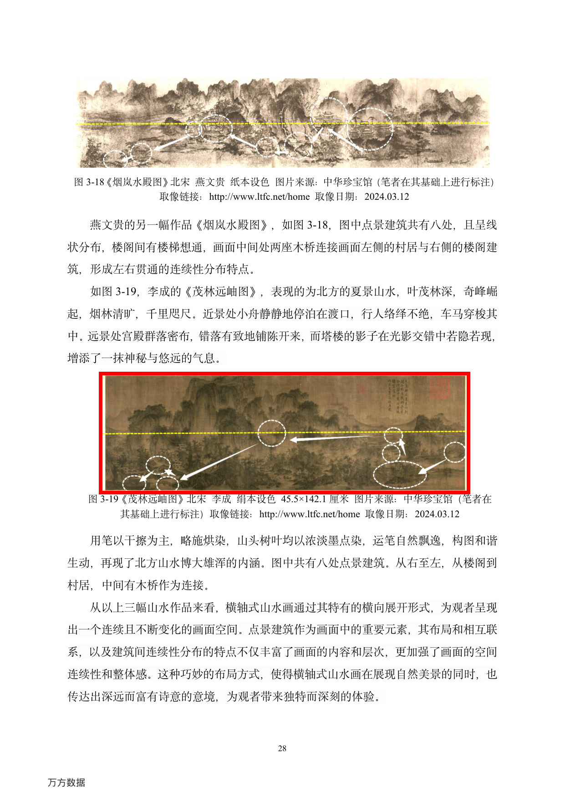
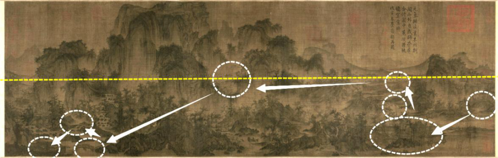

# v0.3.3 完整 SFT 轨迹真实样例

生成时间：2026-05-31 06:53 CST

## 样例概览

- task_id：`egva_v0_3_scope_000238`
- split：`val`
- PDF：`北宋山水画点景建筑布局分析与应用研究.pdf`
- 页码：第 36 页
- 轨迹长度：14 步
- 工具链路：`crop_image -> retrieve_evidence(current_page/nearby_pages/same_document/corpus) -> open_evidence -> write_claim*7 -> finish`

## v0.3.3 红框页面如何构建

v0.3.1 中，`crop_image.bbox` 不稳定等同于当前 page PNG 的真实像素坐标。v0.3.3 的处理是：

1. 读取原始 page PNG 和已有 crop 图。
2. 用 crop 图在 page PNG 上做模板匹配，反推出 crop 在页面图中的真实像素位置。
3. 用匹配得到的真实 page bbox 修正 `crop_image.bbox`。
4. 在 page image 上绘制红色矩形，让模型视觉上知道“目标图是哪一块”。

- v0.3.1 原始 bbox：`[181, 468, 827, 614]`
- v0.3.3 修正后 page bbox：`[224, 822, 1025, 1076]`
- page image size：`(1241, 1754)`
- crop image size：`(1069, 340)`

### 输入页面图：红框已绘制



### step 0 后得到的裁剪图



## Compact Prompt 说明

下面每一步展示的是当前 SFT 训练/评测实际使用的 `compact prompt` 形态。它不是 v0.3.1 原始超长 prompt，而是从结构化字段重建：

- 输入图像：page image；step 1 以后还包含 crop image。
- 文本输入：任务定义、工具 schema、最近历史动作、最近工具返回摘要、当前 claims。
- 监督输出：assistant 只输出一个 JSON action。

注意：当前保留的 v2 SFT adapter 使用 `coordinate_info=false` 的 compact prompt；也就是不额外插入页面尺寸和坐标说明。

## 逐步真实输入与输出
### Step 0: `crop_image`

**模型输入图像**

- 图像数量：1
- image 1: `v0.3.3完整SFT轨迹真实样例_20260531_0653_assets/page_highlighted.png` size=`(1241, 1754)`


**模型输入文本：compact prompt**

<details open>
<summary>展开 Step 0 compact prompt</summary>

```text
你是 evidence-grounded figure understanding 的 VLM tool-call agent。
目标：根据 PDF 页面图像、局部裁剪图和可追溯证据，为红框/目标山水画图像写出有证据支撑的结构化 claim。
task_id：egva_v0_3_scope_000238；step：0
source_file：北宋山水画点景建筑布局分析与应用研究.pdf；page：36
输入图像：1 张。第 1 张通常是 PDF 页面；第 2 张通常是已裁剪的目标图。
可用工具：
1. {"action":"crop_image","bbox":[x1,y1,x2,y2]}
2. {"action":"retrieve_evidence","query":"...","scope":"current_page|nearby_pages|same_document|corpus","anchor":{"source_file":"...","page":页码,"bbox":[x1,y1,x2,y2]},"top_k":整数}
3. {"action":"open_evidence","evidence_id":"ev_xxx"}
4. {"action":"write_claim","field":"caption_text|title|artist|dynasty|visual_elements|technique|composition","value":值,"evidence_ids":["ev_xxx"],"visual_bbox":[x1,y1,x2,y2]或null,"confidence":0到1}
5. {"action":"abstain_claim","field":"字段名","reason":"证据不足原因"}
6. {"action":"finish","status":"done"}
约束：只输出一个 JSON 对象；不要输出 markdown；不要编造作品名、画家、朝代、技法；证据不足就 abstain。
历史动作（保留最近若干步）：
[]
工具返回摘要（保留最近若干条，每条检索只保留前几个候选证据）：
[]
当前 claims：
[]
请根据当前状态选择下一步工具调用。只输出一个 JSON 对象。
```

</details>

**监督目标 / 模型应输出**

```json
{
  "action": "crop_image",
  "bbox": [
    224,
    822,
    1025,
    1076
  ]
}
```

### Step 1: `retrieve_evidence`

**模型输入图像**

- 图像数量：2
- image 1: `v0.3.3完整SFT轨迹真实样例_20260531_0653_assets/page_highlighted.png` size=`(1241, 1754)`


- image 2: `v0.3.3完整SFT轨迹真实样例_20260531_0653_assets/crop_target.jpg` size=`(1069, 340)`


**模型输入文本：compact prompt**

<details open>
<summary>展开 Step 1 compact prompt</summary>

```text
你是 evidence-grounded figure understanding 的 VLM tool-call agent。
目标：根据 PDF 页面图像、局部裁剪图和可追溯证据，为红框/目标山水画图像写出有证据支撑的结构化 claim。
task_id：egva_v0_3_scope_000238；step：1
source_file：北宋山水画点景建筑布局分析与应用研究.pdf；page：36
输入图像：2 张。第 1 张通常是 PDF 页面；第 2 张通常是已裁剪的目标图。
可用工具：
1. {"action":"crop_image","bbox":[x1,y1,x2,y2]}
2. {"action":"retrieve_evidence","query":"...","scope":"current_page|nearby_pages|same_document|corpus","anchor":{"source_file":"...","page":页码,"bbox":[x1,y1,x2,y2]},"top_k":整数}
3. {"action":"open_evidence","evidence_id":"ev_xxx"}
4. {"action":"write_claim","field":"caption_text|title|artist|dynasty|visual_elements|technique|composition","value":值,"evidence_ids":["ev_xxx"],"visual_bbox":[x1,y1,x2,y2]或null,"confidence":0到1}
5. {"action":"abstain_claim","field":"字段名","reason":"证据不足原因"}
6. {"action":"finish","status":"done"}
约束：只输出一个 JSON 对象；不要输出 markdown；不要编造作品名、画家、朝代、技法；证据不足就 abstain。
历史动作（保留最近若干步）：
[{"action":"crop_image","bbox":[224,822,1025,1076]}]
工具返回摘要（保留最近若干条，每条检索只保留前几个候选证据）：
[{"tool":"crop_image","bbox":[224,822,1025,1076],"crop_path":"v0.3.3完整SFT轨迹真实样例_20260531_0653_assets/crop_target.jpg"}]
当前 claims：
[]
请根据当前状态选择下一步工具调用。只输出一个 JSON 对象。
```

</details>

**监督目标 / 模型应输出**

```json
{
  "action": "retrieve_evidence",
  "query": "北宋山水画点景建筑布局分析与应用研究 图3-19《茂林远岫图》北宋李成绢本设色45.5×142.1厘米图片来源：中华珍宝馆（笔者在其基础上进行标注）",
  "scope": "current_page",
  "anchor": {
    "source_file": "北宋山水画点景建筑布局分析与应用研究.pdf",
    "page": 36,
    "bbox": [
      156,
      615,
      871,
      632
    ]
  },
  "top_k": 5
}
```

### Step 2: `retrieve_evidence`

**模型输入图像**

- 图像数量：2
- image 1: `v0.3.3完整SFT轨迹真实样例_20260531_0653_assets/page_highlighted.png` size=`(1241, 1754)`


- image 2: `v0.3.3完整SFT轨迹真实样例_20260531_0653_assets/crop_target.jpg` size=`(1069, 340)`


**模型输入文本：compact prompt**

<details open>
<summary>展开 Step 2 compact prompt</summary>

```text
你是 evidence-grounded figure understanding 的 VLM tool-call agent。
目标：根据 PDF 页面图像、局部裁剪图和可追溯证据，为红框/目标山水画图像写出有证据支撑的结构化 claim。
task_id：egva_v0_3_scope_000238；step：2
source_file：北宋山水画点景建筑布局分析与应用研究.pdf；page：36
输入图像：2 张。第 1 张通常是 PDF 页面；第 2 张通常是已裁剪的目标图。
可用工具：
1. {"action":"crop_image","bbox":[x1,y1,x2,y2]}
2. {"action":"retrieve_evidence","query":"...","scope":"current_page|nearby_pages|same_document|corpus","anchor":{"source_file":"...","page":页码,"bbox":[x1,y1,x2,y2]},"top_k":整数}
3. {"action":"open_evidence","evidence_id":"ev_xxx"}
4. {"action":"write_claim","field":"caption_text|title|artist|dynasty|visual_elements|technique|composition","value":值,"evidence_ids":["ev_xxx"],"visual_bbox":[x1,y1,x2,y2]或null,"confidence":0到1}
5. {"action":"abstain_claim","field":"字段名","reason":"证据不足原因"}
6. {"action":"finish","status":"done"}
约束：只输出一个 JSON 对象；不要输出 markdown；不要编造作品名、画家、朝代、技法；证据不足就 abstain。
历史动作（保留最近若干步）：
[{"action":"crop_image","bbox":[224,822,1025,1076]},{"action":"retrieve_evidence","scope":"current_page","top_k":5,"query":"北宋山水画点景建筑布局分析与应用研究 图3-19《茂林远岫图》北宋李成绢本设色45.5×142.1厘米图片来源：中华珍宝馆（笔者在其基础上进行标注）","anchor":{"source_file":"北宋山水画点景建筑布局分析与应用研究.pdf","page":36,"bbox":[156,615,871,632]}}]
工具返回摘要（保留最近若干条，每条检索只保留前几个候选证据）：
[{"tool":"crop_image","bbox":[224,822,1025,1076],"crop_path":"v0.3.3完整SFT轨迹真实样例_20260531_0653_assets/crop_target.jpg"},{"tool":"retrieve_evidence","scope":"current_page","query":"北宋山水画点景建筑布局分析与应用研究 图3-19《茂林远岫图》北宋李成绢本设色45.5×142.1厘米图片来源：中华珍宝馆（笔者在其基础上进行标注）","anchor":{"source_file":"北宋山水画点景建筑布局分析与应用研究.pdf","page":36,"bbox":[156,615,871,632]},"results":[{"evidence_id":"ev_76e4c60bbe4109c8a748","source_file":"北宋山水画点景建筑布局分析与应用研究.pdf","page_start":35,"page_end":37,"authority_level":"B","citation_level":"page_range_chunk","score":86.5,"snippet":"础上进行标注）取像链接：http://www.ltfc.net/home 取像日期：2024.03.12燕文贵的另一幅作品《烟岚水殿图》，如图3-18，图中点景建筑共有八处，且呈线状分布，楼阁间有楼梯想通，画面中间处两座木桥连接画面左侧的村居与右侧的楼阁建如图3-19，李成的《茂林远岫图》，表现的为北方的夏景山水，叶茂林深，奇峰崛起，烟林清旷，千里咫尺..."},{"evidence_id":"ev_dd7681366eefeb223411","source_file":"北宋山水画点景建筑布局分析与应用研究.pdf","page_start":34,"page_end":36,"authority_level":"B","citation_level":"page_range_chunk","score":65.5,"snippet":"色144.4×56.8 厘米图片来源：中华珍宝馆（笔者在其基础上进行标注）取像链接：http://www.ltfc.net/home 取连续性特点主要体现在北宋时期的横轴式山水画中，横轴式作品同样占据了重要的地位。与立轴式作品相比，横轴式作品在构图和点景建筑的布局上也有着独特的规律。首先，横轴式作品主要以横向展开的卷轴形式呈现，长度并不固定，且画幅的长..."},{"evidence_id":"ev_98708b29631b60048cc2","source_file":"北宋山水画点景建筑布局分析与应用研究.pdf","page_start":36,"page_end":36,"authority_level":"legacy","citation_level":"chunk","score":28.1,"snippet":"该图示通过虚线与箭头系统展示北宋山水画中点景建筑的布局逻辑，是验证四大布局铁律的图像证据，位于文献的规律层分析环节。"}]}]
当前 claims：
[]
请根据当前状态选择下一步工具调用。只输出一个 JSON 对象。
```

</details>

**监督目标 / 模型应输出**

```json
{
  "action": "retrieve_evidence",
  "query": "北宋山水画点景建筑布局分析与应用研究 图3-19《茂林远岫图》北宋李成绢本设色45.5×142.1厘米图片来源：中华珍宝馆（笔者在其基础上进行标注） 茂林远岫图 李成 北宋 山 水 建筑 树木 桥梁 设色 干擦 烘染 点染 布局",
  "scope": "nearby_pages",
  "anchor": {
    "source_file": "北宋山水画点景建筑布局分析与应用研究.pdf",
    "page": 36,
    "bbox": [
      181,
      468,
      827,
      614
    ]
  },
  "top_k": 6
}
```

### Step 3: `retrieve_evidence`

**模型输入图像**

- 图像数量：2
- image 1: `v0.3.3完整SFT轨迹真实样例_20260531_0653_assets/page_highlighted.png` size=`(1241, 1754)`


- image 2: `v0.3.3完整SFT轨迹真实样例_20260531_0653_assets/crop_target.jpg` size=`(1069, 340)`


**模型输入文本：compact prompt**

<details open>
<summary>展开 Step 3 compact prompt</summary>

```text
你是 evidence-grounded figure understanding 的 VLM tool-call agent。
目标：根据 PDF 页面图像、局部裁剪图和可追溯证据，为红框/目标山水画图像写出有证据支撑的结构化 claim。
task_id：egva_v0_3_scope_000238；step：3
source_file：北宋山水画点景建筑布局分析与应用研究.pdf；page：36
输入图像：2 张。第 1 张通常是 PDF 页面；第 2 张通常是已裁剪的目标图。
可用工具：
1. {"action":"crop_image","bbox":[x1,y1,x2,y2]}
2. {"action":"retrieve_evidence","query":"...","scope":"current_page|nearby_pages|same_document|corpus","anchor":{"source_file":"...","page":页码,"bbox":[x1,y1,x2,y2]},"top_k":整数}
3. {"action":"open_evidence","evidence_id":"ev_xxx"}
4. {"action":"write_claim","field":"caption_text|title|artist|dynasty|visual_elements|technique|composition","value":值,"evidence_ids":["ev_xxx"],"visual_bbox":[x1,y1,x2,y2]或null,"confidence":0到1}
5. {"action":"abstain_claim","field":"字段名","reason":"证据不足原因"}
6. {"action":"finish","status":"done"}
约束：只输出一个 JSON 对象；不要输出 markdown；不要编造作品名、画家、朝代、技法；证据不足就 abstain。
历史动作（保留最近若干步）：
[{"action":"crop_image","bbox":[224,822,1025,1076]},{"action":"retrieve_evidence","scope":"current_page","top_k":5,"query":"北宋山水画点景建筑布局分析与应用研究 图3-19《茂林远岫图》北宋李成绢本设色45.5×142.1厘米图片来源：中华珍宝馆（笔者在其基础上进行标注）","anchor":{"source_file":"北宋山水画点景建筑布局分析与应用研究.pdf","page":36,"bbox":[156,615,871,632]}},{"action":"retrieve_evidence","scope":"nearby_pages","top_k":6,"query":"北宋山水画点景建筑布局分析与应用研究 图3-19《茂林远岫图》北宋李成绢本设色45.5×142.1厘米图片来源：中华珍宝馆（笔者在其基础上进行标注） 茂林远岫图 李成 北宋 山 水 建筑 树木 桥梁 设色 干擦 烘染 点染 布局","anchor":{"source_file":"北宋山水画点景建筑布局分析与应用研究.pdf","page":36,"bbox":[181,468,827,614]}}]
工具返回摘要（保留最近若干条，每条检索只保留前几个候选证据）：
[{"tool":"crop_image","bbox":[224,822,1025,1076],"crop_path":"v0.3.3完整SFT轨迹真实样例_20260531_0653_assets/crop_target.jpg"},{"tool":"retrieve_evidence","scope":"current_page","query":"北宋山水画点景建筑布局分析与应用研究 图3-19《茂林远岫图》北宋李成绢本设色45.5×142.1厘米图片来源：中华珍宝馆（笔者在其基础上进行标注）","anchor":{"source_file":"北宋山水画点景建筑布局分析与应用研究.pdf","page":36,"bbox":[156,615,871,632]},"results":[{"evidence_id":"ev_76e4c60bbe4109c8a748","source_file":"北宋山水画点景建筑布局分析与应用研究.pdf","page_start":35,"page_end":37,"authority_level":"B","citation_level":"page_range_chunk","score":86.5,"snippet":"础上进行标注）取像链接：http://www.ltfc.net/home 取像日期：2024.03.12燕文贵的另一幅作品《烟岚水殿图》，如图3-18，图中点景建筑共有八处，且呈线状分布，楼阁间有楼梯想通，画面中间处两座木桥连接画面左侧的村居与右侧的楼阁建如图3-19，李成的《茂林远岫图》，表现的为北方的夏景山水，叶茂林深，奇峰崛起，烟林清旷，千里咫尺..."},{"evidence_id":"ev_dd7681366eefeb223411","source_file":"北宋山水画点景建筑布局分析与应用研究.pdf","page_start":34,"page_end":36,"authority_level":"B","citation_level":"page_range_chunk","score":65.5,"snippet":"色144.4×56.8 厘米图片来源：中华珍宝馆（笔者在其基础上进行标注）取像链接：http://www.ltfc.net/home 取连续性特点主要体现在北宋时期的横轴式山水画中，横轴式作品同样占据了重要的地位。与立轴式作品相比，横轴式作品在构图和点景建筑的布局上也有着独特的规律。首先，横轴式作品主要以横向展开的卷轴形式呈现，长度并不固定，且画幅的长..."},{"evidence_id":"ev_98708b29631b60048cc2","source_file":"北宋山水画点景建筑布局分析与应用研究.pdf","page_start":36,"page_end":36,"authority_level":"legacy","citation_level":"chunk","score":28.1,"snippet":"该图示通过虚线与箭头系统展示北宋山水画中点景建筑的布局逻辑，是验证四大布局铁律的图像证据，位于文献的规律层分析环节。"}]},{"tool":"retrieve_evidence","scope":"nearby_pages","query":"北宋山水画点景建筑布局分析与应用研究 图3-19《茂林远岫图》北宋李成绢本设色45.5×142.1厘米图片来源：中华珍宝馆（笔者在其基础上进行标注） 茂林远岫图 李成 北宋 山 水 建筑 树木 桥梁 设色 干擦 烘染 点染 布局","anchor":{"source_file":"北宋山水画点景建筑布局分析与应用研究.pdf","page":36,"bbox":[181,468,827,614]},"results":[{"evidence_id":"ev_76e4c60bbe4109c8a748","source_file":"北宋山水画点景建筑布局分析与应用研究.pdf","page_start":35,"page_end":37,"authority_level":"B","citation_level":"page_range_chunk","score":114.5,"snippet":"础上进行标注）取像链接：http://www.ltfc.net/home 取像日期：2024.03.12燕文贵的另一幅作品《烟岚水殿图》，如图3-18，图中点景建筑共有八处，且呈线状分布，楼阁间有楼梯想通，画面中间处两座木桥连接画面左侧的村居与右侧的楼阁建如图3-19，李成的《茂林远岫图》，表现的为北方的夏景山水，叶茂林深，奇峰崛起，烟林清旷，千里咫尺..."},{"evidence_id":"ev_dd7681366eefeb223411","source_file":"北宋山水画点景建筑布局分析与应用研究.pdf","page_start":34,"page_end":36,"authority_level":"B","citation_level":"page_range_chunk","score":82.5,"snippet":"色144.4×56.8 厘米图片来源：中华珍宝馆（笔者在其基础上进行标注）取像链接：http://www.ltfc.net/home 取连续性特点主要体现在北宋时期的横轴式山水画中，横轴式作品同样占据了重要的地位。与立轴式作品相比，横轴式作品在构图和点景建筑的布局上也有着独特的规律。首先，横轴式作品主要以横向展开的卷轴形式呈现，长度并不固定，且画幅的长..."},{"evidence_id":"ev_bcd361fb21fe794887ba","source_file":"北宋山水画点景建筑布局分析与应用研究.pdf","page_start":35,"page_end":35,"authority_level":"legacy","citation_level":"chunk","score":74.6,"snippet":"本段以《江山楼观图》为例，标注18处点景建筑并标出中轴线，用于验证北宋山水画中建筑布局的集中性与对称性，是布局规律研究的实证基础。"}]}]
当前 claims：
[]
请根据当前状态选择下一步工具调用。只输出一个 JSON 对象。
```

</details>

**监督目标 / 模型应输出**

```json
{
  "action": "retrieve_evidence",
  "query": "北宋山水画点景建筑布局分析与应用研究 图3-19《茂林远岫图》北宋李成绢本设色45.5×142.1厘米图片来源：中华珍宝馆（笔者在其基础上进行标注） 茂林远岫图 李成 北宋 山 水 建筑 树木 桥梁 设色 干擦 烘染 点染 布局",
  "scope": "same_document",
  "anchor": {
    "source_file": "北宋山水画点景建筑布局分析与应用研究.pdf",
    "page": 36,
    "bbox": [
      181,
      468,
      827,
      614
    ]
  },
  "top_k": 8
}
```

### Step 4: `retrieve_evidence`

**模型输入图像**

- 图像数量：2
- image 1: `v0.3.3完整SFT轨迹真实样例_20260531_0653_assets/page_highlighted.png` size=`(1241, 1754)`


- image 2: `v0.3.3完整SFT轨迹真实样例_20260531_0653_assets/crop_target.jpg` size=`(1069, 340)`


**模型输入文本：compact prompt**

<details open>
<summary>展开 Step 4 compact prompt</summary>

```text
你是 evidence-grounded figure understanding 的 VLM tool-call agent。
目标：根据 PDF 页面图像、局部裁剪图和可追溯证据，为红框/目标山水画图像写出有证据支撑的结构化 claim。
task_id：egva_v0_3_scope_000238；step：4
source_file：北宋山水画点景建筑布局分析与应用研究.pdf；page：36
输入图像：2 张。第 1 张通常是 PDF 页面；第 2 张通常是已裁剪的目标图。
可用工具：
1. {"action":"crop_image","bbox":[x1,y1,x2,y2]}
2. {"action":"retrieve_evidence","query":"...","scope":"current_page|nearby_pages|same_document|corpus","anchor":{"source_file":"...","page":页码,"bbox":[x1,y1,x2,y2]},"top_k":整数}
3. {"action":"open_evidence","evidence_id":"ev_xxx"}
4. {"action":"write_claim","field":"caption_text|title|artist|dynasty|visual_elements|technique|composition","value":值,"evidence_ids":["ev_xxx"],"visual_bbox":[x1,y1,x2,y2]或null,"confidence":0到1}
5. {"action":"abstain_claim","field":"字段名","reason":"证据不足原因"}
6. {"action":"finish","status":"done"}
约束：只输出一个 JSON 对象；不要输出 markdown；不要编造作品名、画家、朝代、技法；证据不足就 abstain。
历史动作（保留最近若干步）：
[{"action":"crop_image","bbox":[224,822,1025,1076]},{"action":"retrieve_evidence","scope":"current_page","top_k":5,"query":"北宋山水画点景建筑布局分析与应用研究 图3-19《茂林远岫图》北宋李成绢本设色45.5×142.1厘米图片来源：中华珍宝馆（笔者在其基础上进行标注）","anchor":{"source_file":"北宋山水画点景建筑布局分析与应用研究.pdf","page":36,"bbox":[156,615,871,632]}},{"action":"retrieve_evidence","scope":"nearby_pages","top_k":6,"query":"北宋山水画点景建筑布局分析与应用研究 图3-19《茂林远岫图》北宋李成绢本设色45.5×142.1厘米图片来源：中华珍宝馆（笔者在其基础上进行标注） 茂林远岫图 李成 北宋 山 水 建筑 树木 桥梁 设色 干擦 烘染 点染 布局","anchor":{"source_file":"北宋山水画点景建筑布局分析与应用研究.pdf","page":36,"bbox":[181,468,827,614]}},{"action":"retrieve_evidence","scope":"same_document","top_k":8,"query":"北宋山水画点景建筑布局分析与应用研究 图3-19《茂林远岫图》北宋李成绢本设色45.5×142.1厘米图片来源：中华珍宝馆（笔者在其基础上进行标注） 茂林远岫图 李成 北宋 山 水 建筑 树木 桥梁 设色 干擦 烘染 点染 布局","anchor":{"source_file":"北宋山水画点景建筑布局分析与应用研究.pdf","page":36,"bbox":[181,468,827,614]}}]
工具返回摘要（保留最近若干条，每条检索只保留前几个候选证据）：
[{"tool":"crop_image","bbox":[224,822,1025,1076],"crop_path":"v0.3.3完整SFT轨迹真实样例_20260531_0653_assets/crop_target.jpg"},{"tool":"retrieve_evidence","scope":"current_page","query":"北宋山水画点景建筑布局分析与应用研究 图3-19《茂林远岫图》北宋李成绢本设色45.5×142.1厘米图片来源：中华珍宝馆（笔者在其基础上进行标注）","anchor":{"source_file":"北宋山水画点景建筑布局分析与应用研究.pdf","page":36,"bbox":[156,615,871,632]},"results":[{"evidence_id":"ev_76e4c60bbe4109c8a748","source_file":"北宋山水画点景建筑布局分析与应用研究.pdf","page_start":35,"page_end":37,"authority_level":"B","citation_level":"page_range_chunk","score":86.5,"snippet":"础上进行标注）取像链接：http://www.ltfc.net/home 取像日期：2024.03.12燕文贵的另一幅作品《烟岚水殿图》，如图3-18，图中点景建筑共有八处，且呈线状分布，楼阁间有楼梯想通，画面中间处两座木桥连接画面左侧的村居与右侧的楼阁建如图3-19，李成的《茂林远岫图》，表现的为北方的夏景山水，叶茂林深，奇峰崛起，烟林清旷，千里咫尺..."},{"evidence_id":"ev_dd7681366eefeb223411","source_file":"北宋山水画点景建筑布局分析与应用研究.pdf","page_start":34,"page_end":36,"authority_level":"B","citation_level":"page_range_chunk","score":65.5,"snippet":"色144.4×56.8 厘米图片来源：中华珍宝馆（笔者在其基础上进行标注）取像链接：http://www.ltfc.net/home 取连续性特点主要体现在北宋时期的横轴式山水画中，横轴式作品同样占据了重要的地位。与立轴式作品相比，横轴式作品在构图和点景建筑的布局上也有着独特的规律。首先，横轴式作品主要以横向展开的卷轴形式呈现，长度并不固定，且画幅的长..."},{"evidence_id":"ev_98708b29631b60048cc2","source_file":"北宋山水画点景建筑布局分析与应用研究.pdf","page_start":36,"page_end":36,"authority_level":"legacy","citation_level":"chunk","score":28.1,"snippet":"该图示通过虚线与箭头系统展示北宋山水画中点景建筑的布局逻辑，是验证四大布局铁律的图像证据，位于文献的规律层分析环节。"}]},{"tool":"retrieve_evidence","scope":"nearby_pages","query":"北宋山水画点景建筑布局分析与应用研究 图3-19《茂林远岫图》北宋李成绢本设色45.5×142.1厘米图片来源：中华珍宝馆（笔者在其基础上进行标注） 茂林远岫图 李成 北宋 山 水 建筑 树木 桥梁 设色 干擦 烘染 点染 布局","anchor":{"source_file":"北宋山水画点景建筑布局分析与应用研究.pdf","page":36,"bbox":[181,468,827,614]},"results":[{"evidence_id":"ev_76e4c60bbe4109c8a748","source_file":"北宋山水画点景建筑布局分析与应用研究.pdf","page_start":35,"page_end":37,"authority_level":"B","citation_level":"page_range_chunk","score":114.5,"snippet":"础上进行标注）取像链接：http://www.ltfc.net/home 取像日期：2024.03.12燕文贵的另一幅作品《烟岚水殿图》，如图3-18，图中点景建筑共有八处，且呈线状分布，楼阁间有楼梯想通，画面中间处两座木桥连接画面左侧的村居与右侧的楼阁建如图3-19，李成的《茂林远岫图》，表现的为北方的夏景山水，叶茂林深，奇峰崛起，烟林清旷，千里咫尺..."},{"evidence_id":"ev_dd7681366eefeb223411","source_file":"北宋山水画点景建筑布局分析与应用研究.pdf","page_start":34,"page_end":36,"authority_level":"B","citation_level":"page_range_chunk","score":82.5,"snippet":"色144.4×56.8 厘米图片来源：中华珍宝馆（笔者在其基础上进行标注）取像链接：http://www.ltfc.net/home 取连续性特点主要体现在北宋时期的横轴式山水画中，横轴式作品同样占据了重要的地位。与立轴式作品相比，横轴式作品在构图和点景建筑的布局上也有着独特的规律。首先，横轴式作品主要以横向展开的卷轴形式呈现，长度并不固定，且画幅的长..."},{"evidence_id":"ev_bcd361fb21fe794887ba","source_file":"北宋山水画点景建筑布局分析与应用研究.pdf","page_start":35,"page_end":35,"authority_level":"legacy","citation_level":"chunk","score":74.6,"snippet":"本段以《江山楼观图》为例，标注18处点景建筑并标出中轴线，用于验证北宋山水画中建筑布局的集中性与对称性，是布局规律研究的实证基础。"}]},{"tool":"retrieve_evidence","scope":"same_document","query":"北宋山水画点景建筑布局分析与应用研究 图3-19《茂林远岫图》北宋李成绢本设色45.5×142.1厘米图片来源：中华珍宝馆（笔者在其基础上进行标注） 茂林远岫图 李成 北宋 山 水 建筑 树木 桥梁 设色 干擦 烘染 点染 布局","anchor":{"source_file":"北宋山水画点景建筑布局分析与应用研究.pdf","page":36,"bbox":[181,468,827,614]},"results":[{"evidence_id":"ev_16de6882ace68d455411","source_file":"北宋山水画点景建筑布局分析与应用研究.pdf","page_start":null,"page_end":null,"authority_level":"legacy","citation_level":"chunk","score":123.6,"snippet":"本段以《茂林远岫图》为例，说明北宋李成作品中点景建筑的分布与构图关系，支撑布局规律的类型学分析，属于文献中规律层的实证案例。"},{"evidence_id":"ev_76e4c60bbe4109c8a748","source_file":"北宋山水画点景建筑布局分析与应用研究.pdf","page_start":35,"page_end":37,"authority_level":"B","citation_level":"page_range_chunk","score":114.5,"snippet":"础上进行标注）取像链接：http://www.ltfc.net/home 取像日期：2024.03.12燕文贵的另一幅作品《烟岚水殿图》，如图3-18，图中点景建筑共有八处，且呈线状分布，楼阁间有楼梯想通，画面中间处两座木桥连接画面左侧的村居与右侧的楼阁建如图3-19，李成的《茂林远岫图》，表现的为北方的夏景山水，叶茂林深，奇峰崛起，烟林清旷，千里咫尺..."},{"evidence_id":"ev_0d1f30d17feb5298c6ef","source_file":"北宋山水画点景建筑布局分析与应用研究.pdf","page_start":null,"page_end":null,"authority_level":"legacy","citation_level":"chunk","score":95.6,"snippet":"本段以《晴峦萧寺图》《早春图》为例，分析北宋山水画中点景建筑的分布规律，揭示其集中、平衡、等级与连续的布局特征，服务于整体布局铁律的建立。"}]}]
当前 claims：
[]
请根据当前状态选择下一步工具调用。只输出一个 JSON 对象。
```

</details>

**监督目标 / 模型应输出**

```json
{
  "action": "retrieve_evidence",
  "query": "北宋山水画点景建筑布局分析与应用研究 图3-19《茂林远岫图》北宋李成绢本设色45.5×142.1厘米图片来源：中华珍宝馆（笔者在其基础上进行标注） 茂林远岫图 李成 北宋 山 水 建筑 树木 桥梁 设色 干擦 烘染 点染 布局",
  "scope": "corpus",
  "anchor": {
    "source_file": "北宋山水画点景建筑布局分析与应用研究.pdf",
    "page": 36,
    "bbox": [
      181,
      468,
      827,
      614
    ]
  },
  "top_k": 8
}
```

### Step 5: `open_evidence`

**模型输入图像**

- 图像数量：2
- image 1: `v0.3.3完整SFT轨迹真实样例_20260531_0653_assets/page_highlighted.png` size=`(1241, 1754)`


- image 2: `v0.3.3完整SFT轨迹真实样例_20260531_0653_assets/crop_target.jpg` size=`(1069, 340)`


**模型输入文本：compact prompt**

<details open>
<summary>展开 Step 5 compact prompt</summary>

```text
你是 evidence-grounded figure understanding 的 VLM tool-call agent。
目标：根据 PDF 页面图像、局部裁剪图和可追溯证据，为红框/目标山水画图像写出有证据支撑的结构化 claim。
task_id：egva_v0_3_scope_000238；step：5
source_file：北宋山水画点景建筑布局分析与应用研究.pdf；page：36
输入图像：2 张。第 1 张通常是 PDF 页面；第 2 张通常是已裁剪的目标图。
可用工具：
1. {"action":"crop_image","bbox":[x1,y1,x2,y2]}
2. {"action":"retrieve_evidence","query":"...","scope":"current_page|nearby_pages|same_document|corpus","anchor":{"source_file":"...","page":页码,"bbox":[x1,y1,x2,y2]},"top_k":整数}
3. {"action":"open_evidence","evidence_id":"ev_xxx"}
4. {"action":"write_claim","field":"caption_text|title|artist|dynasty|visual_elements|technique|composition","value":值,"evidence_ids":["ev_xxx"],"visual_bbox":[x1,y1,x2,y2]或null,"confidence":0到1}
5. {"action":"abstain_claim","field":"字段名","reason":"证据不足原因"}
6. {"action":"finish","status":"done"}
约束：只输出一个 JSON 对象；不要输出 markdown；不要编造作品名、画家、朝代、技法；证据不足就 abstain。
历史动作（保留最近若干步）：
[{"action":"crop_image","bbox":[224,822,1025,1076]},{"action":"retrieve_evidence","scope":"current_page","top_k":5,"query":"北宋山水画点景建筑布局分析与应用研究 图3-19《茂林远岫图》北宋李成绢本设色45.5×142.1厘米图片来源：中华珍宝馆（笔者在其基础上进行标注）","anchor":{"source_file":"北宋山水画点景建筑布局分析与应用研究.pdf","page":36,"bbox":[156,615,871,632]}},{"action":"retrieve_evidence","scope":"nearby_pages","top_k":6,"query":"北宋山水画点景建筑布局分析与应用研究 图3-19《茂林远岫图》北宋李成绢本设色45.5×142.1厘米图片来源：中华珍宝馆（笔者在其基础上进行标注） 茂林远岫图 李成 北宋 山 水 建筑 树木 桥梁 设色 干擦 烘染 点染 布局","anchor":{"source_file":"北宋山水画点景建筑布局分析与应用研究.pdf","page":36,"bbox":[181,468,827,614]}},{"action":"retrieve_evidence","scope":"same_document","top_k":8,"query":"北宋山水画点景建筑布局分析与应用研究 图3-19《茂林远岫图》北宋李成绢本设色45.5×142.1厘米图片来源：中华珍宝馆（笔者在其基础上进行标注） 茂林远岫图 李成 北宋 山 水 建筑 树木 桥梁 设色 干擦 烘染 点染 布局","anchor":{"source_file":"北宋山水画点景建筑布局分析与应用研究.pdf","page":36,"bbox":[181,468,827,614]}},{"action":"retrieve_evidence","scope":"corpus","top_k":8,"query":"北宋山水画点景建筑布局分析与应用研究 图3-19《茂林远岫图》北宋李成绢本设色45.5×142.1厘米图片来源：中华珍宝馆（笔者在其基础上进行标注） 茂林远岫图 李成 北宋 山 水 建筑 树木 桥梁 设色 干擦 烘染 点染 布局","anchor":{"source_file":"北宋山水画点景建筑布局分析与应用研究.pdf","page":36,"bbox":[181,468,827,614]}}]
工具返回摘要（保留最近若干条，每条检索只保留前几个候选证据）：
[{"tool":"crop_image","bbox":[224,822,1025,1076],"crop_path":"v0.3.3完整SFT轨迹真实样例_20260531_0653_assets/crop_target.jpg"},{"tool":"retrieve_evidence","scope":"current_page","query":"北宋山水画点景建筑布局分析与应用研究 图3-19《茂林远岫图》北宋李成绢本设色45.5×142.1厘米图片来源：中华珍宝馆（笔者在其基础上进行标注）","anchor":{"source_file":"北宋山水画点景建筑布局分析与应用研究.pdf","page":36,"bbox":[156,615,871,632]},"results":[{"evidence_id":"ev_76e4c60bbe4109c8a748","source_file":"北宋山水画点景建筑布局分析与应用研究.pdf","page_start":35,"page_end":37,"authority_level":"B","citation_level":"page_range_chunk","score":86.5,"snippet":"础上进行标注）取像链接：http://www.ltfc.net/home 取像日期：2024.03.12燕文贵的另一幅作品《烟岚水殿图》，如图3-18，图中点景建筑共有八处，且呈线状分布，楼阁间有楼梯想通，画面中间处两座木桥连接画面左侧的村居与右侧的楼阁建如图3-19，李成的《茂林远岫图》，表现的为北方的夏景山水，叶茂林深，奇峰崛起，烟林清旷，千里咫尺..."},{"evidence_id":"ev_dd7681366eefeb223411","source_file":"北宋山水画点景建筑布局分析与应用研究.pdf","page_start":34,"page_end":36,"authority_level":"B","citation_level":"page_range_chunk","score":65.5,"snippet":"色144.4×56.8 厘米图片来源：中华珍宝馆（笔者在其基础上进行标注）取像链接：http://www.ltfc.net/home 取连续性特点主要体现在北宋时期的横轴式山水画中，横轴式作品同样占据了重要的地位。与立轴式作品相比，横轴式作品在构图和点景建筑的布局上也有着独特的规律。首先，横轴式作品主要以横向展开的卷轴形式呈现，长度并不固定，且画幅的长..."},{"evidence_id":"ev_98708b29631b60048cc2","source_file":"北宋山水画点景建筑布局分析与应用研究.pdf","page_start":36,"page_end":36,"authority_level":"legacy","citation_level":"chunk","score":28.1,"snippet":"该图示通过虚线与箭头系统展示北宋山水画中点景建筑的布局逻辑，是验证四大布局铁律的图像证据，位于文献的规律层分析环节。"}]},{"tool":"retrieve_evidence","scope":"nearby_pages","query":"北宋山水画点景建筑布局分析与应用研究 图3-19《茂林远岫图》北宋李成绢本设色45.5×142.1厘米图片来源：中华珍宝馆（笔者在其基础上进行标注） 茂林远岫图 李成 北宋 山 水 建筑 树木 桥梁 设色 干擦 烘染 点染 布局","anchor":{"source_file":"北宋山水画点景建筑布局分析与应用研究.pdf","page":36,"bbox":[181,468,827,614]},"results":[{"evidence_id":"ev_76e4c60bbe4109c8a748","source_file":"北宋山水画点景建筑布局分析与应用研究.pdf","page_start":35,"page_end":37,"authority_level":"B","citation_level":"page_range_chunk","score":114.5,"snippet":"础上进行标注）取像链接：http://www.ltfc.net/home 取像日期：2024.03.12燕文贵的另一幅作品《烟岚水殿图》，如图3-18，图中点景建筑共有八处，且呈线状分布，楼阁间有楼梯想通，画面中间处两座木桥连接画面左侧的村居与右侧的楼阁建如图3-19，李成的《茂林远岫图》，表现的为北方的夏景山水，叶茂林深，奇峰崛起，烟林清旷，千里咫尺..."},{"evidence_id":"ev_dd7681366eefeb223411","source_file":"北宋山水画点景建筑布局分析与应用研究.pdf","page_start":34,"page_end":36,"authority_level":"B","citation_level":"page_range_chunk","score":82.5,"snippet":"色144.4×56.8 厘米图片来源：中华珍宝馆（笔者在其基础上进行标注）取像链接：http://www.ltfc.net/home 取连续性特点主要体现在北宋时期的横轴式山水画中，横轴式作品同样占据了重要的地位。与立轴式作品相比，横轴式作品在构图和点景建筑的布局上也有着独特的规律。首先，横轴式作品主要以横向展开的卷轴形式呈现，长度并不固定，且画幅的长..."},{"evidence_id":"ev_bcd361fb21fe794887ba","source_file":"北宋山水画点景建筑布局分析与应用研究.pdf","page_start":35,"page_end":35,"authority_level":"legacy","citation_level":"chunk","score":74.6,"snippet":"本段以《江山楼观图》为例，标注18处点景建筑并标出中轴线，用于验证北宋山水画中建筑布局的集中性与对称性，是布局规律研究的实证基础。"}]},{"tool":"retrieve_evidence","scope":"same_document","query":"北宋山水画点景建筑布局分析与应用研究 图3-19《茂林远岫图》北宋李成绢本设色45.5×142.1厘米图片来源：中华珍宝馆（笔者在其基础上进行标注） 茂林远岫图 李成 北宋 山 水 建筑 树木 桥梁 设色 干擦 烘染 点染 布局","anchor":{"source_file":"北宋山水画点景建筑布局分析与应用研究.pdf","page":36,"bbox":[181,468,827,614]},"results":[{"evidence_id":"ev_16de6882ace68d455411","source_file":"北宋山水画点景建筑布局分析与应用研究.pdf","page_start":null,"page_end":null,"authority_level":"legacy","citation_level":"chunk","score":123.6,"snippet":"本段以《茂林远岫图》为例，说明北宋李成作品中点景建筑的分布与构图关系，支撑布局规律的类型学分析，属于文献中规律层的实证案例。"},{"evidence_id":"ev_76e4c60bbe4109c8a748","source_file":"北宋山水画点景建筑布局分析与应用研究.pdf","page_start":35,"page_end":37,"authority_level":"B","citation_level":"page_range_chunk","score":114.5,"snippet":"础上进行标注）取像链接：http://www.ltfc.net/home 取像日期：2024.03.12燕文贵的另一幅作品《烟岚水殿图》，如图3-18，图中点景建筑共有八处，且呈线状分布，楼阁间有楼梯想通，画面中间处两座木桥连接画面左侧的村居与右侧的楼阁建如图3-19，李成的《茂林远岫图》，表现的为北方的夏景山水，叶茂林深，奇峰崛起，烟林清旷，千里咫尺..."},{"evidence_id":"ev_0d1f30d17feb5298c6ef","source_file":"北宋山水画点景建筑布局分析与应用研究.pdf","page_start":null,"page_end":null,"authority_level":"legacy","citation_level":"chunk","score":95.6,"snippet":"本段以《晴峦萧寺图》《早春图》为例，分析北宋山水画中点景建筑的分布规律，揭示其集中、平衡、等级与连续的布局特征，服务于整体布局铁律的建立。"}]},{"tool":"retrieve_evidence","scope":"corpus","query":"北宋山水画点景建筑布局分析与应用研究 图3-19《茂林远岫图》北宋李成绢本设色45.5×142.1厘米图片来源：中华珍宝馆（笔者在其基础上进行标注） 茂林远岫图 李成 北宋 山 水 建筑 树木 桥梁 设色 干擦 烘染 点染 布局","anchor":{"source_file":"北宋山水画点景建筑布局分析与应用研究.pdf","page":36,"bbox":[181,468,827,614]},"results":[{"evidence_id":"ev_16de6882ace68d455411","source_file":"北宋山水画点景建筑布局分析与应用研究.pdf","page_start":null,"page_end":null,"authority_level":"legacy","citation_level":"chunk","score":123.6,"snippet":"本段以《茂林远岫图》为例，说明北宋李成作品中点景建筑的分布与构图关系，支撑布局规律的类型学分析，属于文献中规律层的实证案例。"},{"evidence_id":"ev_76e4c60bbe4109c8a748","source_file":"北宋山水画点景建筑布局分析与应用研究.pdf","page_start":35,"page_end":37,"authority_level":"B","citation_level":"page_range_chunk","score":114.5,"snippet":"础上进行标注）取像链接：http://www.ltfc.net/home 取像日期：2024.03.12燕文贵的另一幅作品《烟岚水殿图》，如图3-18，图中点景建筑共有八处，且呈线状分布，楼阁间有楼梯想通，画面中间处两座木桥连接画面左侧的村居与右侧的楼阁建如图3-19，李成的《茂林远岫图》，表现的为北方的夏景山水，叶茂林深，奇峰崛起，烟林清旷，千里咫尺..."},{"evidence_id":"ev_0d1f30d17feb5298c6ef","source_file":"北宋山水画点景建筑布局分析与应用研究.pdf","page_start":null,"page_end":null,"authority_level":"legacy","citation_level":"chunk","score":95.6,"snippet":"本段以《晴峦萧寺图》《早春图》为例，分析北宋山水画中点景建筑的分布规律，揭示其集中、平衡、等级与连续的布局特征，服务于整体布局铁律的建立。"}]}]
当前 claims：
[]
请根据当前状态选择下一步工具调用。只输出一个 JSON 对象。
```

</details>

**监督目标 / 模型应输出**

```json
{
  "action": "open_evidence",
  "evidence_id": "ev_16de6882ace68d455411"
}
```

### Step 6: `write_claim`

**模型输入图像**

- 图像数量：2
- image 1: `v0.3.3完整SFT轨迹真实样例_20260531_0653_assets/page_highlighted.png` size=`(1241, 1754)`


- image 2: `v0.3.3完整SFT轨迹真实样例_20260531_0653_assets/crop_target.jpg` size=`(1069, 340)`


**模型输入文本：compact prompt**

<details open>
<summary>展开 Step 6 compact prompt</summary>

```text
你是 evidence-grounded figure understanding 的 VLM tool-call agent。
目标：根据 PDF 页面图像、局部裁剪图和可追溯证据，为红框/目标山水画图像写出有证据支撑的结构化 claim。
task_id：egva_v0_3_scope_000238；step：6
source_file：北宋山水画点景建筑布局分析与应用研究.pdf；page：36
输入图像：2 张。第 1 张通常是 PDF 页面；第 2 张通常是已裁剪的目标图。
可用工具：
1. {"action":"crop_image","bbox":[x1,y1,x2,y2]}
2. {"action":"retrieve_evidence","query":"...","scope":"current_page|nearby_pages|same_document|corpus","anchor":{"source_file":"...","page":页码,"bbox":[x1,y1,x2,y2]},"top_k":整数}
3. {"action":"open_evidence","evidence_id":"ev_xxx"}
4. {"action":"write_claim","field":"caption_text|title|artist|dynasty|visual_elements|technique|composition","value":值,"evidence_ids":["ev_xxx"],"visual_bbox":[x1,y1,x2,y2]或null,"confidence":0到1}
5. {"action":"abstain_claim","field":"字段名","reason":"证据不足原因"}
6. {"action":"finish","status":"done"}
约束：只输出一个 JSON 对象；不要输出 markdown；不要编造作品名、画家、朝代、技法；证据不足就 abstain。
历史动作（保留最近若干步）：
[{"action":"crop_image","bbox":[224,822,1025,1076]},{"action":"retrieve_evidence","scope":"current_page","top_k":5,"query":"北宋山水画点景建筑布局分析与应用研究 图3-19《茂林远岫图》北宋李成绢本设色45.5×142.1厘米图片来源：中华珍宝馆（笔者在其基础上进行标注）","anchor":{"source_file":"北宋山水画点景建筑布局分析与应用研究.pdf","page":36,"bbox":[156,615,871,632]}},{"action":"retrieve_evidence","scope":"nearby_pages","top_k":6,"query":"北宋山水画点景建筑布局分析与应用研究 图3-19《茂林远岫图》北宋李成绢本设色45.5×142.1厘米图片来源：中华珍宝馆（笔者在其基础上进行标注） 茂林远岫图 李成 北宋 山 水 建筑 树木 桥梁 设色 干擦 烘染 点染 布局","anchor":{"source_file":"北宋山水画点景建筑布局分析与应用研究.pdf","page":36,"bbox":[181,468,827,614]}},{"action":"retrieve_evidence","scope":"same_document","top_k":8,"query":"北宋山水画点景建筑布局分析与应用研究 图3-19《茂林远岫图》北宋李成绢本设色45.5×142.1厘米图片来源：中华珍宝馆（笔者在其基础上进行标注） 茂林远岫图 李成 北宋 山 水 建筑 树木 桥梁 设色 干擦 烘染 点染 布局","anchor":{"source_file":"北宋山水画点景建筑布局分析与应用研究.pdf","page":36,"bbox":[181,468,827,614]}},{"action":"retrieve_evidence","scope":"corpus","top_k":8,"query":"北宋山水画点景建筑布局分析与应用研究 图3-19《茂林远岫图》北宋李成绢本设色45.5×142.1厘米图片来源：中华珍宝馆（笔者在其基础上进行标注） 茂林远岫图 李成 北宋 山 水 建筑 树木 桥梁 设色 干擦 烘染 点染 布局","anchor":{"source_file":"北宋山水画点景建筑布局分析与应用研究.pdf","page":36,"bbox":[181,468,827,614]}},{"action":"open_evidence","evidence_id":"ev_16de6882ace68d455411"}]
工具返回摘要（保留最近若干条，每条检索只保留前几个候选证据）：
[{"tool":"crop_image","bbox":[224,822,1025,1076],"crop_path":"v0.3.3完整SFT轨迹真实样例_20260531_0653_assets/crop_target.jpg"},{"tool":"retrieve_evidence","scope":"current_page","query":"北宋山水画点景建筑布局分析与应用研究 图3-19《茂林远岫图》北宋李成绢本设色45.5×142.1厘米图片来源：中华珍宝馆（笔者在其基础上进行标注）","anchor":{"source_file":"北宋山水画点景建筑布局分析与应用研究.pdf","page":36,"bbox":[156,615,871,632]},"results":[{"evidence_id":"ev_76e4c60bbe4109c8a748","source_file":"北宋山水画点景建筑布局分析与应用研究.pdf","page_start":35,"page_end":37,"authority_level":"B","citation_level":"page_range_chunk","score":86.5,"snippet":"础上进行标注）取像链接：http://www.ltfc.net/home 取像日期：2024.03.12燕文贵的另一幅作品《烟岚水殿图》，如图3-18，图中点景建筑共有八处，且呈线状分布，楼阁间有楼梯想通，画面中间处两座木桥连接画面左侧的村居与右侧的楼阁建如图3-19，李成的《茂林远岫图》，表现的为北方的夏景山水，叶茂林深，奇峰崛起，烟林清旷，千里咫尺..."},{"evidence_id":"ev_dd7681366eefeb223411","source_file":"北宋山水画点景建筑布局分析与应用研究.pdf","page_start":34,"page_end":36,"authority_level":"B","citation_level":"page_range_chunk","score":65.5,"snippet":"色144.4×56.8 厘米图片来源：中华珍宝馆（笔者在其基础上进行标注）取像链接：http://www.ltfc.net/home 取连续性特点主要体现在北宋时期的横轴式山水画中，横轴式作品同样占据了重要的地位。与立轴式作品相比，横轴式作品在构图和点景建筑的布局上也有着独特的规律。首先，横轴式作品主要以横向展开的卷轴形式呈现，长度并不固定，且画幅的长..."},{"evidence_id":"ev_98708b29631b60048cc2","source_file":"北宋山水画点景建筑布局分析与应用研究.pdf","page_start":36,"page_end":36,"authority_level":"legacy","citation_level":"chunk","score":28.1,"snippet":"该图示通过虚线与箭头系统展示北宋山水画中点景建筑的布局逻辑，是验证四大布局铁律的图像证据，位于文献的规律层分析环节。"}]},{"tool":"retrieve_evidence","scope":"nearby_pages","query":"北宋山水画点景建筑布局分析与应用研究 图3-19《茂林远岫图》北宋李成绢本设色45.5×142.1厘米图片来源：中华珍宝馆（笔者在其基础上进行标注） 茂林远岫图 李成 北宋 山 水 建筑 树木 桥梁 设色 干擦 烘染 点染 布局","anchor":{"source_file":"北宋山水画点景建筑布局分析与应用研究.pdf","page":36,"bbox":[181,468,827,614]},"results":[{"evidence_id":"ev_76e4c60bbe4109c8a748","source_file":"北宋山水画点景建筑布局分析与应用研究.pdf","page_start":35,"page_end":37,"authority_level":"B","citation_level":"page_range_chunk","score":114.5,"snippet":"础上进行标注）取像链接：http://www.ltfc.net/home 取像日期：2024.03.12燕文贵的另一幅作品《烟岚水殿图》，如图3-18，图中点景建筑共有八处，且呈线状分布，楼阁间有楼梯想通，画面中间处两座木桥连接画面左侧的村居与右侧的楼阁建如图3-19，李成的《茂林远岫图》，表现的为北方的夏景山水，叶茂林深，奇峰崛起，烟林清旷，千里咫尺..."},{"evidence_id":"ev_dd7681366eefeb223411","source_file":"北宋山水画点景建筑布局分析与应用研究.pdf","page_start":34,"page_end":36,"authority_level":"B","citation_level":"page_range_chunk","score":82.5,"snippet":"色144.4×56.8 厘米图片来源：中华珍宝馆（笔者在其基础上进行标注）取像链接：http://www.ltfc.net/home 取连续性特点主要体现在北宋时期的横轴式山水画中，横轴式作品同样占据了重要的地位。与立轴式作品相比，横轴式作品在构图和点景建筑的布局上也有着独特的规律。首先，横轴式作品主要以横向展开的卷轴形式呈现，长度并不固定，且画幅的长..."},{"evidence_id":"ev_bcd361fb21fe794887ba","source_file":"北宋山水画点景建筑布局分析与应用研究.pdf","page_start":35,"page_end":35,"authority_level":"legacy","citation_level":"chunk","score":74.6,"snippet":"本段以《江山楼观图》为例，标注18处点景建筑并标出中轴线，用于验证北宋山水画中建筑布局的集中性与对称性，是布局规律研究的实证基础。"}]},{"tool":"retrieve_evidence","scope":"same_document","query":"北宋山水画点景建筑布局分析与应用研究 图3-19《茂林远岫图》北宋李成绢本设色45.5×142.1厘米图片来源：中华珍宝馆（笔者在其基础上进行标注） 茂林远岫图 李成 北宋 山 水 建筑 树木 桥梁 设色 干擦 烘染 点染 布局","anchor":{"source_file":"北宋山水画点景建筑布局分析与应用研究.pdf","page":36,"bbox":[181,468,827,614]},"results":[{"evidence_id":"ev_16de6882ace68d455411","source_file":"北宋山水画点景建筑布局分析与应用研究.pdf","page_start":null,"page_end":null,"authority_level":"legacy","citation_level":"chunk","score":123.6,"snippet":"本段以《茂林远岫图》为例，说明北宋李成作品中点景建筑的分布与构图关系，支撑布局规律的类型学分析，属于文献中规律层的实证案例。"},{"evidence_id":"ev_76e4c60bbe4109c8a748","source_file":"北宋山水画点景建筑布局分析与应用研究.pdf","page_start":35,"page_end":37,"authority_level":"B","citation_level":"page_range_chunk","score":114.5,"snippet":"础上进行标注）取像链接：http://www.ltfc.net/home 取像日期：2024.03.12燕文贵的另一幅作品《烟岚水殿图》，如图3-18，图中点景建筑共有八处，且呈线状分布，楼阁间有楼梯想通，画面中间处两座木桥连接画面左侧的村居与右侧的楼阁建如图3-19，李成的《茂林远岫图》，表现的为北方的夏景山水，叶茂林深，奇峰崛起，烟林清旷，千里咫尺..."},{"evidence_id":"ev_0d1f30d17feb5298c6ef","source_file":"北宋山水画点景建筑布局分析与应用研究.pdf","page_start":null,"page_end":null,"authority_level":"legacy","citation_level":"chunk","score":95.6,"snippet":"本段以《晴峦萧寺图》《早春图》为例，分析北宋山水画中点景建筑的分布规律，揭示其集中、平衡、等级与连续的布局特征，服务于整体布局铁律的建立。"}]},{"tool":"retrieve_evidence","scope":"corpus","query":"北宋山水画点景建筑布局分析与应用研究 图3-19《茂林远岫图》北宋李成绢本设色45.5×142.1厘米图片来源：中华珍宝馆（笔者在其基础上进行标注） 茂林远岫图 李成 北宋 山 水 建筑 树木 桥梁 设色 干擦 烘染 点染 布局","anchor":{"source_file":"北宋山水画点景建筑布局分析与应用研究.pdf","page":36,"bbox":[181,468,827,614]},"results":[{"evidence_id":"ev_16de6882ace68d455411","source_file":"北宋山水画点景建筑布局分析与应用研究.pdf","page_start":null,"page_end":null,"authority_level":"legacy","citation_level":"chunk","score":123.6,"snippet":"本段以《茂林远岫图》为例，说明北宋李成作品中点景建筑的分布与构图关系，支撑布局规律的类型学分析，属于文献中规律层的实证案例。"},{"evidence_id":"ev_76e4c60bbe4109c8a748","source_file":"北宋山水画点景建筑布局分析与应用研究.pdf","page_start":35,"page_end":37,"authority_level":"B","citation_level":"page_range_chunk","score":114.5,"snippet":"础上进行标注）取像链接：http://www.ltfc.net/home 取像日期：2024.03.12燕文贵的另一幅作品《烟岚水殿图》，如图3-18，图中点景建筑共有八处，且呈线状分布，楼阁间有楼梯想通，画面中间处两座木桥连接画面左侧的村居与右侧的楼阁建如图3-19，李成的《茂林远岫图》，表现的为北方的夏景山水，叶茂林深，奇峰崛起，烟林清旷，千里咫尺..."},{"evidence_id":"ev_0d1f30d17feb5298c6ef","source_file":"北宋山水画点景建筑布局分析与应用研究.pdf","page_start":null,"page_end":null,"authority_level":"legacy","citation_level":"chunk","score":95.6,"snippet":"本段以《晴峦萧寺图》《早春图》为例，分析北宋山水画中点景建筑的分布规律，揭示其集中、平衡、等级与连续的布局特征，服务于整体布局铁律的建立。"}]},{"tool":"open_evidence","evidence_id":"ev_16de6882ace68d455411","source_file":"北宋山水画点景建筑布局分析与应用研究.pdf","page_start":null,"page_end":null,"authority_level":"legacy","citation_level":"chunk","source_quality":"legacy_milvus","display_snippet":"本段以《茂林远岫图》为例，说明北宋李成作品中点景建筑的分布与构图关系，支撑布局规律的类型学分析，属于文献中规律层的实证案例。 图 3-19《茂林远岫图》北宋 李成 绢本设色 45.5×142.1 厘米 图片来源: 中华珍宝馆 (笔者在其基础上进行标注) 取像链接: http://www.ltfc.net/home 取像日期: 2024.03.12。用笔..."}]
当前 claims：
[]
请根据当前状态选择下一步工具调用。只输出一个 JSON 对象。
```

</details>

**监督目标 / 模型应输出**

```json
{
  "action": "write_claim",
  "field": "caption_text",
  "value": "图3-19《茂林远岫图》北宋李成绢本设色45.5×142.1厘米图片来源：中华珍宝馆（笔者在其基础上进行标注）",
  "evidence_ids": [
    "ev_16de6882ace68d455411"
  ],
  "visual_bbox": null,
  "confidence": 0.95
}
```

### Step 7: `write_claim`

**模型输入图像**

- 图像数量：2
- image 1: `v0.3.3完整SFT轨迹真实样例_20260531_0653_assets/page_highlighted.png` size=`(1241, 1754)`


- image 2: `v0.3.3完整SFT轨迹真实样例_20260531_0653_assets/crop_target.jpg` size=`(1069, 340)`


**模型输入文本：compact prompt**

<details open>
<summary>展开 Step 7 compact prompt</summary>

```text
你是 evidence-grounded figure understanding 的 VLM tool-call agent。
目标：根据 PDF 页面图像、局部裁剪图和可追溯证据，为红框/目标山水画图像写出有证据支撑的结构化 claim。
task_id：egva_v0_3_scope_000238；step：7
source_file：北宋山水画点景建筑布局分析与应用研究.pdf；page：36
输入图像：2 张。第 1 张通常是 PDF 页面；第 2 张通常是已裁剪的目标图。
可用工具：
1. {"action":"crop_image","bbox":[x1,y1,x2,y2]}
2. {"action":"retrieve_evidence","query":"...","scope":"current_page|nearby_pages|same_document|corpus","anchor":{"source_file":"...","page":页码,"bbox":[x1,y1,x2,y2]},"top_k":整数}
3. {"action":"open_evidence","evidence_id":"ev_xxx"}
4. {"action":"write_claim","field":"caption_text|title|artist|dynasty|visual_elements|technique|composition","value":值,"evidence_ids":["ev_xxx"],"visual_bbox":[x1,y1,x2,y2]或null,"confidence":0到1}
5. {"action":"abstain_claim","field":"字段名","reason":"证据不足原因"}
6. {"action":"finish","status":"done"}
约束：只输出一个 JSON 对象；不要输出 markdown；不要编造作品名、画家、朝代、技法；证据不足就 abstain。
历史动作（保留最近若干步）：
[{"action":"crop_image","bbox":[224,822,1025,1076]},{"action":"retrieve_evidence","scope":"current_page","top_k":5,"query":"北宋山水画点景建筑布局分析与应用研究 图3-19《茂林远岫图》北宋李成绢本设色45.5×142.1厘米图片来源：中华珍宝馆（笔者在其基础上进行标注）","anchor":{"source_file":"北宋山水画点景建筑布局分析与应用研究.pdf","page":36,"bbox":[156,615,871,632]}},{"action":"retrieve_evidence","scope":"nearby_pages","top_k":6,"query":"北宋山水画点景建筑布局分析与应用研究 图3-19《茂林远岫图》北宋李成绢本设色45.5×142.1厘米图片来源：中华珍宝馆（笔者在其基础上进行标注） 茂林远岫图 李成 北宋 山 水 建筑 树木 桥梁 设色 干擦 烘染 点染 布局","anchor":{"source_file":"北宋山水画点景建筑布局分析与应用研究.pdf","page":36,"bbox":[181,468,827,614]}},{"action":"retrieve_evidence","scope":"same_document","top_k":8,"query":"北宋山水画点景建筑布局分析与应用研究 图3-19《茂林远岫图》北宋李成绢本设色45.5×142.1厘米图片来源：中华珍宝馆（笔者在其基础上进行标注） 茂林远岫图 李成 北宋 山 水 建筑 树木 桥梁 设色 干擦 烘染 点染 布局","anchor":{"source_file":"北宋山水画点景建筑布局分析与应用研究.pdf","page":36,"bbox":[181,468,827,614]}},{"action":"retrieve_evidence","scope":"corpus","top_k":8,"query":"北宋山水画点景建筑布局分析与应用研究 图3-19《茂林远岫图》北宋李成绢本设色45.5×142.1厘米图片来源：中华珍宝馆（笔者在其基础上进行标注） 茂林远岫图 李成 北宋 山 水 建筑 树木 桥梁 设色 干擦 烘染 点染 布局","anchor":{"source_file":"北宋山水画点景建筑布局分析与应用研究.pdf","page":36,"bbox":[181,468,827,614]}},{"action":"open_evidence","evidence_id":"ev_16de6882ace68d455411"},{"action":"write_claim","field":"caption_text","value":"图3-19《茂林远岫图》北宋李成绢本设色45.5×142.1厘米图片来源：中华珍宝馆（笔者在其基础上进行标注）","evidence_ids":["ev_16de6882ace68d455411"]}]
工具返回摘要（保留最近若干条，每条检索只保留前几个候选证据）：
[{"tool":"crop_image","bbox":[224,822,1025,1076],"crop_path":"v0.3.3完整SFT轨迹真实样例_20260531_0653_assets/crop_target.jpg"},{"tool":"retrieve_evidence","scope":"current_page","query":"北宋山水画点景建筑布局分析与应用研究 图3-19《茂林远岫图》北宋李成绢本设色45.5×142.1厘米图片来源：中华珍宝馆（笔者在其基础上进行标注）","anchor":{"source_file":"北宋山水画点景建筑布局分析与应用研究.pdf","page":36,"bbox":[156,615,871,632]},"results":[{"evidence_id":"ev_76e4c60bbe4109c8a748","source_file":"北宋山水画点景建筑布局分析与应用研究.pdf","page_start":35,"page_end":37,"authority_level":"B","citation_level":"page_range_chunk","score":86.5,"snippet":"础上进行标注）取像链接：http://www.ltfc.net/home 取像日期：2024.03.12燕文贵的另一幅作品《烟岚水殿图》，如图3-18，图中点景建筑共有八处，且呈线状分布，楼阁间有楼梯想通，画面中间处两座木桥连接画面左侧的村居与右侧的楼阁建如图3-19，李成的《茂林远岫图》，表现的为北方的夏景山水，叶茂林深，奇峰崛起，烟林清旷，千里咫尺..."},{"evidence_id":"ev_dd7681366eefeb223411","source_file":"北宋山水画点景建筑布局分析与应用研究.pdf","page_start":34,"page_end":36,"authority_level":"B","citation_level":"page_range_chunk","score":65.5,"snippet":"色144.4×56.8 厘米图片来源：中华珍宝馆（笔者在其基础上进行标注）取像链接：http://www.ltfc.net/home 取连续性特点主要体现在北宋时期的横轴式山水画中，横轴式作品同样占据了重要的地位。与立轴式作品相比，横轴式作品在构图和点景建筑的布局上也有着独特的规律。首先，横轴式作品主要以横向展开的卷轴形式呈现，长度并不固定，且画幅的长..."},{"evidence_id":"ev_98708b29631b60048cc2","source_file":"北宋山水画点景建筑布局分析与应用研究.pdf","page_start":36,"page_end":36,"authority_level":"legacy","citation_level":"chunk","score":28.1,"snippet":"该图示通过虚线与箭头系统展示北宋山水画中点景建筑的布局逻辑，是验证四大布局铁律的图像证据，位于文献的规律层分析环节。"}]},{"tool":"retrieve_evidence","scope":"nearby_pages","query":"北宋山水画点景建筑布局分析与应用研究 图3-19《茂林远岫图》北宋李成绢本设色45.5×142.1厘米图片来源：中华珍宝馆（笔者在其基础上进行标注） 茂林远岫图 李成 北宋 山 水 建筑 树木 桥梁 设色 干擦 烘染 点染 布局","anchor":{"source_file":"北宋山水画点景建筑布局分析与应用研究.pdf","page":36,"bbox":[181,468,827,614]},"results":[{"evidence_id":"ev_76e4c60bbe4109c8a748","source_file":"北宋山水画点景建筑布局分析与应用研究.pdf","page_start":35,"page_end":37,"authority_level":"B","citation_level":"page_range_chunk","score":114.5,"snippet":"础上进行标注）取像链接：http://www.ltfc.net/home 取像日期：2024.03.12燕文贵的另一幅作品《烟岚水殿图》，如图3-18，图中点景建筑共有八处，且呈线状分布，楼阁间有楼梯想通，画面中间处两座木桥连接画面左侧的村居与右侧的楼阁建如图3-19，李成的《茂林远岫图》，表现的为北方的夏景山水，叶茂林深，奇峰崛起，烟林清旷，千里咫尺..."},{"evidence_id":"ev_dd7681366eefeb223411","source_file":"北宋山水画点景建筑布局分析与应用研究.pdf","page_start":34,"page_end":36,"authority_level":"B","citation_level":"page_range_chunk","score":82.5,"snippet":"色144.4×56.8 厘米图片来源：中华珍宝馆（笔者在其基础上进行标注）取像链接：http://www.ltfc.net/home 取连续性特点主要体现在北宋时期的横轴式山水画中，横轴式作品同样占据了重要的地位。与立轴式作品相比，横轴式作品在构图和点景建筑的布局上也有着独特的规律。首先，横轴式作品主要以横向展开的卷轴形式呈现，长度并不固定，且画幅的长..."},{"evidence_id":"ev_bcd361fb21fe794887ba","source_file":"北宋山水画点景建筑布局分析与应用研究.pdf","page_start":35,"page_end":35,"authority_level":"legacy","citation_level":"chunk","score":74.6,"snippet":"本段以《江山楼观图》为例，标注18处点景建筑并标出中轴线，用于验证北宋山水画中建筑布局的集中性与对称性，是布局规律研究的实证基础。"}]},{"tool":"retrieve_evidence","scope":"same_document","query":"北宋山水画点景建筑布局分析与应用研究 图3-19《茂林远岫图》北宋李成绢本设色45.5×142.1厘米图片来源：中华珍宝馆（笔者在其基础上进行标注） 茂林远岫图 李成 北宋 山 水 建筑 树木 桥梁 设色 干擦 烘染 点染 布局","anchor":{"source_file":"北宋山水画点景建筑布局分析与应用研究.pdf","page":36,"bbox":[181,468,827,614]},"results":[{"evidence_id":"ev_16de6882ace68d455411","source_file":"北宋山水画点景建筑布局分析与应用研究.pdf","page_start":null,"page_end":null,"authority_level":"legacy","citation_level":"chunk","score":123.6,"snippet":"本段以《茂林远岫图》为例，说明北宋李成作品中点景建筑的分布与构图关系，支撑布局规律的类型学分析，属于文献中规律层的实证案例。"},{"evidence_id":"ev_76e4c60bbe4109c8a748","source_file":"北宋山水画点景建筑布局分析与应用研究.pdf","page_start":35,"page_end":37,"authority_level":"B","citation_level":"page_range_chunk","score":114.5,"snippet":"础上进行标注）取像链接：http://www.ltfc.net/home 取像日期：2024.03.12燕文贵的另一幅作品《烟岚水殿图》，如图3-18，图中点景建筑共有八处，且呈线状分布，楼阁间有楼梯想通，画面中间处两座木桥连接画面左侧的村居与右侧的楼阁建如图3-19，李成的《茂林远岫图》，表现的为北方的夏景山水，叶茂林深，奇峰崛起，烟林清旷，千里咫尺..."},{"evidence_id":"ev_0d1f30d17feb5298c6ef","source_file":"北宋山水画点景建筑布局分析与应用研究.pdf","page_start":null,"page_end":null,"authority_level":"legacy","citation_level":"chunk","score":95.6,"snippet":"本段以《晴峦萧寺图》《早春图》为例，分析北宋山水画中点景建筑的分布规律，揭示其集中、平衡、等级与连续的布局特征，服务于整体布局铁律的建立。"}]},{"tool":"retrieve_evidence","scope":"corpus","query":"北宋山水画点景建筑布局分析与应用研究 图3-19《茂林远岫图》北宋李成绢本设色45.5×142.1厘米图片来源：中华珍宝馆（笔者在其基础上进行标注） 茂林远岫图 李成 北宋 山 水 建筑 树木 桥梁 设色 干擦 烘染 点染 布局","anchor":{"source_file":"北宋山水画点景建筑布局分析与应用研究.pdf","page":36,"bbox":[181,468,827,614]},"results":[{"evidence_id":"ev_16de6882ace68d455411","source_file":"北宋山水画点景建筑布局分析与应用研究.pdf","page_start":null,"page_end":null,"authority_level":"legacy","citation_level":"chunk","score":123.6,"snippet":"本段以《茂林远岫图》为例，说明北宋李成作品中点景建筑的分布与构图关系，支撑布局规律的类型学分析，属于文献中规律层的实证案例。"},{"evidence_id":"ev_76e4c60bbe4109c8a748","source_file":"北宋山水画点景建筑布局分析与应用研究.pdf","page_start":35,"page_end":37,"authority_level":"B","citation_level":"page_range_chunk","score":114.5,"snippet":"础上进行标注）取像链接：http://www.ltfc.net/home 取像日期：2024.03.12燕文贵的另一幅作品《烟岚水殿图》，如图3-18，图中点景建筑共有八处，且呈线状分布，楼阁间有楼梯想通，画面中间处两座木桥连接画面左侧的村居与右侧的楼阁建如图3-19，李成的《茂林远岫图》，表现的为北方的夏景山水，叶茂林深，奇峰崛起，烟林清旷，千里咫尺..."},{"evidence_id":"ev_0d1f30d17feb5298c6ef","source_file":"北宋山水画点景建筑布局分析与应用研究.pdf","page_start":null,"page_end":null,"authority_level":"legacy","citation_level":"chunk","score":95.6,"snippet":"本段以《晴峦萧寺图》《早春图》为例，分析北宋山水画中点景建筑的分布规律，揭示其集中、平衡、等级与连续的布局特征，服务于整体布局铁律的建立。"}]},{"tool":"open_evidence","evidence_id":"ev_16de6882ace68d455411","source_file":"北宋山水画点景建筑布局分析与应用研究.pdf","page_start":null,"page_end":null,"authority_level":"legacy","citation_level":"chunk","source_quality":"legacy_milvus","display_snippet":"本段以《茂林远岫图》为例，说明北宋李成作品中点景建筑的分布与构图关系，支撑布局规律的类型学分析，属于文献中规律层的实证案例。 图 3-19《茂林远岫图》北宋 李成 绢本设色 45.5×142.1 厘米 图片来源: 中华珍宝馆 (笔者在其基础上进行标注) 取像链接: http://www.ltfc.net/home 取像日期: 2024.03.12。用笔..."}]
当前 claims：
[{"field":"caption_text","value":"图3-19《茂林远岫图》北宋李成绢本设色45.5×142.1厘米图片来源：中华珍宝馆（笔者在其基础上进行标注）","evidence_ids":["ev_16de6882ace68d455411"],"visual_bbox":null,"confidence":0.95}]
请根据当前状态选择下一步工具调用。只输出一个 JSON 对象。
```

</details>

**监督目标 / 模型应输出**

```json
{
  "action": "write_claim",
  "field": "title",
  "value": "茂林远岫图",
  "evidence_ids": [
    "ev_16de6882ace68d455411"
  ],
  "visual_bbox": null,
  "confidence": 0.95
}
```

### Step 8: `write_claim`

**模型输入图像**

- 图像数量：2
- image 1: `v0.3.3完整SFT轨迹真实样例_20260531_0653_assets/page_highlighted.png` size=`(1241, 1754)`


- image 2: `v0.3.3完整SFT轨迹真实样例_20260531_0653_assets/crop_target.jpg` size=`(1069, 340)`


**模型输入文本：compact prompt**

<details open>
<summary>展开 Step 8 compact prompt</summary>

```text
你是 evidence-grounded figure understanding 的 VLM tool-call agent。
目标：根据 PDF 页面图像、局部裁剪图和可追溯证据，为红框/目标山水画图像写出有证据支撑的结构化 claim。
task_id：egva_v0_3_scope_000238；step：8
source_file：北宋山水画点景建筑布局分析与应用研究.pdf；page：36
输入图像：2 张。第 1 张通常是 PDF 页面；第 2 张通常是已裁剪的目标图。
可用工具：
1. {"action":"crop_image","bbox":[x1,y1,x2,y2]}
2. {"action":"retrieve_evidence","query":"...","scope":"current_page|nearby_pages|same_document|corpus","anchor":{"source_file":"...","page":页码,"bbox":[x1,y1,x2,y2]},"top_k":整数}
3. {"action":"open_evidence","evidence_id":"ev_xxx"}
4. {"action":"write_claim","field":"caption_text|title|artist|dynasty|visual_elements|technique|composition","value":值,"evidence_ids":["ev_xxx"],"visual_bbox":[x1,y1,x2,y2]或null,"confidence":0到1}
5. {"action":"abstain_claim","field":"字段名","reason":"证据不足原因"}
6. {"action":"finish","status":"done"}
约束：只输出一个 JSON 对象；不要输出 markdown；不要编造作品名、画家、朝代、技法；证据不足就 abstain。
历史动作（保留最近若干步）：
[{"action":"crop_image","bbox":[224,822,1025,1076]},{"action":"retrieve_evidence","scope":"current_page","top_k":5,"query":"北宋山水画点景建筑布局分析与应用研究 图3-19《茂林远岫图》北宋李成绢本设色45.5×142.1厘米图片来源：中华珍宝馆（笔者在其基础上进行标注）","anchor":{"source_file":"北宋山水画点景建筑布局分析与应用研究.pdf","page":36,"bbox":[156,615,871,632]}},{"action":"retrieve_evidence","scope":"nearby_pages","top_k":6,"query":"北宋山水画点景建筑布局分析与应用研究 图3-19《茂林远岫图》北宋李成绢本设色45.5×142.1厘米图片来源：中华珍宝馆（笔者在其基础上进行标注） 茂林远岫图 李成 北宋 山 水 建筑 树木 桥梁 设色 干擦 烘染 点染 布局","anchor":{"source_file":"北宋山水画点景建筑布局分析与应用研究.pdf","page":36,"bbox":[181,468,827,614]}},{"action":"retrieve_evidence","scope":"same_document","top_k":8,"query":"北宋山水画点景建筑布局分析与应用研究 图3-19《茂林远岫图》北宋李成绢本设色45.5×142.1厘米图片来源：中华珍宝馆（笔者在其基础上进行标注） 茂林远岫图 李成 北宋 山 水 建筑 树木 桥梁 设色 干擦 烘染 点染 布局","anchor":{"source_file":"北宋山水画点景建筑布局分析与应用研究.pdf","page":36,"bbox":[181,468,827,614]}},{"action":"retrieve_evidence","scope":"corpus","top_k":8,"query":"北宋山水画点景建筑布局分析与应用研究 图3-19《茂林远岫图》北宋李成绢本设色45.5×142.1厘米图片来源：中华珍宝馆（笔者在其基础上进行标注） 茂林远岫图 李成 北宋 山 水 建筑 树木 桥梁 设色 干擦 烘染 点染 布局","anchor":{"source_file":"北宋山水画点景建筑布局分析与应用研究.pdf","page":36,"bbox":[181,468,827,614]}},{"action":"open_evidence","evidence_id":"ev_16de6882ace68d455411"},{"action":"write_claim","field":"caption_text","value":"图3-19《茂林远岫图》北宋李成绢本设色45.5×142.1厘米图片来源：中华珍宝馆（笔者在其基础上进行标注）","evidence_ids":["ev_16de6882ace68d455411"]},{"action":"write_claim","field":"title","value":"茂林远岫图","evidence_ids":["ev_16de6882ace68d455411"]}]
工具返回摘要（保留最近若干条，每条检索只保留前几个候选证据）：
[{"tool":"crop_image","bbox":[224,822,1025,1076],"crop_path":"v0.3.3完整SFT轨迹真实样例_20260531_0653_assets/crop_target.jpg"},{"tool":"retrieve_evidence","scope":"current_page","query":"北宋山水画点景建筑布局分析与应用研究 图3-19《茂林远岫图》北宋李成绢本设色45.5×142.1厘米图片来源：中华珍宝馆（笔者在其基础上进行标注）","anchor":{"source_file":"北宋山水画点景建筑布局分析与应用研究.pdf","page":36,"bbox":[156,615,871,632]},"results":[{"evidence_id":"ev_76e4c60bbe4109c8a748","source_file":"北宋山水画点景建筑布局分析与应用研究.pdf","page_start":35,"page_end":37,"authority_level":"B","citation_level":"page_range_chunk","score":86.5,"snippet":"础上进行标注）取像链接：http://www.ltfc.net/home 取像日期：2024.03.12燕文贵的另一幅作品《烟岚水殿图》，如图3-18，图中点景建筑共有八处，且呈线状分布，楼阁间有楼梯想通，画面中间处两座木桥连接画面左侧的村居与右侧的楼阁建如图3-19，李成的《茂林远岫图》，表现的为北方的夏景山水，叶茂林深，奇峰崛起，烟林清旷，千里咫尺..."},{"evidence_id":"ev_dd7681366eefeb223411","source_file":"北宋山水画点景建筑布局分析与应用研究.pdf","page_start":34,"page_end":36,"authority_level":"B","citation_level":"page_range_chunk","score":65.5,"snippet":"色144.4×56.8 厘米图片来源：中华珍宝馆（笔者在其基础上进行标注）取像链接：http://www.ltfc.net/home 取连续性特点主要体现在北宋时期的横轴式山水画中，横轴式作品同样占据了重要的地位。与立轴式作品相比，横轴式作品在构图和点景建筑的布局上也有着独特的规律。首先，横轴式作品主要以横向展开的卷轴形式呈现，长度并不固定，且画幅的长..."},{"evidence_id":"ev_98708b29631b60048cc2","source_file":"北宋山水画点景建筑布局分析与应用研究.pdf","page_start":36,"page_end":36,"authority_level":"legacy","citation_level":"chunk","score":28.1,"snippet":"该图示通过虚线与箭头系统展示北宋山水画中点景建筑的布局逻辑，是验证四大布局铁律的图像证据，位于文献的规律层分析环节。"}]},{"tool":"retrieve_evidence","scope":"nearby_pages","query":"北宋山水画点景建筑布局分析与应用研究 图3-19《茂林远岫图》北宋李成绢本设色45.5×142.1厘米图片来源：中华珍宝馆（笔者在其基础上进行标注） 茂林远岫图 李成 北宋 山 水 建筑 树木 桥梁 设色 干擦 烘染 点染 布局","anchor":{"source_file":"北宋山水画点景建筑布局分析与应用研究.pdf","page":36,"bbox":[181,468,827,614]},"results":[{"evidence_id":"ev_76e4c60bbe4109c8a748","source_file":"北宋山水画点景建筑布局分析与应用研究.pdf","page_start":35,"page_end":37,"authority_level":"B","citation_level":"page_range_chunk","score":114.5,"snippet":"础上进行标注）取像链接：http://www.ltfc.net/home 取像日期：2024.03.12燕文贵的另一幅作品《烟岚水殿图》，如图3-18，图中点景建筑共有八处，且呈线状分布，楼阁间有楼梯想通，画面中间处两座木桥连接画面左侧的村居与右侧的楼阁建如图3-19，李成的《茂林远岫图》，表现的为北方的夏景山水，叶茂林深，奇峰崛起，烟林清旷，千里咫尺..."},{"evidence_id":"ev_dd7681366eefeb223411","source_file":"北宋山水画点景建筑布局分析与应用研究.pdf","page_start":34,"page_end":36,"authority_level":"B","citation_level":"page_range_chunk","score":82.5,"snippet":"色144.4×56.8 厘米图片来源：中华珍宝馆（笔者在其基础上进行标注）取像链接：http://www.ltfc.net/home 取连续性特点主要体现在北宋时期的横轴式山水画中，横轴式作品同样占据了重要的地位。与立轴式作品相比，横轴式作品在构图和点景建筑的布局上也有着独特的规律。首先，横轴式作品主要以横向展开的卷轴形式呈现，长度并不固定，且画幅的长..."},{"evidence_id":"ev_bcd361fb21fe794887ba","source_file":"北宋山水画点景建筑布局分析与应用研究.pdf","page_start":35,"page_end":35,"authority_level":"legacy","citation_level":"chunk","score":74.6,"snippet":"本段以《江山楼观图》为例，标注18处点景建筑并标出中轴线，用于验证北宋山水画中建筑布局的集中性与对称性，是布局规律研究的实证基础。"}]},{"tool":"retrieve_evidence","scope":"same_document","query":"北宋山水画点景建筑布局分析与应用研究 图3-19《茂林远岫图》北宋李成绢本设色45.5×142.1厘米图片来源：中华珍宝馆（笔者在其基础上进行标注） 茂林远岫图 李成 北宋 山 水 建筑 树木 桥梁 设色 干擦 烘染 点染 布局","anchor":{"source_file":"北宋山水画点景建筑布局分析与应用研究.pdf","page":36,"bbox":[181,468,827,614]},"results":[{"evidence_id":"ev_16de6882ace68d455411","source_file":"北宋山水画点景建筑布局分析与应用研究.pdf","page_start":null,"page_end":null,"authority_level":"legacy","citation_level":"chunk","score":123.6,"snippet":"本段以《茂林远岫图》为例，说明北宋李成作品中点景建筑的分布与构图关系，支撑布局规律的类型学分析，属于文献中规律层的实证案例。"},{"evidence_id":"ev_76e4c60bbe4109c8a748","source_file":"北宋山水画点景建筑布局分析与应用研究.pdf","page_start":35,"page_end":37,"authority_level":"B","citation_level":"page_range_chunk","score":114.5,"snippet":"础上进行标注）取像链接：http://www.ltfc.net/home 取像日期：2024.03.12燕文贵的另一幅作品《烟岚水殿图》，如图3-18，图中点景建筑共有八处，且呈线状分布，楼阁间有楼梯想通，画面中间处两座木桥连接画面左侧的村居与右侧的楼阁建如图3-19，李成的《茂林远岫图》，表现的为北方的夏景山水，叶茂林深，奇峰崛起，烟林清旷，千里咫尺..."},{"evidence_id":"ev_0d1f30d17feb5298c6ef","source_file":"北宋山水画点景建筑布局分析与应用研究.pdf","page_start":null,"page_end":null,"authority_level":"legacy","citation_level":"chunk","score":95.6,"snippet":"本段以《晴峦萧寺图》《早春图》为例，分析北宋山水画中点景建筑的分布规律，揭示其集中、平衡、等级与连续的布局特征，服务于整体布局铁律的建立。"}]},{"tool":"retrieve_evidence","scope":"corpus","query":"北宋山水画点景建筑布局分析与应用研究 图3-19《茂林远岫图》北宋李成绢本设色45.5×142.1厘米图片来源：中华珍宝馆（笔者在其基础上进行标注） 茂林远岫图 李成 北宋 山 水 建筑 树木 桥梁 设色 干擦 烘染 点染 布局","anchor":{"source_file":"北宋山水画点景建筑布局分析与应用研究.pdf","page":36,"bbox":[181,468,827,614]},"results":[{"evidence_id":"ev_16de6882ace68d455411","source_file":"北宋山水画点景建筑布局分析与应用研究.pdf","page_start":null,"page_end":null,"authority_level":"legacy","citation_level":"chunk","score":123.6,"snippet":"本段以《茂林远岫图》为例，说明北宋李成作品中点景建筑的分布与构图关系，支撑布局规律的类型学分析，属于文献中规律层的实证案例。"},{"evidence_id":"ev_76e4c60bbe4109c8a748","source_file":"北宋山水画点景建筑布局分析与应用研究.pdf","page_start":35,"page_end":37,"authority_level":"B","citation_level":"page_range_chunk","score":114.5,"snippet":"础上进行标注）取像链接：http://www.ltfc.net/home 取像日期：2024.03.12燕文贵的另一幅作品《烟岚水殿图》，如图3-18，图中点景建筑共有八处，且呈线状分布，楼阁间有楼梯想通，画面中间处两座木桥连接画面左侧的村居与右侧的楼阁建如图3-19，李成的《茂林远岫图》，表现的为北方的夏景山水，叶茂林深，奇峰崛起，烟林清旷，千里咫尺..."},{"evidence_id":"ev_0d1f30d17feb5298c6ef","source_file":"北宋山水画点景建筑布局分析与应用研究.pdf","page_start":null,"page_end":null,"authority_level":"legacy","citation_level":"chunk","score":95.6,"snippet":"本段以《晴峦萧寺图》《早春图》为例，分析北宋山水画中点景建筑的分布规律，揭示其集中、平衡、等级与连续的布局特征，服务于整体布局铁律的建立。"}]},{"tool":"open_evidence","evidence_id":"ev_16de6882ace68d455411","source_file":"北宋山水画点景建筑布局分析与应用研究.pdf","page_start":null,"page_end":null,"authority_level":"legacy","citation_level":"chunk","source_quality":"legacy_milvus","display_snippet":"本段以《茂林远岫图》为例，说明北宋李成作品中点景建筑的分布与构图关系，支撑布局规律的类型学分析，属于文献中规律层的实证案例。 图 3-19《茂林远岫图》北宋 李成 绢本设色 45.5×142.1 厘米 图片来源: 中华珍宝馆 (笔者在其基础上进行标注) 取像链接: http://www.ltfc.net/home 取像日期: 2024.03.12。用笔..."}]
当前 claims：
[{"field":"caption_text","value":"图3-19《茂林远岫图》北宋李成绢本设色45.5×142.1厘米图片来源：中华珍宝馆（笔者在其基础上进行标注）","evidence_ids":["ev_16de6882ace68d455411"],"visual_bbox":null,"confidence":0.95},{"field":"title","value":"茂林远岫图","evidence_ids":["ev_16de6882ace68d455411"],"visual_bbox":null,"confidence":0.95}]
请根据当前状态选择下一步工具调用。只输出一个 JSON 对象。
```

</details>

**监督目标 / 模型应输出**

```json
{
  "action": "write_claim",
  "field": "artist",
  "value": "李成",
  "evidence_ids": [
    "ev_16de6882ace68d455411"
  ],
  "visual_bbox": null,
  "confidence": 0.95
}
```

### Step 9: `write_claim`

**模型输入图像**

- 图像数量：2
- image 1: `v0.3.3完整SFT轨迹真实样例_20260531_0653_assets/page_highlighted.png` size=`(1241, 1754)`


- image 2: `v0.3.3完整SFT轨迹真实样例_20260531_0653_assets/crop_target.jpg` size=`(1069, 340)`


**模型输入文本：compact prompt**

<details open>
<summary>展开 Step 9 compact prompt</summary>

```text
你是 evidence-grounded figure understanding 的 VLM tool-call agent。
目标：根据 PDF 页面图像、局部裁剪图和可追溯证据，为红框/目标山水画图像写出有证据支撑的结构化 claim。
task_id：egva_v0_3_scope_000238；step：9
source_file：北宋山水画点景建筑布局分析与应用研究.pdf；page：36
输入图像：2 张。第 1 张通常是 PDF 页面；第 2 张通常是已裁剪的目标图。
可用工具：
1. {"action":"crop_image","bbox":[x1,y1,x2,y2]}
2. {"action":"retrieve_evidence","query":"...","scope":"current_page|nearby_pages|same_document|corpus","anchor":{"source_file":"...","page":页码,"bbox":[x1,y1,x2,y2]},"top_k":整数}
3. {"action":"open_evidence","evidence_id":"ev_xxx"}
4. {"action":"write_claim","field":"caption_text|title|artist|dynasty|visual_elements|technique|composition","value":值,"evidence_ids":["ev_xxx"],"visual_bbox":[x1,y1,x2,y2]或null,"confidence":0到1}
5. {"action":"abstain_claim","field":"字段名","reason":"证据不足原因"}
6. {"action":"finish","status":"done"}
约束：只输出一个 JSON 对象；不要输出 markdown；不要编造作品名、画家、朝代、技法；证据不足就 abstain。
历史动作（保留最近若干步）：
[{"action":"retrieve_evidence","scope":"current_page","top_k":5,"query":"北宋山水画点景建筑布局分析与应用研究 图3-19《茂林远岫图》北宋李成绢本设色45.5×142.1厘米图片来源：中华珍宝馆（笔者在其基础上进行标注）","anchor":{"source_file":"北宋山水画点景建筑布局分析与应用研究.pdf","page":36,"bbox":[156,615,871,632]}},{"action":"retrieve_evidence","scope":"nearby_pages","top_k":6,"query":"北宋山水画点景建筑布局分析与应用研究 图3-19《茂林远岫图》北宋李成绢本设色45.5×142.1厘米图片来源：中华珍宝馆（笔者在其基础上进行标注） 茂林远岫图 李成 北宋 山 水 建筑 树木 桥梁 设色 干擦 烘染 点染 布局","anchor":{"source_file":"北宋山水画点景建筑布局分析与应用研究.pdf","page":36,"bbox":[181,468,827,614]}},{"action":"retrieve_evidence","scope":"same_document","top_k":8,"query":"北宋山水画点景建筑布局分析与应用研究 图3-19《茂林远岫图》北宋李成绢本设色45.5×142.1厘米图片来源：中华珍宝馆（笔者在其基础上进行标注） 茂林远岫图 李成 北宋 山 水 建筑 树木 桥梁 设色 干擦 烘染 点染 布局","anchor":{"source_file":"北宋山水画点景建筑布局分析与应用研究.pdf","page":36,"bbox":[181,468,827,614]}},{"action":"retrieve_evidence","scope":"corpus","top_k":8,"query":"北宋山水画点景建筑布局分析与应用研究 图3-19《茂林远岫图》北宋李成绢本设色45.5×142.1厘米图片来源：中华珍宝馆（笔者在其基础上进行标注） 茂林远岫图 李成 北宋 山 水 建筑 树木 桥梁 设色 干擦 烘染 点染 布局","anchor":{"source_file":"北宋山水画点景建筑布局分析与应用研究.pdf","page":36,"bbox":[181,468,827,614]}},{"action":"open_evidence","evidence_id":"ev_16de6882ace68d455411"},{"action":"write_claim","field":"caption_text","value":"图3-19《茂林远岫图》北宋李成绢本设色45.5×142.1厘米图片来源：中华珍宝馆（笔者在其基础上进行标注）","evidence_ids":["ev_16de6882ace68d455411"]},{"action":"write_claim","field":"title","value":"茂林远岫图","evidence_ids":["ev_16de6882ace68d455411"]},{"action":"write_claim","field":"artist","value":"李成","evidence_ids":["ev_16de6882ace68d455411"]}]
工具返回摘要（保留最近若干条，每条检索只保留前几个候选证据）：
[{"tool":"crop_image","bbox":[224,822,1025,1076],"crop_path":"v0.3.3完整SFT轨迹真实样例_20260531_0653_assets/crop_target.jpg"},{"tool":"retrieve_evidence","scope":"current_page","query":"北宋山水画点景建筑布局分析与应用研究 图3-19《茂林远岫图》北宋李成绢本设色45.5×142.1厘米图片来源：中华珍宝馆（笔者在其基础上进行标注）","anchor":{"source_file":"北宋山水画点景建筑布局分析与应用研究.pdf","page":36,"bbox":[156,615,871,632]},"results":[{"evidence_id":"ev_76e4c60bbe4109c8a748","source_file":"北宋山水画点景建筑布局分析与应用研究.pdf","page_start":35,"page_end":37,"authority_level":"B","citation_level":"page_range_chunk","score":86.5,"snippet":"础上进行标注）取像链接：http://www.ltfc.net/home 取像日期：2024.03.12燕文贵的另一幅作品《烟岚水殿图》，如图3-18，图中点景建筑共有八处，且呈线状分布，楼阁间有楼梯想通，画面中间处两座木桥连接画面左侧的村居与右侧的楼阁建如图3-19，李成的《茂林远岫图》，表现的为北方的夏景山水，叶茂林深，奇峰崛起，烟林清旷，千里咫尺..."},{"evidence_id":"ev_dd7681366eefeb223411","source_file":"北宋山水画点景建筑布局分析与应用研究.pdf","page_start":34,"page_end":36,"authority_level":"B","citation_level":"page_range_chunk","score":65.5,"snippet":"色144.4×56.8 厘米图片来源：中华珍宝馆（笔者在其基础上进行标注）取像链接：http://www.ltfc.net/home 取连续性特点主要体现在北宋时期的横轴式山水画中，横轴式作品同样占据了重要的地位。与立轴式作品相比，横轴式作品在构图和点景建筑的布局上也有着独特的规律。首先，横轴式作品主要以横向展开的卷轴形式呈现，长度并不固定，且画幅的长..."},{"evidence_id":"ev_98708b29631b60048cc2","source_file":"北宋山水画点景建筑布局分析与应用研究.pdf","page_start":36,"page_end":36,"authority_level":"legacy","citation_level":"chunk","score":28.1,"snippet":"该图示通过虚线与箭头系统展示北宋山水画中点景建筑的布局逻辑，是验证四大布局铁律的图像证据，位于文献的规律层分析环节。"}]},{"tool":"retrieve_evidence","scope":"nearby_pages","query":"北宋山水画点景建筑布局分析与应用研究 图3-19《茂林远岫图》北宋李成绢本设色45.5×142.1厘米图片来源：中华珍宝馆（笔者在其基础上进行标注） 茂林远岫图 李成 北宋 山 水 建筑 树木 桥梁 设色 干擦 烘染 点染 布局","anchor":{"source_file":"北宋山水画点景建筑布局分析与应用研究.pdf","page":36,"bbox":[181,468,827,614]},"results":[{"evidence_id":"ev_76e4c60bbe4109c8a748","source_file":"北宋山水画点景建筑布局分析与应用研究.pdf","page_start":35,"page_end":37,"authority_level":"B","citation_level":"page_range_chunk","score":114.5,"snippet":"础上进行标注）取像链接：http://www.ltfc.net/home 取像日期：2024.03.12燕文贵的另一幅作品《烟岚水殿图》，如图3-18，图中点景建筑共有八处，且呈线状分布，楼阁间有楼梯想通，画面中间处两座木桥连接画面左侧的村居与右侧的楼阁建如图3-19，李成的《茂林远岫图》，表现的为北方的夏景山水，叶茂林深，奇峰崛起，烟林清旷，千里咫尺..."},{"evidence_id":"ev_dd7681366eefeb223411","source_file":"北宋山水画点景建筑布局分析与应用研究.pdf","page_start":34,"page_end":36,"authority_level":"B","citation_level":"page_range_chunk","score":82.5,"snippet":"色144.4×56.8 厘米图片来源：中华珍宝馆（笔者在其基础上进行标注）取像链接：http://www.ltfc.net/home 取连续性特点主要体现在北宋时期的横轴式山水画中，横轴式作品同样占据了重要的地位。与立轴式作品相比，横轴式作品在构图和点景建筑的布局上也有着独特的规律。首先，横轴式作品主要以横向展开的卷轴形式呈现，长度并不固定，且画幅的长..."},{"evidence_id":"ev_bcd361fb21fe794887ba","source_file":"北宋山水画点景建筑布局分析与应用研究.pdf","page_start":35,"page_end":35,"authority_level":"legacy","citation_level":"chunk","score":74.6,"snippet":"本段以《江山楼观图》为例，标注18处点景建筑并标出中轴线，用于验证北宋山水画中建筑布局的集中性与对称性，是布局规律研究的实证基础。"}]},{"tool":"retrieve_evidence","scope":"same_document","query":"北宋山水画点景建筑布局分析与应用研究 图3-19《茂林远岫图》北宋李成绢本设色45.5×142.1厘米图片来源：中华珍宝馆（笔者在其基础上进行标注） 茂林远岫图 李成 北宋 山 水 建筑 树木 桥梁 设色 干擦 烘染 点染 布局","anchor":{"source_file":"北宋山水画点景建筑布局分析与应用研究.pdf","page":36,"bbox":[181,468,827,614]},"results":[{"evidence_id":"ev_16de6882ace68d455411","source_file":"北宋山水画点景建筑布局分析与应用研究.pdf","page_start":null,"page_end":null,"authority_level":"legacy","citation_level":"chunk","score":123.6,"snippet":"本段以《茂林远岫图》为例，说明北宋李成作品中点景建筑的分布与构图关系，支撑布局规律的类型学分析，属于文献中规律层的实证案例。"},{"evidence_id":"ev_76e4c60bbe4109c8a748","source_file":"北宋山水画点景建筑布局分析与应用研究.pdf","page_start":35,"page_end":37,"authority_level":"B","citation_level":"page_range_chunk","score":114.5,"snippet":"础上进行标注）取像链接：http://www.ltfc.net/home 取像日期：2024.03.12燕文贵的另一幅作品《烟岚水殿图》，如图3-18，图中点景建筑共有八处，且呈线状分布，楼阁间有楼梯想通，画面中间处两座木桥连接画面左侧的村居与右侧的楼阁建如图3-19，李成的《茂林远岫图》，表现的为北方的夏景山水，叶茂林深，奇峰崛起，烟林清旷，千里咫尺..."},{"evidence_id":"ev_0d1f30d17feb5298c6ef","source_file":"北宋山水画点景建筑布局分析与应用研究.pdf","page_start":null,"page_end":null,"authority_level":"legacy","citation_level":"chunk","score":95.6,"snippet":"本段以《晴峦萧寺图》《早春图》为例，分析北宋山水画中点景建筑的分布规律，揭示其集中、平衡、等级与连续的布局特征，服务于整体布局铁律的建立。"}]},{"tool":"retrieve_evidence","scope":"corpus","query":"北宋山水画点景建筑布局分析与应用研究 图3-19《茂林远岫图》北宋李成绢本设色45.5×142.1厘米图片来源：中华珍宝馆（笔者在其基础上进行标注） 茂林远岫图 李成 北宋 山 水 建筑 树木 桥梁 设色 干擦 烘染 点染 布局","anchor":{"source_file":"北宋山水画点景建筑布局分析与应用研究.pdf","page":36,"bbox":[181,468,827,614]},"results":[{"evidence_id":"ev_16de6882ace68d455411","source_file":"北宋山水画点景建筑布局分析与应用研究.pdf","page_start":null,"page_end":null,"authority_level":"legacy","citation_level":"chunk","score":123.6,"snippet":"本段以《茂林远岫图》为例，说明北宋李成作品中点景建筑的分布与构图关系，支撑布局规律的类型学分析，属于文献中规律层的实证案例。"},{"evidence_id":"ev_76e4c60bbe4109c8a748","source_file":"北宋山水画点景建筑布局分析与应用研究.pdf","page_start":35,"page_end":37,"authority_level":"B","citation_level":"page_range_chunk","score":114.5,"snippet":"础上进行标注）取像链接：http://www.ltfc.net/home 取像日期：2024.03.12燕文贵的另一幅作品《烟岚水殿图》，如图3-18，图中点景建筑共有八处，且呈线状分布，楼阁间有楼梯想通，画面中间处两座木桥连接画面左侧的村居与右侧的楼阁建如图3-19，李成的《茂林远岫图》，表现的为北方的夏景山水，叶茂林深，奇峰崛起，烟林清旷，千里咫尺..."},{"evidence_id":"ev_0d1f30d17feb5298c6ef","source_file":"北宋山水画点景建筑布局分析与应用研究.pdf","page_start":null,"page_end":null,"authority_level":"legacy","citation_level":"chunk","score":95.6,"snippet":"本段以《晴峦萧寺图》《早春图》为例，分析北宋山水画中点景建筑的分布规律，揭示其集中、平衡、等级与连续的布局特征，服务于整体布局铁律的建立。"}]},{"tool":"open_evidence","evidence_id":"ev_16de6882ace68d455411","source_file":"北宋山水画点景建筑布局分析与应用研究.pdf","page_start":null,"page_end":null,"authority_level":"legacy","citation_level":"chunk","source_quality":"legacy_milvus","display_snippet":"本段以《茂林远岫图》为例，说明北宋李成作品中点景建筑的分布与构图关系，支撑布局规律的类型学分析，属于文献中规律层的实证案例。 图 3-19《茂林远岫图》北宋 李成 绢本设色 45.5×142.1 厘米 图片来源: 中华珍宝馆 (笔者在其基础上进行标注) 取像链接: http://www.ltfc.net/home 取像日期: 2024.03.12。用笔..."}]
当前 claims：
[{"field":"caption_text","value":"图3-19《茂林远岫图》北宋李成绢本设色45.5×142.1厘米图片来源：中华珍宝馆（笔者在其基础上进行标注）","evidence_ids":["ev_16de6882ace68d455411"],"visual_bbox":null,"confidence":0.95},{"field":"title","value":"茂林远岫图","evidence_ids":["ev_16de6882ace68d455411"],"visual_bbox":null,"confidence":0.95},{"field":"artist","value":"李成","evidence_ids":["ev_16de6882ace68d455411"],"visual_bbox":null,"confidence":0.95}]
请根据当前状态选择下一步工具调用。只输出一个 JSON 对象。
```

</details>

**监督目标 / 模型应输出**

```json
{
  "action": "write_claim",
  "field": "dynasty",
  "value": "北宋",
  "evidence_ids": [
    "ev_16de6882ace68d455411"
  ],
  "visual_bbox": null,
  "confidence": 0.95
}
```

### Step 10: `write_claim`

**模型输入图像**

- 图像数量：2
- image 1: `v0.3.3完整SFT轨迹真实样例_20260531_0653_assets/page_highlighted.png` size=`(1241, 1754)`


- image 2: `v0.3.3完整SFT轨迹真实样例_20260531_0653_assets/crop_target.jpg` size=`(1069, 340)`


**模型输入文本：compact prompt**

<details open>
<summary>展开 Step 10 compact prompt</summary>

```text
你是 evidence-grounded figure understanding 的 VLM tool-call agent。
目标：根据 PDF 页面图像、局部裁剪图和可追溯证据，为红框/目标山水画图像写出有证据支撑的结构化 claim。
task_id：egva_v0_3_scope_000238；step：10
source_file：北宋山水画点景建筑布局分析与应用研究.pdf；page：36
输入图像：2 张。第 1 张通常是 PDF 页面；第 2 张通常是已裁剪的目标图。
可用工具：
1. {"action":"crop_image","bbox":[x1,y1,x2,y2]}
2. {"action":"retrieve_evidence","query":"...","scope":"current_page|nearby_pages|same_document|corpus","anchor":{"source_file":"...","page":页码,"bbox":[x1,y1,x2,y2]},"top_k":整数}
3. {"action":"open_evidence","evidence_id":"ev_xxx"}
4. {"action":"write_claim","field":"caption_text|title|artist|dynasty|visual_elements|technique|composition","value":值,"evidence_ids":["ev_xxx"],"visual_bbox":[x1,y1,x2,y2]或null,"confidence":0到1}
5. {"action":"abstain_claim","field":"字段名","reason":"证据不足原因"}
6. {"action":"finish","status":"done"}
约束：只输出一个 JSON 对象；不要输出 markdown；不要编造作品名、画家、朝代、技法；证据不足就 abstain。
历史动作（保留最近若干步）：
[{"action":"retrieve_evidence","scope":"nearby_pages","top_k":6,"query":"北宋山水画点景建筑布局分析与应用研究 图3-19《茂林远岫图》北宋李成绢本设色45.5×142.1厘米图片来源：中华珍宝馆（笔者在其基础上进行标注） 茂林远岫图 李成 北宋 山 水 建筑 树木 桥梁 设色 干擦 烘染 点染 布局","anchor":{"source_file":"北宋山水画点景建筑布局分析与应用研究.pdf","page":36,"bbox":[181,468,827,614]}},{"action":"retrieve_evidence","scope":"same_document","top_k":8,"query":"北宋山水画点景建筑布局分析与应用研究 图3-19《茂林远岫图》北宋李成绢本设色45.5×142.1厘米图片来源：中华珍宝馆（笔者在其基础上进行标注） 茂林远岫图 李成 北宋 山 水 建筑 树木 桥梁 设色 干擦 烘染 点染 布局","anchor":{"source_file":"北宋山水画点景建筑布局分析与应用研究.pdf","page":36,"bbox":[181,468,827,614]}},{"action":"retrieve_evidence","scope":"corpus","top_k":8,"query":"北宋山水画点景建筑布局分析与应用研究 图3-19《茂林远岫图》北宋李成绢本设色45.5×142.1厘米图片来源：中华珍宝馆（笔者在其基础上进行标注） 茂林远岫图 李成 北宋 山 水 建筑 树木 桥梁 设色 干擦 烘染 点染 布局","anchor":{"source_file":"北宋山水画点景建筑布局分析与应用研究.pdf","page":36,"bbox":[181,468,827,614]}},{"action":"open_evidence","evidence_id":"ev_16de6882ace68d455411"},{"action":"write_claim","field":"caption_text","value":"图3-19《茂林远岫图》北宋李成绢本设色45.5×142.1厘米图片来源：中华珍宝馆（笔者在其基础上进行标注）","evidence_ids":["ev_16de6882ace68d455411"]},{"action":"write_claim","field":"title","value":"茂林远岫图","evidence_ids":["ev_16de6882ace68d455411"]},{"action":"write_claim","field":"artist","value":"李成","evidence_ids":["ev_16de6882ace68d455411"]},{"action":"write_claim","field":"dynasty","value":"北宋","evidence_ids":["ev_16de6882ace68d455411"]}]
工具返回摘要（保留最近若干条，每条检索只保留前几个候选证据）：
[{"tool":"crop_image","bbox":[224,822,1025,1076],"crop_path":"v0.3.3完整SFT轨迹真实样例_20260531_0653_assets/crop_target.jpg"},{"tool":"retrieve_evidence","scope":"current_page","query":"北宋山水画点景建筑布局分析与应用研究 图3-19《茂林远岫图》北宋李成绢本设色45.5×142.1厘米图片来源：中华珍宝馆（笔者在其基础上进行标注）","anchor":{"source_file":"北宋山水画点景建筑布局分析与应用研究.pdf","page":36,"bbox":[156,615,871,632]},"results":[{"evidence_id":"ev_76e4c60bbe4109c8a748","source_file":"北宋山水画点景建筑布局分析与应用研究.pdf","page_start":35,"page_end":37,"authority_level":"B","citation_level":"page_range_chunk","score":86.5,"snippet":"础上进行标注）取像链接：http://www.ltfc.net/home 取像日期：2024.03.12燕文贵的另一幅作品《烟岚水殿图》，如图3-18，图中点景建筑共有八处，且呈线状分布，楼阁间有楼梯想通，画面中间处两座木桥连接画面左侧的村居与右侧的楼阁建如图3-19，李成的《茂林远岫图》，表现的为北方的夏景山水，叶茂林深，奇峰崛起，烟林清旷，千里咫尺..."},{"evidence_id":"ev_dd7681366eefeb223411","source_file":"北宋山水画点景建筑布局分析与应用研究.pdf","page_start":34,"page_end":36,"authority_level":"B","citation_level":"page_range_chunk","score":65.5,"snippet":"色144.4×56.8 厘米图片来源：中华珍宝馆（笔者在其基础上进行标注）取像链接：http://www.ltfc.net/home 取连续性特点主要体现在北宋时期的横轴式山水画中，横轴式作品同样占据了重要的地位。与立轴式作品相比，横轴式作品在构图和点景建筑的布局上也有着独特的规律。首先，横轴式作品主要以横向展开的卷轴形式呈现，长度并不固定，且画幅的长..."},{"evidence_id":"ev_98708b29631b60048cc2","source_file":"北宋山水画点景建筑布局分析与应用研究.pdf","page_start":36,"page_end":36,"authority_level":"legacy","citation_level":"chunk","score":28.1,"snippet":"该图示通过虚线与箭头系统展示北宋山水画中点景建筑的布局逻辑，是验证四大布局铁律的图像证据，位于文献的规律层分析环节。"}]},{"tool":"retrieve_evidence","scope":"nearby_pages","query":"北宋山水画点景建筑布局分析与应用研究 图3-19《茂林远岫图》北宋李成绢本设色45.5×142.1厘米图片来源：中华珍宝馆（笔者在其基础上进行标注） 茂林远岫图 李成 北宋 山 水 建筑 树木 桥梁 设色 干擦 烘染 点染 布局","anchor":{"source_file":"北宋山水画点景建筑布局分析与应用研究.pdf","page":36,"bbox":[181,468,827,614]},"results":[{"evidence_id":"ev_76e4c60bbe4109c8a748","source_file":"北宋山水画点景建筑布局分析与应用研究.pdf","page_start":35,"page_end":37,"authority_level":"B","citation_level":"page_range_chunk","score":114.5,"snippet":"础上进行标注）取像链接：http://www.ltfc.net/home 取像日期：2024.03.12燕文贵的另一幅作品《烟岚水殿图》，如图3-18，图中点景建筑共有八处，且呈线状分布，楼阁间有楼梯想通，画面中间处两座木桥连接画面左侧的村居与右侧的楼阁建如图3-19，李成的《茂林远岫图》，表现的为北方的夏景山水，叶茂林深，奇峰崛起，烟林清旷，千里咫尺..."},{"evidence_id":"ev_dd7681366eefeb223411","source_file":"北宋山水画点景建筑布局分析与应用研究.pdf","page_start":34,"page_end":36,"authority_level":"B","citation_level":"page_range_chunk","score":82.5,"snippet":"色144.4×56.8 厘米图片来源：中华珍宝馆（笔者在其基础上进行标注）取像链接：http://www.ltfc.net/home 取连续性特点主要体现在北宋时期的横轴式山水画中，横轴式作品同样占据了重要的地位。与立轴式作品相比，横轴式作品在构图和点景建筑的布局上也有着独特的规律。首先，横轴式作品主要以横向展开的卷轴形式呈现，长度并不固定，且画幅的长..."},{"evidence_id":"ev_bcd361fb21fe794887ba","source_file":"北宋山水画点景建筑布局分析与应用研究.pdf","page_start":35,"page_end":35,"authority_level":"legacy","citation_level":"chunk","score":74.6,"snippet":"本段以《江山楼观图》为例，标注18处点景建筑并标出中轴线，用于验证北宋山水画中建筑布局的集中性与对称性，是布局规律研究的实证基础。"}]},{"tool":"retrieve_evidence","scope":"same_document","query":"北宋山水画点景建筑布局分析与应用研究 图3-19《茂林远岫图》北宋李成绢本设色45.5×142.1厘米图片来源：中华珍宝馆（笔者在其基础上进行标注） 茂林远岫图 李成 北宋 山 水 建筑 树木 桥梁 设色 干擦 烘染 点染 布局","anchor":{"source_file":"北宋山水画点景建筑布局分析与应用研究.pdf","page":36,"bbox":[181,468,827,614]},"results":[{"evidence_id":"ev_16de6882ace68d455411","source_file":"北宋山水画点景建筑布局分析与应用研究.pdf","page_start":null,"page_end":null,"authority_level":"legacy","citation_level":"chunk","score":123.6,"snippet":"本段以《茂林远岫图》为例，说明北宋李成作品中点景建筑的分布与构图关系，支撑布局规律的类型学分析，属于文献中规律层的实证案例。"},{"evidence_id":"ev_76e4c60bbe4109c8a748","source_file":"北宋山水画点景建筑布局分析与应用研究.pdf","page_start":35,"page_end":37,"authority_level":"B","citation_level":"page_range_chunk","score":114.5,"snippet":"础上进行标注）取像链接：http://www.ltfc.net/home 取像日期：2024.03.12燕文贵的另一幅作品《烟岚水殿图》，如图3-18，图中点景建筑共有八处，且呈线状分布，楼阁间有楼梯想通，画面中间处两座木桥连接画面左侧的村居与右侧的楼阁建如图3-19，李成的《茂林远岫图》，表现的为北方的夏景山水，叶茂林深，奇峰崛起，烟林清旷，千里咫尺..."},{"evidence_id":"ev_0d1f30d17feb5298c6ef","source_file":"北宋山水画点景建筑布局分析与应用研究.pdf","page_start":null,"page_end":null,"authority_level":"legacy","citation_level":"chunk","score":95.6,"snippet":"本段以《晴峦萧寺图》《早春图》为例，分析北宋山水画中点景建筑的分布规律，揭示其集中、平衡、等级与连续的布局特征，服务于整体布局铁律的建立。"}]},{"tool":"retrieve_evidence","scope":"corpus","query":"北宋山水画点景建筑布局分析与应用研究 图3-19《茂林远岫图》北宋李成绢本设色45.5×142.1厘米图片来源：中华珍宝馆（笔者在其基础上进行标注） 茂林远岫图 李成 北宋 山 水 建筑 树木 桥梁 设色 干擦 烘染 点染 布局","anchor":{"source_file":"北宋山水画点景建筑布局分析与应用研究.pdf","page":36,"bbox":[181,468,827,614]},"results":[{"evidence_id":"ev_16de6882ace68d455411","source_file":"北宋山水画点景建筑布局分析与应用研究.pdf","page_start":null,"page_end":null,"authority_level":"legacy","citation_level":"chunk","score":123.6,"snippet":"本段以《茂林远岫图》为例，说明北宋李成作品中点景建筑的分布与构图关系，支撑布局规律的类型学分析，属于文献中规律层的实证案例。"},{"evidence_id":"ev_76e4c60bbe4109c8a748","source_file":"北宋山水画点景建筑布局分析与应用研究.pdf","page_start":35,"page_end":37,"authority_level":"B","citation_level":"page_range_chunk","score":114.5,"snippet":"础上进行标注）取像链接：http://www.ltfc.net/home 取像日期：2024.03.12燕文贵的另一幅作品《烟岚水殿图》，如图3-18，图中点景建筑共有八处，且呈线状分布，楼阁间有楼梯想通，画面中间处两座木桥连接画面左侧的村居与右侧的楼阁建如图3-19，李成的《茂林远岫图》，表现的为北方的夏景山水，叶茂林深，奇峰崛起，烟林清旷，千里咫尺..."},{"evidence_id":"ev_0d1f30d17feb5298c6ef","source_file":"北宋山水画点景建筑布局分析与应用研究.pdf","page_start":null,"page_end":null,"authority_level":"legacy","citation_level":"chunk","score":95.6,"snippet":"本段以《晴峦萧寺图》《早春图》为例，分析北宋山水画中点景建筑的分布规律，揭示其集中、平衡、等级与连续的布局特征，服务于整体布局铁律的建立。"}]},{"tool":"open_evidence","evidence_id":"ev_16de6882ace68d455411","source_file":"北宋山水画点景建筑布局分析与应用研究.pdf","page_start":null,"page_end":null,"authority_level":"legacy","citation_level":"chunk","source_quality":"legacy_milvus","display_snippet":"本段以《茂林远岫图》为例，说明北宋李成作品中点景建筑的分布与构图关系，支撑布局规律的类型学分析，属于文献中规律层的实证案例。 图 3-19《茂林远岫图》北宋 李成 绢本设色 45.5×142.1 厘米 图片来源: 中华珍宝馆 (笔者在其基础上进行标注) 取像链接: http://www.ltfc.net/home 取像日期: 2024.03.12。用笔..."}]
当前 claims：
[{"field":"caption_text","value":"图3-19《茂林远岫图》北宋李成绢本设色45.5×142.1厘米图片来源：中华珍宝馆（笔者在其基础上进行标注）","evidence_ids":["ev_16de6882ace68d455411"],"visual_bbox":null,"confidence":0.95},{"field":"title","value":"茂林远岫图","evidence_ids":["ev_16de6882ace68d455411"],"visual_bbox":null,"confidence":0.95},{"field":"artist","value":"李成","evidence_ids":["ev_16de6882ace68d455411"],"visual_bbox":null,"confidence":0.95},{"field":"dynasty","value":"北宋","evidence_ids":["ev_16de6882ace68d455411"],"visual_bbox":null,"confidence":0.95}]
请根据当前状态选择下一步工具调用。只输出一个 JSON 对象。
```

</details>

**监督目标 / 模型应输出**

```json
{
  "action": "write_claim",
  "field": "visual_elements",
  "value": [
    "山",
    "水",
    "建筑",
    "树木",
    "桥梁"
  ],
  "evidence_ids": [
    "ev_16de6882ace68d455411"
  ],
  "visual_bbox": [
    181,
    468,
    827,
    614
  ],
  "confidence": 0.9
}
```

### Step 11: `write_claim`

**模型输入图像**

- 图像数量：2
- image 1: `v0.3.3完整SFT轨迹真实样例_20260531_0653_assets/page_highlighted.png` size=`(1241, 1754)`


- image 2: `v0.3.3完整SFT轨迹真实样例_20260531_0653_assets/crop_target.jpg` size=`(1069, 340)`


**模型输入文本：compact prompt**

<details open>
<summary>展开 Step 11 compact prompt</summary>

```text
你是 evidence-grounded figure understanding 的 VLM tool-call agent。
目标：根据 PDF 页面图像、局部裁剪图和可追溯证据，为红框/目标山水画图像写出有证据支撑的结构化 claim。
task_id：egva_v0_3_scope_000238；step：11
source_file：北宋山水画点景建筑布局分析与应用研究.pdf；page：36
输入图像：2 张。第 1 张通常是 PDF 页面；第 2 张通常是已裁剪的目标图。
可用工具：
1. {"action":"crop_image","bbox":[x1,y1,x2,y2]}
2. {"action":"retrieve_evidence","query":"...","scope":"current_page|nearby_pages|same_document|corpus","anchor":{"source_file":"...","page":页码,"bbox":[x1,y1,x2,y2]},"top_k":整数}
3. {"action":"open_evidence","evidence_id":"ev_xxx"}
4. {"action":"write_claim","field":"caption_text|title|artist|dynasty|visual_elements|technique|composition","value":值,"evidence_ids":["ev_xxx"],"visual_bbox":[x1,y1,x2,y2]或null,"confidence":0到1}
5. {"action":"abstain_claim","field":"字段名","reason":"证据不足原因"}
6. {"action":"finish","status":"done"}
约束：只输出一个 JSON 对象；不要输出 markdown；不要编造作品名、画家、朝代、技法；证据不足就 abstain。
历史动作（保留最近若干步）：
[{"action":"retrieve_evidence","scope":"same_document","top_k":8,"query":"北宋山水画点景建筑布局分析与应用研究 图3-19《茂林远岫图》北宋李成绢本设色45.5×142.1厘米图片来源：中华珍宝馆（笔者在其基础上进行标注） 茂林远岫图 李成 北宋 山 水 建筑 树木 桥梁 设色 干擦 烘染 点染 布局","anchor":{"source_file":"北宋山水画点景建筑布局分析与应用研究.pdf","page":36,"bbox":[181,468,827,614]}},{"action":"retrieve_evidence","scope":"corpus","top_k":8,"query":"北宋山水画点景建筑布局分析与应用研究 图3-19《茂林远岫图》北宋李成绢本设色45.5×142.1厘米图片来源：中华珍宝馆（笔者在其基础上进行标注） 茂林远岫图 李成 北宋 山 水 建筑 树木 桥梁 设色 干擦 烘染 点染 布局","anchor":{"source_file":"北宋山水画点景建筑布局分析与应用研究.pdf","page":36,"bbox":[181,468,827,614]}},{"action":"open_evidence","evidence_id":"ev_16de6882ace68d455411"},{"action":"write_claim","field":"caption_text","value":"图3-19《茂林远岫图》北宋李成绢本设色45.5×142.1厘米图片来源：中华珍宝馆（笔者在其基础上进行标注）","evidence_ids":["ev_16de6882ace68d455411"]},{"action":"write_claim","field":"title","value":"茂林远岫图","evidence_ids":["ev_16de6882ace68d455411"]},{"action":"write_claim","field":"artist","value":"李成","evidence_ids":["ev_16de6882ace68d455411"]},{"action":"write_claim","field":"dynasty","value":"北宋","evidence_ids":["ev_16de6882ace68d455411"]},{"action":"write_claim","field":"visual_elements","value":["山","水","建筑","树木","桥梁"],"evidence_ids":["ev_16de6882ace68d455411"]}]
工具返回摘要（保留最近若干条，每条检索只保留前几个候选证据）：
[{"tool":"crop_image","bbox":[224,822,1025,1076],"crop_path":"v0.3.3完整SFT轨迹真实样例_20260531_0653_assets/crop_target.jpg"},{"tool":"retrieve_evidence","scope":"current_page","query":"北宋山水画点景建筑布局分析与应用研究 图3-19《茂林远岫图》北宋李成绢本设色45.5×142.1厘米图片来源：中华珍宝馆（笔者在其基础上进行标注）","anchor":{"source_file":"北宋山水画点景建筑布局分析与应用研究.pdf","page":36,"bbox":[156,615,871,632]},"results":[{"evidence_id":"ev_76e4c60bbe4109c8a748","source_file":"北宋山水画点景建筑布局分析与应用研究.pdf","page_start":35,"page_end":37,"authority_level":"B","citation_level":"page_range_chunk","score":86.5,"snippet":"础上进行标注）取像链接：http://www.ltfc.net/home 取像日期：2024.03.12燕文贵的另一幅作品《烟岚水殿图》，如图3-18，图中点景建筑共有八处，且呈线状分布，楼阁间有楼梯想通，画面中间处两座木桥连接画面左侧的村居与右侧的楼阁建如图3-19，李成的《茂林远岫图》，表现的为北方的夏景山水，叶茂林深，奇峰崛起，烟林清旷，千里咫尺..."},{"evidence_id":"ev_dd7681366eefeb223411","source_file":"北宋山水画点景建筑布局分析与应用研究.pdf","page_start":34,"page_end":36,"authority_level":"B","citation_level":"page_range_chunk","score":65.5,"snippet":"色144.4×56.8 厘米图片来源：中华珍宝馆（笔者在其基础上进行标注）取像链接：http://www.ltfc.net/home 取连续性特点主要体现在北宋时期的横轴式山水画中，横轴式作品同样占据了重要的地位。与立轴式作品相比，横轴式作品在构图和点景建筑的布局上也有着独特的规律。首先，横轴式作品主要以横向展开的卷轴形式呈现，长度并不固定，且画幅的长..."},{"evidence_id":"ev_98708b29631b60048cc2","source_file":"北宋山水画点景建筑布局分析与应用研究.pdf","page_start":36,"page_end":36,"authority_level":"legacy","citation_level":"chunk","score":28.1,"snippet":"该图示通过虚线与箭头系统展示北宋山水画中点景建筑的布局逻辑，是验证四大布局铁律的图像证据，位于文献的规律层分析环节。"}]},{"tool":"retrieve_evidence","scope":"nearby_pages","query":"北宋山水画点景建筑布局分析与应用研究 图3-19《茂林远岫图》北宋李成绢本设色45.5×142.1厘米图片来源：中华珍宝馆（笔者在其基础上进行标注） 茂林远岫图 李成 北宋 山 水 建筑 树木 桥梁 设色 干擦 烘染 点染 布局","anchor":{"source_file":"北宋山水画点景建筑布局分析与应用研究.pdf","page":36,"bbox":[181,468,827,614]},"results":[{"evidence_id":"ev_76e4c60bbe4109c8a748","source_file":"北宋山水画点景建筑布局分析与应用研究.pdf","page_start":35,"page_end":37,"authority_level":"B","citation_level":"page_range_chunk","score":114.5,"snippet":"础上进行标注）取像链接：http://www.ltfc.net/home 取像日期：2024.03.12燕文贵的另一幅作品《烟岚水殿图》，如图3-18，图中点景建筑共有八处，且呈线状分布，楼阁间有楼梯想通，画面中间处两座木桥连接画面左侧的村居与右侧的楼阁建如图3-19，李成的《茂林远岫图》，表现的为北方的夏景山水，叶茂林深，奇峰崛起，烟林清旷，千里咫尺..."},{"evidence_id":"ev_dd7681366eefeb223411","source_file":"北宋山水画点景建筑布局分析与应用研究.pdf","page_start":34,"page_end":36,"authority_level":"B","citation_level":"page_range_chunk","score":82.5,"snippet":"色144.4×56.8 厘米图片来源：中华珍宝馆（笔者在其基础上进行标注）取像链接：http://www.ltfc.net/home 取连续性特点主要体现在北宋时期的横轴式山水画中，横轴式作品同样占据了重要的地位。与立轴式作品相比，横轴式作品在构图和点景建筑的布局上也有着独特的规律。首先，横轴式作品主要以横向展开的卷轴形式呈现，长度并不固定，且画幅的长..."},{"evidence_id":"ev_bcd361fb21fe794887ba","source_file":"北宋山水画点景建筑布局分析与应用研究.pdf","page_start":35,"page_end":35,"authority_level":"legacy","citation_level":"chunk","score":74.6,"snippet":"本段以《江山楼观图》为例，标注18处点景建筑并标出中轴线，用于验证北宋山水画中建筑布局的集中性与对称性，是布局规律研究的实证基础。"}]},{"tool":"retrieve_evidence","scope":"same_document","query":"北宋山水画点景建筑布局分析与应用研究 图3-19《茂林远岫图》北宋李成绢本设色45.5×142.1厘米图片来源：中华珍宝馆（笔者在其基础上进行标注） 茂林远岫图 李成 北宋 山 水 建筑 树木 桥梁 设色 干擦 烘染 点染 布局","anchor":{"source_file":"北宋山水画点景建筑布局分析与应用研究.pdf","page":36,"bbox":[181,468,827,614]},"results":[{"evidence_id":"ev_16de6882ace68d455411","source_file":"北宋山水画点景建筑布局分析与应用研究.pdf","page_start":null,"page_end":null,"authority_level":"legacy","citation_level":"chunk","score":123.6,"snippet":"本段以《茂林远岫图》为例，说明北宋李成作品中点景建筑的分布与构图关系，支撑布局规律的类型学分析，属于文献中规律层的实证案例。"},{"evidence_id":"ev_76e4c60bbe4109c8a748","source_file":"北宋山水画点景建筑布局分析与应用研究.pdf","page_start":35,"page_end":37,"authority_level":"B","citation_level":"page_range_chunk","score":114.5,"snippet":"础上进行标注）取像链接：http://www.ltfc.net/home 取像日期：2024.03.12燕文贵的另一幅作品《烟岚水殿图》，如图3-18，图中点景建筑共有八处，且呈线状分布，楼阁间有楼梯想通，画面中间处两座木桥连接画面左侧的村居与右侧的楼阁建如图3-19，李成的《茂林远岫图》，表现的为北方的夏景山水，叶茂林深，奇峰崛起，烟林清旷，千里咫尺..."},{"evidence_id":"ev_0d1f30d17feb5298c6ef","source_file":"北宋山水画点景建筑布局分析与应用研究.pdf","page_start":null,"page_end":null,"authority_level":"legacy","citation_level":"chunk","score":95.6,"snippet":"本段以《晴峦萧寺图》《早春图》为例，分析北宋山水画中点景建筑的分布规律，揭示其集中、平衡、等级与连续的布局特征，服务于整体布局铁律的建立。"}]},{"tool":"retrieve_evidence","scope":"corpus","query":"北宋山水画点景建筑布局分析与应用研究 图3-19《茂林远岫图》北宋李成绢本设色45.5×142.1厘米图片来源：中华珍宝馆（笔者在其基础上进行标注） 茂林远岫图 李成 北宋 山 水 建筑 树木 桥梁 设色 干擦 烘染 点染 布局","anchor":{"source_file":"北宋山水画点景建筑布局分析与应用研究.pdf","page":36,"bbox":[181,468,827,614]},"results":[{"evidence_id":"ev_16de6882ace68d455411","source_file":"北宋山水画点景建筑布局分析与应用研究.pdf","page_start":null,"page_end":null,"authority_level":"legacy","citation_level":"chunk","score":123.6,"snippet":"本段以《茂林远岫图》为例，说明北宋李成作品中点景建筑的分布与构图关系，支撑布局规律的类型学分析，属于文献中规律层的实证案例。"},{"evidence_id":"ev_76e4c60bbe4109c8a748","source_file":"北宋山水画点景建筑布局分析与应用研究.pdf","page_start":35,"page_end":37,"authority_level":"B","citation_level":"page_range_chunk","score":114.5,"snippet":"础上进行标注）取像链接：http://www.ltfc.net/home 取像日期：2024.03.12燕文贵的另一幅作品《烟岚水殿图》，如图3-18，图中点景建筑共有八处，且呈线状分布，楼阁间有楼梯想通，画面中间处两座木桥连接画面左侧的村居与右侧的楼阁建如图3-19，李成的《茂林远岫图》，表现的为北方的夏景山水，叶茂林深，奇峰崛起，烟林清旷，千里咫尺..."},{"evidence_id":"ev_0d1f30d17feb5298c6ef","source_file":"北宋山水画点景建筑布局分析与应用研究.pdf","page_start":null,"page_end":null,"authority_level":"legacy","citation_level":"chunk","score":95.6,"snippet":"本段以《晴峦萧寺图》《早春图》为例，分析北宋山水画中点景建筑的分布规律，揭示其集中、平衡、等级与连续的布局特征，服务于整体布局铁律的建立。"}]},{"tool":"open_evidence","evidence_id":"ev_16de6882ace68d455411","source_file":"北宋山水画点景建筑布局分析与应用研究.pdf","page_start":null,"page_end":null,"authority_level":"legacy","citation_level":"chunk","source_quality":"legacy_milvus","display_snippet":"本段以《茂林远岫图》为例，说明北宋李成作品中点景建筑的分布与构图关系，支撑布局规律的类型学分析，属于文献中规律层的实证案例。 图 3-19《茂林远岫图》北宋 李成 绢本设色 45.5×142.1 厘米 图片来源: 中华珍宝馆 (笔者在其基础上进行标注) 取像链接: http://www.ltfc.net/home 取像日期: 2024.03.12。用笔..."}]
当前 claims：
[{"field":"caption_text","value":"图3-19《茂林远岫图》北宋李成绢本设色45.5×142.1厘米图片来源：中华珍宝馆（笔者在其基础上进行标注）","evidence_ids":["ev_16de6882ace68d455411"],"visual_bbox":null,"confidence":0.95},{"field":"title","value":"茂林远岫图","evidence_ids":["ev_16de6882ace68d455411"],"visual_bbox":null,"confidence":0.95},{"field":"artist","value":"李成","evidence_ids":["ev_16de6882ace68d455411"],"visual_bbox":null,"confidence":0.95},{"field":"dynasty","value":"北宋","evidence_ids":["ev_16de6882ace68d455411"],"visual_bbox":null,"confidence":0.95},{"field":"visual_elements","value":["山","水","建筑","树木","桥梁"],"evidence_ids":["ev_16de6882ace68d455411"],"visual_bbox":[181,468,827,614],"confidence":0.9}]
请根据当前状态选择下一步工具调用。只输出一个 JSON 对象。
```

</details>

**监督目标 / 模型应输出**

```json
{
  "action": "write_claim",
  "field": "technique",
  "value": [
    "设色",
    "干擦",
    "烘染",
    "点染"
  ],
  "evidence_ids": [
    "ev_16de6882ace68d455411"
  ],
  "visual_bbox": null,
  "confidence": 0.9
}
```

### Step 12: `write_claim`

**模型输入图像**

- 图像数量：2
- image 1: `v0.3.3完整SFT轨迹真实样例_20260531_0653_assets/page_highlighted.png` size=`(1241, 1754)`


- image 2: `v0.3.3完整SFT轨迹真实样例_20260531_0653_assets/crop_target.jpg` size=`(1069, 340)`


**模型输入文本：compact prompt**

<details open>
<summary>展开 Step 12 compact prompt</summary>

```text
你是 evidence-grounded figure understanding 的 VLM tool-call agent。
目标：根据 PDF 页面图像、局部裁剪图和可追溯证据，为红框/目标山水画图像写出有证据支撑的结构化 claim。
task_id：egva_v0_3_scope_000238；step：12
source_file：北宋山水画点景建筑布局分析与应用研究.pdf；page：36
输入图像：2 张。第 1 张通常是 PDF 页面；第 2 张通常是已裁剪的目标图。
可用工具：
1. {"action":"crop_image","bbox":[x1,y1,x2,y2]}
2. {"action":"retrieve_evidence","query":"...","scope":"current_page|nearby_pages|same_document|corpus","anchor":{"source_file":"...","page":页码,"bbox":[x1,y1,x2,y2]},"top_k":整数}
3. {"action":"open_evidence","evidence_id":"ev_xxx"}
4. {"action":"write_claim","field":"caption_text|title|artist|dynasty|visual_elements|technique|composition","value":值,"evidence_ids":["ev_xxx"],"visual_bbox":[x1,y1,x2,y2]或null,"confidence":0到1}
5. {"action":"abstain_claim","field":"字段名","reason":"证据不足原因"}
6. {"action":"finish","status":"done"}
约束：只输出一个 JSON 对象；不要输出 markdown；不要编造作品名、画家、朝代、技法；证据不足就 abstain。
历史动作（保留最近若干步）：
[{"action":"retrieve_evidence","scope":"corpus","top_k":8,"query":"北宋山水画点景建筑布局分析与应用研究 图3-19《茂林远岫图》北宋李成绢本设色45.5×142.1厘米图片来源：中华珍宝馆（笔者在其基础上进行标注） 茂林远岫图 李成 北宋 山 水 建筑 树木 桥梁 设色 干擦 烘染 点染 布局","anchor":{"source_file":"北宋山水画点景建筑布局分析与应用研究.pdf","page":36,"bbox":[181,468,827,614]}},{"action":"open_evidence","evidence_id":"ev_16de6882ace68d455411"},{"action":"write_claim","field":"caption_text","value":"图3-19《茂林远岫图》北宋李成绢本设色45.5×142.1厘米图片来源：中华珍宝馆（笔者在其基础上进行标注）","evidence_ids":["ev_16de6882ace68d455411"]},{"action":"write_claim","field":"title","value":"茂林远岫图","evidence_ids":["ev_16de6882ace68d455411"]},{"action":"write_claim","field":"artist","value":"李成","evidence_ids":["ev_16de6882ace68d455411"]},{"action":"write_claim","field":"dynasty","value":"北宋","evidence_ids":["ev_16de6882ace68d455411"]},{"action":"write_claim","field":"visual_elements","value":["山","水","建筑","树木","桥梁"],"evidence_ids":["ev_16de6882ace68d455411"]},{"action":"write_claim","field":"technique","value":["设色","干擦","烘染","点染"],"evidence_ids":["ev_16de6882ace68d455411"]}]
工具返回摘要（保留最近若干条，每条检索只保留前几个候选证据）：
[{"tool":"crop_image","bbox":[224,822,1025,1076],"crop_path":"v0.3.3完整SFT轨迹真实样例_20260531_0653_assets/crop_target.jpg"},{"tool":"retrieve_evidence","scope":"current_page","query":"北宋山水画点景建筑布局分析与应用研究 图3-19《茂林远岫图》北宋李成绢本设色45.5×142.1厘米图片来源：中华珍宝馆（笔者在其基础上进行标注）","anchor":{"source_file":"北宋山水画点景建筑布局分析与应用研究.pdf","page":36,"bbox":[156,615,871,632]},"results":[{"evidence_id":"ev_76e4c60bbe4109c8a748","source_file":"北宋山水画点景建筑布局分析与应用研究.pdf","page_start":35,"page_end":37,"authority_level":"B","citation_level":"page_range_chunk","score":86.5,"snippet":"础上进行标注）取像链接：http://www.ltfc.net/home 取像日期：2024.03.12燕文贵的另一幅作品《烟岚水殿图》，如图3-18，图中点景建筑共有八处，且呈线状分布，楼阁间有楼梯想通，画面中间处两座木桥连接画面左侧的村居与右侧的楼阁建如图3-19，李成的《茂林远岫图》，表现的为北方的夏景山水，叶茂林深，奇峰崛起，烟林清旷，千里咫尺..."},{"evidence_id":"ev_dd7681366eefeb223411","source_file":"北宋山水画点景建筑布局分析与应用研究.pdf","page_start":34,"page_end":36,"authority_level":"B","citation_level":"page_range_chunk","score":65.5,"snippet":"色144.4×56.8 厘米图片来源：中华珍宝馆（笔者在其基础上进行标注）取像链接：http://www.ltfc.net/home 取连续性特点主要体现在北宋时期的横轴式山水画中，横轴式作品同样占据了重要的地位。与立轴式作品相比，横轴式作品在构图和点景建筑的布局上也有着独特的规律。首先，横轴式作品主要以横向展开的卷轴形式呈现，长度并不固定，且画幅的长..."},{"evidence_id":"ev_98708b29631b60048cc2","source_file":"北宋山水画点景建筑布局分析与应用研究.pdf","page_start":36,"page_end":36,"authority_level":"legacy","citation_level":"chunk","score":28.1,"snippet":"该图示通过虚线与箭头系统展示北宋山水画中点景建筑的布局逻辑，是验证四大布局铁律的图像证据，位于文献的规律层分析环节。"}]},{"tool":"retrieve_evidence","scope":"nearby_pages","query":"北宋山水画点景建筑布局分析与应用研究 图3-19《茂林远岫图》北宋李成绢本设色45.5×142.1厘米图片来源：中华珍宝馆（笔者在其基础上进行标注） 茂林远岫图 李成 北宋 山 水 建筑 树木 桥梁 设色 干擦 烘染 点染 布局","anchor":{"source_file":"北宋山水画点景建筑布局分析与应用研究.pdf","page":36,"bbox":[181,468,827,614]},"results":[{"evidence_id":"ev_76e4c60bbe4109c8a748","source_file":"北宋山水画点景建筑布局分析与应用研究.pdf","page_start":35,"page_end":37,"authority_level":"B","citation_level":"page_range_chunk","score":114.5,"snippet":"础上进行标注）取像链接：http://www.ltfc.net/home 取像日期：2024.03.12燕文贵的另一幅作品《烟岚水殿图》，如图3-18，图中点景建筑共有八处，且呈线状分布，楼阁间有楼梯想通，画面中间处两座木桥连接画面左侧的村居与右侧的楼阁建如图3-19，李成的《茂林远岫图》，表现的为北方的夏景山水，叶茂林深，奇峰崛起，烟林清旷，千里咫尺..."},{"evidence_id":"ev_dd7681366eefeb223411","source_file":"北宋山水画点景建筑布局分析与应用研究.pdf","page_start":34,"page_end":36,"authority_level":"B","citation_level":"page_range_chunk","score":82.5,"snippet":"色144.4×56.8 厘米图片来源：中华珍宝馆（笔者在其基础上进行标注）取像链接：http://www.ltfc.net/home 取连续性特点主要体现在北宋时期的横轴式山水画中，横轴式作品同样占据了重要的地位。与立轴式作品相比，横轴式作品在构图和点景建筑的布局上也有着独特的规律。首先，横轴式作品主要以横向展开的卷轴形式呈现，长度并不固定，且画幅的长..."},{"evidence_id":"ev_bcd361fb21fe794887ba","source_file":"北宋山水画点景建筑布局分析与应用研究.pdf","page_start":35,"page_end":35,"authority_level":"legacy","citation_level":"chunk","score":74.6,"snippet":"本段以《江山楼观图》为例，标注18处点景建筑并标出中轴线，用于验证北宋山水画中建筑布局的集中性与对称性，是布局规律研究的实证基础。"}]},{"tool":"retrieve_evidence","scope":"same_document","query":"北宋山水画点景建筑布局分析与应用研究 图3-19《茂林远岫图》北宋李成绢本设色45.5×142.1厘米图片来源：中华珍宝馆（笔者在其基础上进行标注） 茂林远岫图 李成 北宋 山 水 建筑 树木 桥梁 设色 干擦 烘染 点染 布局","anchor":{"source_file":"北宋山水画点景建筑布局分析与应用研究.pdf","page":36,"bbox":[181,468,827,614]},"results":[{"evidence_id":"ev_16de6882ace68d455411","source_file":"北宋山水画点景建筑布局分析与应用研究.pdf","page_start":null,"page_end":null,"authority_level":"legacy","citation_level":"chunk","score":123.6,"snippet":"本段以《茂林远岫图》为例，说明北宋李成作品中点景建筑的分布与构图关系，支撑布局规律的类型学分析，属于文献中规律层的实证案例。"},{"evidence_id":"ev_76e4c60bbe4109c8a748","source_file":"北宋山水画点景建筑布局分析与应用研究.pdf","page_start":35,"page_end":37,"authority_level":"B","citation_level":"page_range_chunk","score":114.5,"snippet":"础上进行标注）取像链接：http://www.ltfc.net/home 取像日期：2024.03.12燕文贵的另一幅作品《烟岚水殿图》，如图3-18，图中点景建筑共有八处，且呈线状分布，楼阁间有楼梯想通，画面中间处两座木桥连接画面左侧的村居与右侧的楼阁建如图3-19，李成的《茂林远岫图》，表现的为北方的夏景山水，叶茂林深，奇峰崛起，烟林清旷，千里咫尺..."},{"evidence_id":"ev_0d1f30d17feb5298c6ef","source_file":"北宋山水画点景建筑布局分析与应用研究.pdf","page_start":null,"page_end":null,"authority_level":"legacy","citation_level":"chunk","score":95.6,"snippet":"本段以《晴峦萧寺图》《早春图》为例，分析北宋山水画中点景建筑的分布规律，揭示其集中、平衡、等级与连续的布局特征，服务于整体布局铁律的建立。"}]},{"tool":"retrieve_evidence","scope":"corpus","query":"北宋山水画点景建筑布局分析与应用研究 图3-19《茂林远岫图》北宋李成绢本设色45.5×142.1厘米图片来源：中华珍宝馆（笔者在其基础上进行标注） 茂林远岫图 李成 北宋 山 水 建筑 树木 桥梁 设色 干擦 烘染 点染 布局","anchor":{"source_file":"北宋山水画点景建筑布局分析与应用研究.pdf","page":36,"bbox":[181,468,827,614]},"results":[{"evidence_id":"ev_16de6882ace68d455411","source_file":"北宋山水画点景建筑布局分析与应用研究.pdf","page_start":null,"page_end":null,"authority_level":"legacy","citation_level":"chunk","score":123.6,"snippet":"本段以《茂林远岫图》为例，说明北宋李成作品中点景建筑的分布与构图关系，支撑布局规律的类型学分析，属于文献中规律层的实证案例。"},{"evidence_id":"ev_76e4c60bbe4109c8a748","source_file":"北宋山水画点景建筑布局分析与应用研究.pdf","page_start":35,"page_end":37,"authority_level":"B","citation_level":"page_range_chunk","score":114.5,"snippet":"础上进行标注）取像链接：http://www.ltfc.net/home 取像日期：2024.03.12燕文贵的另一幅作品《烟岚水殿图》，如图3-18，图中点景建筑共有八处，且呈线状分布，楼阁间有楼梯想通，画面中间处两座木桥连接画面左侧的村居与右侧的楼阁建如图3-19，李成的《茂林远岫图》，表现的为北方的夏景山水，叶茂林深，奇峰崛起，烟林清旷，千里咫尺..."},{"evidence_id":"ev_0d1f30d17feb5298c6ef","source_file":"北宋山水画点景建筑布局分析与应用研究.pdf","page_start":null,"page_end":null,"authority_level":"legacy","citation_level":"chunk","score":95.6,"snippet":"本段以《晴峦萧寺图》《早春图》为例，分析北宋山水画中点景建筑的分布规律，揭示其集中、平衡、等级与连续的布局特征，服务于整体布局铁律的建立。"}]},{"tool":"open_evidence","evidence_id":"ev_16de6882ace68d455411","source_file":"北宋山水画点景建筑布局分析与应用研究.pdf","page_start":null,"page_end":null,"authority_level":"legacy","citation_level":"chunk","source_quality":"legacy_milvus","display_snippet":"本段以《茂林远岫图》为例，说明北宋李成作品中点景建筑的分布与构图关系，支撑布局规律的类型学分析，属于文献中规律层的实证案例。 图 3-19《茂林远岫图》北宋 李成 绢本设色 45.5×142.1 厘米 图片来源: 中华珍宝馆 (笔者在其基础上进行标注) 取像链接: http://www.ltfc.net/home 取像日期: 2024.03.12。用笔..."}]
当前 claims：
[{"field":"caption_text","value":"图3-19《茂林远岫图》北宋李成绢本设色45.5×142.1厘米图片来源：中华珍宝馆（笔者在其基础上进行标注）","evidence_ids":["ev_16de6882ace68d455411"],"visual_bbox":null,"confidence":0.95},{"field":"title","value":"茂林远岫图","evidence_ids":["ev_16de6882ace68d455411"],"visual_bbox":null,"confidence":0.95},{"field":"artist","value":"李成","evidence_ids":["ev_16de6882ace68d455411"],"visual_bbox":null,"confidence":0.95},{"field":"dynasty","value":"北宋","evidence_ids":["ev_16de6882ace68d455411"],"visual_bbox":null,"confidence":0.95},{"field":"visual_elements","value":["山","水","建筑","树木","桥梁"],"evidence_ids":["ev_16de6882ace68d455411"],"visual_bbox":[181,468,827,614],"confidence":0.9},{"field":"technique","value":["设色","干擦","烘染","点染"],"evidence_ids":["ev_16de6882ace68d455411"],"visual_bbox":null,"confidence":0.9}]
请根据当前状态选择下一步工具调用。只输出一个 JSON 对象。
```

</details>

**监督目标 / 模型应输出**

```json
{
  "action": "write_claim",
  "field": "composition",
  "value": [
    "布局"
  ],
  "evidence_ids": [
    "ev_16de6882ace68d455411"
  ],
  "visual_bbox": [
    181,
    468,
    827,
    614
  ],
  "confidence": 0.85
}
```

### Step 13: `finish`

**模型输入图像**

- 图像数量：2
- image 1: `v0.3.3完整SFT轨迹真实样例_20260531_0653_assets/page_highlighted.png` size=`(1241, 1754)`


- image 2: `v0.3.3完整SFT轨迹真实样例_20260531_0653_assets/crop_target.jpg` size=`(1069, 340)`


**模型输入文本：compact prompt**

<details open>
<summary>展开 Step 13 compact prompt</summary>

```text
你是 evidence-grounded figure understanding 的 VLM tool-call agent。
目标：根据 PDF 页面图像、局部裁剪图和可追溯证据，为红框/目标山水画图像写出有证据支撑的结构化 claim。
task_id：egva_v0_3_scope_000238；step：13
source_file：北宋山水画点景建筑布局分析与应用研究.pdf；page：36
输入图像：2 张。第 1 张通常是 PDF 页面；第 2 张通常是已裁剪的目标图。
可用工具：
1. {"action":"crop_image","bbox":[x1,y1,x2,y2]}
2. {"action":"retrieve_evidence","query":"...","scope":"current_page|nearby_pages|same_document|corpus","anchor":{"source_file":"...","page":页码,"bbox":[x1,y1,x2,y2]},"top_k":整数}
3. {"action":"open_evidence","evidence_id":"ev_xxx"}
4. {"action":"write_claim","field":"caption_text|title|artist|dynasty|visual_elements|technique|composition","value":值,"evidence_ids":["ev_xxx"],"visual_bbox":[x1,y1,x2,y2]或null,"confidence":0到1}
5. {"action":"abstain_claim","field":"字段名","reason":"证据不足原因"}
6. {"action":"finish","status":"done"}
约束：只输出一个 JSON 对象；不要输出 markdown；不要编造作品名、画家、朝代、技法；证据不足就 abstain。
历史动作（保留最近若干步）：
[{"action":"open_evidence","evidence_id":"ev_16de6882ace68d455411"},{"action":"write_claim","field":"caption_text","value":"图3-19《茂林远岫图》北宋李成绢本设色45.5×142.1厘米图片来源：中华珍宝馆（笔者在其基础上进行标注）","evidence_ids":["ev_16de6882ace68d455411"]},{"action":"write_claim","field":"title","value":"茂林远岫图","evidence_ids":["ev_16de6882ace68d455411"]},{"action":"write_claim","field":"artist","value":"李成","evidence_ids":["ev_16de6882ace68d455411"]},{"action":"write_claim","field":"dynasty","value":"北宋","evidence_ids":["ev_16de6882ace68d455411"]},{"action":"write_claim","field":"visual_elements","value":["山","水","建筑","树木","桥梁"],"evidence_ids":["ev_16de6882ace68d455411"]},{"action":"write_claim","field":"technique","value":["设色","干擦","烘染","点染"],"evidence_ids":["ev_16de6882ace68d455411"]},{"action":"write_claim","field":"composition","value":["布局"],"evidence_ids":["ev_16de6882ace68d455411"]}]
工具返回摘要（保留最近若干条，每条检索只保留前几个候选证据）：
[{"tool":"crop_image","bbox":[224,822,1025,1076],"crop_path":"v0.3.3完整SFT轨迹真实样例_20260531_0653_assets/crop_target.jpg"},{"tool":"retrieve_evidence","scope":"current_page","query":"北宋山水画点景建筑布局分析与应用研究 图3-19《茂林远岫图》北宋李成绢本设色45.5×142.1厘米图片来源：中华珍宝馆（笔者在其基础上进行标注）","anchor":{"source_file":"北宋山水画点景建筑布局分析与应用研究.pdf","page":36,"bbox":[156,615,871,632]},"results":[{"evidence_id":"ev_76e4c60bbe4109c8a748","source_file":"北宋山水画点景建筑布局分析与应用研究.pdf","page_start":35,"page_end":37,"authority_level":"B","citation_level":"page_range_chunk","score":86.5,"snippet":"础上进行标注）取像链接：http://www.ltfc.net/home 取像日期：2024.03.12燕文贵的另一幅作品《烟岚水殿图》，如图3-18，图中点景建筑共有八处，且呈线状分布，楼阁间有楼梯想通，画面中间处两座木桥连接画面左侧的村居与右侧的楼阁建如图3-19，李成的《茂林远岫图》，表现的为北方的夏景山水，叶茂林深，奇峰崛起，烟林清旷，千里咫尺..."},{"evidence_id":"ev_dd7681366eefeb223411","source_file":"北宋山水画点景建筑布局分析与应用研究.pdf","page_start":34,"page_end":36,"authority_level":"B","citation_level":"page_range_chunk","score":65.5,"snippet":"色144.4×56.8 厘米图片来源：中华珍宝馆（笔者在其基础上进行标注）取像链接：http://www.ltfc.net/home 取连续性特点主要体现在北宋时期的横轴式山水画中，横轴式作品同样占据了重要的地位。与立轴式作品相比，横轴式作品在构图和点景建筑的布局上也有着独特的规律。首先，横轴式作品主要以横向展开的卷轴形式呈现，长度并不固定，且画幅的长..."},{"evidence_id":"ev_98708b29631b60048cc2","source_file":"北宋山水画点景建筑布局分析与应用研究.pdf","page_start":36,"page_end":36,"authority_level":"legacy","citation_level":"chunk","score":28.1,"snippet":"该图示通过虚线与箭头系统展示北宋山水画中点景建筑的布局逻辑，是验证四大布局铁律的图像证据，位于文献的规律层分析环节。"}]},{"tool":"retrieve_evidence","scope":"nearby_pages","query":"北宋山水画点景建筑布局分析与应用研究 图3-19《茂林远岫图》北宋李成绢本设色45.5×142.1厘米图片来源：中华珍宝馆（笔者在其基础上进行标注） 茂林远岫图 李成 北宋 山 水 建筑 树木 桥梁 设色 干擦 烘染 点染 布局","anchor":{"source_file":"北宋山水画点景建筑布局分析与应用研究.pdf","page":36,"bbox":[181,468,827,614]},"results":[{"evidence_id":"ev_76e4c60bbe4109c8a748","source_file":"北宋山水画点景建筑布局分析与应用研究.pdf","page_start":35,"page_end":37,"authority_level":"B","citation_level":"page_range_chunk","score":114.5,"snippet":"础上进行标注）取像链接：http://www.ltfc.net/home 取像日期：2024.03.12燕文贵的另一幅作品《烟岚水殿图》，如图3-18，图中点景建筑共有八处，且呈线状分布，楼阁间有楼梯想通，画面中间处两座木桥连接画面左侧的村居与右侧的楼阁建如图3-19，李成的《茂林远岫图》，表现的为北方的夏景山水，叶茂林深，奇峰崛起，烟林清旷，千里咫尺..."},{"evidence_id":"ev_dd7681366eefeb223411","source_file":"北宋山水画点景建筑布局分析与应用研究.pdf","page_start":34,"page_end":36,"authority_level":"B","citation_level":"page_range_chunk","score":82.5,"snippet":"色144.4×56.8 厘米图片来源：中华珍宝馆（笔者在其基础上进行标注）取像链接：http://www.ltfc.net/home 取连续性特点主要体现在北宋时期的横轴式山水画中，横轴式作品同样占据了重要的地位。与立轴式作品相比，横轴式作品在构图和点景建筑的布局上也有着独特的规律。首先，横轴式作品主要以横向展开的卷轴形式呈现，长度并不固定，且画幅的长..."},{"evidence_id":"ev_bcd361fb21fe794887ba","source_file":"北宋山水画点景建筑布局分析与应用研究.pdf","page_start":35,"page_end":35,"authority_level":"legacy","citation_level":"chunk","score":74.6,"snippet":"本段以《江山楼观图》为例，标注18处点景建筑并标出中轴线，用于验证北宋山水画中建筑布局的集中性与对称性，是布局规律研究的实证基础。"}]},{"tool":"retrieve_evidence","scope":"same_document","query":"北宋山水画点景建筑布局分析与应用研究 图3-19《茂林远岫图》北宋李成绢本设色45.5×142.1厘米图片来源：中华珍宝馆（笔者在其基础上进行标注） 茂林远岫图 李成 北宋 山 水 建筑 树木 桥梁 设色 干擦 烘染 点染 布局","anchor":{"source_file":"北宋山水画点景建筑布局分析与应用研究.pdf","page":36,"bbox":[181,468,827,614]},"results":[{"evidence_id":"ev_16de6882ace68d455411","source_file":"北宋山水画点景建筑布局分析与应用研究.pdf","page_start":null,"page_end":null,"authority_level":"legacy","citation_level":"chunk","score":123.6,"snippet":"本段以《茂林远岫图》为例，说明北宋李成作品中点景建筑的分布与构图关系，支撑布局规律的类型学分析，属于文献中规律层的实证案例。"},{"evidence_id":"ev_76e4c60bbe4109c8a748","source_file":"北宋山水画点景建筑布局分析与应用研究.pdf","page_start":35,"page_end":37,"authority_level":"B","citation_level":"page_range_chunk","score":114.5,"snippet":"础上进行标注）取像链接：http://www.ltfc.net/home 取像日期：2024.03.12燕文贵的另一幅作品《烟岚水殿图》，如图3-18，图中点景建筑共有八处，且呈线状分布，楼阁间有楼梯想通，画面中间处两座木桥连接画面左侧的村居与右侧的楼阁建如图3-19，李成的《茂林远岫图》，表现的为北方的夏景山水，叶茂林深，奇峰崛起，烟林清旷，千里咫尺..."},{"evidence_id":"ev_0d1f30d17feb5298c6ef","source_file":"北宋山水画点景建筑布局分析与应用研究.pdf","page_start":null,"page_end":null,"authority_level":"legacy","citation_level":"chunk","score":95.6,"snippet":"本段以《晴峦萧寺图》《早春图》为例，分析北宋山水画中点景建筑的分布规律，揭示其集中、平衡、等级与连续的布局特征，服务于整体布局铁律的建立。"}]},{"tool":"retrieve_evidence","scope":"corpus","query":"北宋山水画点景建筑布局分析与应用研究 图3-19《茂林远岫图》北宋李成绢本设色45.5×142.1厘米图片来源：中华珍宝馆（笔者在其基础上进行标注） 茂林远岫图 李成 北宋 山 水 建筑 树木 桥梁 设色 干擦 烘染 点染 布局","anchor":{"source_file":"北宋山水画点景建筑布局分析与应用研究.pdf","page":36,"bbox":[181,468,827,614]},"results":[{"evidence_id":"ev_16de6882ace68d455411","source_file":"北宋山水画点景建筑布局分析与应用研究.pdf","page_start":null,"page_end":null,"authority_level":"legacy","citation_level":"chunk","score":123.6,"snippet":"本段以《茂林远岫图》为例，说明北宋李成作品中点景建筑的分布与构图关系，支撑布局规律的类型学分析，属于文献中规律层的实证案例。"},{"evidence_id":"ev_76e4c60bbe4109c8a748","source_file":"北宋山水画点景建筑布局分析与应用研究.pdf","page_start":35,"page_end":37,"authority_level":"B","citation_level":"page_range_chunk","score":114.5,"snippet":"础上进行标注）取像链接：http://www.ltfc.net/home 取像日期：2024.03.12燕文贵的另一幅作品《烟岚水殿图》，如图3-18，图中点景建筑共有八处，且呈线状分布，楼阁间有楼梯想通，画面中间处两座木桥连接画面左侧的村居与右侧的楼阁建如图3-19，李成的《茂林远岫图》，表现的为北方的夏景山水，叶茂林深，奇峰崛起，烟林清旷，千里咫尺..."},{"evidence_id":"ev_0d1f30d17feb5298c6ef","source_file":"北宋山水画点景建筑布局分析与应用研究.pdf","page_start":null,"page_end":null,"authority_level":"legacy","citation_level":"chunk","score":95.6,"snippet":"本段以《晴峦萧寺图》《早春图》为例，分析北宋山水画中点景建筑的分布规律，揭示其集中、平衡、等级与连续的布局特征，服务于整体布局铁律的建立。"}]},{"tool":"open_evidence","evidence_id":"ev_16de6882ace68d455411","source_file":"北宋山水画点景建筑布局分析与应用研究.pdf","page_start":null,"page_end":null,"authority_level":"legacy","citation_level":"chunk","source_quality":"legacy_milvus","display_snippet":"本段以《茂林远岫图》为例，说明北宋李成作品中点景建筑的分布与构图关系，支撑布局规律的类型学分析，属于文献中规律层的实证案例。 图 3-19《茂林远岫图》北宋 李成 绢本设色 45.5×142.1 厘米 图片来源: 中华珍宝馆 (笔者在其基础上进行标注) 取像链接: http://www.ltfc.net/home 取像日期: 2024.03.12。用笔..."}]
当前 claims：
[{"field":"caption_text","value":"图3-19《茂林远岫图》北宋李成绢本设色45.5×142.1厘米图片来源：中华珍宝馆（笔者在其基础上进行标注）","evidence_ids":["ev_16de6882ace68d455411"],"visual_bbox":null,"confidence":0.95},{"field":"title","value":"茂林远岫图","evidence_ids":["ev_16de6882ace68d455411"],"visual_bbox":null,"confidence":0.95},{"field":"artist","value":"李成","evidence_ids":["ev_16de6882ace68d455411"],"visual_bbox":null,"confidence":0.95},{"field":"dynasty","value":"北宋","evidence_ids":["ev_16de6882ace68d455411"],"visual_bbox":null,"confidence":0.95},{"field":"visual_elements","value":["山","水","建筑","树木","桥梁"],"evidence_ids":["ev_16de6882ace68d455411"],"visual_bbox":[181,468,827,614],"confidence":0.9},{"field":"technique","value":["设色","干擦","烘染","点染"],"evidence_ids":["ev_16de6882ace68d455411"],"visual_bbox":null,"confidence":0.9},{"field":"composition","value":["布局"],"evidence_ids":["ev_16de6882ace68d455411"],"visual_bbox":[181,468,827,614],"confidence":0.85}]
请根据当前状态选择下一步工具调用。只输出一个 JSON 对象。
```

</details>

**监督目标 / 模型应输出**

```json
{
  "action": "finish",
  "status": "done"
}
```

## 这个样例说明了什么

1. v0.3.3 的 page image 已经把目标图用红框标出来，避免模型在多图页面里猜目标。
2. step-level SFT 每一条并不是“只有问题”，而是“图像 + 当前状态文本 -> 下一步工具 JSON”。
3. compact prompt 会随着历史动作和工具返回增长，但只保留摘要，避免把完整 OCR/检索结果全部塞入上下文。
4. 这条轨迹最后写入 caption/title/artist/dynasty/visual_elements/technique/composition，并用同一个 evidence id 支撑。
5. 当前 SFT 适合学习工具调用格式与下一步动作类型；精确 bbox grounding 仍应通过检测/模板工具或更强 VLM 继续改进。
